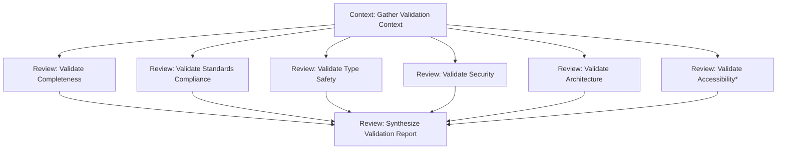

# Assert Command

## Role

Use the [agent] profile

## Goal

**Validate implementation completeness, correctness, and compliance** before advancing to testing phase. This command serves as an **automated quality gate** that ensures code meets fundamental standards through static analysis, requirements verification, and compliance enforcement.

**Primary Objectives**:

1. **Verify completeness** - Ensure all acceptance criteria are addressed
2. **Validate correctness** - Check implementation aligns with requirements and specifications
3. **Enforce compliance** - Assert coding standards, architectural patterns, and security best practices
4. **Block defective code** - Prevent incomplete or non-compliant implementations from consuming testing resources
5. **Provide actionable feedback** - Generate detailed reports with specific remediation guidance
6. **Static validation only** - Pre-testing checkpoint using linters, type checkers, and static analyzers
7. **Objective assessment** - Apply measurable criteria consistently without bias
8. **Fast feedback** - Quick validation to enable rapid iteration

**This command answers**: "Is this implementation ready for testing, or does it need remediation first?"

## Context

### Input Arguments

**Command Invocation**:

```bash
valora assert [scope] [--severity=<level>] [--report-format=<format>]
```

**Arguments**:

1. **`[scope]`** (optional, positional) - Validation scope
   - Default: Current git changes (unstaged + staged)
   - File path(s): `src/api/users.ts` or `src/components/`
   - Commit range: `HEAD~3..HEAD` or `main..feature-branch`
   - All files: `--all`

2. **`--severity`** (default: `critical`) - Minimum severity level to report
   - `critical` - Only report critical blockers (security, build failures, type errors)
   - `high` - Report critical and high severity issues (+ WCAG Level A, architectural violations)
   - `all` - Report all issues including warnings and informational messages

3. **`--report-format`** (default: `structured`) - Output format
   - `structured` - Full validation report with all dimensions organized by severity
   - `summary` - Executive summary with pass/fail status and key metrics only
   - `detailed` - Comprehensive report including code snippets, remediation steps, and references

4. **`--quick`** (optional) - Fast template-based validation (~2 min vs ~9 min)
   - `completeness` - Use ASSERT_COMPLETENESS.md template (acceptance criteria, features, tests)
   - `security` - Use ASSERT_SECURITY.md template (OWASP, secrets, input validation)
   - `typescript` - Use ASSERT_TYPESCRIPT.md template (type safety, conventions, patterns)
   - `all` - Run all quick templates sequentially (~5 min total)
   - Skips full pipeline, uses binary Y/N checklists for faster validation
   - Use for pre-flight checks before full assertion

**Example Usage**:

```bash
# Validate current changes (one-shot mode)
valora assert

# Validate specific scope
valora assert src/api/

# All issues, detailed report
valora assert --severity=all --report-format=detailed

# Within workflow (triggered after implement)
# Session context provides implementation details
```

### Session Context (When Part of Workflow)

When invoked as part of a workflow (e.g., after `/implement`), the command has access to:

- **`$SESSION.implementation_plan`** - Original implementation plan from `/plan`
- **`$SESSION.task_requirements`** - Task definition from `/fetch-task`
- **`$SESSION.gathered_knowledge`** - Codebase context from `/gather-knowledge`
- **`$SESSION.implementation_summary`** - Summary of changes made

### Standalone Context (One-Shot Mode)

When invoked independently:

- **Git changes** - Automatically detects modified, staged, and unstaged files
- **Requirements inference** - Attempts to extract acceptance criteria from:
  - Commit messages
  - Branch name patterns (e.g., `feature/US-123-login`)
  - Linked issue tracker tickets (via commit metadata)
  - Knowledge base documentation

### Available Context Sources

The assertion process can leverage:

- **Implementation scope** - Modified files, added/deleted lines, change patterns
- **Requirements/specifications** - User stories, acceptance criteria, technical specs (from session or inference)
- **Coding standards** - ESLint config, Prettier config, TSConfig, linting rules
- **Architectural guidelines** - ADRs, design patterns, module boundaries (from knowledge base)
- **Quality gates** - Coverage thresholds, complexity limits, security policies
- **Project configuration** - Build configs, package.json, CI/CD settings

## Rules

### Quality Gate Standards

1. **Zero tolerance for critical issues** - Security vulnerabilities, build failures, type errors are blockers
2. **Objective validation** - Apply rules consistently based on measurable criteria
3. **Comprehensive assessment** - Validate across all quality dimensions simultaneously
4. **Actionable feedback** - Every failure includes location, explanation, and remediation
5. **Fail-fast principle** - Block early to prevent wasted testing resources
6. **Standards enforcement** - Apply team-agreed standards without subjective interpretation

### Validation Dimensions

```structured
Assert implementation quality across these dimensions:

1. **Completeness**
   - All acceptance criteria addressed
   - Required features implemented
   - Edge cases handled
   - Error scenarios covered

2. **Standards Compliance**
   - Zero linting errors
   - Formatting consistent
   - Naming conventions followed
   - Code organization proper

3. **Type Safety**
   - No type errors in strict mode
   - Interface compliance validated
   - Null safety checked
   - Contract adherence verified

4. **Security**
   - No OWASP vulnerabilities
   - No hard-coded secrets
   - Input validation present
   - No dependency CVEs

5. **Architecture**
   - Design patterns followed
   - Module boundaries respected
   - No circular dependencies
   - API contracts satisfied

6. **Accessibility** (if frontend)
   - WCAG Level A compliance
   - ARIA properly implemented
   - Semantic HTML used
   - Keyboard navigation works

7. **Build System**
   - Build succeeds
   - No dependency conflicts
   - Bundle size acceptable
   - Build reproducible

8. **Documentation**
   - Public APIs documented
   - Complex logic explained
   - README updated if needed
   - Architecture decisions recorded
```

### Blocking vs. Warning Criteria

**BLOCK (Fail Quality Gate)**:

- ❌ Security vulnerabilities (CVSS ≥7.0)
- ❌ Build failures or compilation errors
- ❌ Type errors in strict mode
- ❌ WCAG Level A violations (if frontend)
- ❌ Critical architectural violations
- ❌ >50% of acceptance criteria unmet
- ❌ Hard-coded secrets or credentials

**WARN (Advisory, Non-Blocking)**:

- ⚠️ Code smells or moderate complexity
- ⚠️ Minor documentation gaps
- ⚠️ WCAG Level AA violations (if Level A met)
- ⚠️ Coverage below threshold but above minimum
- ⚠️ Performance anti-patterns (non-critical)

**INFORM (Informational)**:

- ℹ️ Best practice suggestions
- ℹ️ Optimization opportunities
- ℹ️ Refactoring recommendations

### Escalation Triggers

Escalate to human oversight when:

- Critical security vulnerabilities detected (CVSS ≥7.0)
- Major architectural violations affecting system integrity
- >50% of assertions failed (complete implementation failure)
- Requirements are unclear, missing, or conflicting
- Build system failures prevent validation
- Systematic false positives in validation tools

### Anti-Patterns to Avoid

❌ **Subjective assessment** - "This code looks messy"
✅ **Objective validation** - "Cyclomatic complexity 15 exceeds threshold of 10"

❌ **Vague feedback** - "Fix the security issue"
✅ **Specific guidance** - "SQL injection vulnerability at line 45: use parameterized queries"

❌ **Ignoring context** - Applying same rules to all code areas
✅ **Contextual validation** - Different rules for API vs. UI vs. utilities

❌ **Silent failures** - Not explaining why validation failed
✅ **Transparent reporting** - Every failure includes reasoning and remediation

## Process Steps

The assert command executes validation through a structured pipeline of specialized prompts. The agent leverages these prompts to perform comprehensive quality assessment across multiple dimensions.

### Pipeline Architecture

The validation pipeline consists of three stages:

1. **Context Stage** - Gather all necessary validation context
2. **Review Stage** - Execute parallel validations across quality dimensions
3. **Synthesis Stage** - Aggregate results into actionable report

### Execution Flow



*Conditional execution based on frontend changes

### Stage 1: Context Gathering

**Prompt**: `context.gather-validation-context`

**Purpose**: Collect all necessary validation context including implementation scope, standards, requirements, and quality gates.

**Key Activities**:

1. **Determine implementation scope**:
   - If `$ARG_scope` provided: Use specified scope (files/directories/commits)
   - If in session: Use implementation details from session context
   - If standalone: Detect git changes (staged + unstaged + recent commits)

2. **Analyze modified files**:
   - List all changed files with change types (added/modified/deleted)
   - Categorize by component type (UI, API, utilities, tests, config)
   - Detect frontend vs. backend vs. full-stack changes
   - Calculate change metrics (lines added/removed, files touched)

3. **Load project standards**:
   - Read ESLint config (`.eslintrc*`)
   - Read Prettier config (`prettier.config.*`)
   - Read TypeScript config (`tsconfig.json`)
   - Extract key rules and conventions

4. **Load architectural guidelines**:
   - Check knowledge base for ADRs and architectural documentation
   - Identify design patterns and module boundaries
   - Load API contracts (OpenAPI, GraphQL schemas)

5. **Define quality gates**:
   - Extract coverage thresholds (from config or default to 80%)
   - Load complexity limits (cyclomatic, cognitive)
   - Security policies (OWASP compliance level)
   - Accessibility requirements (WCAG level)

6. **Parse acceptance criteria**:
   - From session: `$SESSION.task_requirements`
   - From git: Commit messages, branch names, linked issues
   - From knowledge base: Related user stories and requirements

7. **Set validation flags**:
   - `frontend_changes`: true if UI components modified
   - `backend_changes`: true if API/services modified
   - `test_changes`: true if test files modified

**Inputs**:

- `implementation_scope: $ARG_scope` (optional scope override)
- `session_data: $SESSION` (full session context if available)

**Outputs**:

- `implementation_details` (modified files, change metrics, scope flags)
- `coding_standards` (linting, formatting, naming conventions)
- `architectural_guidelines` (patterns, boundaries, ADRs)
- `quality_gates` (coverage, complexity, security, accessibility thresholds)
- `acceptance_criteria` (requirements to validate against)
- `frontend_changes` (boolean flag for conditional accessibility validation)

---

### Stage 2: Parallel Validations

#### Validate Implementation Completeness

**Prompt**: `review.validate-implementation-completeness`

**Note**: This prompt needs to be created or the existing `review.validate-completeness` prompt needs to be extended to support `document_type: "implementation"`. Currently, it only supports `specifications`, `prd`, and `plan`.

Maps acceptance criteria to implementation and verifies all requirements are addressed. For each acceptance criterion:

- **Check implementation presence**: Verify feature/functionality exists
- **Validate edge cases**: Ensure error scenarios and boundary conditions handled
- **Check completeness markers**: Look for TODO, FIXME, or placeholder comments
- **Assess coverage**: Estimate percentage of criteria addressed

**Outputs**: `completeness_status`, `missing_features`, `incomplete_items`, `coverage_percentage`

---

#### Validate Standards Compliance

**Prompt**: `review.validate-standards-compliance` (parallel)

Executes linting tools, checks formatting, validates naming conventions, and verifies code organization standards.

**Outputs**: `linting_results`, `formatting_results`, `convention_violations`

---

#### Validate Type Safety

**Prompt**: `review.validate-type-safety` (parallel)

Runs type checkers in strict mode, validates interface compliance, checks null safety, and calculates type coverage.

**Outputs**: `type_errors`, `contract_violations`, `type_coverage`

---

#### Validate Security

**Prompt**: `review.validate-security` (parallel)

Scans for OWASP vulnerabilities, detects hard-coded secrets, validates input handling, and checks dependency CVEs.

**Outputs**: `security_vulnerabilities`, `secrets_found`, `owasp_violations`

---

#### Validate Architecture

**Prompt**: `review.validate-architecture` (parallel)

Checks design pattern adherence, validates module boundaries, detects anti-patterns, and identifies circular dependencies.

**Outputs**: `architectural_violations`, `pattern_violations`, `boundary_breaches`

---

#### Validate Accessibility *(Conditional)*

**Prompt**: `review.validate-accessibility` (parallel, conditional)

Runs WCAG compliance audits, validates ARIA implementation, checks semantic HTML, and verifies keyboard accessibility. Only executes when frontend changes detected.

**Outputs**: `wcag_violations`, `aria_issues`, `semantic_html_issues`

---

### Stage 3: Report Synthesis

**Prompt**: `review.synthesize-validation-report`

**Purpose**: Aggregate all validation results into comprehensive, actionable assertion report.

**Key Activities**:

- Collect results from all validation dimensions
- Categorize issues by severity (critical/high/medium/low)
- Apply severity filtering based on `--severity` argument
- Calculate overall pass/fail status
- Generate prioritized remediation recommendations
- Format report per `--report-format` specification

**Outputs**: `validation_status`, `blocker_count`, `validation_report`

**Final Verdict**:

- **PASS** ✅ - Ready to advance to testing
- **BLOCKED** ❌ - Critical issues prevent advancement
- **WARN** ⚠️ - Non-critical issues, proceed with caution

---

## Validation Report Structure

The final validation report includes:

### 1. Executive Summary

- Overall status (PASS/BLOCKED/WARN)
- Critical, high, medium, low issue counts
- Recommendation for next steps

### 2. Validation Dimensions Table

Matrix showing status of each validation dimension with issue counts

### 3. Critical Blockers

Detailed enumeration of all blocking issues with:

- Location (file:line)
- Rule/standard violated
- Impact explanation
- Specific remediation steps
- Documentation references

### 4. Quality Metrics

- Lines changed
- Completeness percentage
- Code coverage vs. threshold
- Type coverage
- Complexity metrics
- Security score
- Accessibility score
- Technical debt estimate

### 5. Requirements Traceability

Matrix mapping requirements to implementation and validation status

### 6. Next Steps

Prioritized remediation list with effort estimates and required skills

### 7. Reproducibility

Commands to reproduce validation results locally

---

## Prompt Reusability

The `review.validate-completeness` prompt is designed for reusability across multiple commands:

- **For /assert**: Validates implementation completeness against acceptance criteria
- **For /review-plan**: Validates plan completeness against requirements
- **For /create-prd**: Validates PRD completeness before backlog creation

The prompt adapts its validation criteria based on the `document_type` input parameter.

---

## Output Requirements

### Validation Report Quality Checklist

Before finalizing the report, verify:

- [ ] **Overall verdict is clear** - PASS, BLOCKED, or WARN with justification
- [ ] **All dimensions validated** - Completeness, standards, type safety, security, architecture, accessibility, build
- [ ] **Critical issues enumerated** - Every blocker listed with full details
- [ ] **Locations are specific** - File paths and line numbers provided
- [ ] **Remediation is actionable** - Specific steps to fix each issue
- [ ] **Severity is justified** - Clear reasoning for severity classifications
- [ ] **Metrics are quantified** - Numbers, not vague descriptions
- [ ] **Requirements mapped** - Traceability matrix shows coverage
- [ ] **Reproducibility documented** - Commands to re-run validation
- [ ] **Resources provided** - Links to relevant documentation

### Success Metrics

A successful assertion enables:

1. **Clear go/no-go decision** - Unambiguous pass/fail status
2. **Rapid remediation** - Specific guidance enables quick fixes
3. **Quality assurance** - Confidence that implementation meets standards
4. **Test readiness** - QA can focus on functional testing, not basic compliance
5. **Continuous improvement** - Patterns in failures inform better practices

### Handoff to Next Phase

**If PASS ✅**:

- Proceed to `/test` command
- Implementation ready for functional validation
- Non-blocking warnings can be addressed in parallel

**If BLOCKED ❌**:

- Return to `/implement` with remediation guidance
- Address critical blockers before re-asserting
- May require `/review-plan` if fundamental issues found

**If WARN ⚠️**:

- Can proceed to `/test` with caution
- Non-critical issues should be addressed post-testing
- Document warnings for review phase

**Next Command**:

- **If PASS**: `/test` to execute test suites
- **If BLOCKED**: Return to implementation with remediation plan
- **If systematic issues**: `/feedback` to improve standards or tooling

## Metrics Collection

After assertion completes, emit quality metrics as JSON:

```typescript
quality_metrics: {
  lint_errors_assert: number,        // Linter errors found in assert phase
  test_failures: number,             // Test failures (if tests run)
  test_passes: number                // Test passes (if tests run)
}
```

Store these in command outputs for session logging and metrics extraction.

## Command Output Summary

Print the following summary at command completion:

**For PASS:**

```markdown
## ✅ Assertion: PASS

**Overall Status**: PASS
**Blockers**: 0 critical issues

### Validation Results
| Dimension    | Status | Issues |
| ------------ | ------ | ------ |
| Completeness | ✅ Pass | 0      |
| Standards    | ✅ Pass | 0      |
| Type Safety  | ✅ Pass | 0      |
| Security     | ✅ Pass | 0      |
| Architecture | ✅ Pass | 0      |

### Quality Metrics
- **Coverage**: [XX]%
- **Type Coverage**: [XX]%
- **Complexity**: Within limits

### Next Step
→ `/test` to execute comprehensive test suites
```

**For WARN:**

```markdown
## ⚠️ Assertion: WARN

**Overall Status**: WARN - Proceed with caution
**Blockers**: 0 | **Warnings**: [N]

### Validation Results
| Dimension    | Status | Issues |
| ------------ | ------ | ------ |
| Completeness | ✅ Pass | 0      |
| Standards    | ⚠️ Warn | [N]    |
| Type Safety  | ✅ Pass | 0      |
| Security     | ✅ Pass | 0      |
| Architecture | ⚠️ Warn | [N]    |

### Warnings
- [Warning 1]
- [Warning 2]

### Next Step
→ `/test` (proceed with caution, address warnings post-testing)
```

**For BLOCKED:**

```markdown
## ❌ Assertion: BLOCKED

**Overall Status**: BLOCKED
**Blockers**: [N] critical issues

### Critical Issues
1. **[Issue Category]**: [Description]
   - **Location**: [file:line]
   - **Remediation**: [How to fix]

2. **[Issue Category]**: [Description]
   - **Location**: [file:line]
   - **Remediation**: [How to fix]

### Next Step
→ Return to `/implement` to address critical issues
```

---

## Quick Assertion Mode

When `--quick` flag is used, the assertion switches to fast template-based validation:

### Purpose

Reduce assertion time from ~9 min to ~2-5 min by using standardised templates for quick pass/fail validation. Automates common completeness checks.

### Available Templates

| Template       | Focus                                | Time   |
| -------------- | ------------------------------------ | ------ |
| `completeness` | Acceptance criteria, features, tests | ~2 min |
| `security`     | OWASP, secrets, input validation     | ~2 min |
| `typescript`   | Type safety, conventions, patterns   | ~2 min |
| `all`          | All templates sequentially           | ~5 min |

### Template Details

#### ASSERT_COMPLETENESS.md

Validates implementation completeness:
- Acceptance criteria coverage (100% required)
- Feature completeness (no TODOs/stubs)
- Error handling (happy path, errors, edge cases)
- Integration points (APIs, database, services)
- Test coverage (unit, integration, E2E)

#### ASSERT_SECURITY.md

Validates security compliance:
- Input validation (CRITICAL)
- Injection prevention (CRITICAL)
- Authentication & authorisation (CRITICAL)
- Secrets management (CRITICAL)
- Data protection
- Dependency security
- Error handling security

Includes OWASP Top 10 quick check.

#### ASSERT_TYPESCRIPT.md

Validates TypeScript-specific standards:
- Type safety (CRITICAL) - tsc:check, no `any`
- Naming conventions - PascalCase, camelCase, etc.
- Code quality (CRITICAL) - lint, format
- Type definitions - interfaces, explicit types
- Modern patterns - const, functional, async/await
- Error handling - custom errors, try/catch
- Testing (CRITICAL) - Vitest, coverage
- Architecture compliance

### When to Use Quick Mode

- **Pre-flight validation** before full assertion
- **Iterative development** for rapid feedback
- **Focused checks** when you know the concern area
- **CI integration** for fast first-pass validation

### Quick Mode Output

```markdown
## Quick Assertion: PASS

**Mode**: --quick=typescript
**Scope**: src/api/users.ts
**Duration**: 1.8 min

### Template Results
| Section            | Passed | Total    |
| ------------------ | ------ | -------- |
| Type Safety        | 5      | 5        |
| Naming Conventions | 5      | 5        |
| Code Quality       | 4      | 5        |
| Type Definitions   | 5      | 5        |
| Modern Patterns    | 5      | 5        |
| Error Handling     | 5      | 5        |
| Testing            | 5      | 5        |
| Architecture       | 4      | 5        |
| **TOTAL**          | 38     | 40 (95%) |

### Failed Items
- 3.5 - console.log found at line 45
- 8.3 - UserService has 15 methods (consider splitting)

### Verdict: PASS (95% >= 80% threshold)

### Next Step
→ `/test` to execute comprehensive test suites
→ Or run `valora assert` for full pipeline validation
```

### Quick Mode vs Full Mode

| Aspect     | Quick Mode             | Full Mode         |
| ---------- | ---------------------- | ----------------- |
| Duration   | ~2-5 min               | ~9 min            |
| Depth      | Binary Y/N checklists  | Deep analysis     |
| Output     | Template-based report  | Narrative report  |
| Use case   | Pre-flight, iteration  | Final gate        |
| Automation | High (checklist items) | Medium (analysis) |

### Workflow Integration

```
/implement
    |
    v
valora assert --quick=typescript  <-- Fast feedback (~2 min)
    |
    v (if issues)
/implement (fix issues)
    |
    v
valora assert --quick=all        <-- Broader check (~5 min)
    |
    v (if PASS)
valora assert                     <-- Full validation (~9 min)
    |
    v
/test
```

### Combining with Full Assertion

Quick mode can be used as a pre-filter:

```bash
# Quick check first
valora assert --quick=all

# If quick passes, run full
valora assert --severity=all --report-format=detailed
```

This workflow catches common issues early, reducing total validation time when issues are present.
