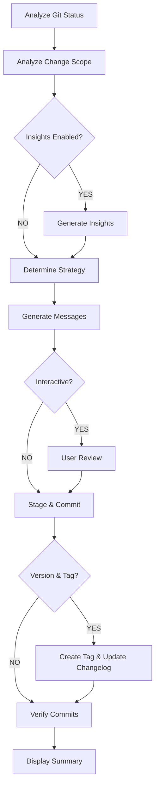
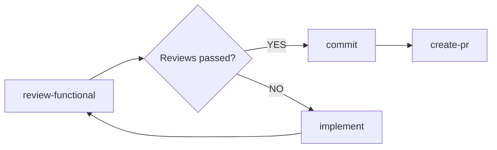

# Commit Command

## Role

Use the [agent] profile

## Goal

**Create atomic, intelligent commits** with automated message generation, version management, changelog updates, quality insights, and security validation. This command provides a comprehensive commit workflow that analyzes changes, generates conventional commit messages, manages semantic versioning, updates documentation, provides AI-powered insights, and supports interactive review.

### Success Criteria

- ✅ All relevant changes are staged and committed atomically
- ✅ Commit messages follow Conventional Commits specification
- ✅ Semantic versioning is automatically calculated and applied (when enabled)
- ✅ CHANGELOG.md is updated with structured release notes (when enabled)
- ✅ Breaking changes are properly flagged with `BREAKING CHANGE:` footer
- ✅ AI-powered quality insights identify potential issues (when enabled)
- ✅ Issue tracker integration links commits to tickets (when enabled)
- ✅ Commit signing ensures cryptographic verification (when enabled)
- ✅ Interactive review allows human oversight (when enabled)
- ✅ Pre-commit hooks pass (unless `--no-verify` specified)
- ✅ Commit history is clean, meaningful, and traceable

## Rules

### Conventional Commits Format

Follow the [Conventional Commits](https://www.conventionalcommits.org/) specification:

```plaintext
<type>[optional scope]: <description>

[optional body]

[optional footer(s)]
```

#### Commit Types

| Type       | Description                                         | Example                                     |
| ---------- | --------------------------------------------------- | ------------------------------------------- |
| `feat`     | New feature implementation                          | `feat(auth): add OAuth2 authentication`     |
| `fix`      | Bug fix                                             | `fix(api): resolve race condition in cache` |
| `docs`     | Documentation changes                               | `docs(readme): update installation steps`   |
| `style`    | Code style changes (formatting, no logic change)    | `style(components): apply Prettier rules`   |
| `refactor` | Code refactoring (no feature change or bug fix)     | `refactor(db): extract query builders`      |
| `perf`     | Performance improvements                            | `perf(api): optimize database query`        |
| `test`     | Adding or updating tests                            | `test(auth): add OAuth2 integration tests`  |
| `build`    | Build system or dependency changes                  | `build(deps): upgrade React to v18`         |
| `ci`       | CI/CD configuration changes                         | `ci(github): add automated deployments`     |
| `chore`    | Maintenance tasks, tooling updates                  | `chore(deps): update development tools`     |
| `revert`   | Revert a previous commit                            | `revert: feat(auth): add OAuth2`            |
| `wip`      | Work in progress (should not appear in main branch) | `wip: experimenting with GraphQL`           |

#### Scope Guidelines

- Use clear, concise scope names (kebab-case)
- Align with architectural boundaries (e.g., `auth`, `api`, `ui`, `db`)
- Omit scope if change affects multiple areas broadly
- Examples: `auth`, `user-profile`, `payment-gateway`, `logging`

#### Breaking Changes

For breaking changes, add `!` after scope and include footer:

```plaintext
feat(api)!: redesign authentication endpoints

BREAKING CHANGE: /api/login endpoint now requires JWT tokens
instead of session cookies. Clients must update authentication flow.
```

### Commit Strategy

#### When to Create Single Commit

- Changes form a single logical unit
- All files relate to the same feature/fix
- Total changes are < 500 lines
- No mixed concerns (feature + refactor, fix + feature)

#### When to Split into Multiple Commits

- Multiple distinct features/fixes in changeset
- Mixed concerns (separate feature from refactor)
- Large changesets (> 500 lines) that can be logically separated
- Frontend + backend changes (separate when appropriate)
- Schema migrations + code changes

#### Commit Order Priority

1. **Schema/migrations** (database, API contracts)
2. **Backend/core logic** (business logic, APIs)
3. **Frontend/UI** (components, pages)
4. **Tests** (unless tightly coupled to feature)
5. **Documentation** (README, API docs)
6. **Configuration** (CI/CD, tooling)

### Staging Strategy

- **Auto-stage** all modified tracked files by default
- **Exclude** untracked files unless explicitly added
- **Respect** `.gitignore` and workspace ignore rules
- **Prompt** for confirmation before staging large changesets (> 1000 lines)

### Commit Message Quality

#### Subject Line (< 72 characters)

- Start with lowercase (after type/scope)
- Use imperative mood ("add", not "added" or "adds")
- No period at the end
- Be specific and descriptive

✅ **Good Examples:**

```plaintext
feat(auth): implement JWT refresh token rotation
fix(payments): prevent duplicate charge on retry
docs(api): document rate limiting behavior
```

❌ **Bad Examples:**

```plaintext
updated files
fix bug
WIP
feat: changes
```

#### Body (Optional, Wrap at 72 Characters)

- Explain **what** and **why**, not **how**
- Reference related issues, tickets, or design docs
- Include context for complex changes
- Use bullet points for multiple points

#### Footer (Optional)

- `BREAKING CHANGE:` - Document breaking changes
- `Closes #123` - Auto-close GitHub issues
- `Refs #456` - Reference related issues
- `Co-authored-by:` - Credit collaborators

### Pre-commit Verification

Before committing, ensure:

1. ✅ Linting passes (no critical errors)
2. ✅ Type checking passes
3. ✅ Tests pass locally (if `--no-verify` not set)
4. ✅ No debug code (console.log, debugger, etc.)
5. ✅ No sensitive data (secrets, tokens, PII)
6. ✅ No unresolved merge conflicts

## Context

### User-Provided Arguments

```plaintext
$ARGUMENTS
```

### Available Arguments

#### Core Arguments

- `--scope=<area>` - Force specific scope (overrides auto-detection)
- `--breaking` - Flag as breaking change with `BREAKING CHANGE:` footer
- `--message="<msg>"` - Custom commit message (overrides auto-generation)
- `--amend` - Amend last commit instead of creating new one
- `--no-verify` - Skip pre-commit hooks (use sparingly)

#### Version Management

- `--version-bump=<auto|major|minor|patch>` - Calculate and apply semantic version bump
  - `auto` - Auto-detect from commit type (feat→minor, fix→patch, breaking→major)
  - `major` - Force major version bump (x.0.0)
  - `minor` - Force minor version bump (0.x.0)
  - `patch` - Force patch version bump (0.0.x)
- `--tag` - Create git tag with version number after commit

#### Documentation

- `--update-changelog` - Automatically update CHANGELOG.md with structured entries
- `--changelog-format=<keepachangelog|github>` - Changelog format (default: keepachangelog)

#### Quality & Insights

- `--insights` - Generate AI-powered commit quality insights and recommendations
- `--quality-check` - Run quality validation (score message, detect issues)
- `--impact-analysis` - Analyze potential impact of changes (breaking changes, dependencies)

#### Security

- `--sign` - Sign commit with GPG/SSH key for cryptographic verification
- `--sign-key=<key-id>` - Sign with specific GPG/SSH key
- `--security-scan` - Scan commit for secrets, vulnerabilities, suspicious patterns

#### Issue Tracking

- `--auto-ticket` - Extract ticket number from branch name (e.g., feature/PROJ-123-foo)
- `--ticket=<number>` - Manually specify ticket/issue number
- `--update-tracker` - Update issue tracker status (In Progress → In Review)

#### Templates

- `--template=<name>` - Use project-specific commit template from `.commitrc.json`
- `--template-var <key>=<value>` - Set template variable value

#### Interactive Mode

- `--interactive` - Review and edit AI-generated messages before committing
- `--dry-run` - Show what would be committed without executing
- `--preview` - Preview commit message and impact analysis

### Git Status

Current repository state will be automatically analyzed.

## Process Overview

The commit command follows a **staged pipeline** that orchestrates the following workflow:

### Pipeline Stages

**1. Context Analysis** (`context` stage)

- Analyze git status and identify changed files
- Load commit templates (if specified)
- Extract ticket information from branch name (if enabled)
- Analyze change scope (type, areas, breaking changes, risk)

**2. Quality Review** (`review` stage - parallel)

- Generate AI-powered commit insights (if enabled)
- Quality scoring, impact analysis, security scanning
- Provide recommendations for improvement

**3. Strategy & Generation** (`code` stage)

- Determine commit strategy (single vs split commits)
- Calculate version bump (if enabled)
- Generate conventional commit messages
- Interactive review (if enabled)
- Stage files and execute commits
- Create version tags (if enabled)

**4. Documentation** (`documentation` stage)

- Update CHANGELOG.md (if enabled)

**5. Final Verification** (`review` stage)

- Verify commits created successfully
- Validate message format compliance
- Display comprehensive summary
- Provide next steps

### Key Features

- **Automated Message Generation**: AI-generated conventional commit messages
- **Smart Commit Splitting**: Automatically groups changes into logical commits
- **Semantic Versioning**: Auto-calculates and applies version bumps
- **Changelog Management**: Keeps CHANGELOG.md up-to-date automatically
- **Quality Insights**: AI-powered analysis with recommendations
- **Security Scanning**: Detects secrets, vulnerabilities, and suspicious patterns
- **Interactive Mode**: Human review and editing before commit
- **Template Support**: Project-specific commit templates
- **Issue Tracking**: Auto-links commits to tickets/issues

### Process Flow



**Note**: All detailed instructions for each stage are defined in the individual prompts within the pipeline. The command orchestrates the flow, while prompts contain the specific implementation logic.

## Error Handling

### No Changes to Commit

```plaintext
⚠️  No changes detected to commit.
   Working tree is clean.
```

**Resolution:** Make code changes first, then run commit command.

### Commit Message Validation Failed

```plaintext
❌ Commit message does not follow Conventional Commits format:
   "Updated files"
   
   Expected format: <type>(<scope>): <description>
   Example: feat(auth): add OAuth2 support
```

**Resolution:** AI will regenerate message following standards.

### Pre-commit Hooks Failed

```plaintext
❌ Pre-commit hooks failed. Commit aborted.
   
   Linting errors:
   - src/auth/oauth.ts:45 - Unused variable 'token'
   
   Options:
   1. Fix errors and commit again
   2. Use --no-verify to skip hooks (not recommended)
```

**Resolution:** Fix errors or use `--no-verify` if intentional.

### Merge Conflicts Detected

```plaintext
❌ Cannot commit: unresolved merge conflicts detected
   
   Conflicting files:
   - src/auth/oauth.ts
   
   Resolve conflicts first, then commit.
```

**Resolution:** Resolve conflicts manually, then run commit command.

## Examples

### Example 1: Simple Feature Commit

**Input:**

```bash
commit
```

**Analysis:**

- Changed: `src/auth/login.ts`, `src/auth/validation.ts`
- Type: Feature
- Scope: auth

**Output:**

```plaintext
✅ Created commit: feat(auth): add email validation for login

a4f7c9e feat(auth): add email validation for login
- src/auth/login.ts | 25 ++++++++++++++++++++
- src/auth/validation.ts | 15 ++++++++++++
```

### Example 2: Bug Fix with Custom Scope

**Input:**

```bash
commit --scope=payments
```

**Output:**

```plaintext
✅ Created commit: fix(payments): prevent duplicate charges on retry

b8c3d1f fix(payments): prevent duplicate charges on retry
- src/payments/processor.ts | 30 ++++++++++++++++++++---
```

### Example 3: Breaking Change

**Input:**

```bash
commit --breaking
```

**Output:**

```plaintext
✅ Created commit: feat(api)!: redesign authentication endpoints

BREAKING CHANGE: /api/login endpoint now requires JWT tokens instead of session cookies

e5f9a2b feat(api)!: redesign authentication endpoints
- src/api/auth.ts | 145 +++++++++++++++++++++++++++++++-------------
```

### Example 4: Split Commits (Auto-detected)

**Input:**

```bash
commit
```

**Analysis:**

- Multiple areas: auth + payments
- Strategy: Split

**Output:**

```plaintext
✅ Created 2 commits:

c6d8e3a feat(auth): implement OAuth2 refresh tokens
- src/auth/oauth.ts | 95 ++++++++++++++++++++++++
- src/auth/tokens.ts | 50 +++++++++++--

f7a9b4c feat(payments): add Stripe webhook handlers
- src/payments/webhooks.ts | 120 ++++++++++++++++++++++++++++++
```

### Example 5: Amend Last Commit

**Input:**

```bash
commit --amend --message="feat(auth): implement OAuth2 with refresh tokens"
```

**Output:**

```plaintext
✅ Amended commit: feat(auth): implement OAuth2 with refresh tokens

g8b0c5d feat(auth): implement OAuth2 with refresh tokens (amended)
```

### Example 6: Commit with Version Bump and Changelog

**Input:**

```bash
commit --version-bump=auto --tag --update-changelog
```

**Output:**

```plaintext
✅ Created commit with automated release management:

h9c1d6e feat(payments): add Stripe integration

📦 Version Calculation:
- Change type: feat (new feature)
- Current version: 1.2.3
- Version bump: minor (0.x.0)
- Next version: 1.3.0

🏷️  Created Tag: v1.3.0

📝 Updated CHANGELOG.md:
## [1.3.0] - 2025-11-12

### ✨ Features
- **payments**: add Stripe integration

[1.3.0]: https://github.com/org/repo/compare/v1.2.0...v1.3.0

Next steps:
1. Review: git show v1.3.0
2. Push with tags: git push origin main --follow-tags
```

### Example 7: Interactive Commit with Insights

**Input:**

```bash
commit --interactive --insights
```

**Interactive Flow:**

```plaintext
🔍 Analyzing changes...

📝 Proposed Commit Message (Quality: 7.2/10)

fix(api): handle null values in user response

💡 AI Insights:
✅ Follows conventional commits format
⚠️  Quality could be improved:
    - Subject line is vague - specify which endpoint
    - Missing context about when this occurs
    - No reference to related issue/ticket

⚠️  Security concern: Changes to authentication logic without tests
⚠️  Impact: Public API endpoint - breaking change risk

🔍 Recommendations:
1. Improve subject: "fix(api): handle null email in GET /users/:id response"
2. Add body explaining the bug scenario
3. Add reference to issue tracker
4. Consider this a potential breaking change

Actions:
[C] Commit as-is  [E] Edit  [I] Improve  [X] Cancel
> I

🤖 Improving commit message...

📝 Improved Commit Message (Quality: 9.1/10)

fix(api): handle null email in GET /users/:id response

Fixes bug where users without verified emails would cause the
GET /users/:id endpoint to return null instead of omitting
the email field, breaking client expectations.

This change ensures backward compatibility by omitting the
email field when null rather than including it.

Fixes #789

✅ Quality Score: 9.1/10 (+1.9)
✅ All recommendations applied

Actions:
[C] Commit  [E] Edit more  [X] Cancel
> C

✅ Committed: fix(api): handle null email in GET /users/:id response
```

### Example 8: Template-Based Commit with Ticket

**Input:**

```bash
commit --template=bugfix --auto-ticket
```

**Workflow:**

```plaintext
🎫 Extracting ticket from branch...
Branch: bugfix/PROJ-456-fix-cache-race-condition
Ticket: PROJ-456

📋 Loading template: bugfix
Required fields: scope, description, ticket, root_cause

🔍 Analyzing changes...
Detected scope: cache
Detected root cause: Race condition in Redis concurrent access

📝 Generated Commit Message:

fix(cache): resolve race condition in Redis operations

**Issue:** PROJ-456
**Root Cause:** Multiple concurrent writes to same cache key without locking

Added Redis distributed lock using SETNX to prevent race conditions
when multiple instances attempt to write the same cache key simultaneously.

Fixes #456

✅ All template requirements met
✅ Ticket automatically linked

Commit? [Y/n] Y

✅ Committed: fix(cache): resolve race condition in Redis operations
🎫 Linked to PROJ-456
```

### Example 9: Signed Commit with Security Scan

**Input:**

```bash
commit --sign --security-scan
```

**Output:**

```plaintext
🔒 Running security scan...

✅ Security scan passed:
- No secrets detected
- No suspicious patterns found
- No large binary files

🔑 Signing commit with GPG key...
Using key: ABC12345 (damien@example.com)

✅ Created signed commit:

i3k7m9p feat(auth): add two-factor authentication (signed)

🔒 Signature verified: ✓
Signed by: Damien Tivelet <damien@example.com>
Key ID: ABC12345
Signature: Good

Next steps:
1. Verify signature: git verify-commit i3k7m9p
2. Push signed commit: git push origin main
```

### Example 10: Breaking Change with Full Workflow

**Input:**

```bash
commit --breaking --version-bump=major --update-changelog --tag --insights
```

**Output:**

```plaintext
⚠️  Breaking Change Detected

💡 AI Insights:
✅ Quality Score: 9.5/10
⚠️  Impact Analysis:
    - Breaking change in public API
    - 3 dependent services affected: api-gateway, mobile-app, web-app
    - Migration required for all API consumers
⚠️  Recommendation: Create migration guide documentation

📝 Generated Commit Message:

feat(api)!: redesign authentication endpoints

BREAKING CHANGE: Authentication flow has been redesigned to use JWT tokens

Previous endpoints:
- POST /auth/login (session-based)
- POST /auth/logout

New endpoints:
- POST /auth/token (JWT-based)
- POST /auth/refresh
- DELETE /auth/token

Migration guide: See docs/migration/v2.0.md

All API consumers must update their authentication implementation.
Session-based auth is no longer supported.

Closes #234

📦 Version Calculation:
- Change type: feat + breaking change
- Current version: 1.5.2
- Version bump: MAJOR (x.0.0)
- Next version: 2.0.0

✅ Created commit: feat(api)!: redesign authentication endpoints
🏷️  Created tag: v2.0.0
📝 Updated CHANGELOG.md:

## [2.0.0] - 2025-11-12

### ⚠️ BREAKING CHANGES
- **api**: redesign authentication endpoints
  - Session-based authentication removed
  - JWT-based authentication required
  - See migration guide: docs/migration/v2.0.md

### ✨ Features
- **api**: add JWT refresh token support
- **api**: add token revocation endpoint

[2.0.0]: https://github.com/org/repo/compare/v1.5.2...v2.0.0

⚠️  Important: Major version bump due to breaking changes
📋 Recommended actions:
1. Publish migration guide
2. Notify dependent teams
3. Coordinate deployment with API consumers
4. Plan gradual rollout strategy

Next steps:
1. Review: git show v2.0.0
2. Review changelog: head -50 CHANGELOG.md
3. Create migration guide: docs/migration/v2.0.md
4. Notify stakeholders before pushing
```

## Integration with Workflow

### Position in Development Lifecycle



### Typical Usage Patterns

#### Pattern 1: After Implementation

```bash
implement "Add user authentication"
test
review-code
review-functional
commit  # ← Executed here
create-pr
```

#### Pattern 2: Incremental Commits

```bash
implement step-by-step "Large feature"
commit  # ← After first step
implement step-by-step
commit  # ← After second step
# ... continue ...
create-pr
```

#### Pattern 3: Fix and Recommit

```bash
review-code  # Found issues
implement "Fix review feedback"
commit
create-pr
```

## Best Practices

### ✅ DO

- **Commit frequently** - Small, atomic commits are better than large ones
- **Write descriptive messages** - Future you will thank present you
- **Follow conventions** - Consistent format improves team collaboration
- **Review before committing** - Use `git diff` to verify changes
- **Group related changes** - Keep feature and tests together (if small)
- **Reference issues** - Link commits to tracking system

### ❌ DON'T

- **Commit WIP code** - Unless on feature branch with clear intent
- **Mix concerns** - Don't combine feature + refactor in one commit
- **Skip commit messages** - "update" or "changes" are not helpful
- **Commit generated files** - Unless they're meant to be versioned
- **Commit secrets** - Always review for sensitive data
- **Break the build** - Ensure each commit is buildable

## Quality Checklist

Before finalizing commits, verify:

- [ ] Commit messages follow Conventional Commits format
- [ ] Subject lines are < 72 characters
- [ ] Changes are atomic (one logical unit per commit)
- [ ] No debug code or commented-out code
- [ ] No sensitive data (API keys, passwords, tokens)
- [ ] Linting passes (or --no-verify justified)
- [ ] Tests pass locally
- [ ] Breaking changes are properly flagged
- [ ] Related issues are referenced in footer

## Performance Considerations

- **Fast operations** - Analysis and commit creation should take < 5 seconds
- **Large changesets** - Split into logical commits automatically
- **Hook timeouts** - Pre-commit hooks should complete within 30 seconds
- **Diff analysis** - Optimize file reading for large diffs (> 10 files)

## Document Generation

**File** (optional): `CHANGELOG.md` entry

**Ask user**: "Would you like me to update `CHANGELOG.md` with this release?" (only if `--update-changelog` or version bump)

## Command Output Summary

Print the following summary at command completion:

**For successful commit:**

```markdown
## ✅ Commit Created

**Commits**: [N] commit(s)
**Hash**: [short-hash]

### Commit Summary
```
[type]([scope]): [description]
```

### Files Committed
- [file1.ts] | +[N] -[N]
- [file2.ts] | +[N] -[N]

### Quality Insights
- ✅ Linting: Pass
- ✅ Security: No issues
- ✅ Conventional format: Valid

### Documents Updated
→ `CHANGELOG.md` (if --update-changelog)

### Next Step
→ `/create-pr` to create pull request
```

**For version bump:**

```markdown
## ✅ Commit & Version Created

**Commits**: [N] commit(s)
**Version**: [old-version] → [new-version]
**Tag**: v[new-version]

### Commit Summary
```
[type]([scope]): [description]
```

### Version Bump Reason
- [Type of changes that triggered bump]

### Documents Updated
→ `CHANGELOG.md` (updated with release notes)
→ `package.json` (version bumped)

### Next Step
→ `/create-pr` to create pull request
```

**For commit failure:**

```markdown
## ❌ Commit Failed

**Reason**: [Pre-commit hook failure | Validation error | etc.]

### Error Details
[Error message]

### Suggested Fix
- [How to resolve the issue]

### Next Step
→ Fix issues and re-run `/commit`
```
