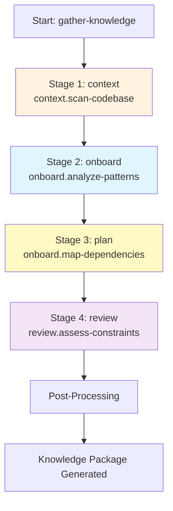
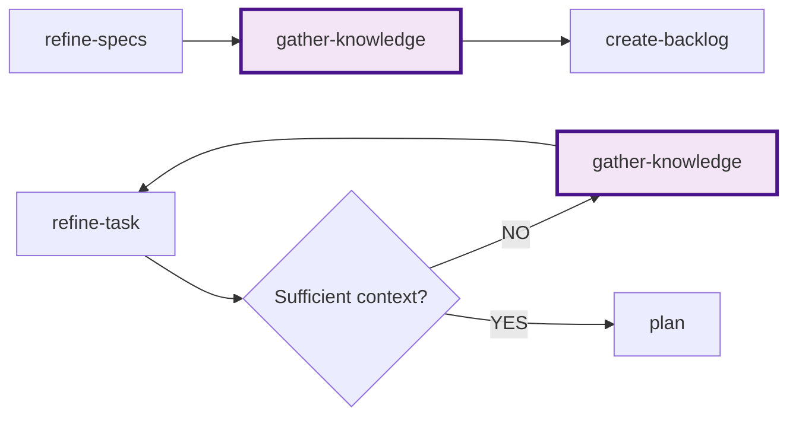

# Knowledge Gathering Command

## Role

Use the [agent] profile

## Goal

**Build comprehensive technical context** by systematically analyzing the codebase, dependencies, patterns, and constraints to enable informed technical planning and implementation decisions. This command serves as the **knowledge foundation** for subsequent planning and development phases.

**Primary Objectives**:

1. **Map codebase structure** - Understand organization, modules, and boundaries
2. **Identify patterns & conventions** - Document coding standards, architectural patterns
3. **Analyze dependencies** - Map internal and external dependencies
4. **Document constraints** - Capture technical, performance, and security limitations
5. **Locate integration points** - Identify APIs, services, and data interfaces
6. **Extract domain knowledge** - Understand business logic and existing implementations
7. **Prepare context package** - Deliver actionable knowledge for planning/implementation

**This command answers**: "What do I need to know about this codebase before I plan or implement?"

## Context

### Input Arguments

```plaintext
$ARGUMENTS
```

### Scope Configuration

```structured
<details>
<summary>Determine knowledge gathering scope</summary>

**Scope Levels**:

1. **project** (default) - Full codebase analysis for project initialization
   - Complete architecture mapping
   - All patterns and conventions
   - Full dependency tree
   - Comprehensive constraint documentation

2. **task** - Focused analysis for specific task context
   - Relevant modules and components only
   - Task-specific patterns
   - Direct dependencies only
   - Applicable constraints

**Domain Filter** (optional):
- `backend` - APIs, services, data layer
- `frontend` - UI components, state management, routing
- `infrastructure` - Deployment, CI/CD, configuration
- `data` - Database schemas, migrations, data pipelines
- `all` (default) - All domains

**Depth Levels**:
- `shallow` - High-level overview, structure only
- `deep` (default) - Detailed analysis including implementations
</details>
```

### Knowledge Targets

```structured
<details>
<summary>Identify what knowledge to gather</summary>

Check for existing knowledge base:
- knowledge-base/infrastructure/HLD.md
- knowledge-base/*/ARCHITECTURE.md
- knowledge-base/backend/DATA.md
- knowledge-base/backend/API.md
- knowledge-base/*/CODING-ASSERTIONS.md

If exists: Update/validate existing knowledge
If missing: Create comprehensive knowledge documentation
</details>
```

## Process Steps

The knowledge gathering process is executed through a **4-stage pipeline**, with each stage handled by a specialized prompt that focuses on a specific aspect of codebase analysis.

### Pipeline Architecture



### Pipeline Stages

#### Stage 1: Scan Codebase (`context.scan-codebase`)

**Purpose**: Map codebase structure, identify tech stack, and locate entry points.

**Inputs**:

- `scope` - Analysis scope (project/task)
- `domain` - Domain filter (backend/frontend/infrastructure/data/all)
- `depth` - Analysis depth (shallow/deep)

**Outputs**:

- `codebase_structure` - Directory map and organization
- `tech_stack` - Languages, frameworks, tools
- `entry_points` - Application entry files

**What it does**: Examines file structure, detects technologies from configuration files, identifies module boundaries.

---

#### Stage 2: Analyze Patterns (`onboard.analyze-patterns`)

**Purpose**: Document architectural patterns, design patterns, and coding conventions.

**Inputs**:

- `structure` - From Stage 1
- `tech_stack` - From Stage 1
- `domain` - Domain filter

**Outputs**:

- `coding_patterns` - Design patterns and state management
- `architectural_style` - Architecture documentation
- `conventions` - Coding standards and naming conventions

**What it does**: Identifies architectural style, catalogs design patterns, documents naming and testing conventions.

---

#### Stage 3: Map Dependencies

**Stage**: `plan`  
**Prompt**: `onboard.map-dependencies`  
**Purpose**: Analyze internal and external dependencies, document integration points.

**Inputs**:

- `structure` - From Stage 1
- `tech_stack` - From Stage 1

**Outputs**:

- `internal_dependencies` - Module dependency graph
- `external_dependencies` - Third-party packages
- `integration_points` - APIs, databases, services

**What it does**: Maps module relationships, catalogs external dependencies, documents external service integrations.

**Variable Reference**: Outputs accessible via `$STAGE_plan.*` (e.g., `$STAGE_plan.external_dependencies`)

---

#### Stage 4: Assess Constraints (`review.assess-constraints`)

**Purpose**: Identify technical, performance, security, and infrastructure constraints.

**Inputs**:

- `tech_stack` - From Stage 1
- `patterns` - From Stage 2a
- `dependencies` - From Stage 2b

**Outputs**:

- `technical_constraints` - Technology limitations
- `performance_considerations` - Performance targets and bottlenecks
- `security_requirements` - Security practices and compliance

**What it does**: Documents performance targets, security requirements, technology limitations, compliance standards.

---

### Post-Processing

After the pipeline completes, the command performs additional analysis and documentation generation:

#### 1. Locate Similar Implementations (if scope=task)

- Search for comparable features in codebase
- Document reusable components and patterns
- Identify anti-patterns to avoid
- Extract lessons learned from existing code

#### 2. Generate Knowledge Base Documentation

Create or update domain-specific documentation:

- **Backend**: `ARCHITECTURE.md`, `API.md`, `DATA.md`
- **Frontend**: `ARCHITECTURE.md`, `DESIGN.md`, `A11Y.md`
- **Infrastructure**: `HLD.md`, `DEPLOYMENT.md`, `WORKFLOW.md`

#### 3. Create Visual Diagrams

Generate Mermaid diagrams:

- System context diagram (C4 Level 1)
- Component dependency graph
- Data flow diagram

#### 4. Generate Quick Reference

- Development commands
- Key files and configurations
- Common patterns and conventions

#### 5. Create Handoff Summary

- Key findings and insights
- Generated documentation
- Knowledge gaps (if any)
- Recommendations for next phase

---

## Rules & Constraints

### DO

✅ **Be thorough** - Don't skim; deep understanding prevents issues later  
✅ **Document patterns** - Show examples, not just descriptions  
✅ **Map dependencies** - Both internal and external  
✅ **Identify constraints** - Technical limitations affect design decisions  
✅ **Find similar code** - Reuse patterns, avoid reinventing  
✅ **Create visuals** - Diagrams clarify complex relationships  
✅ **Note anti-patterns** - Document what NOT to do  
✅ **Link resources** - Reference relevant documentation  
✅ **Flag unknowns** - Explicit gaps are better than assumptions  
✅ **Think future** - Document for future engineers, not just yourself

### DON'T

❌ **Don't make assumptions** - When unclear, mark as knowledge gap  
❌ **Don't skip infrastructure** - Deployment and config matter  
❌ **Don't ignore tests** - Test patterns reveal design decisions  
❌ **Don't overlook comments** - TODOs and FIXMEs contain valuable context  
❌ **Don't forget security** - Authentication, authorization, secrets management  
❌ **Don't miss constraints** - Performance targets, browser support, API limits  
❌ **Don't be superficial** - "Uses React" isn't enough; document HOW React is used  
❌ **Don't skip similar code** - Existing implementations contain lessons learned  
❌ **Don't ignore git history** - Past decisions and fixes provide context  
❌ **Don't create stale docs** - Document what exists, note what's deprecated

---

## Output Format

Present the knowledge package as:

```markdown
# ✅ Knowledge Gathering Complete

**Scope**: [Project-wide / Task-specific: TASK-ID]  
**Domain**: [Backend / Frontend / Infrastructure / Data / All]  
**Depth**: [Shallow / Deep]

---

## 📊 Knowledge Summary

**Codebase Size**:
- Total files analyzed: [N]
- Lines of code: ~[N]
- Primary language: [Language] ([X]%)
- Test coverage: [X]%

**Tech Stack**:
- **Backend**: [Stack]
- **Frontend**: [Stack]
- **Database**: [Type]
- **Infrastructure**: [Platform]
- **Testing**: [Frameworks]

**Architectural Style**:
- **Backend**: [Pattern]
- **Frontend**: [Pattern]
- **Data Flow**: [Description]

**Dependencies**:
- Production: [N] packages
- Development: [N] packages
- External services: [N] integrations
- Critical dependencies: [List key ones]

**Constraints Identified**:
- Performance: [Key constraints]
- Security: [Key requirements]
- Technology: [Key limitations]
- Infrastructure: [Key constraints]

---

## 📁 Documentation Generated

✅ **knowledge-base/backend/ARCHITECTURE.md** - Backend architecture and patterns  
✅ **knowledge-base/backend/API.md** - API documentation and conventions  
✅ **knowledge-base/backend/DATA.md** - Data models and schema  
✅ **knowledge-base/frontend/ARCHITECTURE.md** - Frontend architecture and patterns  
✅ **knowledge-base/frontend/DESIGN.md** - UI/UX patterns and component library  
✅ **knowledge-base/infrastructure/HLD.md** - System architecture diagrams  
✅ **knowledge-base/infrastructure/DEPLOYMENT.md** - Deployment and CI/CD

---

## 💡 Key Insights

1. **[Insight Category]**: [Finding]
   - **Implication**: [What this means for planning/implementation]
   - **Recommendation**: [Suggested action]

2. **[Insight Category]**: [Finding]
   - **Implication**: [What this means for planning/implementation]
   - **Recommendation**: [Suggested action]

3. **[Insight Category]**: [Finding]
   - **Implication**: [What this means for planning/implementation]
   - **Recommendation**: [Suggested action]

---

## 🎯 Reusable Components & Patterns

**Components/Modules to Reuse**:
- **[Component Name]** (`[path]`): [Purpose] - Can be used for [scenarios]
- **[Utility Name]** (`[path]`): [Purpose] - Can be used for [scenarios]

**Patterns to Follow**:
- **[Pattern Name]**: [When to use] - See example in `[file]`
- **[Pattern Name]**: [When to use] - See example in `[file]`

**Anti-Patterns to Avoid**:
- ❌ **[Anti-pattern]**: [Why to avoid] - Instead, use [better approach]

---

## ⚠️ Knowledge Gaps

[If gaps identified]:
**Areas Requiring Further Investigation**:

1. **[Area]**: [What's unclear]
   - **Impact**: High / Medium / Low
   - **Recommendation**: [How to resolve]
   - **Blocker**: Yes / No

2. **[Area]**: [What's unclear]
   - **Impact**: High / Medium / Low
   - **Recommendation**: [How to resolve]
   - **Blocker**: Yes / No

[If no gaps]:
✅ **No critical knowledge gaps identified. Sufficient context available for planning.**

---

## 🚀 Recommended Next Steps

[If for project initialization]:
"✅ Codebase knowledge is comprehensive. Ready to proceed to `/create-backlog` to define project tasks based on this context."

[If for task context]:
"✅ Task-specific context gathered. Ready to proceed to `/plan [TASK-ID]` with sufficient technical understanding."

[If gaps exist]:
"⚠️ [N] knowledge gaps identified. Consider:
1. Consulting with [team/person] for [specific area]
2. Reviewing [external documentation] for [topic]
3. Running proof-of-concept for [uncertain area]

You may proceed with caution, documenting assumptions explicitly."

---

## 📎 Reference Links

- **Codebase**: [Repository URL]
- **Documentation**: [Docs URL]
- **API Docs**: [API URL]
- **Design System**: [Design URL]
- **CI/CD**: [Pipeline URL]
- **Monitoring**: [Monitoring URL]
```

---

## Success Indicators

This command succeeds when:

1. ✅ Complete codebase structure mapped
2. ✅ Tech stack and frameworks documented
3. ✅ Architectural patterns identified and documented
4. ✅ Coding conventions and standards cataloged
5. ✅ Internal dependencies mapped
6. ✅ External dependencies cataloged with purposes
7. ✅ Integration points documented (APIs, databases, services)
8. ✅ Performance constraints identified
9. ✅ Security requirements documented
10. ✅ Technology constraints noted
11. ✅ Infrastructure limitations understood
12. ✅ Similar implementations found and analyzed
13. ✅ Reusable components and patterns documented
14. ✅ Anti-patterns to avoid identified
15. ✅ Knowledge base documents created/updated
16. ✅ Visual diagrams generated (architecture, dependencies, data flow)
17. ✅ Quick reference guide created
18. ✅ Knowledge gaps explicitly documented (if any)
19. ✅ Actionable insights provided for next phase
20. ✅ User confirms sufficient context for planning/implementation

---

## Integration with Workflow

**Entry Points**:

1. **After `/refine-specs`** (Initialization Phase - project-wide context)
2. **After `/refine-task`** when "Sufficient context?" = NO (Task Preparation Phase - task-specific context)

**Prerequisites**:

- ✅ Codebase is accessible
- ✅ For project scope: Specifications refined (optional but helpful)
- ✅ For task scope: Task refined with basic requirements

**Exits**:

- ✅ **From Initialization Phase**: → `/create-backlog` (with project-wide context)
- ✅ **From Task Preparation Phase**: → `/refine-task` (with task-specific context) → `/plan`
- 🔄 **Knowledge Gaps**: → Iterate `/gather-knowledge --depth=deep` or escalate for clarification
- ⚠️ **Blocker Identified**: → Human escalation (missing critical information)

**Workflow Position**:



---

## Examples

### Example 1: Project-Wide Knowledge Gathering (Greenfield)

**Command**: `/gather-knowledge --scope=project --depth=deep`

**Context**: New e-commerce platform, initial codebase scan

**Output**:

```markdown
**Tech Stack**: Node.js, TypeScript, Express, React, PostgreSQL, Redis, Docker
**Architecture**: Backend - Layered (MVC), Frontend - Component-based (React)
**Dependencies**: 87 production packages, 45 dev packages
**Integrations**: Stripe (payments), SendGrid (email), AWS S3 (storage)
**Constraints**: 
- API response < 500ms (95th percentile)
- GDPR compliance required
- Multi-tenant isolation
**Reusable**: Authentication middleware, pagination helper, React form components
**Gaps**: Redis caching strategy undocumented, no load testing results
```

**Documents Created**:

- `ARCHITECTURE.md` (backend & frontend)
- `API.md` with REST conventions
- `DATA.md` with schema diagrams
- `HLD.md` with C4 diagrams

### Example 2: Task-Specific Knowledge Gathering

**Command**: `/gather-knowledge --scope=task --domain=frontend`

**Context**: Adding search functionality to user dashboard (TASK-FE0012)

**Output**:

```markdown
**Relevant Components**: 
- `SearchBar` component exists in admin panel (can reuse)
- `useDebounce` hook available
- API endpoint `/api/search` already exists

**Patterns to Follow**:
- Use `react-query` for search API calls (established pattern)
- Debounce input by 300ms (admin search pattern)
- Show loading skeleton during search (UX pattern)

**Constraints**:
- Search API has 100 req/min rate limit per user
- Must support keyboard navigation (a11y requirement)
- Results paginated at 20 items (API limitation)

**Similar Implementation**: Admin search (`src/admin/Search.tsx`)
- Lesson: Empty state message improved UX
- Anti-pattern: Initial version had no debounce → poor performance
```

**Documents Updated**:

- Added search patterns to `frontend/ARCHITECTURE.md`
- Updated `frontend/CODING-ASSERTIONS.md` with search conventions

### Example 3: Legacy Codebase Analysis

**Command**: `/gather-knowledge --scope=project --depth=deep`

**Context**: Brownfield PHP/jQuery application being modernized

**Output**:

```markdown
**Tech Stack**: PHP 7.4, MySQL, jQuery 2.1, Bootstrap 3
**Architecture**: Monolithic MVC (no framework, custom implementation)
**Major Findings**:
- No dependency management (composer.json missing)
- Direct SQL queries (no ORM)
- Global state in jQuery (spaghetti code)
- No tests
- Mixed authentication strategies (sessions + JWT)

**Constraints**:
- Database schema cannot change (shared with legacy system)
- Must maintain jQuery UI until Q3 (user training dependency)
- PHP upgrade blocked by server constraints

**Modernization Opportunities**:
- Extract business logic into service layer
- Add Composer for dependency management
- Introduce PHPUnit for testing
- Create API layer for React components (incremental migration)

**Critical Gaps**:
- Authentication token generation logic undocumented
- Database backup/restore procedures unclear
- Production deployment process unknown
```

**Recommendations**:

- Map authentication flow before modernization
- Document deployment before making changes
- Create strangler fig migration strategy

---

## Notes

### Scope Selection Guidelines

**Use `--scope=project`** when:

- Starting a new project or major feature
- Onboarding to unfamiliar codebase
- Creating project-wide documentation
- Beginning initialization phase

**Use `--scope=task`** when:

- Planning specific task implementation
- Need focused context for feature
- Time-constrained (deep dive not needed)
- In task preparation phase

### Depth Level Guidelines

**Use `--depth=shallow`** when:

- Quick overview needed
- Time is limited
- High-level architecture understanding sufficient
- For initial assessment before deep dive

**Use `--depth=deep`** (recommended) when:

- Planning significant changes
- Need to understand patterns and conventions
- Creating comprehensive documentation
- Identifying reusable components

### Handling Large Codebases

For very large codebases (> 100k LOC):

1. **Start with domain filter**: `--domain=backend` or `--domain=frontend`
2. **Focus on relevant modules**: Target specific directories
3. **Incremental approach**: Run multiple focused scans instead of one massive scan
4. **Leverage existing docs**: Prioritize existing architecture docs if available

### Knowledge Freshness

Knowledge base should be updated when:

- Major architectural changes occur
- New patterns or conventions adopted
- Significant dependencies added/changed
- Infrastructure changes (deployment, CI/CD)
- Periodic refresh (quarterly for active projects)

### Dealing with Knowledge Gaps

When significant gaps exist:

1. **Prioritize by impact**: Focus on blockers first
2. **Consult team**: Some knowledge is tribal, not in code
3. **Review external docs**: Check README, wiki, Confluence
4. **Proof of concept**: For uncertain areas, build small POC
5. **Document assumptions**: Make educated guesses explicit

### Integration with Existing Documentation

If architecture docs already exist:

1. **Read existing docs first**
2. **Validate against code**: Ensure docs match reality
3. **Update stale sections**: Mark outdated information
4. **Fill gaps**: Add missing sections
5. **Merge insights**: Combine existing and discovered knowledge

## Document Generation

**Files**:
- `knowledge-base/backend/ARCHITECTURE.md`
- `knowledge-base/backend/API.md`
- `knowledge-base/backend/DATA.md`
- `knowledge-base/frontend/ARCHITECTURE.md`
- `knowledge-base/frontend/DESIGN.md`
- `knowledge-base/infrastructure/HLD.md`
- `knowledge-base/infrastructure/DEPLOYMENT.md`

**Ask user**: "Would you like me to create/update the knowledge base documentation files?"

## Command Output Summary

Print the following summary at command completion:

**For project scope:**

```markdown
## ✅ Knowledge Gathering Complete

**Scope**: Project-wide
**Domain**: [Backend | Frontend | Infrastructure | All]
**Depth**: [Shallow | Deep]

### Codebase Summary
- **Tech Stack**: [Languages, frameworks]
- **Architecture**: [Pattern description]
- **Size**: ~[N] LOC, [N] files
- **Dependencies**: [N] production, [N] dev packages

### Key Insights
1. **[Category]**: [Finding]
2. **[Category]**: [Finding]
3. **[Category]**: [Finding]

### Documents Generated
→ `knowledge-base/backend/ARCHITECTURE.md`
→ `knowledge-base/backend/API.md`
→ `knowledge-base/backend/DATA.md`
→ `knowledge-base/frontend/ARCHITECTURE.md`
→ `knowledge-base/frontend/DESIGN.md`
→ `knowledge-base/infrastructure/HLD.md`
→ `knowledge-base/infrastructure/DEPLOYMENT.md`

### Next Step
→ `/create-backlog` to define project tasks
```

**For task scope:**

```markdown
## ✅ Task Context Gathered

**Scope**: Task-specific
**Task**: [TASK-ID]
**Domain**: [Backend | Frontend | Infrastructure]

### Relevant Context
- **Affected Modules**: [List]
- **Patterns to Follow**: [List]
- **Reusable Components**: [List]

### Similar Implementations
- `[path]`: [What can be reused]

### Constraints Discovered
- [Constraint 1]
- [Constraint 2]

### Next Step
→ `/refine-task [TASK-ID]` to continue refinement
→ `/plan [TASK-ID]` if ready for planning
```

**For knowledge gaps:**

```markdown
## ⚠️ Knowledge Gathered with Gaps

**Scope**: [Project-wide | Task-specific]
**Status**: Partial - gaps identified

### Knowledge Gaps
| Area | Impact | Recommendation |
|------|--------|----------------|
| [Area] | [High/Med/Low] | [How to resolve] |

### Documents Generated
→ [List of generated docs with gap indicators]

### Next Step
→ `/gather-knowledge --depth=deep` for deeper analysis
→ Consult team for tribal knowledge
```
