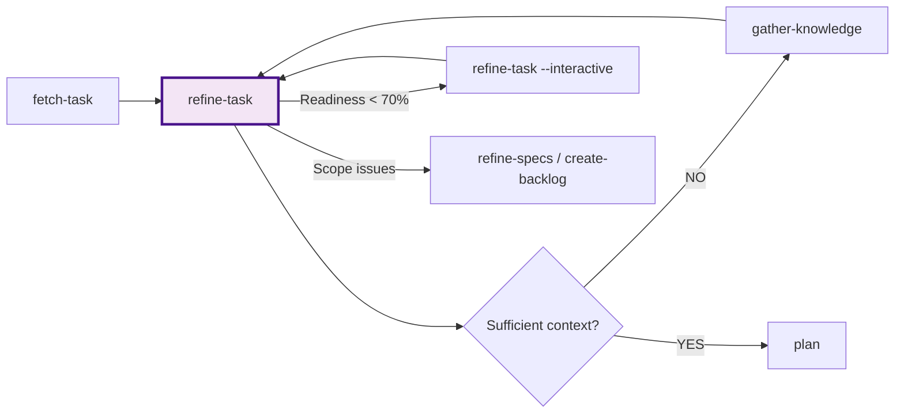

# Task Refinement Command

## Role

Use the [agent] profile

## Goal

**Transform a fetched task into a crystal-clear, implementation-ready specification** by:

1. **Analyzing task clarity** - Identify ambiguities, gaps, and assumptions
2. **Clarifying requirements** - Ask targeted questions to resolve uncertainties
3. **Defining acceptance criteria** - Ensure testable, measurable success conditions
4. **Establishing context** - Link to PRD, codebase patterns, and constraints
5. **Collecting user answers** - Gather responses to clarifying questions interactively
6. **Validating readiness** - Confirm task is ready for technical planning
7. **Preparing handoff** - Package refined task for `/plan` command

**This command bridges product requirements (WHAT) and technical planning (HOW).**

## Context

### Input Arguments

```plaintext
$ARGUMENTS
```

### Task Source

```structured
<details>
<summary>Identify task to refine</summary>

Task can come from:
1. Most recent task from `/fetch-task` (stored in TODO.md)
2. Explicit task ID via --task-id parameter
3. User-provided task description inline
4. Task reference from BACKLOG.md

Priority: Explicit parameter > Recent fetch > User input
</details>
```

### Related Documentation

```structured
<details>
<summary>Gather context documents</summary>

Check for:
- knowledge-base/PRD.md (functional requirements)
- knowledge-base/BACKLOG.md (task dependencies)
- knowledge-base/backend/ARCHITECTURE.md (technical patterns)
- knowledge-base/frontend/ARCHITECTURE.md (UI patterns)
- knowledge-base/FUNCTIONAL.md (user flows)
- TODO.md (current project state)
</details>
```

## Process Steps

### Step 1: Load Task & Analyze Current State

**Objective**: Retrieve task details and assess current clarity level.

**Actions**: Execute `context.load-task` prompt to:

- Locate task from TODO.md, BACKLOG.md, or user input
- Extract all task components and metadata
- Load related PRD requirements and context
- Assess initial clarity baseline

**Output**: Task loaded + initial assessment

---

### Step 2: Analyze Clarity & Identify Gaps

**Objective**: Systematically identify areas requiring clarification.

**Actions**: Execute `onboard.analyze-clarity` prompt to:

- Calculate clarity score across 5 dimensions
- Identify specific ambiguities and gaps
- Prioritize gaps (P0/P1/P2)
- Categorize by type (requirements/criteria/context/scope/dependencies)

**Clarity Thresholds**:

- **≥ 85%**: Mostly clear, minor refinement needed
- **60-84%**: Moderate clarity, requires focused clarification
- **< 60%**: Major gaps, needs significant refinement

**Output**: Clarity score + categorized gaps + priorities

---

### Step 3: Refine Requirements & Resolve Ambiguities

**Objective**: Resolve ambiguities through questioning or inference.

**Actions**: Execute `onboard.refine-requirements` prompt to:

**If `--interactive` mode**:

- Generate 3-5 targeted questions with options
- Present to user and await responses
- Iterate until P0 gaps resolved

**If auto mode** (default):

- Make reasonable inferences from codebase patterns
- Reference PRD requirements and similar tasks
- Apply standard domain practices
- Document all assumptions with confidence levels
- Flag high-risk assumptions for validation

**Output**: Refined requirements + questions OR assumptions documented

---

### Step 4: Validate Testability

**Objective**: Ensure acceptance criteria are testable and complete.

**Actions**: Execute `review.validate-testability` prompt to:

- Evaluate criteria using SMART framework
- Check coverage (happy path/edge/error/non-functional)
- Map criteria to test types (unit/integration/e2e/manual)
- Calculate testability score
- Identify any remaining gaps

**Testability Thresholds**:

- **≥ 90%**: Excellent, ready for planning
- **80-89%**: Good, minor improvements suggested
- **< 80%**: Needs additional refinement

**Output**: Testability score + test strategy + readiness assessment

---

### Step 5: Collect User Clarifications

**Objective**: Collect user answers to clarifying questions generated during refinement.

**Actions**: Execute `onboard.collect-clarifications` prompt to:

- Present clarifying questions from the refine stage
- Collect user answers interactively
- Generate summary of decisions for documentation
- Track questions answered vs skipped

**Condition**: Only runs if clarifying questions were generated in Step 3.

**Output**: User answers + summary + questions answered/skipped

---

### Step 6: Calculate Final Readiness & Validate

**Objective**: Confirm task is ready for planning phase.

**Readiness Checklist**:

- [ ] Requirements are clear (no ambiguity)
- [ ] Acceptance criteria complete (all scenarios covered)
- [ ] Acceptance criteria testable (SMART compliant)
- [ ] Scope is bounded (in/out explicit)
- [ ] Dependencies identified and validated
- [ ] Technical context provided
- [ ] Assumptions documented
- [ ] Effort estimate validated
- [ ] Priority confirmed

**Readiness Score**:

```plaintext
Readiness Score = (Checked items / 9) * 100%
```

**Quality Gates**:

- **≥ 85%**: ✅ Ready for `/plan`
- **70-84%**: ⚠️ Mostly ready, proceed with caution
- **< 70%**: ❌ Not ready, needs more work

**Output**: Readiness score + validation report

---

### Step 7: Document Refined Task & Prepare Handoff

**Objective**: Package refined task for planning phase.

**Refined Task Document Template**:

````markdown
# 🎯 Refined Task: [TASK-ID] - [Task Title]

**Status**: Ready for Planning  
**Last Updated**: [Date]  
**Refined By**: @product-manager  
**Readiness Score**: [XX]%

---

## 📋 Task Summary

**Priority**: [P0/P1/P2]  
**Domain**: [Frontend/Backend/Infrastructure/Data/Testing/Documentation]  
**Effort**: [XS/S/M/L/XL] ([estimated hours/days])  
**Complexity**: [Simple/Moderate/Complex]

**Description**:
[Clear, concise description of what needs to be built]

**User Value**:
[Why this matters - business/user impact]

---

## ✅ Acceptance Criteria

### Functional Requirements

**FR-XXX: [Requirement Title from PRD]**

1. **Happy Path**: [Primary success scenario]

   ```gherkin
   GIVEN [initial state]
   WHEN [user action]
   THEN [expected outcome]
   ```

2. **Edge Cases**:
   - ✅ [Edge case 1]: [Expected behavior]
   - ✅ [Edge case 2]: [Expected behavior]

3. **Error Handling**:
   - ✅ [Error case 1]: [Expected error handling]
   - ✅ [Error case 2]: [Expected error handling]

### Non-Functional Requirements

**Performance**:

- ✅ [Performance target with specific metrics]

**Security**:

- ✅ [Security requirement]

**Accessibility**:

- ✅ [A11y requirement]

**Usability**:

- ✅ [UX requirement]

---

## 🎭 User Flows

**Primary Flow**:

1. [Step 1]
2. [Step 2]
3. [Step 3]

**Alternative Flows**:

- [Alternative scenario 1]
- [Alternative scenario 2]

---

## 🔗 Linked Requirements

**PRD Requirements**:

- [FR-XXX]: [Requirement title] → [Link to PRD]
- [NFR-XXX]: [Requirement title] → [Link to PRD]

**User Stories**:

- [US-XXX]: [Story title] → [Link to story]

---

## 🧩 Dependencies

**Prerequisite Tasks**:

- ✅ [TASK-XXX]: [Title] (Completed)
- ✅ [TASK-YYY]: [Title] (Completed)

**Integration Points**:

- [Service/API name]: [Purpose of integration]
- [Component name]: [Purpose of integration]

**Blocked By**:

- None (or list blockers if any)

---

## 🛠️ Technical Context

**Domain**: [Detailed domain description]

**Relevant Files/Modules**:

```plaintext
src/
├── [relevant directory]/
│   ├── [file1.ts] - [Purpose]
│   ├── [file2.ts] - [Purpose]
```

**Patterns to Follow**:

- [Pattern 1]: [When to use, example reference]
- [Pattern 2]: [When to use, example reference]

**Similar Implementations**:

- `[Feature Name]` ([TASK-ID]): [What can be reused/learned]

**Integration Points**:

- [Internal Service]: [Endpoint/method to call]
- [External API]: [API details]
- [Database]: [Tables/collections involved]

---

## ⚠️ Constraints & Considerations

**Technical Constraints**:

- [Constraint 1]
- [Constraint 2]

**Business Constraints**:

- [Constraint 1]

**Performance Targets**:

- [Target 1]: [Specific metric]
- [Target 2]: [Specific metric]

**Security Requirements**:

- [Requirement 1]
- [Requirement 2]

**Accessibility Requirements**:

- [Requirement 1]

---

## 🎯 Scope Definition

### In Scope

✅ [Feature/capability explicitly included]  
✅ [Feature/capability explicitly included]  
✅ [Feature/capability explicitly included]

### Out of Scope

❌ [Feature/capability explicitly excluded] - Reason: [Why deferred]  
❌ [Feature/capability explicitly excluded] - Reason: [Why not needed]

### Future Considerations

🔮 [Potential future enhancement]  
🔮 [Potential future enhancement]

---

## 💡 Assumptions

1. **[Assumption 1]**: [Rationale or basis]
2. **[Assumption 2]**: [Rationale or basis]
3. **[Assumption 3]**: [Rationale or basis]

⚠️ **High-Risk Assumptions** (validate during planning):

- [Assumption that needs verification]

---

## 🧪 Testing Strategy

**Unit Tests**:

- [What to unit test]

**Integration Tests**:

- [What to integration test]

**E2E Tests**:

- [What user flows to test end-to-end]

**Manual Testing**:

- [What requires manual validation]

**Test Data**:

- [Any specific test data needs]

---

## 📊 Success Metrics

**Definition of Done**:

- [ ] All acceptance criteria verified
- [ ] All tests passing (unit, integration, e2e)
- [ ] Code reviewed and approved
- [ ] Documentation updated
- [ ] No critical or high severity issues

**Success Indicators**:

---

## 🚀 Recommended Next Steps

[If readiness ≥ 85%]:
"✅ Task is fully refined and ready for technical planning."

**Next Command**: `/plan [TASK-ID]`

**Planning Focus Areas**:

1. [Area requiring special planning attention]
2. [Area requiring special planning attention]

[If readiness 70-84%]:
"⚠️ Task is mostly ready with minor gaps: [list gaps]."

**Options**:

1. Proceed to `/plan [TASK-ID]` and address gaps during planning
2. Iterate refinement: `/refine-task [TASK-ID] --interactive`

[If readiness < 70%]:
"❌ Task needs more refinement: [list major gaps]."

**Recommendations**:

1. Run `/refine-task [TASK-ID] --interactive` to clarify gaps
2. Consult with stakeholders on: [specific questions]
3. Update PRD if requirements are unclear: `/refine-specs`

---

## 📎 References

- **PRD**: [Link to knowledge-base/PRD.md]
- **Backlog**: [Link to knowledge-base/BACKLOG.md]
- **Architecture**: [Link to relevant architecture docs]
- **Design**: [Link to design mockups/specs if applicable]

---

## 📝 Refinement History

**[Date] - Initial Refinement**:

- Clarified: [What was clarified]
- Added: [What acceptance criteria were added]
- Assumptions: [What assumptions were made]

**[Date] - Updated** (if applicable):

- Changes: [What changed]
- Reason: [Why it changed]

````

**Actions**:

1. **Save refined task**:
   - Update BACKLOG.md with refined version
   - Add refinement notes section
   - Timestamp the refinement

2. **Update TODO.md**:
   - Mark task as "Ready for Planning"
   - Add readiness score
   - Link to refined task document

3. **Create handoff summary**:

   ```markdown
   ## 📤 Handoff to Planning
   
   **Task**: [TASK-ID] - [Title]
   **Readiness**: [XX]%
   **Confidence**: [High/Medium/Low]
   
   **Key Points for Planning**:
   1. [Important consideration for implementation planning]
   2. [Important consideration for implementation planning]
   3. [Important consideration for implementation planning]
   
   **Risk Areas** (for planning attention):
   - [Technical risk or uncertainty]
   - [Integration complexity]
   
   **Estimated Complexity**: [Justification for effort estimate]
   ```

4. **Confirm with user**:
   > "✅ Task [TASK-ID] has been refined and is ready for planning.  
   > **Readiness**: [XX]%  
   > **Next Step**: Proceed to `/plan [TASK-ID]` to create technical implementation plan?"

**Output**: Refined task document saved + handoff summary + user confirmation prompt

---

## Rules & Constraints

### DO

✅ **Follow the pipeline** - Execute prompts in sequence  
✅ **Use interactive mode** - When P0 gaps exist or task is critical  
✅ **Document assumptions** - In auto mode, make reasoning explicit  
✅ **Validate completeness** - Don't skip readiness checks  
✅ **Link to PRD** - Maintain traceability to requirements  
✅ **Prepare for planning** - Package context for next phase  
✅ **Focus on WHAT** - Requirements, not implementation details

### DON'T

❌ **Don't skip prompts** - Each stage is necessary for quality  
❌ **Don't prescribe HOW** - That's for planning phase  
❌ **Don't rush validation** - Quality gates prevent rework  
❌ **Don't accept vague criteria** - Use prompts to refine  
❌ **Don't ignore non-functional requirements** - Performance, security, a11y matter  
❌ **Don't change scope** - Flag issues but maintain boundaries  
❌ **Don't proceed if not ready** - Low readiness → iterate or escalate

---

## Output Format

Present refined task using the template in Step 7, followed by:

```markdown
---

## 📊 Refinement Summary

**Pipeline Execution**:
- ✅ Task loaded (context.load-task)
- ✅ Clarity analyzed (onboard.analyze-clarity): [XX]%
- ✅ Requirements refined (onboard.refine-requirements)
- ✅ Testability validated (review.validate-testability): [XX]%

**Final Readiness**: [XX]% ([Status])

**Key Improvements**:
- ✅ [What was clarified/added/refined]
- ✅ [What was clarified/added/refined]
- ✅ [What was clarified/added/refined]

**Mode**: [Interactive/Auto]
**Assumptions Made** (auto mode): [Count]
**High-Risk Assumptions**: [Count flagged for validation]

**Remaining Gaps** (if any):
- ⚠️ [Gap]: [Why acceptable or needs attention]

---

## ✅ Ready for Next Phase

**Status**: [Ready ✅ / Mostly Ready ⚠️ / Not Ready ❌]

**Next Command**: `/plan [TASK-ID]`

**Planning Focus Areas**:
1. [Technical approach consideration]
2. [Integration complexity consideration]
3. [Testing strategy consideration]

**Validation Needed**:
- [High-risk assumption to validate during planning]
```

---

## Success Indicators

This command succeeds when:

### Pipeline Execution

1. ✅ All 5 prompts executed successfully in sequence
2. ✅ Each prompt produced required outputs
3. ✅ No blocking errors encountered

### Quality Gates

1. ✅ Clarity score calculated (from onboard.analyze-clarity)
2. ✅ Testability score ≥ 80% (from review.validate-testability)
3. ✅ Final readiness score ≥ 70% (ideally ≥ 85%)

### Content Quality

1. ✅ Acceptance criteria complete, testable, and measurable
2. ✅ Scope boundaries explicit (in/out of scope)
3. ✅ Dependencies identified and validated
4. ✅ Assumptions documented (auto mode) OR questions answered (interactive)
5. ✅ Technical context provided

### Deliverables

1. ✅ Refined task document created/updated
2. ✅ BACKLOG.md updated with refinement
3. ✅ TODO.md updated with readiness status
4. ✅ Clear recommendation for next phase

## Command Output Summary

Print the following summary at command completion:

**For ready task:**

```markdown
## ✅ Task Refined: [TASK-ID]

**Readiness Score**: [XX]%
**Status**: Ready for Planning

### Refinement Summary
- **Clarity Score**: [XX]%
- **Testability Score**: [XX]%
- **Acceptance Criteria**: [N] defined

### Key Clarifications
- ✅ [What was clarified]
- ✅ [What was added]
- ✅ [Assumptions documented]

### Documents Updated
→ `knowledge-base/BACKLOG.md` (task updated)
→ `TODO.md` (status updated)

### Next Step
→ `/plan [TASK-ID]` to create implementation plan
```

**For mostly ready task:**

```markdown
## ⚠️ Task Refined: [TASK-ID]

**Readiness Score**: [XX]%
**Status**: Mostly Ready - Minor gaps

### Gaps Identified
- ⚠️ [Gap 1]: [Description]
- ⚠️ [Gap 2]: [Description]

### Recommendations
- Proceed with caution, document assumptions
- Or run `/refine-task --interactive` for clarification

### Next Step
→ `/plan [TASK-ID]` (proceed with noted gaps)
→ `/refine-task [TASK-ID] --interactive` (for clarification)
```

**For not ready task:**

```markdown
## ❌ Task Not Ready: [TASK-ID]

**Readiness Score**: [XX]%
**Status**: Not Ready - Major gaps

### Critical Gaps
1. [Gap]: [Why it blocks planning]
2. [Gap]: [Why it blocks planning]

### Required Actions
- [Action to resolve gap]

### Next Step
→ `/refine-task [TASK-ID] --interactive` for deeper refinement
→ `/gather-knowledge` if technical context missing
```

---

## Integration with Workflow

**Entry Point**: After `/fetch-task` (Task Preparation Phase - see WORKFLOW.md)

**Prerequisites**:

- ✅ Task fetched from backlog (via `/fetch-task`)
- ✅ Task exists in BACKLOG.md with basic details
- ✅ PRD available for requirement linking
- ✅ Relevant architecture docs accessible

**Exits**:

- ✅ **Success (Ready)**: → `/plan [TASK-ID]` (Planning Phase begins)
- 🔄 **Needs More Context**: → `/gather-knowledge` then return to `/refine-task`
- 🔄 **Low Readiness**: → Iterate `/refine-task --interactive` with more input
- ⚠️ **Scope Issues**: → `/refine-specs` or `/create-backlog` (task definition problem)
- ⚠️ **Blocker Discovered**: → Resolve dependency or select different task

**Workflow Position**:



---

## Examples

### Example 1: Auto Mode with Inferences

```bash
/refine-task --task-id=FE0012
```

**Pipeline Execution**:

1. `context.load-task` → Found vague task description
2. `onboard.analyze-clarity` → Clarity: 35% (major gaps)
3. `onboard.refine-requirements` → Made 4 assumptions based on similar tasks
4. `review.validate-testability` → Testability: 88%

**Result**: Readiness 85% - Ready for planning with documented assumptions

---

### Example 2: Interactive Mode

```bash
/refine-task --task-id=BE0045 --interactive
```

**Pipeline Execution**:

1. `context.load-task` → Task loaded, missing security details
2. `onboard.analyze-clarity` → Clarity: 45% (P0 gaps in security)
3. `onboard.refine-requirements` → Asked 5 questions about security/validation
4. User answered questions
5. `review.validate-testability` → Testability: 92%

**Result**: Readiness 90% - Ready for planning with user-validated requirements

---

### Example 3: Already Well-Defined Task

```bash
/refine-task --task-id=TEST0008
```

**Pipeline Execution**:

1. `context.load-task` → Task has complete details
2. `onboard.analyze-clarity` → Clarity: 92% (minor edge case gap)
3. `onboard.refine-requirements` → Added 1 edge case criterion
4. `review.validate-testability` → Testability: 95%

**Result**: Readiness 95% - Excellent, proceed to planning immediately

---

## Notes

### When to Use This Command

**Always use after `/fetch-task`** when:

- Task is P0/P1 (critical work)
- Acceptance criteria are vague or missing
- Task is from high-level backlog requiring detail

**Can skip** (proceed directly to `/plan`) when:

- Task is very simple (XS effort, clear scope)
- Task was previously refined (has detailed criteria)
- Small bugfix with explicit requirements

### Mode Selection

**Interactive Mode** (`--interactive`):

- Use when: P0 gaps exist, task is critical, multiple interpretations possible
- Benefit: User-validated requirements, no assumptions
- Trade-off: Requires user availability and input

**Auto Mode** (default):

- Use when: Patterns exist in codebase, time pressure, P1/P2 tasks
- Benefit: Fast, autonomous, leverages existing patterns
- Trade-off: Relies on assumptions (documented and flagged)

### Handling Low Readiness

If readiness < 70% after refinement:

1. **Try `/gather-knowledge`** - May need more codebase context
2. **Re-run with `--interactive`** - Get direct user clarification
3. **Check dependencies** - May be blocked by other tasks
4. **Consider task splitting** - May be too large/complex
5. **Escalate** - May need product/stakeholder input

### Prompt Reusability

- `context.load-task` - Reusable for any task loading scenario
- `onboard.analyze-clarity` - Reusable for requirements/specifications analysis
- `review.validate-testability` - Reusable for any acceptance criteria validation
- All prompts follow consistent patterns from existing prompts
