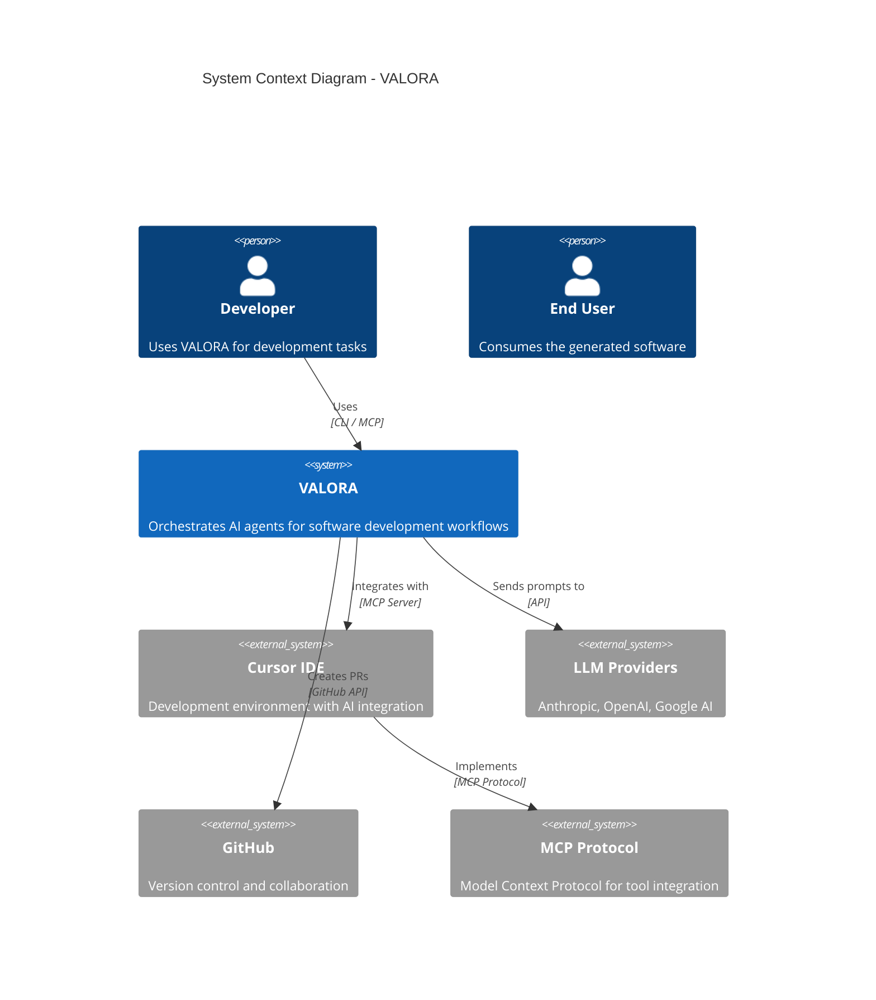
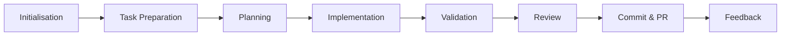

# VALORA Documentation

> A comprehensive TypeScript-based AI orchestration engine with multi-LLM support, session-based state management, and Cursor MCP integration.

## Quick Navigation

| Audience       | Documentation                                                                             |
| -------------- | ----------------------------------------------------------------------------------------- |
| **Users**      | [User Guide](./user-guide/README.md) - Getting started, workflows, and daily usage        |
| **Developers** | [Developer Guide](./developer-guide/README.md) - Architecture, codebase, and contribution |
| **Architects** | [Architecture Documentation](./architecture/README.md) - System design and decisions      |
| **API Users**  | [API Reference](./api-reference/README.md) - CLI, MCP, and TypeScript APIs                |
| **Operations** | [Operations Guide](./operations/README.md) - Deployment, monitoring, and maintenance      |

## What is VALORA?

VALORA (Versatile Agent Logic for Orchestrated Response Architecture) is a software development automation platform that orchestrates multiple AI agents to handle complete development workflows. It implements an 8-phase development lifecycle with 11 specialised agents and 24 commands.

### Key Capabilities

- **Multi-Agent Collaboration**: 11 specialised AI agents with distinct roles and expertise
- **Three-Tier Execution**: MCP Sampling, Guided Completion, and API Fallback modes
- **Session-Based State**: Persistent context across command executions
- **Interactive Clarification**: Pipelines pause to collect user answers, ensuring decisions are documented
- **Model Optimisation**: Cost-efficient AI model selection (GPT-5, Claude Sonnet, Claude Haiku)
- **Quality Gates**: Multi-layer validation preventing technical debt
- **Workflow Metrics**: Automated tracking and reporting of optimisation effectiveness

## System Overview



## Architecture at a Glance

The engine follows a modular, layered architecture:

| Layer                   | Components                      | Responsibility                            |
| ----------------------- | ------------------------------- | ----------------------------------------- |
| **CLI Layer**           | Commands, Flags, Wizard         | User interaction and command parsing      |
| **Orchestration Layer** | Pipeline, Executor, Coordinator | Workflow execution and state management   |
| **Agent Layer**         | Registry, Loader, Selection     | AI agent management and dynamic selection |
| **LLM Layer**           | Providers, Registry             | Multi-provider LLM integration            |
| **Service Layer**       | Session, Config, Cleanup        | Cross-cutting concerns                    |

## Development Lifecycle

The engine implements an 8-phase development lifecycle:



| Phase            | Purpose                        | Key Commands                                                                                  |
| ---------------- | ------------------------------ | --------------------------------------------------------------------------------------------- |
| Initialisation   | Define scope, gather context   | `refine-specs`, `create-prd`, `create-backlog`, `generate-docs`, `generate-all-documentation` |
| Task Preparation | Fetch and contextualise tasks  | `fetch-task`, `refine-task`, `gather-knowledge`                                               |
| Planning         | Design implementation strategy | `plan`, `plan-architecture`, `plan-implementation`, `validate-plan`, `review-plan`            |
| Implementation   | Execute code changes           | `implement`                                                                                   |
| Validation       | Verify correctness             | `assert`, `test`, `validate-coverage`, `validate-parallel`                                    |
| Review           | Quality assurance              | `pre-check`, `review-code`, `review-functional`                                               |
| Commit & PR      | Finalise and merge             | `commit`, `create-pr`                                                                         |
| Feedback         | Continuous improvement         | `feedback`                                                                                    |

## Agent Ecosystem

The engine employs 11 specialised agents:

| Agent                                           | Domain         | Role                                       |
| ----------------------------------------------- | -------------- | ------------------------------------------ |
| **lead**                                        | Leadership     | Technical oversight, architecture, reviews |
| **product-manager**                             | Product        | Requirements, backlog, prioritisation      |
| **software-engineer-typescript**                | Engineering    | General TypeScript development             |
| **software-engineer-typescript-backend**        | Backend        | APIs, databases, Node.js                   |
| **software-engineer-typescript-frontend**       | Frontend       | React, Vue, Svelte                         |
| **software-engineer-typescript-frontend-react** | React          | React/Next.js specialisation               |
| **platform-engineer**                           | Infrastructure | DevOps, cloud, Kubernetes                  |
| **qa**                                          | Quality        | Testing, automation                        |
| **asserter**                                    | Validation     | Completeness checking                      |
| **secops-engineer**                             | Security       | Compliance, threat detection               |
| **ui-ux-designer**                              | Design         | UI/UX, accessibility                       |

## Workflow Optimisations

The engine includes 7 workflow optimisations that reduce development time by up to 32%:

| Optimisation            | Time Savings       | Target Adoption     |
| ----------------------- | ------------------ | ------------------- |
| **Plan Templates**      | 8-10 min/plan      | 40% of plans        |
| **Early Exit Reviews**  | 10-15 min/review   | 30% of reviews      |
| **Express Planning**    | 10-12 min/plan     | 15% of plans        |
| **Parallel Validation** | 12-15 min/review   | All reviews         |
| **Real-Time Linting**   | 3-5 min/workflow   | All implementations |
| **Decision Criteria**   | 5-8 min/review     | All reviews         |
| **Technical Defaults**  | 12-15 min/workflow | All workflows       |

**Baseline Workflow**: 3h 12m → **Optimised**: ~2h 10m (32% reduction)

See [Metrics and Optimisation Guide](./user-guide/metrics.md) for details.

## Getting Started

### For Users

Start with the [User Guide](./user-guide/README.md):

1. [Quick Start](./user-guide/quick-start.md) - Get up and running in 5 minutes
2. [Basic Workflows](./user-guide/workflows.md) - Common development patterns
3. [Command Reference](./user-guide/commands.md) - All 24 commands explained
4. [Metrics and Optimisation](./user-guide/metrics.md) - Track and improve efficiency

### For Developers

Start with the [Developer Guide](./developer-guide/README.md):

1. [Development Setup](./developer-guide/setup.md) - Environment configuration
2. [Codebase Overview](./developer-guide/codebase.md) - Project structure
3. [Contributing](./developer-guide/contributing.md) - How to contribute
4. [Code Quality Standards](./developer-guide/code-quality.md) - Coding standards and best practices

### For Architects

Start with the [Architecture Documentation](./architecture/README.md):

1. [System Architecture](./architecture/system-architecture.md) - High-level design
2. [Component Architecture](./architecture/components.md) - Module structure
3. [Architecture Decision Records](./adr/README.md) - Key decisions

## Documentation Structure

```plaintext
documentation/
├── README.md                       # This file - main entry point
├── DESIGN.md                       # Design philosophy
├── THOUGHTS.md                     # Design thoughts and rationale
├── user-guide/                     # User-focused documentation
│   ├── README.md                  # User guide overview
│   ├── quick-start.md             # Getting started quickly
│   ├── workflows.md               # Development workflows
│   ├── commands.md                # Command reference
│   ├── dry-run-mode.md            # Preview changes
│   ├── metrics.md                 # Workflow optimisation metrics
│   ├── metrics-quickstart.md      # 5-minute metrics setup
│   ├── workflow-optimizations.md  # Detailed optimisation reference
│   ├── configuration.md           # Configuration and customisation
│   ├── best-practices.md          # Recommended usage patterns
│   └── troubleshooting.md         # Common issues and solutions
├── developer-guide/                # Developer-focused documentation
│   ├── README.md                  # Developer guide overview
│   ├── setup.md                   # Development environment setup
│   ├── codebase.md                # Codebase structure
│   ├── contributing.md            # Contribution guidelines
│   ├── code-quality.md            # Code quality standards
│   ├── CODE-QUALITY-GUIDELINES.md # Detailed quality guidelines
│   └── LANGUAGE_CONVENTION.md     # Language usage conventions
├── architecture/                   # Architecture documentation
│   ├── README.md                  # Architecture overview
│   ├── system-architecture.md     # System-level design
│   ├── components.md              # Component architecture
│   ├── data-flow.md               # Data flow diagrams
│   ├── session-optimization.md    # Session performance
│   ├── metrics-system.md          # Metrics collection architecture
│   └── metrics-dashboard.md       # Comprehensive metrics reference
├── api-reference/                  # API documentation
│   └── README.md                  # CLI, MCP, and TypeScript APIs
├── operations/                     # Operations documentation
│   ├── README.md                  # Deployment and maintenance
│   └── automated-reporting.md     # Automated metrics reporting
└── adr/                            # Architecture Decision Records
    ├── README.md                  # ADR index
    ├── 001-multi-agent-architecture.md
    ├── 002-guidance-vs-knowledge-separation.md
    ├── 002-three-tier-execution.md
    ├── 003-session-based-state.md
    ├── 004-pipeline-execution-model.md
    ├── 005-llm-provider-abstraction.md
    ├── 006-automatic-context-flush.md
    └── 007-persistent-stage-output-caching.md
```

## Technology Stack

| Category            | Technologies                 |
| ------------------- | ---------------------------- |
| **Runtime**         | Node.js 18+, TypeScript 5.x  |
| **Package Manager** | pnpm 10.x                    |
| **Build**           | tsc, tsc-alias               |
| **Testing**         | Vitest, Playwright           |
| **LLM Providers**   | Anthropic, OpenAI, Google AI |
| **UI**              | Ink (React for CLI), Chalk   |
| **Validation**      | Zod                          |
| **Documentation**   | Markdown, Mermaid            |

## Version

- **Package**: `valora`
- **Version**: 1.0.0
- **Licence**: MIT

---

*This documentation is maintained as part of the VALORA project. For updates and contributions, see the [Contributing Guide](./developer-guide/contributing.md).*
