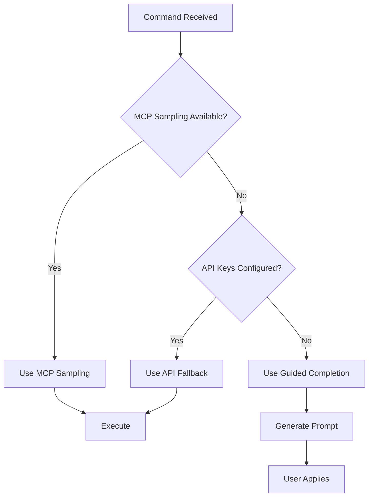

# ADR-002: Three-Tier Execution Model

## Status

Accepted

## Context

VALORA needs to support multiple execution environments:

1. **Cursor IDE Users**: Want to leverage their existing Cursor subscription without additional API costs
2. **Power Users**: Want fully autonomous execution with their own API keys
3. **Future Integration**: Need to support native MCP sampling when available

Additionally, the engine should work with **zero configuration** for new users, while offering advanced options for experienced users.

## Decision

We will implement a **three-tier execution model** with intelligent fallback:

### Tier 1: MCP Sampling (Future)

- **Status**: Not yet available (pending Cursor implementation)
- **Cost**: Free (uses Cursor subscription)
- **Mechanism**: Native MCP protocol sampling
- **Use Case**: Seamless IDE integration

### Tier 2: Guided Completion Mode (Default)

- **Status**: Active and default
- **Cost**: Free (uses Cursor subscription)
- **Mechanism**: Generates structured prompts for Cursor AI to process
- **Use Case**: Zero-configuration usage, learning, transparency

How it works:

1. User invokes a command (e.g., `valora plan "feature"`)
2. Engine generates a detailed, structured prompt
3. Prompt is presented to Cursor AI for completion
4. User reviews and applies the guidance

### Tier 3: API Fallback

- **Status**: Available when configured
- **Cost**: Pay per API call
- **Mechanism**: Direct API calls to LLM providers
- **Use Case**: Autonomous execution, CI/CD integration

How it works:

1. User configures API keys
2. Commands execute automatically via API
3. Results returned without user intervention

### Fallback Logic



## Consequences

### Positive

- **Zero-Configuration Start**: Users can begin immediately without API keys
- **Cost Flexibility**: Users choose their cost model
- **Learning Mode**: Guided completion helps users understand workflows
- **Future-Proof**: Ready for MCP sampling when available
- **IDE Integration**: Tight Cursor integration without custom protocols

### Negative

- **Complexity**: Three execution paths to maintain
- **User Confusion**: Different behaviours may confuse users
- **Testing Burden**: All three tiers need testing
- **Documentation**: Must explain all three modes

### Neutral

- **Provider Configuration**: Centralised in config files
- **Fallback Detection**: Automatic based on available configuration

## Alternatives Considered

### Alternative 1: API-Only

Require API keys for all operations.

**Rejected because**:

- High barrier to entry
- Not suitable for casual users
- Ignores Cursor subscription value

### Alternative 2: Cursor-Only

Only support Cursor integration.

**Rejected because**:

- Limits automation potential
- No CI/CD support
- Vendor lock-in

### Alternative 3: Separate Tools

Different tools for different execution modes.

**Rejected because**:

- Poor user experience
- Maintenance burden
- Fragmented ecosystem

## Implementation Notes

### Configuration Detection

```typescript
function resolveExecutionTier(): ExecutionTier {
  if (mcpSamplingAvailable()) return 'mcp-sampling';
  if (hasConfiguredApiKeys()) return 'api-fallback';
  return 'guided-completion';
}
```

### Provider Fallback Service

Located in `src/cli/provider-fallback-service.ts`:

- Detects available providers
- Implements fallback logic
- Generates guided prompts when needed

### User Communication

- Clear indication of current execution mode
- Explanation of what will happen
- Guidance on configuration options

## References

- [Provider Resolver](../../.bin/src/cli/provider-resolver.ts)
- [Provider Fallback Service](../../.bin/src/cli/provider-fallback-service.ts)
- [User Guide - Execution Modes](../user-guide/README.md)
