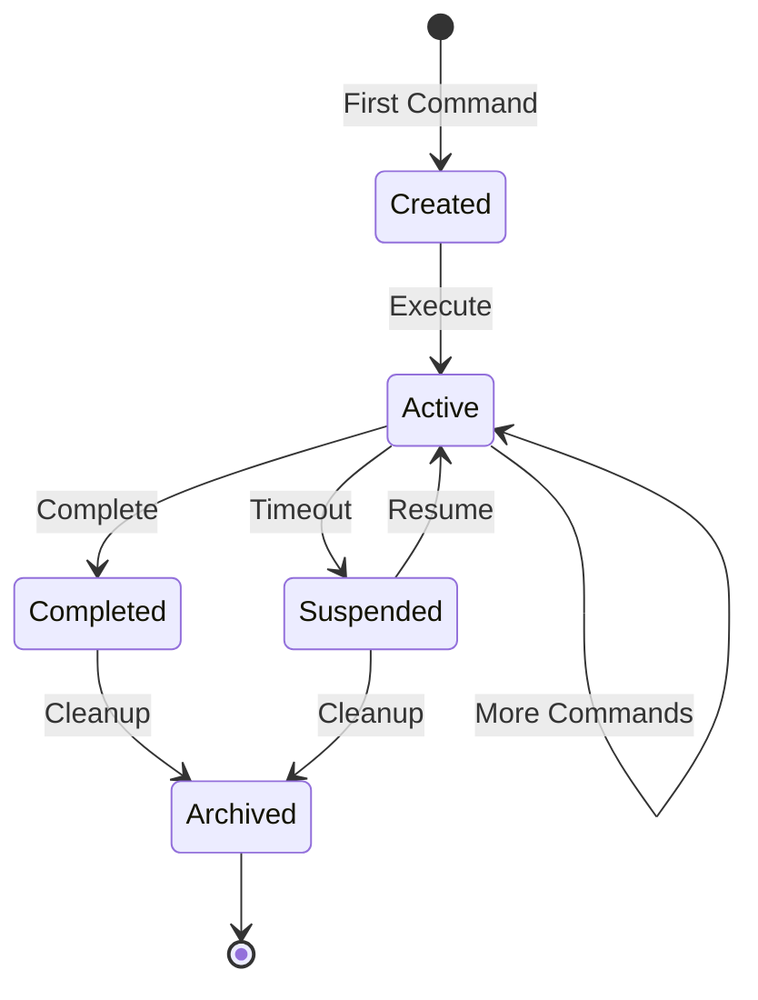

# ADR-003: Session-Based State Management

## Status

Accepted

## Context

Software development workflows involve multiple sequential commands that build upon each other:

1. `plan` creates an implementation plan
2. `implement` uses that plan
3. `review-code` reviews the implemented changes
4. `commit` summarises all changes

Without state management, each command would require users to manually provide context from previous commands, leading to:

- Poor user experience
- Loss of context
- Inconsistent results
- Manual context assembly errors

## Decision

We will implement **session-based state management** that:

1. **Persists context** across command executions
2. **Automatically aggregates** outputs from previous commands
3. **Provides session lifecycle** management (create, resume, complete)
4. **Stores sessions as files** for simplicity and portability

### Session Structure

```typescript
interface Session {
  // Identity
  id: string;
  createdAt: Date;
  updatedAt: Date;

  // Context - carries forward between commands
  context: {
    currentTask?: Task;
    currentPlan?: Plan;
    knowledgeBase: KnowledgeItem[];
    history: CommandHistoryEntry[];
  };

  // Outputs - indexed by command name
  outputs: Map<string, CommandOutput>;

  // Metadata
  metadata: {
    commandCount: number;
    lastCommand: string;
    totalTokens: number;
    status: 'active' | 'suspended' | 'completed';
  };
}
```

### Session Lifecycle



### Context Propagation

When a command executes:

1. Load session context
2. Inject relevant previous outputs into prompt
3. Execute command
4. Capture output
5. Update session context
6. Persist session

## Consequences

### Positive

- **Seamless Workflows**: Commands naturally build on each other
- **Reduced User Effort**: No manual context management
- **Consistent Context**: All commands share the same understanding
- **Audit Trail**: Complete history of commands and outputs
- **Resumability**: Sessions can be resumed after interruption

### Negative

- **Storage Overhead**: Sessions accumulate data over time
- **Stale Context**: Old sessions may have outdated context
- **Complexity**: Session management adds code complexity
- **Cleanup Required**: Sessions need periodic cleanup

### Neutral

- **File-Based Storage**: Simple but not suitable for multi-user scenarios
- **Session Selection**: Users may need to manage multiple sessions

## Implementation Details

### Session Storage

Sessions stored in `.ai/sessions/`:

```plaintext
.ai/sessions/
├── session-abc123.json
├── session-def456.json
└── session-ghi789.json
```

### Session Configuration

```json
{
  "sessions": {
    "max_age_days": 90,
    "max_count": 100,
    "max_size_mb": 50,
    "cleanup_interval_hours": 24
  }
}
```

### Context Injection

```typescript
function injectContext(prompt: string, session: Session): string {
  const context = [];

  if (session.outputs.has('plan')) {
    context.push(`## Previous Plan\n${session.outputs.get('plan').content}`);
  }

  if (session.context.currentTask) {
    context.push(`## Current Task\n${formatTask(session.context.currentTask)}`);
  }

  return `${context.join('\n\n')}\n\n${prompt}`;
}
```

## Alternatives Considered

### Alternative 1: Stateless Commands

Each command operates independently.

**Rejected because**:

- Poor user experience
- Manual context management required
- No workflow continuity

### Alternative 2: Database Storage

Use SQLite or similar for session storage.

**Rejected because**:

- Added dependency
- Overcomplicated for single-user scenario
- File-based is sufficient for v1

### Alternative 3: Memory-Only State

Keep state only in memory during CLI execution.

**Rejected because**:

- Lost on process exit
- Can't resume interrupted workflows
- No persistence across terminal sessions

### Alternative 4: Git-Based State

Store state in git branches or notes.

**Considered for future** but deferred because:

- Added complexity
- Git may not always be available
- Mixing concerns (state vs. source control)

## Session Management Commands

```bash
# List active sessions
valora session list

# Resume a specific session
valora session resume <session-id>

# Complete current session
valora session complete

# Clear session data
valora session clear
```

## References

- [Session Service](../../.bin/src/session/session.service.ts)
- [Session Repository](../../.bin/src/session/session.repository.ts)
- [Data Flow - Session](../architecture/data-flow.md)
