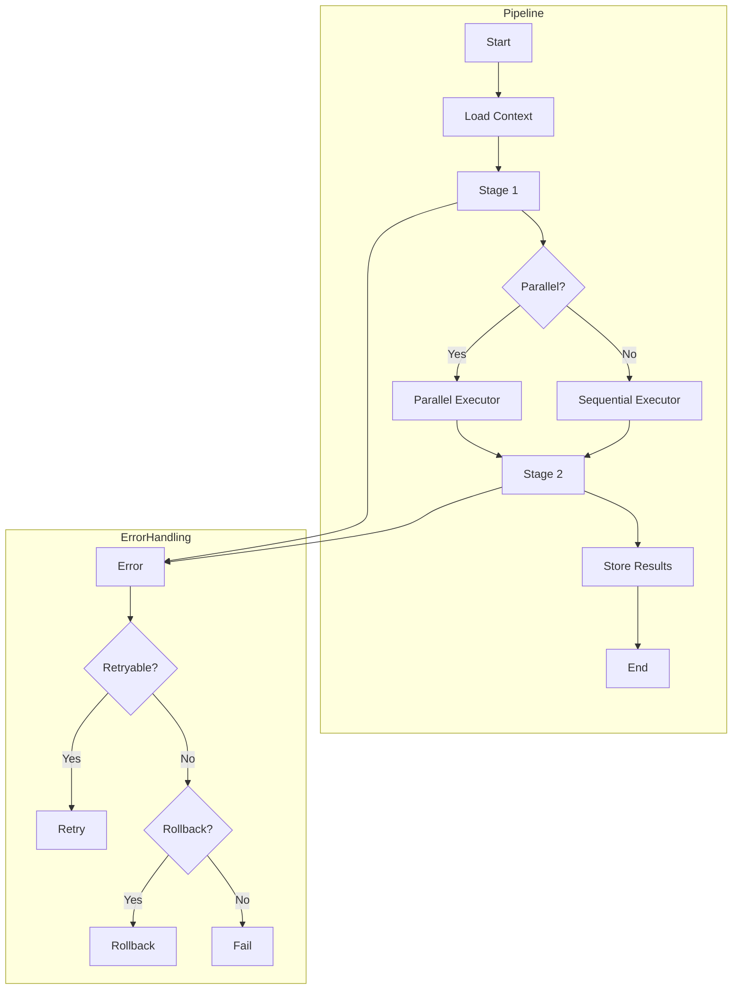

# ADR-004: Pipeline Execution Model

## Status

Accepted

## Context

Commands in VALORA often require multiple steps:

1. Load context and validate inputs
2. Prepare prompts with variable resolution
3. Execute one or more LLM calls
4. Process and validate outputs
5. Store results and update session

A simple sequential execution model would be:

- Inflexible for complex commands
- Difficult to compose stages
- Hard to implement parallel execution
- Challenging to handle errors and rollbacks

## Decision

We will implement a **pipeline execution model** with the following characteristics:

### Pipeline Structure

```typescript
interface Pipeline {
  stages: Stage[];
  errorHandler?: ErrorHandler;
  rollbackStrategy?: RollbackStrategy;
}

interface Stage {
  name: string;
  type: 'sequential' | 'parallel';
  steps: Step[];
  condition?: Condition;
  timeout?: number;
}

interface Step {
  action: Action;
  inputs: Variable[];
  outputs: Variable[];
  retries?: number;
}
```

### Execution Flow



### Variable Resolution

Variables are resolved at runtime:

```typescript
// Template
"Create a plan for: ${task.description}"

// Resolution
variables.resolve('task.description') // → "Add OAuth authentication"
```

### Stage Types

| Type        | Description                | Use Case                               |
| ----------- | -------------------------- | -------------------------------------- |
| Sequential  | Execute steps in order     | Most commands                          |
| Parallel    | Execute steps concurrently | Gather knowledge from multiple sources |
| Conditional | Execute based on condition | Error recovery                         |
| Interactive | Pause for user input       | Collect clarifications, confirmations  |

### Interactive Stages

Interactive stages pause pipeline execution to collect user input. They are used when:

- Clarifying questions need to be answered before proceeding
- User confirmation is required for critical decisions
- Ambiguities in specifications require human resolution

```typescript
interface InteractiveStage extends Stage {
  interactive: true;
  condition?: string;  // Only prompt if condition is true
  inputs: {
    clarifying_questions: Question[];
    context: string;
  };
  outputs: {
    answers: Record<string, Answer>;
    summary: string;
    questions_answered: number;
    questions_skipped: number;
  };
}
```

Interactive stages integrate with the `onboard.collect-clarifications` prompt which:

- Presents questions grouped by priority (P0 → P1 → P2)
- Allows users to select predefined options or provide custom answers
- Permits skipping non-critical questions
- Generates a formatted summary for inclusion in final documents

## Consequences

### Positive

- **Composability**: Stages can be reused across commands
- **Flexibility**: Mix sequential and parallel execution
- **Error Handling**: Centralised error and rollback handling
- **Observability**: Clear execution flow for debugging
- **Testability**: Stages can be tested in isolation

### Negative

- **Complexity**: More abstraction than simple sequential code
- **Learning Curve**: Contributors need to understand pipeline model
- **Overhead**: Small commands may feel over-engineered
- **Debugging**: Pipeline issues can be harder to trace

### Neutral

- **Configuration-Driven**: Pipelines defined in command specifications
- **Event Emission**: Stages emit events for monitoring

## Implementation Details

### Pipeline Executor

```typescript
class PipelineExecutor {
  async execute(pipeline: Pipeline, context: ExecutionContext): Promise<Result> {
    try {
      for (const stage of pipeline.stages) {
        if (stage.condition && !this.evaluateCondition(stage.condition, context)) {
          continue;
        }

        await this.executeStage(stage, context);
      }
      return context.getResult();
    } catch (error) {
      return this.handleError(error, pipeline, context);
    }
  }
}
```

### Stage Executor

```typescript
class StageExecutor {
  async execute(stage: Stage, context: ExecutionContext): Promise<void> {
    if (stage.type === 'parallel') {
      await Promise.all(stage.steps.map(step => this.executeStep(step, context)));
    } else {
      for (const step of stage.steps) {
        await this.executeStep(step, context);
      }
    }
  }
}
```

### Event Emission

```typescript
pipeline.on('stageStart', (stage) => logger.info(`Starting: ${stage.name}`));
pipeline.on('stageComplete', (stage, duration) => logger.info(`Completed: ${stage.name} (${duration}ms)`));
pipeline.on('error', (error, stage) => logger.error(`Error in ${stage.name}: ${error.message}`));
```

## Command Specification

Commands define their pipelines:

```yaml
name: plan
pipeline:
  stages:
    - name: load-context
      type: sequential
      steps:
        - action: loadSession
        - action: loadTask

    - name: gather-knowledge
      type: parallel
      steps:
        - action: analyseCodebase
        - action: loadKnowledge

    - name: generate-plan
      type: sequential
      steps:
        - action: assemblePlan
        - action: llmCall
          inputs: [prompt]
          outputs: [plan]

    - name: store-results
      type: sequential
      steps:
        - action: validatePlan
        - action: saveToSession
```

## Alternatives Considered

### Alternative 1: Simple Function Chains

Chain of function calls without abstraction.

**Rejected because**:

- No parallel execution
- Difficult error handling
- Hard to extend

### Alternative 2: Event-Driven Architecture

Pure event-driven with message queues.

**Rejected because**:

- Overcomplicated for CLI tool
- Harder to reason about
- Unnecessary infrastructure

### Alternative 3: Workflow Engine (Temporal/Cadence)

Full workflow orchestration platform.

**Rejected because**:

- Heavy dependency
- Overcomplicated for local tool
- Better suited for distributed systems

## References

- [Pipeline](../../.bin/src/executor/pipeline.ts)
- [Stage Executor](../../.bin/src/executor/stage-executor.ts)
- [Pipeline Events](../../.bin/src/executor/pipeline-events.ts)
