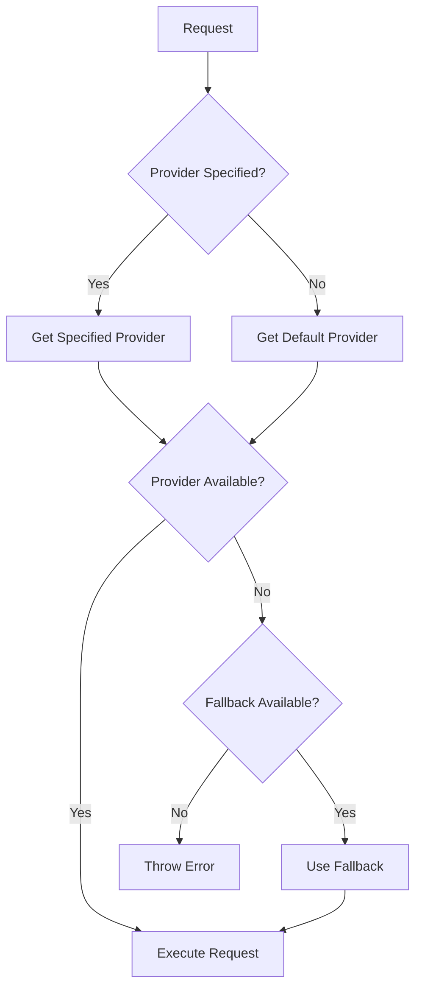

# ADR-005: LLM Provider Abstraction

## Status

Accepted

## Context

VALORA needs to support multiple LLM providers:

1. **Anthropic**: Claude models (Haiku, Sonnet, Opus)
2. **OpenAI**: GPT models (GPT-4, GPT-5)
3. **Google AI**: Gemini models
4. **Cursor**: IDE-integrated AI (via MCP)

Each provider has different:

- API interfaces and authentication
- Response formats
- Capabilities (streaming, tool use, etc.)
- Pricing and rate limits
- Error handling requirements

The engine should be **vendor-agnostic** and allow users to:

- Switch providers without code changes
- Use different providers for different commands
- Add new providers without modifying core code

## Decision

We will implement an **LLM Provider Abstraction** layer with:

### Provider Interface

```typescript
interface LLMProvider {
  // Identity
  readonly name: string;
  readonly displayName: string;

  // Core Operations
  sendPrompt(prompt: string, options?: LLMOptions): Promise<LLMResponse>;
  sendStreamingPrompt(prompt: string, options?: LLMOptions): AsyncGenerator<string>;

  // Configuration
  isConfigured(): boolean;
  getModel(): string;
  getCapabilities(): ProviderCapabilities;

  // Health
  healthCheck(): Promise<HealthStatus>;
}
```

### Provider Registry

```typescript
class LLMProviderRegistry {
  private providers: Map<string, LLMProvider>;

  register(provider: LLMProvider): void;
  getProvider(name: string): LLMProvider;
  getDefaultProvider(): LLMProvider;
  listAvailable(): string[];
}
```

### Response Normalisation

All providers return normalised responses:

```typescript
interface LLMResponse {
  content: string;
  model: string;
  usage?: {
    inputTokens: number;
    outputTokens: number;
  };
  metadata?: Record<string, unknown>;
}
```

### Provider Selection



## Consequences

### Positive

- **Vendor Independence**: Not locked to any provider
- **Easy Switching**: Change providers via configuration
- **Consistent Interface**: Same code works with all providers
- **Extensibility**: New providers easily added
- **Optimisation**: Use best provider for each task

### Negative

- **Lowest Common Denominator**: Can't use provider-specific features
- **Abstraction Leakage**: Some provider differences leak through
- **Maintenance**: Each provider needs updates
- **Testing**: More combinations to test

### Neutral

- **Configuration Complexity**: Users must understand providers
- **Error Mapping**: Provider errors need normalisation

## Provider Implementations

### Anthropic Provider

```typescript
class AnthropicProvider implements LLMProvider {
  private client: Anthropic;

  async sendPrompt(prompt: string, options?: LLMOptions): Promise<LLMResponse> {
    const response = await this.client.messages.create({
      model: options?.model ?? this.defaultModel,
      max_tokens: options?.maxTokens ?? 4096,
      messages: [{ role: 'user', content: prompt }],
    });

    return this.normaliseResponse(response);
  }
}
```

### OpenAI Provider

```typescript
class OpenAIProvider implements LLMProvider {
  private client: OpenAI;

  async sendPrompt(prompt: string, options?: LLMOptions): Promise<LLMResponse> {
    const response = await this.client.chat.completions.create({
      model: options?.model ?? this.defaultModel,
      messages: [{ role: 'user', content: prompt }],
    });

    return this.normaliseResponse(response);
  }
}
```

### Cursor Provider

```typescript
class CursorProvider implements LLMProvider {
  async sendPrompt(prompt: string): Promise<LLMResponse> {
    // Generate guided completion prompt
    return {
      content: this.formatGuidedPrompt(prompt),
      model: 'cursor-guided',
      metadata: { mode: 'guided-completion' },
    };
  }
}
```

## Model Assignment

Commands specify preferred models:

```json
{
  "plan": { "model": "gpt-5-thinking-high" },
  "implement": { "model": "claude-sonnet-4.5" },
  "test": { "model": "claude-haiku-4.5" }
}
```

Model tiers optimise cost and quality:

| Tier      | Models              | Use Case                |
| --------- | ------------------- | ----------------------- |
| Strategic | GPT-5 Thinking High | Deep analysis, planning |
| Execution | Claude Sonnet 4.5   | Implementation, reviews |
| Fast      | Claude Haiku 4.5    | Quick tasks, validation |

## Alternatives Considered

### Alternative 1: Direct SDK Usage

Use provider SDKs directly throughout codebase.

**Rejected because**:

- Vendor lock-in
- Code duplication
- Difficult to switch providers

### Alternative 2: Third-Party Abstraction (LangChain)

Use LangChain or similar library.

**Rejected because**:

- Heavy dependency
- Limited control
- Unnecessary features

### Alternative 3: OpenAI-Compatible API Only

Only support OpenAI-compatible APIs.

**Rejected because**:

- Excludes Anthropic native API
- Limits provider choice
- Feature limitations

## Configuration

Provider configuration in `config.json`:

```json
{
  "providers": {
    "anthropic": {
      "enabled": true,
      "models": {
        "haiku": "claude-3-haiku-20240307",
        "sonnet": "claude-3-5-sonnet-20241022"
      }
    },
    "openai": {
      "enabled": true,
      "models": {
        "gpt5": "gpt-5-turbo"
      }
    }
  },
  "defaults": {
    "default_provider": "anthropic"
  }
}
```

## References

- [Provider Interface](../../.bin/src/llm/provider.interface.ts)
- [Provider Registry](../../.bin/src/llm/registry.ts)
- [Anthropic Provider](../../.bin/src/llm/providers/anthropic.provider.ts)
- [OpenAI Provider](../../.bin/src/llm/providers/openai.provider.ts)
