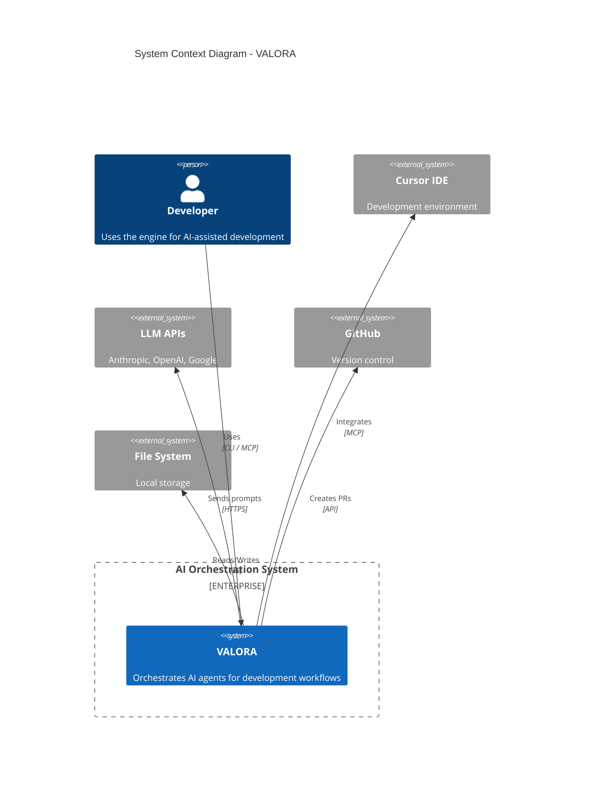
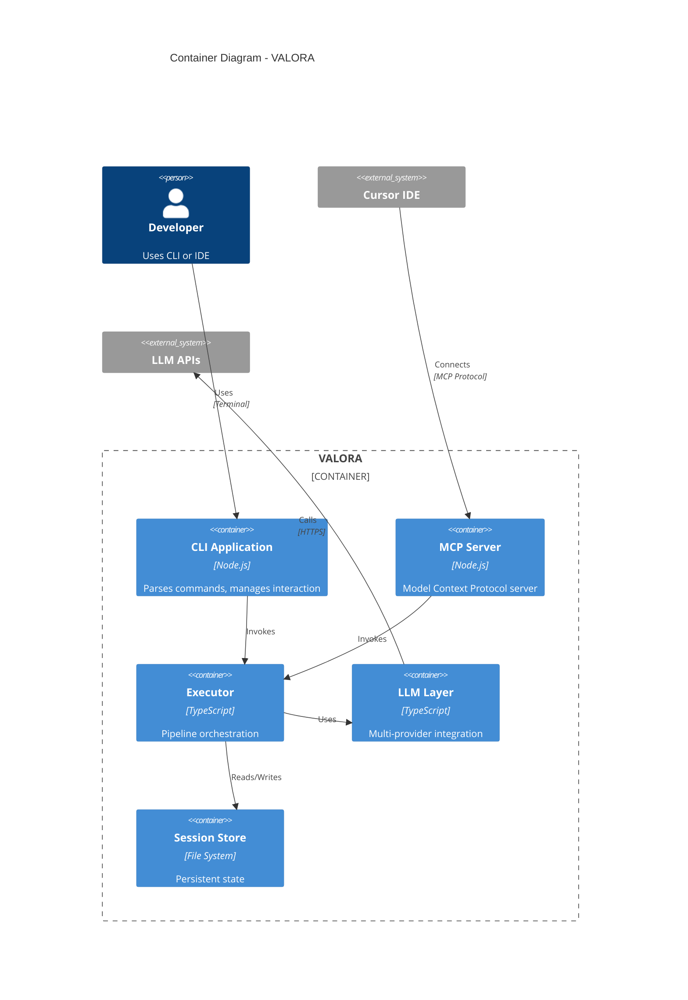

# Architecture Documentation

> Comprehensive architecture documentation for VALORA.

## Overview

This section provides detailed technical architecture documentation following the C4 model approach. It covers system context, container architecture, component design, and data flow.

## Contents

1. [System Architecture](./system-architecture.md) - High-level system design
2. [Component Architecture](./components.md) - Module-level design
3. [Data Flow](./data-flow.md) - Data and control flow diagrams
4. [Session Optimisation](./session-optimization.md) - Session-based performance optimisations
5. [Metrics System](./metrics-system.md) - Workflow metrics collection and reporting
6. [Metrics Dashboard](./metrics-dashboard.md) - Comprehensive metrics tracking reference

## Related Documentation

- [Architecture Decision Records](../adr/README.md) - Key decisions and rationale
- [Developer Guide](../developer-guide/README.md) - Implementation details

## Architecture Principles

VALORA is built on these core principles:

| Principle         | Description                                     |
| ----------------- | ----------------------------------------------- |
| **Modularity**    | Loosely coupled modules with clear interfaces   |
| **Extensibility** | Easy to add new agents, commands, and providers |
| **Testability**   | All components designed for testing             |
| **Observability** | Comprehensive logging and metrics               |
| **Resilience**    | Graceful error handling and recovery            |

## C4 Model Diagrams

### Level 1: System Context

### Level 2: Container Diagram

### Level 3: Component Overview

See [Component Architecture](./components.md) for detailed component diagrams.

## Technology Stack

### Runtime Environment

| Component       | Technology | Version |
| --------------- | ---------- | ------- |
| Runtime         | Node.js    | 18+     |
| Language        | TypeScript | 5.x     |
| Package Manager | pnpm       | 10.x    |

### Dependencies

| Category        | Library                   | Purpose                 |
| --------------- | ------------------------- | ----------------------- |
| CLI             | Commander                 | Command parsing         |
| UI              | Ink, Chalk                | Terminal UI             |
| Validation      | Zod                       | Schema validation       |
| LLM - Anthropic | @anthropic-ai/sdk         | Claude integration      |
| LLM - OpenAI    | openai                    | GPT integration         |
| LLM - Google    | @google/generative-ai     | Gemini integration      |
| MCP             | @modelcontextprotocol/sdk | Protocol implementation |

### Development Tools

| Tool       | Purpose         |
| ---------- | --------------- |
| ESLint     | Code linting    |
| Prettier   | Code formatting |
| Vitest     | Testing         |
| Playwright | E2E testing     |
| Husky      | Git hooks       |

## Key Architectural Decisions

| Decision                 | Rationale                              |
| ------------------------ | -------------------------------------- |
| Multi-agent architecture | Specialisation improves output quality |
| Three-tier execution     | Flexibility for different use cases    |
| Session-based state      | Context preservation across commands   |
| Pipeline-based execution | Composable, testable workflows         |
| Provider abstraction     | LLM vendor independence                |

See [Architecture Decision Records](../adr/README.md) for detailed decisions.

## Quality Attributes

### Performance

- Sub-second CLI response time
- Streaming LLM responses
- Efficient session serialisation
- Persistent stage output caching (2-3 min savings per context load)

### Reliability

- Graceful provider fallback
- Session recovery on restart
- Comprehensive error handling

### Maintainability

- Modular architecture
- Comprehensive documentation
- High test coverage

### Security

- No credential storage in code
- Environment-based configuration
- Input validation with Zod

## Evolution Strategy

### Current State (v1.0.0-alpha)

- Core CLI functionality
- Basic MCP integration
- Multi-provider LLM support

### Near-Term Roadmap

- Enhanced MCP sampling
- Parallel exploration mode
- Improved agent collaboration

### Long-Term Vision

- Team collaboration features
- Enterprise integrations
- Custom agent development
