# Data Flow Architecture

> Data flow, state management, and integration patterns in VALORA.

## Overview

This document describes how data flows through the system, how state is managed, and how different components integrate.

## Primary Data Flows

### 1. Command Execution Flow

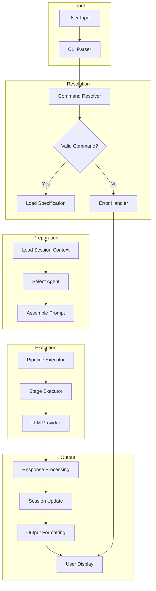

### 2. Session Data Flow

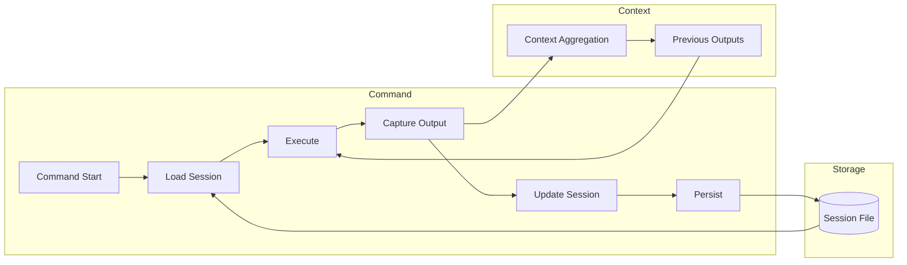

### 3. Interactive Clarification Flow

When commands require user input to resolve ambiguities, the pipeline pauses for interactive clarification:

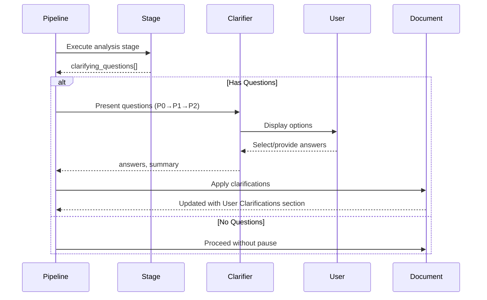

**Key Data Structures:**

```typescript
interface ClarifyingQuestion {
  id: string;
  question: string;
  options: string[];
  priority: 'P0' | 'P1' | 'P2';
  context?: string;
  affects_sections: string[];
}

interface UserAnswer {
  question: string;
  answer: string | null;
  selected_option?: number;
  was_custom: boolean;
  skipped: boolean;
  priority: string;
  affects_sections: string[];
}

interface ClarificationOutput {
  answers: Record<string, UserAnswer>;
  summary: string;  // Formatted markdown for document inclusion
  questions_answered: number;
  questions_skipped: number;
}
```

### 4. LLM Request Flow

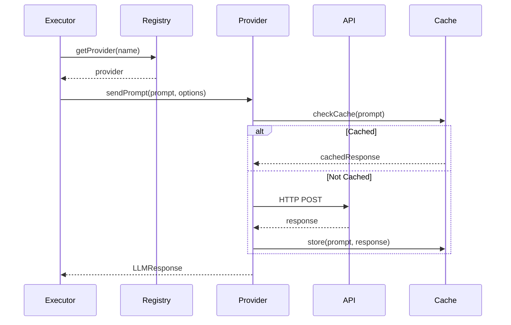

## State Management

### Session State

Sessions maintain the following state:

```typescript
interface SessionState {
  // Identity
  id: string;
  createdAt: Date;
  updatedAt: Date;

  // Context
  context: {
    currentTask?: Task;
    currentPlan?: Plan;
    knowledgeBase: KnowledgeItem[];
    history: HistoryEntry[];
  };

  // Outputs
  outputs: Map<string, CommandOutput>;

  // Metadata
  metadata: {
    commandCount: number;
    lastCommand: string;
    totalTokens: number;
  };
}
```

### State Transitions

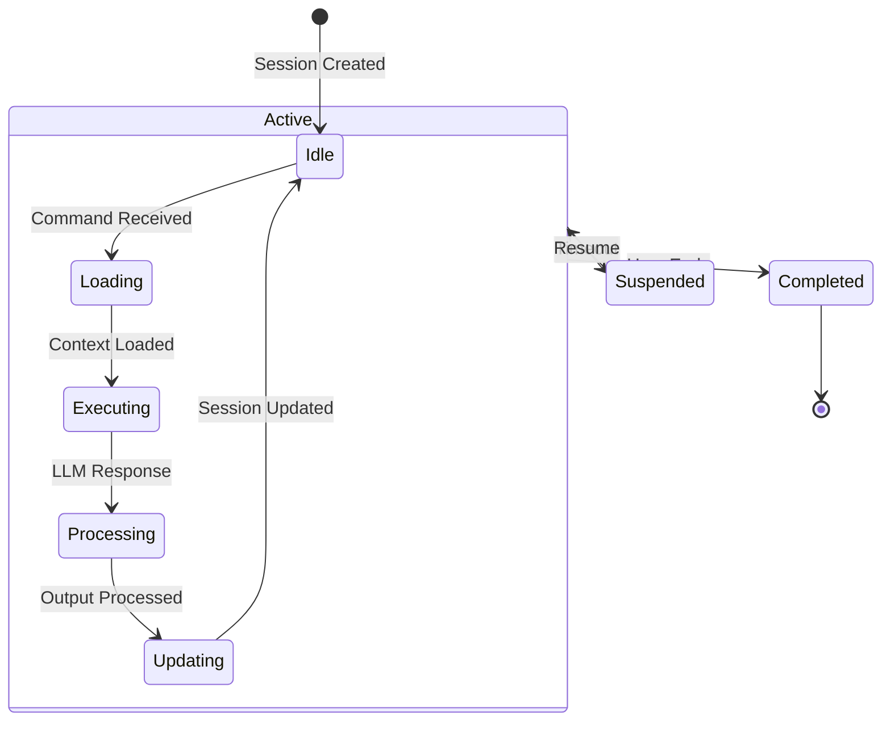

### Context Propagation

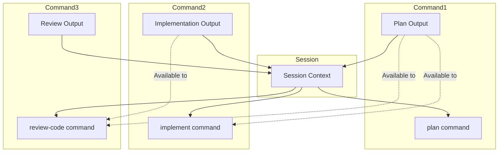

## Integration Patterns

### 1. Provider Integration

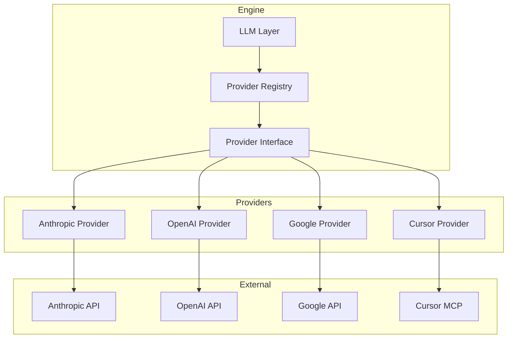

### 2. MCP Integration

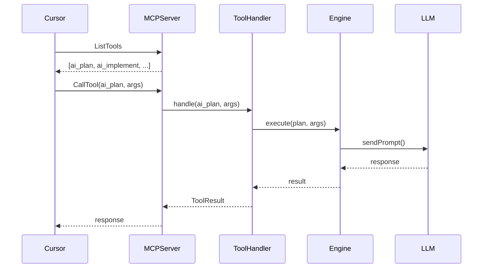

### 3. GitHub Integration

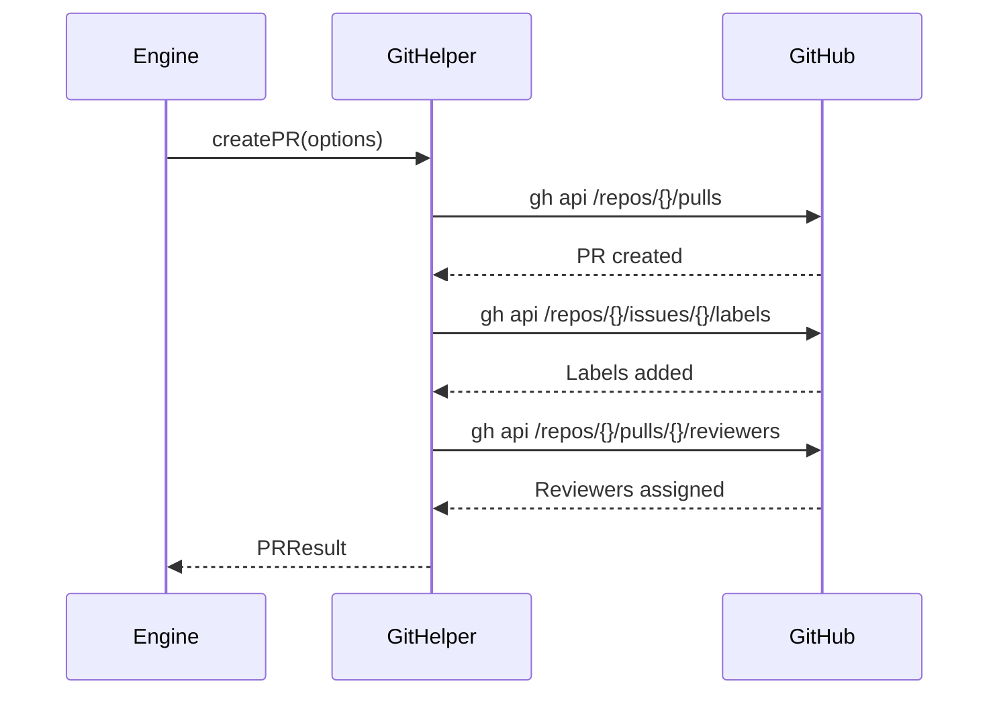

## Data Transformation

### Prompt Assembly

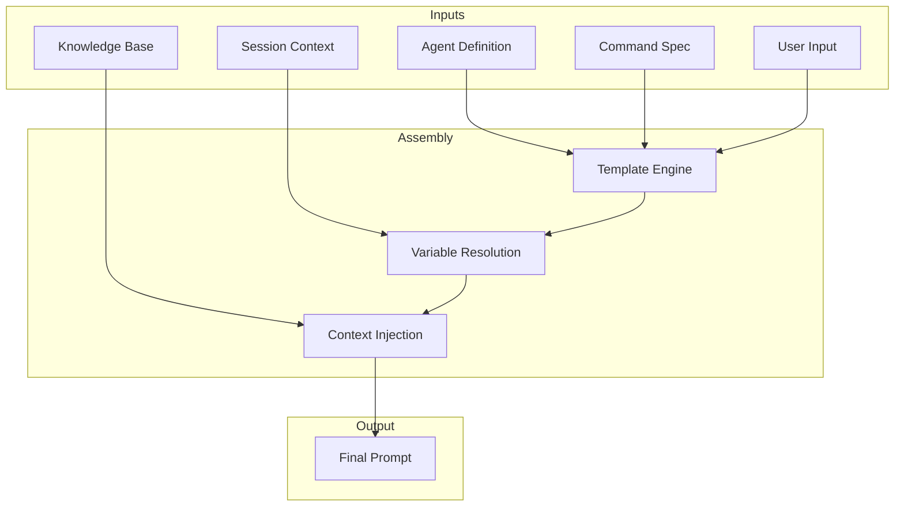

### Response Processing

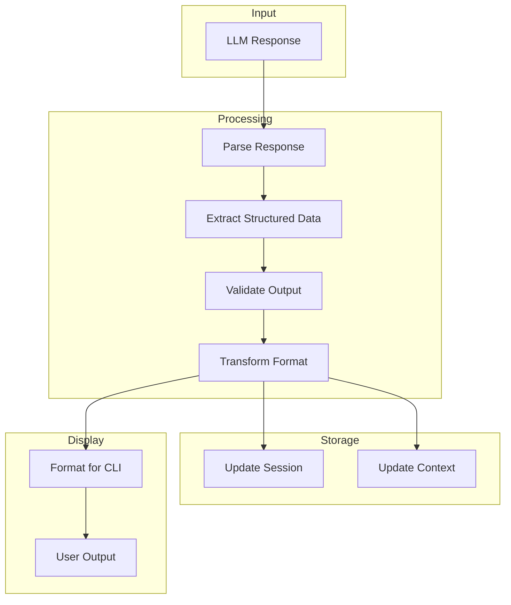

## Caching Strategy

### Cache Layers

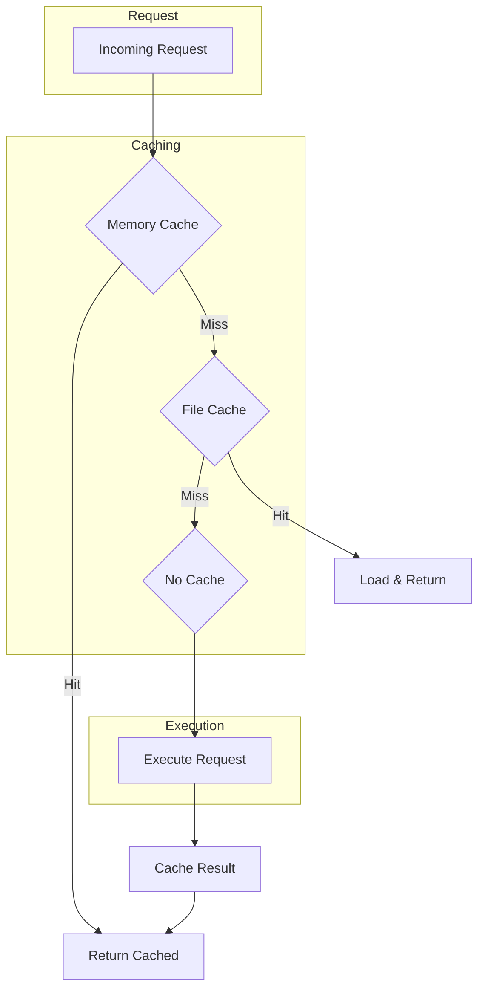

### What's Cached

| Data Type         | Cache Location | TTL              |
| ----------------- | -------------- | ---------------- |
| Agent definitions | Memory         | Session lifetime |
| Command specs     | Memory         | Session lifetime |
| Prompt templates  | Memory         | Session lifetime |
| Configuration     | Memory         | Until reload     |
| Session data      | File           | Configurable     |
| LLM responses     | None           | Not cached       |

## Error Propagation

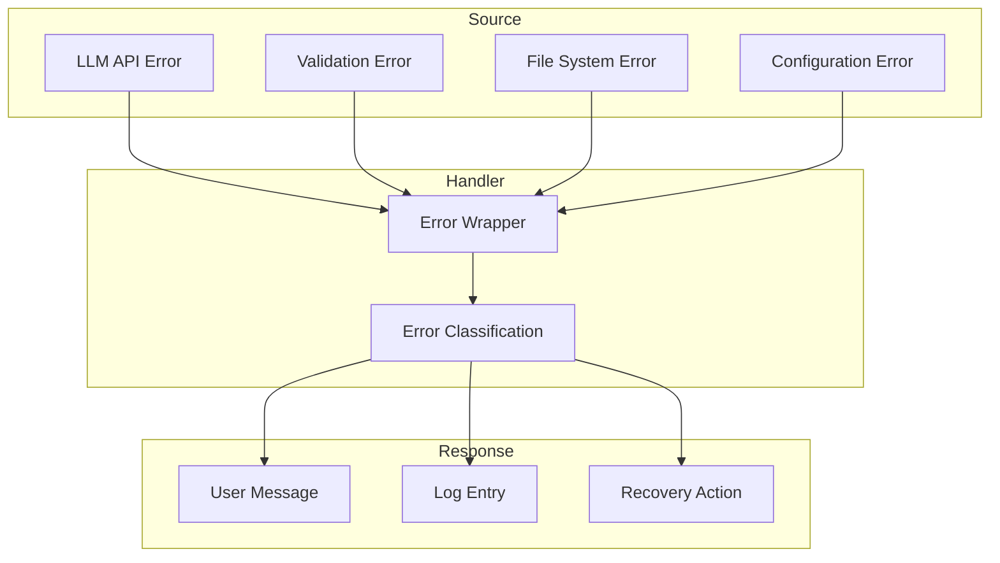

## Concurrency Patterns

### Parallel Stage Execution

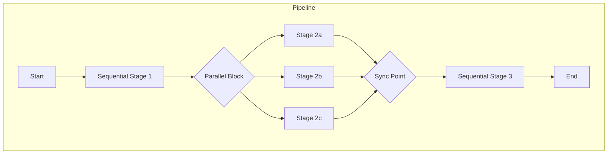

### Resource Locking

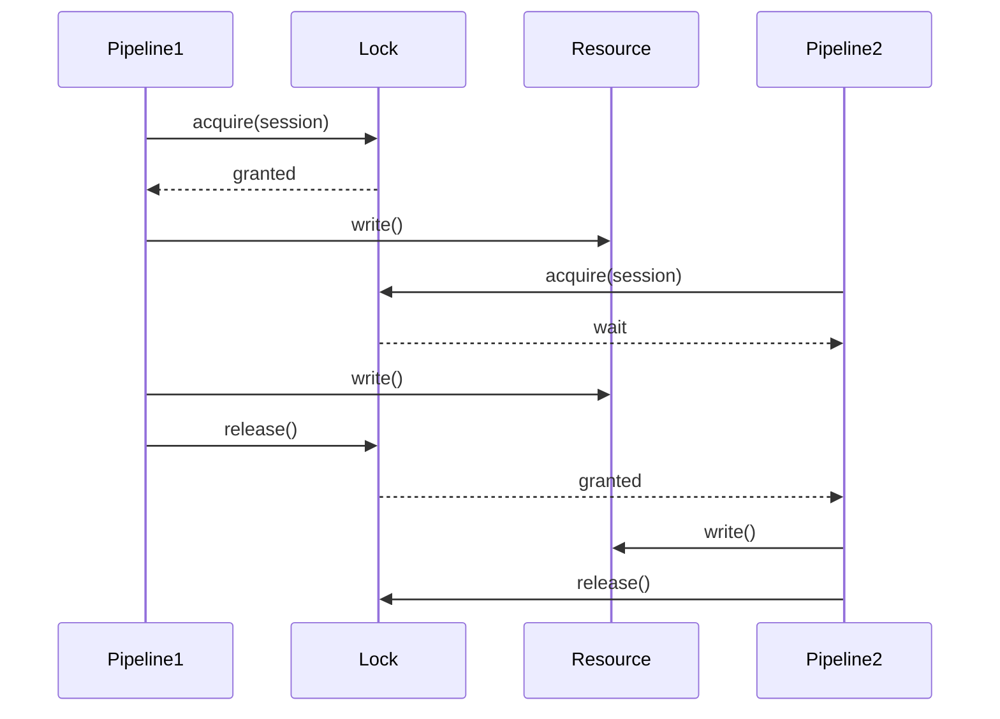

## Data Persistence

### File Structure

```plaintext
.ai/
├── sessions/
│   ├── session-abc123.json
│   └── session-def456.json
├── logs/
│   ├── 2024-01-15.log
│   └── latest.log -> 2024-01-15.log
└── config.json
```

### Session File Format

```json
{
  "id": "session-abc123",
  "createdAt": "2024-01-15T10:00:00Z",
  "updatedAt": "2024-01-15T11:30:00Z",
  "context": {
    "currentTask": { ... },
    "history": [ ... ]
  },
  "outputs": {
    "plan": { ... },
    "implement": { ... }
  },
  "metadata": {
    "commandCount": 5,
    "lastCommand": "review-code",
    "totalTokens": 15000
  }
}
```

## Metrics and Observability

### Collected Metrics

| Metric               | Type      | Description            |
| -------------------- | --------- | ---------------------- |
| command_duration     | Histogram | Command execution time |
| llm_request_duration | Histogram | LLM API latency        |
| session_count        | Gauge     | Active sessions        |
| error_count          | Counter   | Errors by type         |
| token_usage          | Counter   | Tokens consumed        |

### Log Structure

```json
{
  "timestamp": "2024-01-15T10:00:00Z",
  "level": "info",
  "component": "executor",
  "message": "Pipeline execution started",
  "context": {
    "command": "plan",
    "sessionId": "abc123",
    "agent": "lead"
  }
}
```
