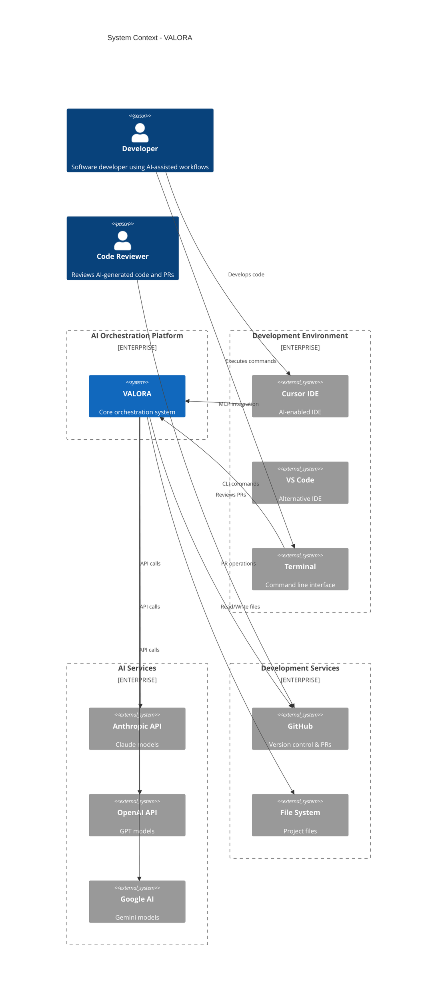
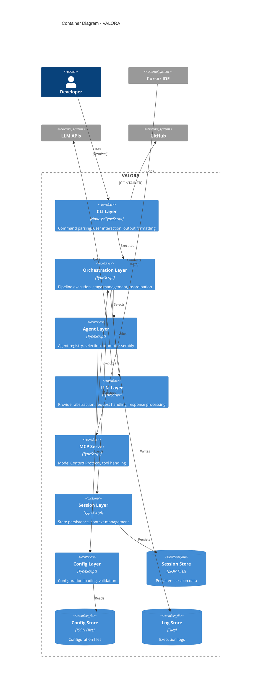
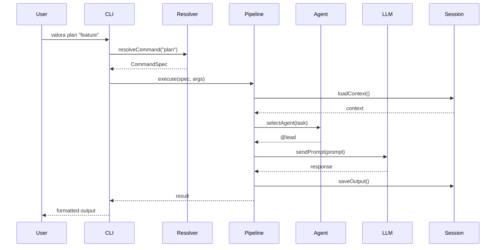
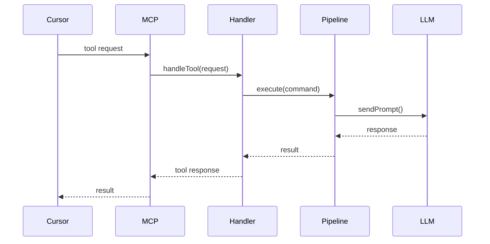
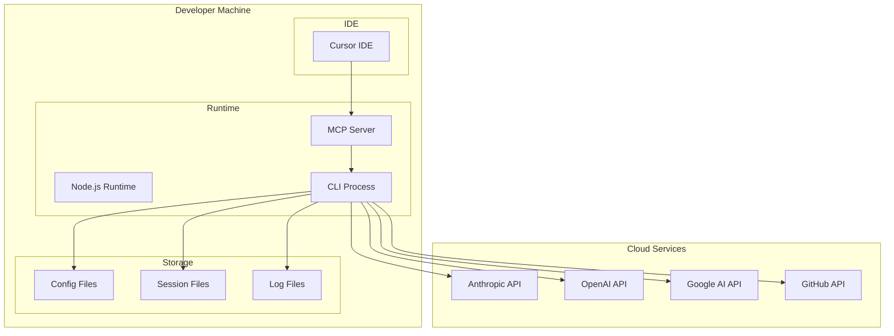
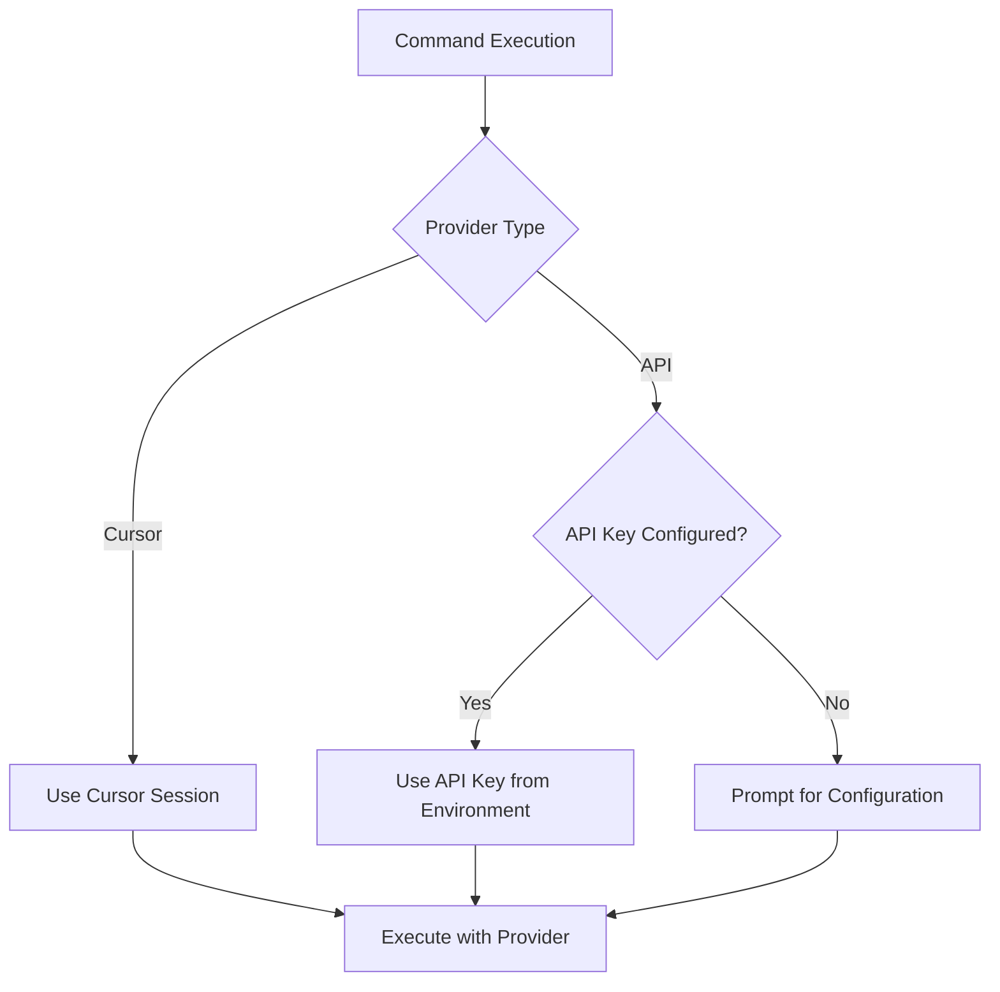

# System Architecture

> High-level architectural design of VALORA.

## Overview

VALORA is a TypeScript-based platform that orchestrates AI agents to automate software development workflows. It provides a CLI interface, MCP server integration, and multi-provider LLM support.

## System Context

## Container Architecture

## Layer Responsibilities

### CLI Layer

**Purpose**: User interaction and command handling

| Component        | Responsibility                 |
| ---------------- | ------------------------------ |
| Command Parser   | Parse CLI arguments and flags  |
| Command Resolver | Resolve command specifications |
| Wizard           | Interactive configuration      |
| Output Formatter | Format and display results     |
| Error Handler    | User-friendly error messages   |

### Orchestration Layer

**Purpose**: Workflow execution and coordination

| Component           | Responsibility             |
| ------------------- | -------------------------- |
| Pipeline            | Execute command pipelines  |
| Stage Executor      | Execute individual stages  |
| Execution Context   | Maintain execution state   |
| Variable Resolution | Resolve template variables |
| Coordinator         | Multi-step coordination    |

### Agent Layer

**Purpose**: AI agent management and selection

| Component        | Responsibility             |
| ---------------- | -------------------------- |
| Agent Registry   | Store agent definitions    |
| Agent Loader     | Load agent configurations  |
| Agent Selector   | Dynamic agent selection    |
| Prompt Assembler | Build prompts with context |

### LLM Layer

**Purpose**: Multi-provider AI integration

| Component          | Responsibility               |
| ------------------ | ---------------------------- |
| Provider Registry  | Register LLM providers       |
| Provider Interface | Abstract provider operations |
| Anthropic Provider | Claude integration           |
| OpenAI Provider    | GPT integration              |
| Google Provider    | Gemini integration           |
| Cursor Provider    | Cursor subscription          |

### MCP Server Layer

**Purpose**: IDE integration via MCP

| Component       | Responsibility         |
| --------------- | ---------------------- |
| Server          | Handle MCP connections |
| Tool Handler    | Execute tool requests  |
| Prompt Handler  | Handle prompt requests |
| Session Service | MCP session management |

### Session Layer

**Purpose**: Persistent state management

| Component          | Responsibility      |
| ------------------ | ------------------- |
| Session Service    | CRUD operations     |
| Session Repository | File persistence    |
| Context Manager    | Context aggregation |

### Configuration Layer

**Purpose**: Application configuration

| Component        | Responsibility           |
| ---------------- | ------------------------ |
| Config Loader    | Load configuration files |
| Schema Validator | Validate with Zod        |
| Provider Config  | LLM provider settings    |

## Execution Flow

### Command Execution

### MCP Integration

## Deployment Architecture

The engine runs locally on the developer's machine:

## Security Architecture

### Authentication Flow

### Security Boundaries

| Boundary      | Protection                           |
| ------------- | ------------------------------------ |
| API Keys      | Environment variables, never in code |
| Configuration | Local file, gitignored               |
| Sessions      | Local storage, no sensitive data     |
| Network       | HTTPS only for API calls             |

## Scalability Considerations

### Current Design

- Single-user, local execution
- Sequential command processing
- File-based session storage

### Future Considerations

- Multi-user support
- Parallel agent execution
- Database-backed sessions
- Remote execution capability
