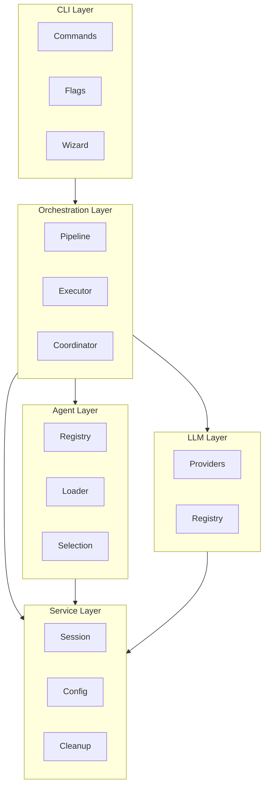

# Developer Guide

> Technical documentation for developers contributing to or extending VALORA.

## Overview

This guide provides in-depth technical information about the engine's architecture, codebase structure, and development practices. Whether you're fixing bugs, adding features, or extending capabilities, this guide will help you navigate the codebase effectively.

## Contents

1. [Development Setup](./setup.md) - Configure your development environment
2. [Codebase Overview](./codebase.md) - Understand the project structure
3. [Contributing](./contributing.md) - Guidelines for contributing
4. [Code Quality Standards](./code-quality.md) - Coding standards and best practices

## Technology Stack

| Category            | Technology         | Purpose                  |
| ------------------- | ------------------ | ------------------------ |
| **Runtime**         | Node.js 18+        | JavaScript runtime       |
| **Language**        | TypeScript 5.x     | Type-safe development    |
| **Package Manager** | pnpm 10.x          | Dependency management    |
| **Build**           | tsc, tsc-alias     | TypeScript compilation   |
| **Testing**         | Vitest             | Unit/integration testing |
| **E2E Testing**     | Playwright         | End-to-end testing       |
| **Linting**         | ESLint 9.x         | Code quality             |
| **Formatting**      | Prettier           | Code formatting          |
| **Pre-commit**      | Husky, lint-staged | Git hooks                |
| **CLI UI**          | Ink (React), Chalk | Terminal UI              |
| **Validation**      | Zod                | Schema validation        |

## Architecture Overview

The engine follows a modular, layered architecture:



## Key Directories

| Directory          | Purpose                                |
| ------------------ | -------------------------------------- |
| `src/cli/`         | Command-line interface and commands    |
| `src/executor/`    | Pipeline and execution logic           |
| `src/exploration/` | Parallel exploration and collaboration |
| `src/llm/`         | LLM provider integrations              |
| `src/mcp/`         | MCP server implementation              |
| `src/session/`     | Session state management               |
| `src/config/`      | Configuration loading and validation   |
| `src/services/`    | Shared services                        |
| `src/types/`       | TypeScript type definitions            |
| `src/utils/`       | Utility functions                      |

## Getting Started

### Prerequisites

Ensure you have installed:

- Node.js 18.0.0+
- pnpm 10.x
- Git

### Quick Setup

```bash
# Clone the repository
git clone <repository-url>
cd valora

# Navigate to the engine directory
cd .ai/.bin

# Install dependencies
pnpm install

# Build the project
pnpm build

# Run tests
pnpm test
```

### Development Mode

```bash
# Watch mode for development
pnpm dev

# Run specific command in development
pnpm dev plan "Add feature"
```

## Development Workflow

### 1. Create a Feature Branch

```bash
git checkout -b feature/your-feature-name
```

### 2. Make Changes

Follow the codebase structure and coding standards.

### 3. Run Quality Checks

```bash
# Format and lint
pnpm format

# Type check
pnpm tsc:check

# Run tests
pnpm test
```

### 4. Commit Changes

Use conventional commits:

```bash
git commit -m "feat(cli): add new command option"
```

### 5. Create Pull Request

Follow the PR template and ensure all checks pass.

## Coding Standards

### TypeScript Guidelines

- Use strict TypeScript settings
- Prefer interfaces over types for object shapes
- Use Zod for runtime validation
- Leverage path aliases (`@/`) for imports

### Code Style

- Follow ESLint and Prettier configuration
- Maximum line length: 100 characters
- Use meaningful variable and function names
- Document public APIs with JSDoc comments

### Testing Requirements

- Unit tests for all utilities and services
- Integration tests for pipelines and executors
- E2E tests for CLI commands
- Minimum 80% code coverage

## Key Concepts

### Commands

Commands are the primary interface. Each command:

- Has a specification file in `.ai/commands/`
- Maps to an agent and model
- Defines allowed tools
- Specifies a pipeline for execution

### Agents

Agents are AI personas with specific expertise:

- Defined in `.ai/agents/`
- Registered in `registry.json`
- Selected based on task characteristics

### Pipelines

Pipelines orchestrate command execution:

- Sequential or parallel stages
- Variable resolution
- Error handling and rollback

### Sessions

Sessions maintain state across commands:

- Stored in `.ai/sessions/`
- Include context, outputs, and metadata
- Support resume and cleanup

## Debugging

### Enable Debug Logging

```bash
export LOG_LEVEL=debug
pnpm dev plan "Test"
```

### View Logs

```bash
tail -f .ai/logs/latest.log
```

### Run Diagnostics

```bash
pnpm dev doctor
```

## Testing

### Run All Tests

```bash
pnpm test
```

### Run Specific Test Suite

```bash
pnpm test:suite:unit
pnpm test:suite:integration
pnpm test:suite:e2e
```

### Run with Coverage

```bash
pnpm test:coverage
```

## Building

### Development Build

```bash
pnpm build
```

### Clean Build

```bash
pnpm clean:build && pnpm build
```

## Next Steps

1. Read [Codebase Overview](./codebase.md) for detailed structure
2. Review [Contributing Guidelines](./contributing.md)
3. Study [Code Quality Standards](./code-quality.md) for coding best practices
4. Explore the [Architecture Documentation](../architecture/README.md)
