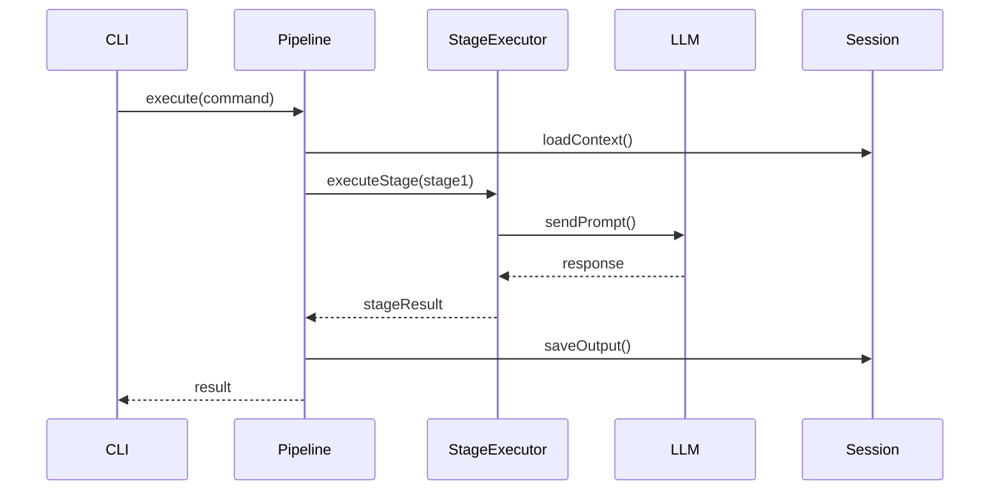
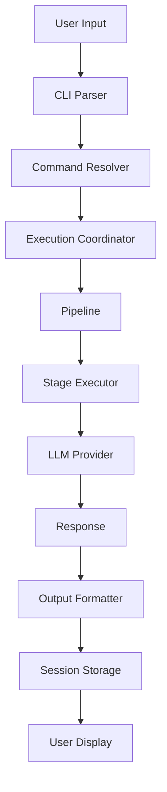
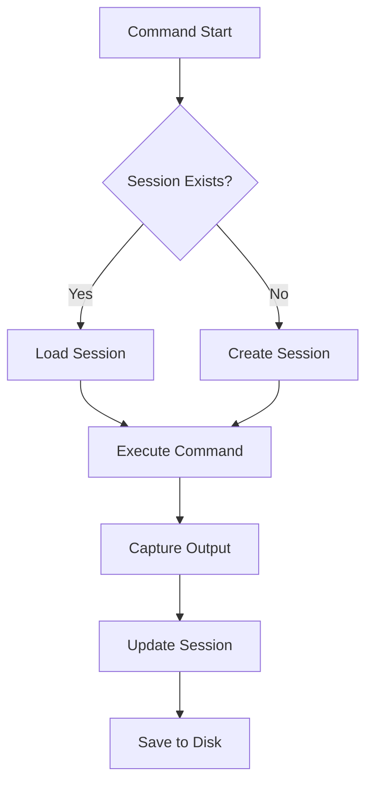

# Codebase Overview

> Detailed walkthrough of the VALORA source code structure.

## Directory Structure

```plaintext
.ai/.bin/src/
├── cleanup/           # Resource cleanup coordination
├── cli/               # Command-line interface
│   ├── commands/      # Individual CLI commands
│   └── types/         # CLI-specific types
├── config/            # Configuration management
├── di/                # Dependency injection container
├── executor/          # Pipeline execution
├── exploration/       # Parallel exploration system
├── llm/               # LLM provider integrations
│   └── providers/     # Individual provider implementations
├── mcp/               # MCP server implementation
├── output/            # Output formatting and rendering
├── services/          # Shared services
├── session/           # Session management
├── types/             # Global type definitions
├── ui/                # Terminal UI components
└── utils/             # Utility functions
```

## Core Modules

### CLI Layer (`src/cli/`)

The CLI layer handles user interaction and command parsing.

#### Entry Point (`index.ts`)

```typescript
// Main entry point for the CLI application
// Sets up Commander.js and registers all commands
```

#### Command Structure

Each command follows a consistent pattern:

```plaintext
src/cli/
├── commands/
│   ├── config.ts        # Configuration commands
│   ├── dashboard.ts     # Dashboard display
│   ├── doctor.ts        # Diagnostics
│   ├── dynamic.ts       # Dynamic command loading
│   ├── explore.ts       # Exploration mode
│   ├── help.ts          # Help display
│   ├── monitoring.ts    # Monitoring commands
│   └── session.ts       # Session management
├── command-adapter.interface.ts
├── commander-adapter.ts
├── command-error-handler.ts
├── command-executor.ts
├── command-palette.ts
├── command-resolver.ts
├── command-suggestions.ts
├── command-templates.ts
├── command-validator.ts
├── command-wizard.ts
├── config-builder.ts
├── execution-coordinator.ts
├── flags.ts
├── provider-fallback-service.ts
├── provider-resolver.ts
├── result-presenter.ts
├── session-browser.ts
├── session-cleanup-adapter.ts
├── session-formatter.ts
├── session-manager.ts
└── session-resume.ts
```

Key components:

| Component                  | Responsibility                      |
| -------------------------- | ----------------------------------- |
| `command-executor.ts`      | Executes parsed commands            |
| `command-resolver.ts`      | Resolves command specifications     |
| `command-wizard.ts`        | Interactive command configuration   |
| `execution-coordinator.ts` | Coordinates multi-step execution    |
| `provider-resolver.ts`     | Resolves LLM provider configuration |

---

### Executor Layer (`src/executor/`)

The executor layer handles pipeline orchestration and stage execution.

```plaintext
src/executor/
├── agent-loader.ts              # Load agent definitions
├── command-discovery.ts         # Discover available commands
├── command-isolation.executor.ts # Isolated command execution
├── command-loader.ts            # Load command specifications
├── command-validation.ts        # Validate command inputs
├── execution-context.ts         # Execution state container
├── execution-strategy.ts        # Execution strategy patterns
├── pipeline.ts                  # Pipeline orchestration
├── pipeline-events.ts           # Pipeline event definitions
├── pipeline-validator.ts        # Pipeline validation
├── prompt-loader.ts             # Load prompt templates
├── stage-executor.ts            # Execute individual stages
├── stage-scheduler.ts           # Schedule stage execution
├── variable-resolution.service.ts # Resolve template variables
└── variables.ts                 # Variable definitions
```

Key components:

| Component              | Responsibility                          |
| ---------------------- | --------------------------------------- |
| `pipeline.ts`          | Orchestrates command pipeline execution |
| `stage-executor.ts`    | Executes individual pipeline stages     |
| `execution-context.ts` | Maintains execution state               |
| `agent-loader.ts`      | Loads and validates agent definitions   |

#### Pipeline Flow



---

### LLM Layer (`src/llm/`)

The LLM layer provides multi-provider AI integration.

```plaintext
src/llm/
├── index.ts              # Module exports
├── provider.interface.ts # Provider interface definition
├── registry.ts           # Provider registry
└── providers/
    ├── anthropic.provider.ts  # Anthropic/Claude
    ├── cursor.provider.ts     # Cursor integration
    ├── google.provider.ts     # Google AI
    ├── index.ts
    └── openai.provider.ts     # OpenAI
```

#### Provider Interface

```typescript
interface LLMProvider {
  name: string;
  sendPrompt(prompt: string, options?: LLMOptions): Promise<LLMResponse>;
  isConfigured(): boolean;
  getModel(): string;
}
```

#### Provider Registration

```typescript
// registry.ts
class LLMRegistry {
  register(provider: LLMProvider): void;
  getProvider(name: string): LLMProvider;
  listProviders(): string[];
}
```

---

### Exploration Layer (`src/exploration/`)

The exploration layer enables parallel agent collaboration.

```plaintext
src/exploration/
├── collaboration-coordinator.ts  # Coordinate agent collaboration
├── container-manager.ts          # Manage exploration containers
├── dashboard-controls.ts         # Dashboard interaction
├── dashboard-metrics.ts          # Metrics collection
├── dashboard-ui.ts               # Dashboard rendering
├── execution-modes.ts            # Execution mode definitions
├── exploration-events.ts         # Event definitions
├── exploration-state.ts          # State management
├── merge-orchestrator.ts         # Merge exploration results
├── orchestrator.ts               # Main orchestration logic
├── resource-allocator.ts         # Resource management
├── result-comparator.ts          # Compare agent results
├── safety-validator.ts           # Safety validation
├── shared-volume-manager.ts      # Volume management
└── worktree-manager.ts           # Git worktree management
```

This module supports:

- Parallel exploration of implementation approaches
- Multi-agent collaboration
- Safe result merging

---

### Session Layer (`src/session/`)

The session layer manages persistent state.

```plaintext
src/session/
├── session.repository.ts    # Session storage
├── session.service.ts       # Session operations
└── session-types.ts         # Type definitions
```

Session structure:

```typescript
interface Session {
  id: string;
  createdAt: Date;
  updatedAt: Date;
  context: SessionContext;
  outputs: Map<string, Output>;
  metadata: SessionMetadata;
}
```

---

### Configuration Layer (`src/config/`)

```plaintext
src/config/
├── constants.ts           # Application constants
├── index.ts
├── interactive-wizard.ts  # Configuration wizard
├── loader.ts              # Config file loading
├── providers.config.ts    # Provider configuration
├── schema.ts              # Zod schemas
├── validation-helpers.ts  # Validation utilities
└── wizard.ts              # Wizard utilities
```

#### Configuration Schema

Configuration is validated using Zod:

```typescript
const ConfigSchema = z.object({
  defaults: z.object({
    default_provider: z.string(),
    interactive: z.boolean(),
    log_level: z.enum(['debug', 'info', 'warn', 'error']),
    output_format: z.enum(['markdown', 'json', 'plain']),
    session_mode: z.boolean(),
  }),
  providers: z.record(ProviderSchema),
  // ...
});
```

---

### MCP Layer (`src/mcp/`)

The MCP layer implements the Model Context Protocol server.

```plaintext
src/mcp/
├── command-discovery.service.ts  # Discover commands
├── context.ts                    # Request context
├── health.service.ts             # Health checks
├── index.ts
├── mcp-logger.ts                 # MCP-specific logging
├── prompt-handler.ts             # Handle prompt requests
├── prompt.service.ts             # Prompt operations
├── server.ts                     # MCP server entry
├── session.service.ts            # Session handling
├── tool-handler.ts               # Tool execution
└── types.ts                      # Type definitions
```

---

### Types Layer (`src/types/`)

Global type definitions used across the codebase.

```plaintext
src/types/
├── agent.types.ts          # Agent definitions
├── command-validation.types.ts
├── command.types.ts        # Command definitions
├── config.types.ts         # Configuration types
├── context.types.ts        # Context types
├── events.types.ts         # Event definitions
├── execution.types.ts      # Execution types
├── exploration.types.ts    # Exploration types
├── index.ts
├── llm.types.ts            # LLM types
├── output.types.ts         # Output types
├── pipeline.types.ts       # Pipeline types
├── prompt.types.ts         # Prompt types
├── provider.types.ts       # Provider types
├── registry.types.ts       # Registry types
├── result.types.ts         # Result types
├── session.types.ts        # Session types
└── stage.types.ts          # Stage types
```

---

### Utilities (`src/utils/`)

Shared utility functions.

```plaintext
src/utils/
├── arrays.ts               # Array utilities
├── async-helpers.ts        # Async utilities
├── cli-helpers.ts          # CLI utilities
├── concurrent-executor.ts  # Concurrent execution
├── date.ts                 # Date utilities
├── file.ts                 # File operations
├── formatting.ts           # Text formatting
├── git.ts                  # Git operations
├── index.ts
├── logger.ts               # Logging
├── markdown-parser.ts      # Markdown parsing
├── paths.ts                # Path utilities
├── process-manager.ts      # Process management
├── registry-utils.ts       # Registry utilities
├── script-runner.ts        # Script execution
├── string.ts               # String utilities
├── timeout-promise.ts      # Timeout handling
├── time.ts                 # Time utilities
└── validation.ts           # Validation utilities
```

---

## Data Flow

### Command Execution Flow



### Session Management Flow



---

## Key Patterns

### Dependency Injection

The codebase uses a simple DI container (`src/di/container.ts`):

```typescript
const container = new Container();
container.register('logger', Logger);
container.register('sessionService', SessionService);
```

### Event-Driven Architecture

Pipeline execution uses events for loose coupling:

```typescript
pipeline.on('stageStart', (stage) => { ... });
pipeline.on('stageComplete', (stage, result) => { ... });
pipeline.on('error', (error) => { ... });
```

### Strategy Pattern

Execution strategies are pluggable:

```typescript
interface ExecutionStrategy {
  execute(context: ExecutionContext): Promise<Result>;
}
```

---

## Testing Structure

```plaintext
tests/
├── integration/    # Integration tests
├── e2e/            # End-to-end tests
├── security/       # Security tests
├── performance/    # Performance tests
├── error-scenarios/ # Error handling tests
└── architecture/   # Architecture tests
```

Unit tests are co-located with source files using `.test.ts` extension.

---

## Next Steps

1. Explore individual modules in detail
2. Read [Contributing Guidelines](./contributing.md)
3. Review [Architecture Documentation](../architecture/README.md)
