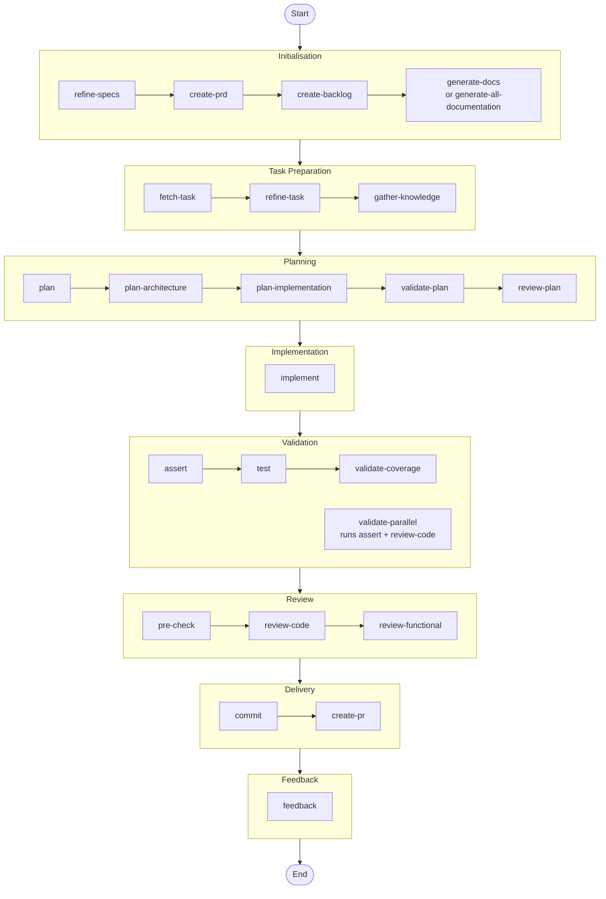

# Development Workflows

> Common patterns and workflows for using VALORA effectively.

## Overview

The engine supports various development workflows, from new feature development to bug fixes and refactoring. This guide covers the most common patterns.

## The Complete Development Lifecycle



## Workflow 1: New Feature Development

**Use when**: Starting a new feature from scratch.

### Steps

1. **Define Requirements**

   ```bash
   valora refine-specs "User authentication with OAuth providers"
   ```

   This engages the `@product-manager` agent to clarify requirements through structured questioning.

   **Interactive Clarification:** The command will pause to collect your answers to clarifying questions. These answers are automatically incorporated into the final `FUNCTIONAL.md` document with a "User Clarifications" section documenting your decisions.

2. **Generate PRD**

   ```bash
   valora create-prd
   ```

   Creates a comprehensive Product Requirements Document based on refined specifications.

   **Interactive Clarification:** If requirements analysis identifies ambiguities, you'll be prompted to answer clarifying questions before the PRD is generated.

3. **Create Backlog**

   ```bash
   valora create-backlog
   ```

   Decomposes the PRD into prioritised, actionable tasks.

4. **Generate Documentation** (Optional)

   ```bash
   valora generate-docs
   ```

   Generates comprehensive technical documentation (15 files) across infrastructure, backend, and frontend domains.

5. **Fetch First Task**

   ```bash
   valora fetch-task
   ```

   Retrieves the highest priority task from the backlog.

6. **Refine Task Details**

   ```bash
   valora refine-task
   ```

   Clarifies acceptance criteria and implementation details.

   **Interactive Clarification:** When clarity gaps are identified, you'll be prompted to answer questions. Your answers are applied to the task document and backlog.

7. **Gather Technical Context**

   ```bash
   valora gather-knowledge --scope=task
   ```

   Analyses the codebase for relevant patterns and dependencies.

8. **Create Implementation Plan**

   ```bash
   valora plan
   ```

   The `@lead` agent creates a detailed technical plan.

   **Interactive Clarification:** Questions from complexity assessment, dependency analysis, and risk assessment are aggregated and presented to you. Your answers inform the implementation breakdown.

9. **Review the Plan**

   ```bash
   valora review-plan
   ```

   Validates the plan before implementation begins.

10. **Implement**

    ```bash
    valora implement
    ```

    The appropriate engineer agent guides the implementation.

11. **Validate Implementation**

    ```bash
    valora assert
    valora test
    ```

    Checks completeness and runs test suites.

12. **Review**

    ```bash
    valora review-code
    valora review-functional
    ```

    Performs code quality and functional reviews.

13. **Commit and PR**

    ```bash
    valora commit
    valora create-pr
    ```

    Creates conventional commits and a pull request.

14. **Capture Feedback**

    ```bash
    valora feedback
    ```

    Records outcomes for continuous improvement.

---

## Workflow 2: Bug Fix

**Use when**: Fixing a reported bug or issue.

### Steps

1. **Understand the Issue**

   Analyse the bug report and gather context manually or use:

   ```bash
   valora gather-knowledge --scope=task --domain=<affected-area>
   ```

2. **Plan the Fix**

   ```bash
   valora plan "Fix: <bug description>"
   ```

3. **Implement the Fix**

   Make the code changes directly or with assistance:

   ```bash
   valora implement
   ```

4. **Validate**

   ```bash
   valora assert
   valora test --type=all
   ```

5. **Review**

   ```bash
   valora review-code --focus=security
   valora review-functional
   ```

6. **Commit**

   ```bash
   valora commit --scope=fix
   ```

7. **Document**

   ```bash
   valora feedback
   ```

---

## Workflow 3: Refactoring

**Use when**: Improving code structure without changing functionality.

### Steps

1. **Define Refactoring Goals**

   Discuss what you want to achieve:

   ```bash
   valora gather-knowledge --scope=project --depth=deep
   ```

2. **Plan the Refactoring**

   ```bash
   valora plan "Refactor: <refactoring description>"
   ```

3. **Review the Plan**

   ```bash
   valora review-plan --strict-mode
   ```

4. **Implement Incrementally**

   For large refactorings, use step-by-step mode:

   ```bash
   valora implement --mode=step-by-step
   ```

5. **Validate No Regressions**

   ```bash
   valora test --type=all --coverage-threshold=80
   ```

6. **Review Changes**

   ```bash
   valora review-code --focus=maintainability
   ```

7. **Commit**

   ```bash
   valora commit --scope=refactor
   ```

---

## Workflow 4: Code Review

**Use when**: Reviewing code before merging.

### Steps

1. **Run Comprehensive Review**

   ```bash
   valora review-code --severity=high --focus=all
   ```

2. **Check Functionality**

   ```bash
   valora review-functional --check-a11y=true
   ```

3. **Validate Tests**

   ```bash
   valora test
   ```

4. **Provide Feedback**

   ```bash
   valora feedback --command=review-code
   ```

---

## Workflow 5: Tiered Planning (Complex Features)

**Use when**: Working on complex features (complexity > 5) that benefit from architectural review before detailed planning.

### Steps

1. **Fetch the Task**

   ```bash
   valora fetch-task --task-id=<id>
   ```

2. **Gather Context**

   ```bash
   valora gather-knowledge --scope=task
   ```

3. **Create Architecture Plan (Phase 1, ~5 min)**

   ```bash
   valora plan-architecture
   ```

   Produces `knowledge-base/PLAN-ARCH-[TASK-ID].md` with:
   - Technology choices and rationale
   - Component boundaries
   - Integration points
   - Go/No-Go decision

4. **Quick Architecture Review**

   ```bash
   valora review-plan --checklist
   ```

   Fast binary validation (~3 min) before investing in detailed planning.

5. **Create Implementation Plan (Phase 2, ~10 min)**

   ```bash
   valora plan-implementation --arch-plan=knowledge-base/PLAN-ARCH-[TASK-ID].md
   ```

   Produces `knowledge-base/PLAN-IMPL-[TASK-ID].md` with:
   - Step-by-step tasks with file paths
   - Dependencies and risks
   - Testing and rollback procedures

6. **Quick Implementation Review**

   ```bash
   valora review-plan --checklist
   ```

7. **Implement**

   ```bash
   valora implement --plan=knowledge-base/PLAN-IMPL-[TASK-ID].md
   ```

8. **Fast Validation Loop**

   ```bash
   valora assert --quick=all
   valora review-code --auto-only
   ```

### Benefits

- Catches architectural issues in 5 min, not 18 min
- No detailed planning on rejected architectures
- Faster feedback loops with `--checklist` and `--quick` modes
- ~25 min saved per planning cycle

---

## Workflow 6: Quick Task

**Use when**: Handling a small, well-defined task.

### Steps

1. **Fetch the Task**

   ```bash
   valora fetch-task --task-id=<id>
   ```

2. **Plan**

   ```bash
   valora plan
   ```

3. **Implement**

   ```bash
   valora implement
   ```

4. **Validate and Commit**

   ```bash
   valora assert && valora test && valora commit
   ```

---

## Interactive Clarification Stages

Several commands include interactive stages that pause execution to collect user input. This ensures that user decisions are properly captured and incorporated into final documents.

### How It Works

1. **Question Generation**: During analysis phases, the AI identifies ambiguities and generates clarifying questions
2. **Interactive Pause**: The pipeline pauses and presents questions grouped by priority (P0 → P1 → P2)
3. **User Response**: You can select predefined options, provide custom answers, or skip non-critical questions
4. **Document Integration**: Your answers are incorporated into the final document with a "User Clarifications" section

### Commands with Interactive Stages

| Command        | Questions Source                | Document Updated    |
| -------------- | ------------------------------- | ------------------- |
| `refine-specs` | Specification refinement        | `FUNCTIONAL.md`     |
| `create-prd`   | Requirements analysis           | `PRD.md`            |
| `refine-task`  | Task clarity analysis           | `BACKLOG.md`        |
| `plan`         | Complexity, dependencies, risks | `PLAN-[TASK-ID].md` |

### Skipping Questions

- **P0 (Critical)** questions should always be answered as they block core functionality
- **P1 (Important)** questions affect significant features but can be skipped with noted assumptions
- **P2 (Minor)** questions are optional clarifications

### Example: User Clarifications Section

When you answer questions, they appear in the document like this:

```markdown
## User Clarifications

The following decisions were made during the refinement process:

| Question           | Decision                       | Impact                      |
| ------------------ | ------------------------------ | --------------------------- |
| Optimal cache TTL? | 5 seconds                      | Non-Functional Requirements |
| Self-health logic? | Any critical service unhealthy | Health Status Logic         |

**Applied on**: 2025-01-28T10:30:00Z
**Mode**: Interactive
```

---

## Decision Points

During workflows, you may encounter decision points:

| Decision            | Criteria                     | Action if False           |
| ------------------- | ---------------------------- | ------------------------- |
| Sufficient context? | Agent has enough information | `gather-knowledge`        |
| AI confident?       | Plan quality validated       | Re-run `plan`             |
| Feature too large?  | Complexity exceeds threshold | Use `--mode=step-by-step` |
| Tests passed?       | All tests green              | Re-run `plan` and fix     |
| Reviews passed?     | Both reviews approved        | Re-implement              |

## Best Practices

### 1. Always Plan First

```bash
# Good
valora plan "Add authentication" && valora review-plan && valora implement

# Avoid
valora implement "Add authentication"  # Skipping planning
```

### 2. Use Appropriate Granularity

```bash
# For large features
valora create-backlog --granularity=fine

# For simple features
valora create-backlog --granularity=coarse
```

### 3. Validate Early and Often

```bash
# After each implementation step (full validation)
valora assert && valora test

# Quick validation for faster feedback
valora assert --quick=typescript && valora review-code --auto-only
```

### 4. Use Quick Modes for Faster Feedback

```bash
# Quick plan review (~3 min vs ~14 min)
valora review-plan --checklist

# Quick assertion (~5 min vs ~9 min)
valora assert --quick=all

# Quick code review (~3 min vs ~10 min)
valora review-code --checklist

# Automated checks only (~1 min)
valora review-code --auto-only

# Coverage validation gate
valora validate-coverage --threshold=80

# Parallel validation (~10 min vs ~19 min sequential)
valora validate-parallel

# Quick parallel validation (~5 min)
valora validate-parallel --quick
```

### 5. Enforce Coverage Gates

Use coverage validation to maintain test quality:

```bash
# Standard validation (80% threshold)
valora validate-coverage

# Strict mode for critical code
valora validate-coverage --strict

# Only validate new/changed code
valora validate-coverage --new-code-only

# CI/CD integration with JSON output
valora validate-coverage --strict --fail-on-decrease --report-format=json
```

**Quality Score Thresholds:**

| Score | Grade | Action                        |
| ----- | ----- | ----------------------------- |
| >= 80 | A     | PASS                          |
| 70-79 | B     | PASS with recommendations     |
| 60-69 | C     | WARN - requires justification |
| < 60  | F     | FAIL - must improve           |

### 6. Use Two-Phase Code Review

Split code review into automated pre-checks and manual architecture review to reduce time by 50%:

```bash
# Phase 1: Automated pre-checks (~1.5 min)
valora pre-check

# If pre-check fails, fix and retry
valora pre-check --fix

# Phase 2: Manual architecture review (~5 min)
valora review-code --focus=architecture

# Continue workflow
valora review-functional
```

**Pre-Check Automated Checks:**

| Check       | Purpose            | Duration |
| ----------- | ------------------ | -------- |
| TypeScript  | Type validation    | ~12s     |
| ESLint      | Code quality       | ~8s      |
| Prettier    | Formatting         | ~3s      |
| Security    | Vulnerability scan | ~5s      |
| Quick Tests | Regression check   | ~20s     |

**Time Savings:**

| Approach                 | Time     | Savings |
| ------------------------ | -------- | ------- |
| Full manual review       | 10.2 min | -       |
| Pre-check + Architecture | 6.5 min  | 36%     |
| Pre-check + Checklist    | 4.5 min  | 56%     |

### 5. Use Parallel Validation

Run assert and review-code concurrently to save ~9 minutes:

```bash
# Instead of sequential:
valora implement
valora assert        # ~9 min
valora review-code   # ~10 min (after assert)
valora commit

# Use parallel:
valora implement
valora validate-parallel  # ~10 min (both run together)
valora commit

# Or quick parallel:
valora implement
valora validate-parallel --quick  # ~5 min
valora commit
```

### 8. Use Pattern Templates for Common Tasks

For common architectural patterns, use pre-built templates to accelerate planning:

```bash
# REST API endpoints
valora plan "Add users API" --pattern=rest-api

# React features and components
valora plan "Add dashboard" --pattern=react-feature

# Database schema and migrations
valora plan "Add orders table" --pattern=database

# Authentication features
valora plan "Add OAuth login" --pattern=auth

# Background jobs and workers
valora plan "Add email queue" --pattern=background-job
```

**Available Patterns:**

| Pattern          | Template                         | Use When                                 |
| ---------------- | -------------------------------- | ---------------------------------------- |
| `rest-api`       | `PLAN_PATTERN_REST_API.md`       | Adding API endpoints, CRUD resources     |
| `react-feature`  | `PLAN_PATTERN_REACT_FEATURE.md`  | Adding React features, pages, components |
| `database`       | `PLAN_PATTERN_DATABASE.md`       | Adding tables, migrations, entities      |
| `auth`           | `PLAN_PATTERN_AUTH.md`           | Adding login, JWT, OAuth, RBAC           |
| `background-job` | `PLAN_PATTERN_BACKGROUND_JOB.md` | Adding async tasks, queues, workers      |

### 9. Capture Feedback

Always run `valora feedback` after completing a workflow to improve future executions.

### 10. Leverage Session Context

The engine maintains context between commands. Use this to your advantage:

```bash
valora plan "Add user profile"
# Context from plan is available for:
valora implement
valora test
valora review-code
```

## Workflow Summary

| Workflow               | When to Use                          | Key Commands                           |
| ---------------------- | ------------------------------------ | -------------------------------------- |
| New Feature            | Starting fresh                       | Full lifecycle                         |
| Bug Fix                | Fixing issues                        | plan, implement, test, commit          |
| Refactoring            | Code improvements                    | plan, implement (step-by-step), test   |
| Code Review            | Before merging                       | review-code, review-functional         |
| Tiered Planning        | Complex features (complexity > 5)    | plan-architecture, plan-implementation |
| Pattern-Based Planning | Common patterns (API, React, DB)     | plan --pattern=<type>                  |
| Quick Task             | Small changes                        | fetch-task, plan, implement, commit    |
| Documentation          | Generating tech docs                 | generate-docs                          |
| Fast Documentation     | Parallel generation (5-7 min faster) | generate-all-documentation             |
| Quick Docs             | Template-based documentation         | generate-docs --quick, --extract-only  |

---

## Workflow 7: Documentation Generation

**Use when**: Creating comprehensive technical documentation for a project.

### Standard Approach (Full Pipeline)

1. **Ensure Prerequisites Exist**

   Make sure PRD, FUNCTIONAL, and BACKLOG documents exist:

   ```bash
   ls knowledge-base/PRD.md knowledge-base/FUNCTIONAL.md knowledge-base/BACKLOG.md
   ```

2. **Generate All Documentation**

   ```bash
   valora generate-docs
   ```

   This generates 15 documents across infrastructure, backend, and frontend domains.

3. **Generate Domain-Specific Documentation**

   For infrastructure only:

   ```bash
   valora generate-docs --domain=infrastructure
   ```

   For backend only:

   ```bash
   valora generate-docs --domain=backend
   ```

   For frontend only:

   ```bash
   valora generate-docs --domain=frontend
   ```

4. **Verify Generated Files**

   Check the output in knowledge-base/:

   ```bash
   ls -la knowledge-base/infrastructure/
   ls -la knowledge-base/backend/
   ls -la knowledge-base/frontend/
   ```

5. **Review Mermaid Diagrams**

   Open documentation files in VS Code with Mermaid preview to verify diagrams render correctly.

### Quick Approach (~50% Faster)

Use when time is constrained or for initial documentation:

1. **Run Extraction First**

   ```bash
   valora generate-docs --extract-only
   ```

   Generates `DOC_EXTRACTION_CHECKLIST.md` with automated commands to extract from code.

2. **Fill Extraction Checklist**

   Run the extraction commands and fill in the checklist (~10 min):

   ```bash
   # Find all route definitions
   grep -rn "router\.\|app\.\(get\|post\|put\|patch\|delete\)" src/ --include="*.ts"

   # Find all interfaces/types
   grep -rn "^export interface\|^export type" src/ --include="*.ts"

   # Find all service classes
   grep -rn "^export class.*Service" src/ --include="*.ts"
   ```

3. **Generate with Quick Mode**

   ```bash
   valora generate-docs --quick
   ```

   Uses pre-built templates for faster generation.

4. **Verify and Customise**

   Review generated docs and add project-specific details.

### Parallel Approach (~6 min Faster)

Use `generate-all-documentation` when time is critical:

1. **Standard Parallel Generation (~8 min)**

   ```bash
   valora generate-all-documentation
   ```

   Runs all three domains in parallel subprocesses.

2. **With Cached Context (~6.5 min)**

   ```bash
   valora generate-all-documentation --cache-context
   ```

   Reuses cached context from previous runs (2-hour TTL).

3. **Fastest Generation (~5.5 min)**

   ```bash
   valora generate-all-documentation --skip-review
   ```

   Skips validation stage. Run `valora validate-parallel` afterwards if needed.

4. **With Security Documentation**

   ```bash
   valora generate-all-documentation --security-context=.ai/security-requirements.json
   ```

   Includes comprehensive security sections in all documents.

**Comparison:**

| Approach                                     | Duration | Best For                  |
| -------------------------------------------- | -------- | ------------------------- |
| `generate-docs`                              | ~14 min  | Single domain, templates  |
| `generate-all-documentation`                 | ~8 min   | Full suite, time-critical |
| `generate-all-documentation --cache-context` | ~6.5 min | Subsequent runs           |
| `generate-all-documentation --skip-review`   | ~5.5 min | Fastest generation        |

### Quick Templates Available

| Template                      | Purpose                           |
| ----------------------------- | --------------------------------- |
| `DOC_EXTRACTION_CHECKLIST.md` | Systematic extraction from code   |
| `DOC_API_QUICK.md`            | API documentation skeleton        |
| `DOC_COMPONENT_QUICK.md`      | Component documentation           |
| `BACKEND_DOC.md`              | Backend document structure        |
| `FRONTEND_DOC.md`             | Frontend document structure       |
| `INFRASTRUCTURE_DOC.md`       | Infrastructure document structure |

### Output Structure

```plaintext
knowledge-base/
├── infrastructure/
│   ├── HLD.md              # High-Level Design
│   ├── CONTAINER.md        # Container Architecture
│   ├── DEPLOYMENT.md       # Deployment Guide
│   ├── LOGGING.md          # Observability
│   ├── LZ.md               # Landing Zone
│   └── WORKFLOW.md         # Development Workflow
├── backend/
│   ├── ARCHITECTURE.md     # Backend Architecture
│   ├── API.md              # API Documentation
│   ├── DATA.md             # Data Architecture
│   ├── TESTING.md          # Testing Strategy
│   └── CODING-ASSERTIONS.md # Coding Standards
└── frontend/
    ├── ARCHITECTURE.md     # Frontend Architecture
    ├── DESIGN.md           # Design System
    ├── TESTING.md          # Testing Strategy
    └── CODING-ASSERTIONS.md # Coding Standards
```
