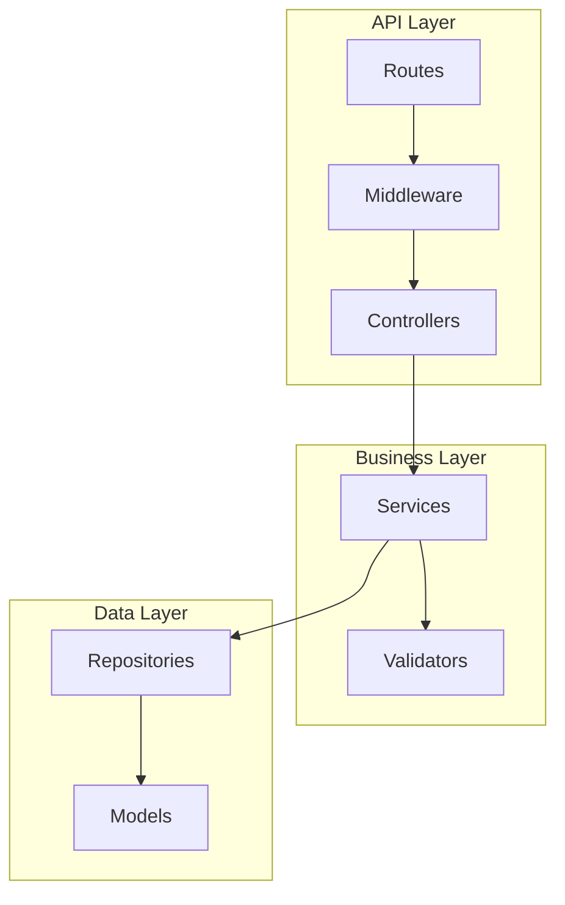
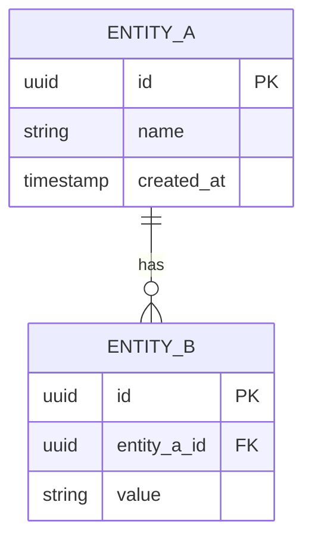

# [Document Title]

| Attribute | Value |
|-----------|-------|
| **Purpose** | [Brief purpose description] |
| **Version** | 1.0.0 |
| **Author** | AI Documentation Generator |
| **Created** | [YYYY-MM-DD] |
| **Last Updated** | [YYYY-MM-DD] |
| **Status** | Draft |

---

## Overview

[High-level overview of the document scope and content. Use British English for prose.]

---

## Architecture

[Architecture description with component diagram]



---

## [Main Section 1]

[Content for main section]

### [Subsection 1.1]

[Detailed content with code examples using American English for code]

```typescript
// Example service implementation
export class ExampleService {
  constructor(private readonly repository: ExampleRepository) {}

  async findAll(): Promise<Example[]> {
    return this.repository.findAll();
  }

  async create(data: CreateExampleDto): Promise<Example> {
    // Validate input
    this.validate(data);

    // Create entity
    return this.repository.create(data);
  }
}
```

### [Subsection 1.2]

[Detailed content]

---

## [Main Section 2]

[Content for section 2]

| Column 1 | Column 2 | Column 3 | Column 4 |
|----------|----------|----------|----------|
| Value 1  | Value 2  | Value 3  | Value 4  |

---

## API Reference

### Endpoint: `[METHOD] /api/v1/[resource]`

**Description**: [Brief description]

**Authentication**: Required / Optional

**Request**:

| Parameter | Location | Type | Required | Description |
|-----------|----------|------|----------|-------------|
| `id` | path | string | Yes | Resource identifier |
| `limit` | query | integer | No | Maximum items (default: 20) |

**Request Body**:

```json
{
  "field1": "value1",
  "field2": 123
}
```

**Response** (`200 OK`):

```json
{
  "data": {
    "id": "abc-123",
    "field1": "value1",
    "field2": 123,
    "createdAt": "2025-01-01T00:00:00Z"
  }
}
```

**Error Responses**:

| Status | Code | Description |
|--------|------|-------------|
| 400 | VALIDATION_ERROR | Invalid request data |
| 401 | UNAUTHORIZED | Authentication required |
| 403 | FORBIDDEN | Insufficient permissions |
| 404 | NOT_FOUND | Resource not found |
| 500 | INTERNAL_ERROR | Server error |

---

## Data Model



---

## Troubleshooting

### Common Issues

| Issue | Symptoms | Resolution |
|-------|----------|------------|
| Database connection timeout | `ECONNREFUSED` errors in logs | Check database host/port, verify credentials |
| Authentication failures | 401 responses on valid tokens | Check token expiration, verify secret key |
| Slow response times | API latency > 2 seconds | Check database queries, review N+1 issues |

### Diagnostic Commands

```bash
# Check API health
curl http://localhost:3000/health

# Test database connection
npm run db:check

# View application logs
docker logs api-server --tail 100

# Run query analysis
npm run db:analyze
```

### Escalation Path

1. Check application logs for stack traces
2. Verify database connectivity and queries
3. Check external service dependencies
4. Contact backend team if issue persists

---

## Best Practices

### Do

- Use dependency injection for testability
- Implement proper error handling with typed errors
- Use transactions for multi-step operations
- Validate all input at API boundaries
- Write comprehensive unit and integration tests

### Don't

- Expose internal error details to clients
- Use `any` type in TypeScript
- Bypass authentication middleware
- Hardcode configuration values
- Ignore error handling in async operations

### Checklist

- [ ] All endpoints documented
- [ ] Error responses standardised
- [ ] Input validation implemented
- [ ] Unit tests written (>80% coverage)
- [ ] Integration tests for critical paths

---

## Related Documentation

| Document | Relationship | Description |
|----------|--------------|-------------|
| [API.md](./API.md) | Related | Complete API documentation |
| [DATA.md](./DATA.md) | Related | Data model definitions |
| [TESTING.md](./TESTING.md) | Related | Testing strategy |
| [Frontend ARCHITECTURE.md](../frontend/ARCHITECTURE.md) | See Also | Frontend integration |

---

## Changelog

| Version | Date | Author | Changes |
|---------|------|--------|---------|
| 1.0.0 | [YYYY-MM-DD] | AI Documentation Generator | Initial documentation |
