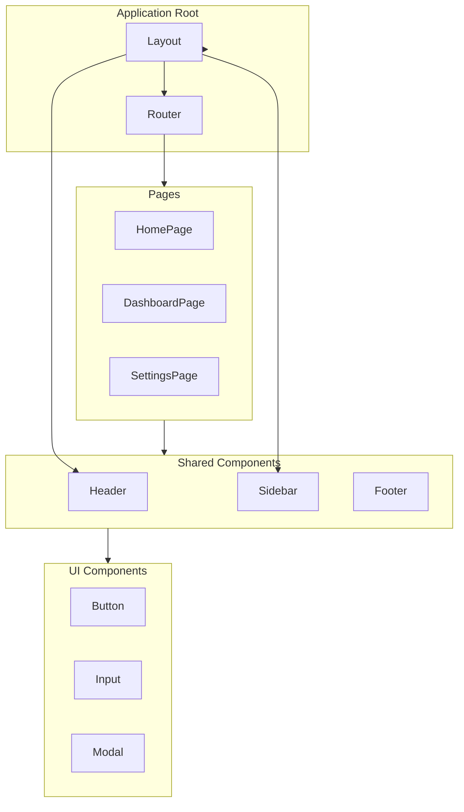
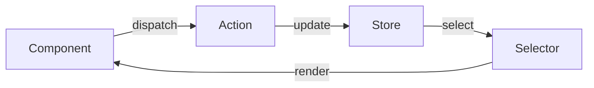

# [Document Title]

| Attribute | Value |
|-----------|-------|
| **Purpose** | [Brief purpose description] |
| **Version** | 1.0.0 |
| **Author** | AI Documentation Generator |
| **Created** | [YYYY-MM-DD] |
| **Last Updated** | [YYYY-MM-DD] |
| **Status** | Draft |

---

## Overview

[High-level overview of the document scope and content. Use British English for prose.]

---

## Component Architecture



---

## [Main Section 1]

[Content for main section. Use British English for prose.]

### [Subsection 1.1]

[Detailed content with code examples using American English for code]

```tsx
// Example component implementation
import { type FC, type PropsWithChildren } from 'react';
import styles from './ExampleComponent.module.css';

interface ExampleComponentProps {
  /** Brief description of prop */
  title: string;
  /** Optional callback for action */
  onAction?: () => void;
}

/**
 * ExampleComponent - Brief component description
 *
 * @example
 * <ExampleComponent title="Hello" onAction={() => console.log('clicked')} />
 */
export const ExampleComponent: FC<PropsWithChildren<ExampleComponentProps>> = ({
  title,
  onAction,
  children,
}) => {
  return (
    <div className={styles.container}>
      <h2 className={styles.title}>{title}</h2>
      {children}
      {onAction && (
        <button onClick={onAction} className={styles.button}>
          Action
        </button>
      )}
    </div>
  );
};
```

### [Subsection 1.2]

[Detailed content]

---

## Design Tokens

### Colour Palette

| Name | Hex | Usage |
|------|-----|-------|
| Primary | `#3B82F6` | Primary actions, links |
| Primary Dark | `#2563EB` | Hover states |
| Primary Light | `#60A5FA` | Backgrounds |
| Success | `#10B981` | Success states |
| Warning | `#F59E0B` | Warnings |
| Error | `#EF4444` | Errors |

### Typography

| Name | Size | Weight | Usage |
|------|------|--------|-------|
| `h1` | 2.25rem | 700 | Page titles |
| `h2` | 1.875rem | 600 | Section headings |
| `h3` | 1.5rem | 600 | Subsection headings |
| `body` | 1rem | 400 | Body text |
| `small` | 0.875rem | 400 | Captions |

### Spacing

| Token | Value | Usage |
|-------|-------|-------|
| `xs` | 0.25rem | Minimal spacing |
| `sm` | 0.5rem | Tight spacing |
| `md` | 1rem | Default spacing |
| `lg` | 1.5rem | Generous spacing |
| `xl` | 2rem | Section spacing |

---

## Component Library

### Button

**Description**: Primary interaction element for user actions.

**Variants**:

| Variant | Usage |
|---------|-------|
| `primary` | Primary actions |
| `secondary` | Secondary actions |
| `outline` | Tertiary actions |
| `ghost` | Minimal emphasis |
| `destructive` | Destructive actions |

**Props**:

| Prop | Type | Default | Description |
|------|------|---------|-------------|
| `variant` | `string` | `'primary'` | Button style |
| `size` | `'sm' \| 'md' \| 'lg'` | `'md'` | Button size |
| `disabled` | `boolean` | `false` | Disabled state |
| `loading` | `boolean` | `false` | Loading state |

**Accessibility**:

- Must have accessible label
- Focus state visible
- Minimum touch target 44x44px

---

## State Management



---

## Troubleshooting

### Common Issues

| Issue | Symptoms | Resolution |
|-------|----------|------------|
| Component not rendering | Blank area in UI | Check React DevTools for errors |
| State not updating | UI shows stale data | Verify state mutations, check selectors |
| Styling issues | Incorrect layout/colours | Check CSS specificity, verify class names |

### Diagnostic Steps

1. Open browser DevTools Console
2. Check React DevTools for component tree
3. Verify Network tab for API failures
4. Check Redux DevTools for state changes (if applicable)

### Escalation Path

1. Check browser console for errors
2. Verify component props
3. Check API responses in Network tab
4. Contact frontend team if issue persists

---

## Best Practices

### Do

- Use TypeScript for type safety
- Implement proper error boundaries
- Follow component composition patterns
- Write accessible components (ARIA, keyboard nav)
- Use semantic HTML elements

### Don't

- Use `any` type in TypeScript
- Mutate state directly
- Ignore accessibility requirements
- Create deeply nested component hierarchies
- Skip loading and error states

### Checklist

- [ ] Component has TypeScript types
- [ ] Accessibility tested (keyboard, screen reader)
- [ ] Responsive design verified
- [ ] Loading states implemented
- [ ] Error boundaries in place

---

## Related Documentation

| Document | Relationship | Description |
|----------|--------------|-------------|
| [DESIGN.md](./DESIGN.md) | Related | Design system |
| [TESTING.md](./TESTING.md) | Related | Testing strategy |
| [Backend API.md](../backend/API.md) | See Also | API integration |

---

## Changelog

| Version | Date | Author | Changes |
|---------|------|--------|---------|
| 1.0.0 | [YYYY-MM-DD] | AI Documentation Generator | Initial documentation |
