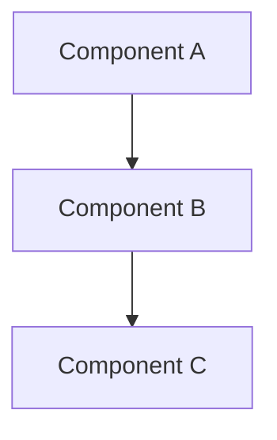

# [Document Title]

| Attribute | Value |
|-----------|-------|
| **Purpose** | [Brief purpose description] |
| **Version** | 1.0.0 |
| **Author** | AI Documentation Generator |
| **Created** | [YYYY-MM-DD] |
| **Last Updated** | [YYYY-MM-DD] |
| **Status** | Draft |

---

## Overview

[High-level overview of the document scope and content. Use British English for prose.]

---

## [Main Section 1]

[Content for main section. Include relevant diagrams using Mermaid syntax.]



### [Subsection 1.1]

[Detailed content]

### [Subsection 1.2]

[Detailed content]

---

## [Main Section 2]

[Content for section 2]

| Column 1 | Column 2 | Column 3 |
|----------|----------|----------|
| Value 1  | Value 2  | Value 3  |

---

## Configuration

[Configuration details with code examples using American English]

```yaml
# Example configuration
service:
  name: example-service
  port: 3000
  environment: production
```

---

## Troubleshooting

### Common Issues

| Issue | Symptoms | Resolution |
|-------|----------|------------|
| [Issue 1] | [Observable symptoms] | [Step-by-step resolution] |
| [Issue 2] | [Observable symptoms] | [Step-by-step resolution] |
| [Issue 3] | [Observable symptoms] | [Step-by-step resolution] |

### Diagnostic Commands

```bash
# Check service status
systemctl status [service-name]

# View logs
journalctl -u [service-name] -f

# Test connectivity
curl -v http://localhost:3000/health
```

### Escalation Path

1. Check application logs for errors
2. Verify configuration settings
3. Check network connectivity
4. Contact platform team if issue persists

---

## Best Practices

### Do

- Follow infrastructure-as-code principles
- Implement proper monitoring and alerting
- Use environment-specific configurations
- Document all manual interventions
- Maintain disaster recovery procedures

### Don't

- Store secrets in plain text or version control
- Make undocumented changes to production
- Skip testing in staging environments
- Ignore security advisories
- Neglect backup verification

### Checklist

- [ ] Infrastructure changes reviewed and approved
- [ ] Monitoring configured for new components
- [ ] Documentation updated
- [ ] Rollback procedure documented
- [ ] Security scan completed

---

## Related Documentation

| Document | Relationship | Description |
|----------|--------------|-------------|
| [Document A](./DOCUMENT_A.md) | Related | [Brief description] |
| [Document B](../domain/DOCUMENT_B.md) | See Also | [Brief description] |
| [Document C](./DOCUMENT_C.md) | Depends On | [Brief description] |

---

## Changelog

| Version | Date | Author | Changes |
|---------|------|--------|---------|
| 1.0.0 | [YYYY-MM-DD] | AI Documentation Generator | Initial documentation |
