# VALORA

<p align="center">
  <strong>The control layer for AI-assisted software development.</strong>
</p>

<p align="center">
  AI can write code.<br>
  <strong>VALORA helps you make sure the right code gets planned, built, tested, reviewed, and delivered.</strong>
</p>

<p align="center">
  
  
  
  
</p>

<p align="center">
  <strong>Open Source</strong> ·
  <strong>Multi-Agent</strong> ·
  <strong>Multi-Model</strong> ·
  <strong>MCP</strong> ·
  <strong>Local Models</strong> ·
  <strong>Security-First</strong>
</p>

## ⚡ TL;DR

**VALORA is an open-source AI development orchestrator.**

It coordinates specialised AI agents across a structured software-development lifecycle — from requirements and architecture through implementation, testing, security, review, and delivery.

Instead of asking a single AI agent to do everything:

```text
                ┌───────────┐       ┌───────────┐       ┌───────────┐       ┌───────────┐       ┌───────────┐
YOUR IDEA  ──▶  │   PLAN    │  ──▶  │   BUILD   │  ──▶  │  VERIFY   │  ──▶  │  REVIEW   │  ──▶  │  DELIVER  │
                └───────────┘       └───────────┘       └───────────┘       └───────────┘       └───────────┘
```

**VALORA gives AI a software-engineering process.**

## Why VALORA?

AI has changed how quickly software can be generated.  
But software engineering is more than generating code.  
A production change also requires:

- understanding requirements
- making architectural decisions
- managing context
- choosing the right implementation strategy
- writing code
- testing behaviour
- reviewing changes
- checking security
- managing dependencies
- maintaining project knowledge
- knowing when a human should intervene

The problem is no longer simply:

> **“Can AI write the code?”**

The more important questions are:

> **What should it build?**

> **How should it build it?**

> **How do we verify what it did?**

> **How do we keep it within safe boundaries?**

> **How does it learn from previous work?**

> **How do humans remain in control?**

VALORA is an attempt to answer those questions.

## 🧠 AI as an engineering team

VALORA doesn't treat AI as one giant autonomous agent.  
It coordinates specialised roles.

```text
┌─────────┐    ┌───────────┐    ┌───────────┐    ┌─────────┐    ┌──────────┐    ┌────────┐    ┌─────────┐
│ PRODUCT │───▶│ LEAD      │───▶│ SOFTWARE  │───▶│ QUALITY │───▶│ SECURITY │───▶│ REVIEW │───▶│ PULL    │
│ MANAGER │    │ ARCHITECT │    │ ENGINEERS │    │         │    │          │    │        │    │ REQUEST │
└─────────┘    └───────────┘    └───────────┘    └─────────┘    └──────────┘    └────────┘    └─────────┘
```

Different responsibilities can use different agents, tools, models and context.

The objective is not to create **one smarter agent**.

It's to create a **better engineering system**.

## 🎬 See VALORA in action

<p align="center">
  <!-- Replace with the strongest 20–40 second product demonstration -->
  
</p>

### From an idea to an engineered change

For example:

```bash
valora plan "Add OAuth authentication to my application"
```

VALORA can turn that request into a structured workflow involving:

```text
Requirements ──▶ Architecture ──▶ Implementation ──▶ Testing ──▶ Security ──▶ Review ──▶ Pull Request
```

The workflow can be fully guided, partially autonomous, or integrated with external AI clients and tools.

## 🚀 Get started

### 1. Install

```bash
npm install -g @windagency/valora
```

Or with pnpm:

```bash
pnpm add -g @windagency/valora
```

### 2. Initialise your project

```bash
cd your-project
valora init
valora plugin add engineering
valora plugin add quality-gate
valora plugin add qa
# Use `valora plugin available` to see any other relevant available plugins
```

### 3. Plan a change

```bash
valora plan "Add OAuth authentication"
```

VALORA analyses the project, gathers relevant context and creates a structured plan.

### 4. Continue through the workflow

```bash
valora implement
```

Then validate:

```bash
valora assert
```

Test:

```bash
valora test --type=all
```

Review:

```bash
valora review-code
```

And create the pull request:

```bash
valora create-pr
```

You can use the full workflow or invoke individual stages.

## 🏗️ The VALORA architecture

VALORA sits between the developer, the development workflow, AI agents, models, tools, and the codebase.

It is **not an LLM wrapper**.

The model is one replaceable component of a larger orchestration system.

### Conceptual Flow

```text
                 ┌─────────────┐
                 │  DEVELOPER  │
                 └──────┬──────┘
                        │
                        ▼
             ┌────────────────────┐
             │       VALORA       │
             │    ORCHESTRATOR    │
             └──────────┬─────────┘
                        │
      ┌─────────────────┼─────────────────┐
      ▼                 ▼                 ▼
   AGENTS            CONTEXT            MEMORY
      │                 │                 │
      └─────────────────┼─────────────────┘
                        ▼
             ┌─────────────────────┐
             │     GOVERNANCE      │
             │     & EXECUTION     │
             └──────────┬──────────┘
                        │
             ┌──────────┴──────────┐
             ▼                     ▼
           MODELS                TOOLS
             │                     │
             └──────────┬──────────┘
                        ▼
                 ┌────────────┐
                 │  CODEBASE  │
                 └────────────┘
```

### The principle

**VALORA orchestrates the engineering process.**

Models provide intelligence.  
Agents provide specialised roles.  
Tools provide capabilities.  
Memory provides continuity.  
Governance provides boundaries.  
The codebase remains the source of truth.

```mermaid
flowchart TB
    DEV["DEVELOPER<br/><br/>CLI · Dashboard<br/>Clients · MCP"]

    subgraph V["VALORA"]
        direction TB

        ORCH["ORCHESTRATOR<br/><br/>Workflow Execution<br/>Agent Selection<br/>Phase Management<br/>Context Orchestration<br/>Session Management<br/>Execution Strategy"]

        subgraph CORE["CORE INTELLIGENCE"]

            AGENTS["<br/>AGENT SYSTEM<br/><br/>Product · Architecture<br/>Engineering · Platform<br/>QA · Security · UI/UX"]

            CONTEXT["CONTEXT<br/>& CODE INTELLIGENCE<br/><br/>AST · Symbols · LSP<br/>Context Filtering<br/>Optimisation"]

            MEMORY["<br/>MEMORY<br/><br/>Project Knowledge<br/>Episodic · Semantic<br/>Plugins"]
        end

        GOV["GOVERNANCE & EXECUTION<br/><br/>Planning · Implementation<br/>Assertion · Testing · Review<br/>Security · Quality Gates<br/>Approval · Audit · Recovery"]

        ORCH --> AGENTS
        ORCH --> CONTEXT
        ORCH --> MEMORY

        AGENTS --> GOV
        CONTEXT --> GOV
        MEMORY --> GOV
    end

    subgraph EXT["EXTERNAL CAPABILITIES"]

        MODELS["MODEL LAYER<br/><br/>Cloud · Local<br/>Compatible APIs<br/>Multiple Providers & Models"]

        TOOLS["TOOL LAYER<br/><br/>MCP<br/>Development · Design<br/>Infrastructure<br/>Data · Observability"]
    end

    CODE["CODEBASE<br/><br/>Git · Worktrees · Files<br/>Tests · CI/CD"]

    DEV --> ORCH

    ORCH --> MODELS
    ORCH --> TOOLS

    MODELS --> CODE
    TOOLS --> CODE

    style V fill:#111827,stroke:#6366f1,stroke-width:2px
    style CORE fill:#1f2937,stroke:#4b5563,stroke-width:1px
    style EXT fill:#111827,stroke:#4b5563,stroke-width:1px

    style DEV fill:#312e81,stroke:#818cf8,stroke-width:2px
    style ORCH fill:#3730a3,stroke:#a5b4fc,stroke-width:2px
    style GOV fill:#312e81,stroke:#818cf8,stroke-width:2px

    style AGENTS fill:#1e293b,stroke:#60a5fa,stroke-width:1px
    style CONTEXT fill:#1e293b,stroke:#60a5fa,stroke-width:1px
    style MEMORY fill:#1e293b,stroke:#60a5fa,stroke-width:1px

    style MODELS fill:#172554,stroke:#60a5fa,stroke-width:1px
    style TOOLS fill:#172554,stroke:#60a5fa,stroke-width:1px

    style CODE fill:#064e3b,stroke:#34d399,stroke-width:2px
```



## 🧩 Core capabilities

### Multi-agent orchestration

VALORA coordinates specialised agents instead of relying on a single general-purpose agent.  
Examples include:

- Product management
- Architecture
- Software engineering
- Platform engineering
- Quality assurance
- Security
- UI/UX

Each role can have its own instructions, tools, context and execution strategy.

### 🔄 Structured software lifecycle

VALORA provides an explicit development workflow:

```text
 Specification
      ↓
     PRD
      ↓
   Backlog
      ↓
   Planning
      ↓
Implementation
      ↓
  Assertion
      ↓
   Testing
      ↓
   Review
      ↓
   Commit
      ↓
 Pull Request
```

This creates a repeatable process instead of a sequence of disconnected AI conversations.

## 🛡️ Security & governance

Giving an AI agent access to your development environment introduces a new security boundary.  
VALORA is designed around that reality.

### Credential protection

- Environment-variable redaction
- Sensitive-file protection
- Output scanning

### Command protection

- Dangerous-command detection
- Network and exfiltration controls
- Remote-access restrictions
- Evaluation safeguards

### Prompt-injection protection

- Tool-result scanning
- Risk assessment
- Quarantine and redaction

### MCP security

- Tool-definition validation
- Tool-set drift detection
- Approval workflows

### Supply-chain protection

- Frozen lockfiles
- Blocked install scripts
- Vulnerability controls

### Auditability

- Structured execution logs
- Security events
- Session history

> **More AI autonomy requires more control, not less.**

## 👤 Humans remain in control

VALORA is designed around **human-AI collaboration**.

You control:

- what gets built
- what gets changed
- which agents participate
- which models are used
- what tools are available
- when approval is required
- what ultimately reaches your repository

AI can accelerate engineering.

**It does not have to own the engineering process.**

## ⚡ Multiple execution strategies

Different environments require different levels of autonomy.  
VALORA supports several execution approaches.

```text
                         VALORA
                            │
          ┌─────────────────┼─────────────────┐
          │                 │                 │
          ▼                 ▼                 ▼
     MCP Sampling     Guided Execution    API Execution
          │                 │                 │
          │                 │                 └──── Cloud APIs
          │                 │
          │                 └───────────────────── Human-controlled
          │
          └────────────────────────────────────── MCP-capable clients

                            +

                       LOCAL MODELS
                            │
                            ▼
                  Local / OpenAI-compatible
                         endpoints
```

You can start with a highly supervised workflow and introduce more autonomy as confidence grows.

## 🧠 Model independence

VALORA does not depend on a single AI provider.  
The model layer is intentionally replaceable.

```text
                    ┌─────────────────┐
                    │     VALORA      │
                    └────────┬────────┘
                             │
                             ▼
                    ┌─────────────────┐
                    │  MODEL ROUTING  │
                    └────────┬────────┘
                             │
            ┌────────────────┼────────────────┐
            │                │                │
            ▼                ▼                ▼
       Cloud models    Local models    Compatible APIs
            │                │                │
       ┌────┼────┐           │          ┌─────┼─────┐
       │    │    │           │          │     │     │
    Provider A  B  C     Local LLMs    Endpoint X  Y  Z
```

Supported providers and execution environments include:

- Anthropic
- OpenAI
- Google
- xAI
- Local models
- OpenAI-compatible endpoints

The architecture is designed so that models can change without rebuilding the entire engineering workflow.

> **Models will change quickly. Your engineering process shouldn't have to.**

## 🔌 MCP & external tools

AI agents become considerably more useful when they can interact with the systems surrounding the codebase.  
VALORA supports MCP-based integrations with external tools.

Examples include:

| Category          | Examples                                    |
| ----------------- | ------------------------------------------- |
| Development       | GitHub · Serena · Context7                  |
| Browser & testing | Playwright · Chrome DevTools · BrowserStack |
| Design            | Figma · Storybook                           |
| Infrastructure    | Terraform · Firebase · Google Cloud         |
| Data              | MongoDB · Elastic                           |
| Observability     | Grafana                                     |
| Research          | DeepResearch                                |

Tools are exposed through explicit capabilities and approval boundaries.

## 🧠 Context engineering

Giving an agent more context is not necessarily better.  
Large amounts of irrelevant context can increase:

- token usage
- latency
- cost
- noise
- hallucination risk
- decision complexity

VALORA therefore includes infrastructure for **relevant context selection**.

### Code intelligence

- AST parsing
- Symbol indexing
- Relevant-code extraction
- LSP integration
- Diagnostics

### Context optimisation

- Content-aware filtering
- History pruning
- Tool-result deduplication
- Context compression

The objective is simple:

> **Give the agent the information it needs — not everything that exists.**

## 🧠 Persistent project memory

Long-running software projects need continuity.  
VALORA can maintain project-level knowledge across sessions.

Memory can include:

- architectural decisions
- observations
- patterns
- previous outcomes
- project knowledge
- reusable context

The memory architecture is designed to be extensible through plugins.  
The goal isn't to remember everything.

It's to remember **what matters**.

## 🌳 Parallel development with Git worktrees

AI development often involves exploring multiple possible solutions.  
VALORA integrates Git worktrees so those explorations can remain isolated.

```text
                         main
                          │
            ┌─────────────┼─────────────┐
            │             │             │
            ▼             ▼             ▼
       auth-experiment  api-v2     payment-refactor
            │             │             │
            ▼             ▼             ▼
         running       complete       failed
```

This allows agents to explore without turning the main working tree into an uncontrolled experiment.

## 🧩 Plugins

VALORA is designed to be extended without modifying its core.  
Plugins can provide:

```text
Agents
Commands
Hooks
Prompts
Templates
Context
TypeScript modules
LLM providers
Memory backends
Compression strategies
```

A plugin can live at different levels:

```text
Built-in
   │
   ├── User
   │
   ├── Project
   │
   └── Package
```

This allows teams to adapt VALORA to their own engineering processes.

## 🛠️ CLI workflow

VALORA exposes individual lifecycle stages as commands.

### Requirements

```bash
valora refine-specs "Add user authentication"
```

### Product specification

```bash
valora create-prd
```

### Backlog

```bash
valora create-backlog
```

### Task selection

```bash
valora fetch-task
```

### Planning

```bash
valora plan
```

### Implementation

```bash
valora implement
```

### Validation

```bash
valora assert
```

### Testing

```bash
valora test --type=all
```

### Code review

```bash
valora review-code
```

### Commit

```bash
valora commit
```

### Pull request

```bash
valora create-pr
```

You can run the complete lifecycle or use individual commands independently.

## 🎯 What can you use VALORA for?

Feature development:

```bash
valora plan "Add OAuth authentication"
```

Bug investigation:

```bash
valora plan "Investigate intermittent login failures"
```

Refactoring:

```bash
valora plan "Refactor the payment service"
```

Security review:

```bash
valora review-code --focus=security
```

Testing:

```bash
valora test --type=all
```

Accessibility:

```bash
valora review-functional --check-a11y=true
```

Architecture:

```bash
valora plan "Design a scalable event-driven architecture"
```

Local AI development:

```bash
valora plan "Refactor the payment module" \
  --provider local \
  --model qwen3:8b
```

## 🆚 VALORA vs AI coding assistants

VALORA isn't necessarily a replacement for your favourite AI coding assistant.  
It addresses a different layer.

A coding assistant primarily helps you interact with AI while writing software.  
VALORA focuses on the **engineering workflow around AI**.

| Capability                    | Coding assistant | VALORA |
| ----------------------------- | :--------------: | :----: |
| Generate code                 |        ✓         |   ✓    |
| Codebase understanding        |        ✓         |   ✓    |
| Structured planning           |        —         |   ✓    |
| Specialised engineering roles |        —         |   ✓    |
| Multi-stage lifecycle         |        —         |   ✓    |
| Quality gates                 |      varies      |   ✓    |
| Security governance           |      varies      |   ✓    |
| Persistent project knowledge  |      varies      |   ✓    |
| Multiple model providers      |      varies      |   ✓    |
| Local models                  |      varies      |   ✓    |
| MCP integrations              |      varies      |   ✓    |
| Extensible plugins            |      varies      |   ✓    |
| Human-controlled workflows    |        ✓         |   ✓    |

### The short version

**Use your favourite AI coding tool.**

Use VALORA when you want to add:

> **process + orchestration + specialised roles + governance + context + memory**

around AI-assisted software development.

## 🏆 Design philosophy

VALORA is built around a few principles.

### 1. AI should amplify engineers

The goal is not to eliminate developers.  
The goal is to make developers more capable.

### 2. Autonomy should be earned

An agent should not receive unlimited capabilities simply because it can.

### 3. Context should be intentional

More information does not automatically produce better decisions.

### 4. Models should be replaceable

Today's best model may not be tomorrow's best model.  
The architecture should survive that change.

### 5. Security belongs in the workflow

Security should not be an afterthought added after autonomous execution exists.

### 6. Failure is information

AI systems will make mistakes.  
A useful engineering system should detect, contain and learn from those mistakes.

### 7. Humans remain accountable

Automation can execute.  
Humans remain responsible for what gets shipped.

## 📐 High-level architecture

```text
                              DEVELOPER
                                  │
                 ┌────────────────┼────────────────┐
                 │                │                │
                 ▼                ▼                ▼
                CLI           Dashboard       AI Clients
                 │                │                │
                 └────────────────┼────────────────┘
                                  │
                                  ▼
                        ┌───────────────────┐
                        │       VALORA      │
                        │    ORCHESTRATOR   │
                        └─────────┬─────────┘
                                  │
          ┌───────────────────────┼────────────────────────┐
          │                       │                        │
          ▼                       ▼                        ▼
          │                    CONTEXT                   MEMORY
          │                       │                        │
          │                   AST / LSP                 Project
       AGENTS                  Symbols                 Knowledge
          │                   Filtering                 History
          │                  Optimisation              Decisions
          │                       │                        │
          └───────────────────────┬────────────────────────┘
                                  │
                                  ▼
                           GOVERNANCE LAYER
                                  │
                  ┌───────────────┼───────────────┐
                  │               │               │
              Security      Quality Gates      Approval
                  │               │               │
                  └───────────────┼───────────────┘
                                  │
                  ┌───────────────┴───────────────┐
                  │                               │
                  ▼                               ▼
             MODEL LAYER                      TOOL LAYER
                  │                               │
        ┌─────────┼─────────┐            ┌────────┼─────────┐
        │         │         │            │        │         │
      Cloud     Local   Compatible      MCP    GitHub    Tools
      Models    Models    APIs        Servers
                  │                               │
                  └───────────────┬───────────────┘
                                  │
                                  ▼
                              CODEBASE
                                  │
                         ┌────────┼────────┐
                         │        │        │
                        Git     Tests   Worktrees
```

## 📚 Documentation

| Documentation                                          | Purpose                      |
| ------------------------------------------------------ | ---------------------------- |
| [Quick Start](documentation/user-guide/quick-start.md) | Get started quickly          |
| [User Guide](documentation/user-guide/)                | Using VALORA                 |
| [Commands](documentation/user-guide/commands.md)       | CLI reference                |
| [Developer Guide](documentation/developer-guide/)      | Develop VALORA               |
| [Architecture](documentation/architecture/)            | System architecture          |
| [Plugin Guide](documentation/plugins/)                 | Build extensions             |
| [Security](SECURITY.md)                                | Security model and reporting |

## 🤝 Contributing

VALORA is open source.  
Contributions are welcome across the entire project:

- Code
- Documentation
- Tests
- Plugins
- Ideas
- Architecture
- Bug reports
- Security research
- Experiments

```bash
git clone https://github.com/windagency/valora.ai.git

cd valora.ai

pnpm install

pnpm test
```

Before contributing, please read the developer documentation and contribution guidelines.

**The future of AI-assisted software development is still being invented.**  
Help shape it.

## ⭐ Support VALORA

If you find VALORA useful:

⭐ **Star the repository**  
🐛 **Report a bug**  
💡 **Open a discussion**  
🔌 **Build a plugin**  
🤝 **Contribute**  
📣 **Tell another developer**

Every contribution helps.

## 🔭 What's next?

VALORA is an evolving experiment in AI-assisted software engineering.

Areas of ongoing exploration include:

- Better agent coordination
- Improved code intelligence
- More efficient context management
- Long-term project memory
- Safer autonomous execution
- Richer MCP integrations
- Improved local-model support
- More powerful plugins
- Better observability
- Human/AI collaboration patterns

The objective isn't simply to make AI generate more code.  
**It's to make AI-assisted software development more reliable, controllable, and scalable.**

## 💬 The bigger idea

> **AI can generate software.**
>
> The next challenge is engineering the system around it.

VALORA explores what that system could look like.

---

## 📄 Licence

MIT © Damien TIVELET  
Open source · Built for developers · Designed for the AI era
