# Dashboard TUI — Design Document

## Overview

The dashboard TUI is a real-time monitoring interface for Valora sessions, system health, and operational metrics. It is built with React/Ink via a library-agnostic TUI adapter (`getTUIAdapter()`), and decomposed into ~30 modular files under `src/ui/dashboard/`.

The entry point is `startDashboard()` in `src/ui/dashboard-tui.tsx`, which renders the root `<Dashboard />` component and wires up signal handlers.

---

## Navigation Model

### State Machine

Navigation is managed by the `useNavigation()` hook, which tracks four pieces of state:

| State           | Type            | Values                                                          |
| --------------- | --------------- | --------------------------------------------------------------- |
| `viewMode`      | `ViewMode`      | `'dashboard'` or `'details'`                                    |
| `activeTab`     | `DashboardTab`  | `'overview'`, `'performance'`, `'agents'`, `'cache'`, `'audit'` |
| `sessionSubTab` | `SessionSubTab` | `'overview'`, `'optimization'`, `'quality'`, `'tokens'`         |
| `selectedIndex` | `number`        | Row index within the active sessions list                       |

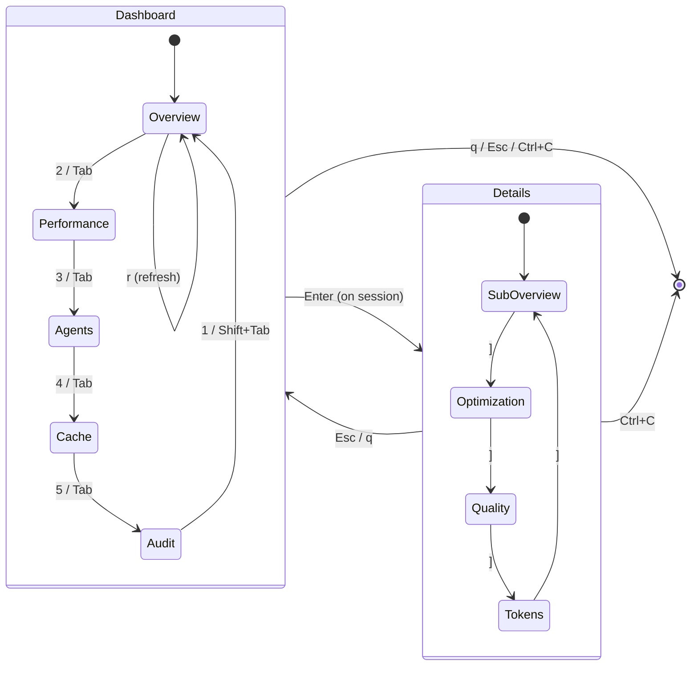

### Key Bindings

#### Dashboard Mode (`viewMode === 'dashboard'`)

| Key          | Action                                          |
| ------------ | ----------------------------------------------- |
| `1`–`5`      | Switch directly to top-level tab                |
| `Tab`        | Next top-level tab (cycles)                     |
| `Shift+Tab`  | Previous top-level tab (cycles)                 |
| `j` / `Down` | Move selection down in session list             |
| `k` / `Up`   | Move selection up in session list               |
| `Enter`      | Drill into selected session (Overview tab only) |
| `r`          | Force refresh data + recompute MetricsSummary   |
| `q` / `Esc`  | Quit dashboard                                  |
| `Ctrl+C`     | Quit dashboard                                  |

#### Details Mode (`viewMode === 'details'`)

| Key         | Action                            |
| ----------- | --------------------------------- |
| `]`         | Next session sub-tab (cycles)     |
| `[`         | Previous session sub-tab (cycles) |
| `q` / `Esc` | Back to dashboard mode            |
| `Ctrl+C`    | Quit dashboard                    |

### Tab Bar

```
 [1:Overview]  2:Performance  3:Agents  4:Cache  5:Audit
```

Active tab is highlighted with `backgroundColor="cyan"` and `color="black"`.

### Session Sub-Tab Bar

```
 [Overview]  Optimization  Quality  Tokens    ([/] switch)
```

Same visual treatment. Shown at the top of the session details view.

---

## Data Flow

### Hook Wiring

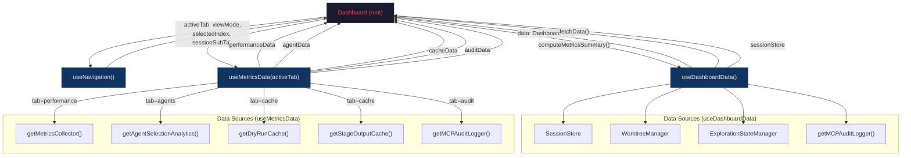

### Tiered Refresh Rates

Only the active tab's data is fetched:

| Tab             | Rate | Source                                            |
| --------------- | ---- | ------------------------------------------------- |
| Overview        | 1 s  | `SessionStore`, worktrees, explorations           |
| Performance     | 2 s  | `getMetricsCollector().getSnapshot()`             |
| Audit           | 3 s  | `getMCPAuditLogger().getRecentEntries()`          |
| Agents          | 5 s  | `getAgentSelectionAnalytics().getMetrics()`       |
| Cache           | 5 s  | `getDryRunCache/getStageOutputCache().getStats()` |
| Session details | 1 s  | `sessionStore.loadSession()` on selected session  |

`MetricsSummary` is computed on overview tab activation and on manual refresh (`r`), not every tick.

### Data Interfaces

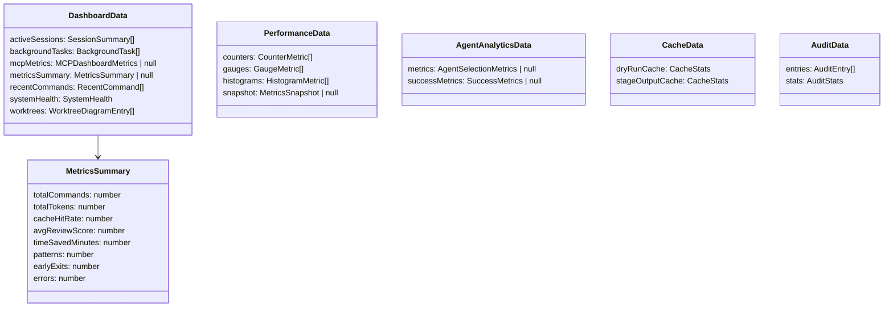

---

## Page Composition

### Root Shell (`dashboard-tui.tsx`)

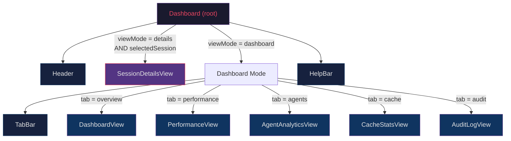

---

### Tab 1: Overview — `DashboardView`

**Props:** `data: DashboardData`, `selectedIndex: number`

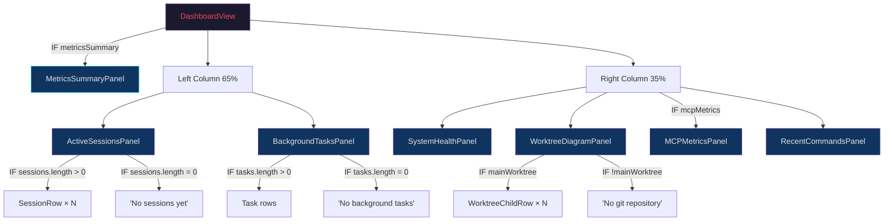

#### Conditional Blocks

| Component             | Condition                     | Renders                   |
| --------------------- | ----------------------------- | ------------------------- |
| `MetricsSummaryPanel` | `data.metricsSummary != null` | Aggregated metrics banner |
| `MCPMetricsPanel`     | `data.mcpMetrics != null`     | MCP summary               |

**`MetricsSummaryPanel` colour thresholds:**

| Metric           | Green  | Yellow | Red |
| ---------------- | ------ | ------ | --- |
| Cache hit rate   | >= 70% | < 70%  | -   |
| Avg review score | >= 80  | < 80   | -   |
| Errors           | = 0    | -      | > 0 |

**`SessionRow` conditionals:**

- `isSelected` -> cyan background, bold, ">" indicator
- `session.status === 'active'` -> green dot, else yellow
- `tokens > 0` -> show token count
- `ctxUsage` present -> show utilisation %

**`BackgroundTasksPanel` per-task conditionals:**

- `status`: completed -> green check, failed -> red X, else yellow spinner
- `progress < 0` (indeterminate) -> "running..." bar, else filled percentage bar
- `elapsedStr` present -> show elapsed time

**`WorktreeDiagramPanel` conditionals:**

- `mainWorktree` exists -> show tree, else "No git repository detected"
- `children.length === 0` -> "No additional worktrees"
- Per child: `prunable` -> red, `isExploration` -> yellow, else white
- Per child: `explorationStatus` present -> coloured status badge
- Per child: `truncatedTask` present -> task text (max 20 chars)
- `overflow` -> "+ N more worktrees" (max 4 shown)

---

### Tab 2: Performance — `PerformanceView`

**Props:** `data: PerformanceData`

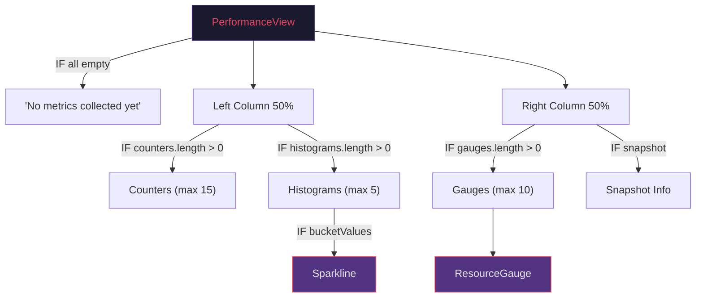

#### Conditional Blocks

| Condition                 | Renders                              |
| ------------------------- | ------------------------------------ |
| All arrays empty          | "No metrics collected yet."          |
| `counters.length > 0`     | Counter name:value pairs (max 15)    |
| `counters.length > 15`    | "...and N more" overflow             |
| `histograms.length > 0`   | Histogram with name, count, avg      |
| `bucketValues.length > 0` | Sparkline chart per histogram        |
| `gauges.length > 0`       | ResourceGauge bar per gauge (max 10) |
| `gauges.length > 10`      | "...and N more" overflow             |
| `snapshot` present        | Uptime, collection interval          |

---

### Tab 3: Agents — `AgentAnalyticsView`

**Props:** `data: AgentAnalyticsData`

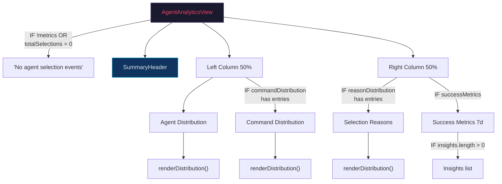

#### Conditional Blocks

| Condition                             | Renders                            |
| ------------------------------------- | ---------------------------------- |
| `!metrics \|\| totalSelections === 0` | Empty state message                |
| `commandDistribution` has keys        | Command Distribution bar chart     |
| `reasonDistribution` has keys         | Selection Reasons bar chart        |
| `successMetrics` present              | Accuracy, Completion, Satisfaction |
| `insights.length > 0`                 | Insights text list                 |

**`SummaryHeader` colour thresholds:**

| Metric         | Green  | Yellow | Red   |
| -------------- | ------ | ------ | ----- |
| Avg confidence | >= 85% | < 85%  | -     |
| Fallback rate  | -      | -      | > 15% |
| Override rate  | -      | -      | > 20% |

---

### Tab 4: Cache — `CacheStatsView`

**Props:** `data: CacheData`

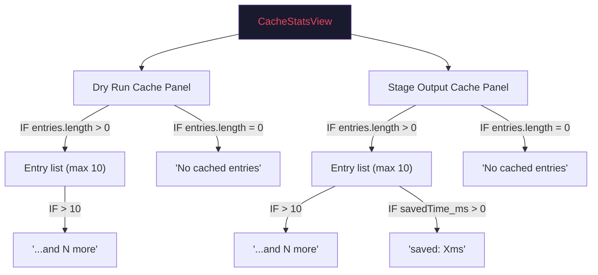

#### Conditional Blocks

| Panel        | Condition              | Renders                                 |
| ------------ | ---------------------- | --------------------------------------- |
| Dry Run      | `entries.length > 0`   | key (truncated 20) + command name + age |
| Dry Run      | `entries.length === 0` | "No cached entries"                     |
| Dry Run      | `entries.length > 10`  | "...and N more" overflow                |
| Stage Output | `entries.length > 0`   | stageId (truncated 20) + age            |
| Stage Output | `entries.length === 0` | "No cached entries"                     |
| Stage Output | `entries.length > 10`  | "...and N more" overflow                |
| Stage Output | `savedTime_ms > 0`     | "saved: Xms" per entry                  |

---

### Tab 5: Audit — `AuditLogView`

**Props:** `data: AuditData`

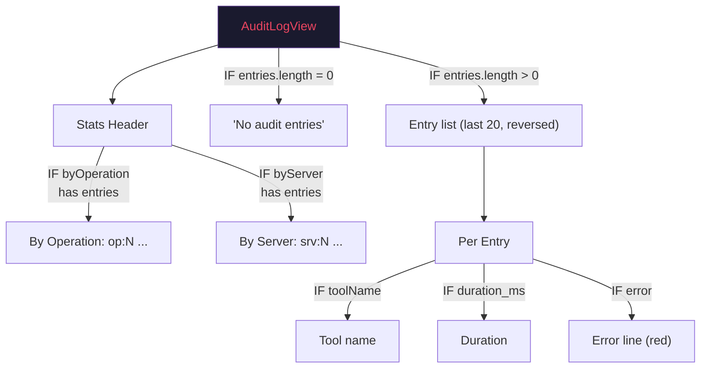

#### Conditional Blocks

| Condition                        | Renders                    |
| -------------------------------- | -------------------------- |
| `byOperation` has keys           | "By Operation" breakdown   |
| `byServer` has keys              | "By Server" breakdown      |
| `entries.length === 0`           | "No audit entries"         |
| Per entry: `toolName`            | Tool name label            |
| Per entry: `duration_ms != null` | Duration value             |
| Per entry: `error`               | Error line (red, indented) |
| `successRate >= 0.9`             | Green rate, else yellow    |

---

### Session Details — `SessionDetailsView`

**Props:** `activeSubTab: SessionSubTab`, `onBack`, `onExit`, `session: Session`

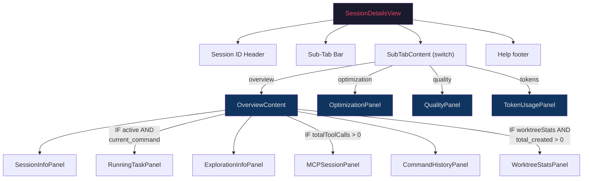

#### Sub-Tab: Overview — `OverviewContent`

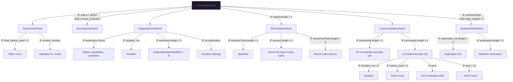

#### Sub-Tab: Optimization — `OptimizationPanel`

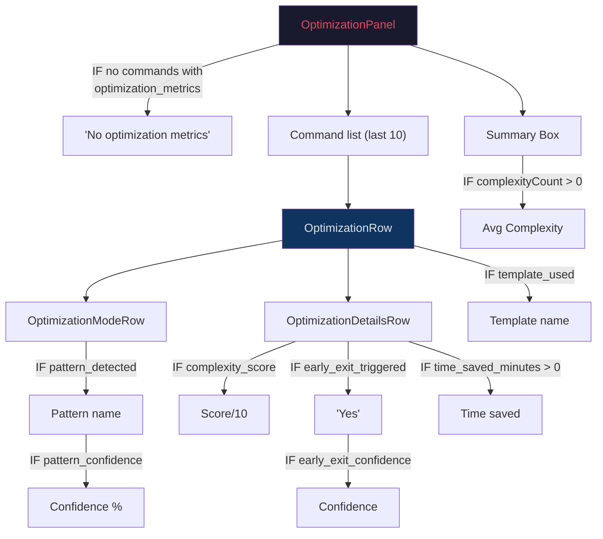

**Complexity colour thresholds:** > 7 red, > 4 yellow, else green.

#### Sub-Tab: Quality — `QualityPanel`

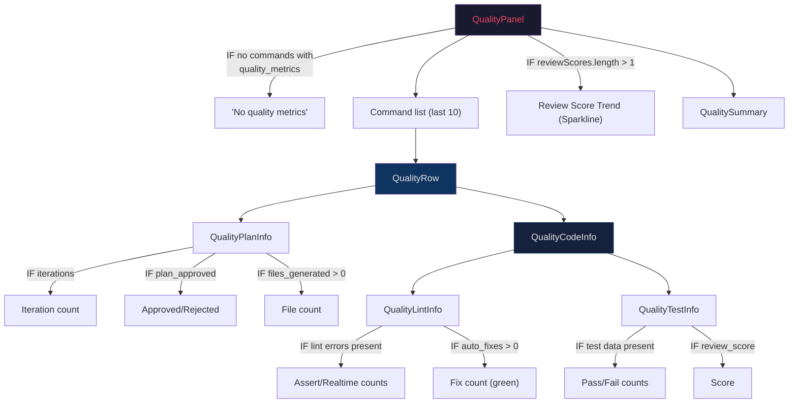

**Review score colour thresholds:** >= 80 green, >= 60 yellow, else red.

**QualitySummary colour thresholds:**

| Metric         | Green  | Yellow | White    |
| -------------- | ------ | ------ | -------- |
| Avg review     | >= 80  | < 80   | -        |
| Test pass rate | >= 90% | < 90%  | no tests |

#### Sub-Tab: Tokens — `TokenUsagePanel`

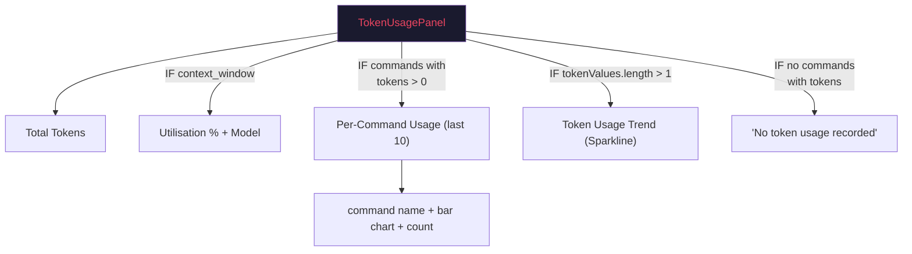

**Context utilisation colour:** > 80% red, else green.

---

## Component Composition Tree

Complete tree showing every component and its children:

```mermaid
graph TD
    D["Dashboard"]
    D --> H["Header"]
    D --> TB["TabBar"]
    D --> HB["HelpBar"]

    D -->|"dashboard mode"| DV["DashboardView"]
    D -->|"details mode"| SDV["SessionDetailsView"]

    DV --> MSP["MetricsSummaryPanel"]
    DV --> ASP["ActiveSessionsPanel"]
    ASP --> SR["SessionRow"]
    DV --> BTP["BackgroundTasksPanel"]
    DV --> SHP["SystemHealthPanel"]
    DV --> WDP["WorktreeDiagramPanel"]
    WDP --> WCR["WorktreeChildRow"]
    DV --> MMP["MCPMetricsPanel"]
    DV --> RCP["RecentCommandsPanel"]

    SDV -->|"overview"| OC["OverviewContent"]
    SDV -->|"optimization"| OP["OptimizationPanel"]
    SDV -->|"quality"| QP["QualityPanel"]
    SDV -->|"tokens"| TUP["TokenUsagePanel"]

    OC --> SIP["SessionInfoPanel"]
    OC --> RTP["RunningTaskPanel"]
    OC --> EIP["ExplorationInfoPanel"]
    EIP --> EWR["ExplorationWorktreeRow"]
    OC --> MCSP["MCPSessionPanel"]
    OC --> CHP["CommandHistoryPanel"]
    OC --> WSP["WorktreeStatsPanel"]

    OP --> OR["OptimizationRow"]
    OR --> OMR["OptimizationModeRow"]
    OR --> ODR["OptimizationDetailsRow"]

    QP --> QR["QualityRow"]
    QR --> QPI["QualityPlanInfo"]
    QR --> QCI["QualityCodeInfo"]
    QCI --> QLI["QualityLintInfo"]
    QCI --> QTI["QualityTestInfo"]
    QP --> QS["QualitySummary"]

    MCSP --> SL1["Sparkline"]
    QP --> SL2["Sparkline"]
    TUP --> SL3["Sparkline"]

    style D fill:#e94560,stroke:#533483,color:#fff
    style DV fill:#0f3460,stroke:#533483,color:#e2e2e2
    style SDV fill:#533483,stroke:#e94560,color:#e2e2e2
    style H fill:#16213e,stroke:#0f3460,color:#e2e2e2
    style TB fill:#16213e,stroke:#0f3460,color:#e2e2e2
    style HB fill:#16213e,stroke:#0f3460,color:#e2e2e2
```

---

## File Structure

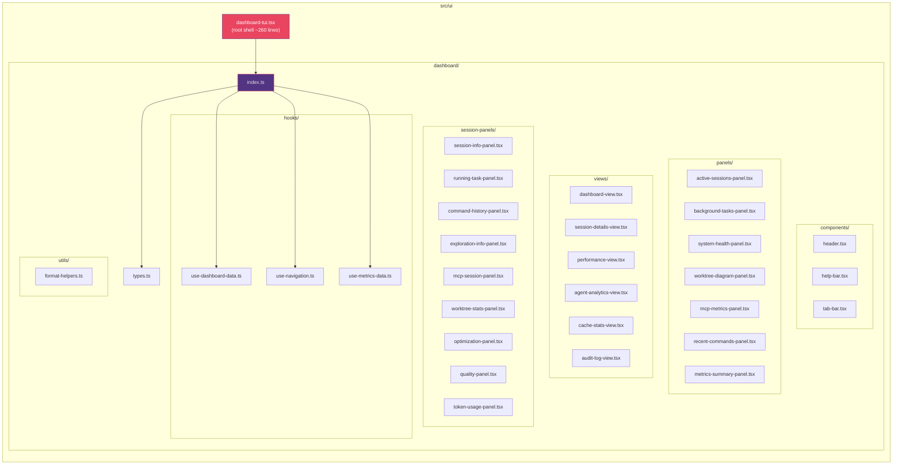

---

## Reused Components

| Component          | Source                              | Used By                                                                                                                                  |
| ------------------ | ----------------------------------- | ---------------------------------------------------------------------------------------------------------------------------------------- |
| `Sparkline`        | `exploration/dashboard-metrics.tsx` | PerformanceView, MCPSessionPanel, QualityPanel, TokenUsagePanel                                                                          |
| `ResourceGauge`    | `exploration/dashboard-metrics.tsx` | PerformanceView                                                                                                                          |
| `formatNumber`     | `utils/number-format.ts`            | MetricsSummaryPanel, ActiveSessionsPanel, SessionInfoPanel, CommandHistoryPanel, TokenUsagePanel                                         |
| `formatDurationMs` | `dashboard/utils/format-helpers.ts` | BackgroundTasksPanel, SystemHealthPanel, RunningTaskPanel, CommandHistoryPanel, ExplorationInfoPanel, WorktreeStatsPanel, CacheStatsView |
| `formatAge`        | `dashboard/utils/format-helpers.ts` | ActiveSessionsPanel, RecentCommandsPanel, MCPSessionPanel, AuditLogView                                                                  |

## Singleton Data Sources

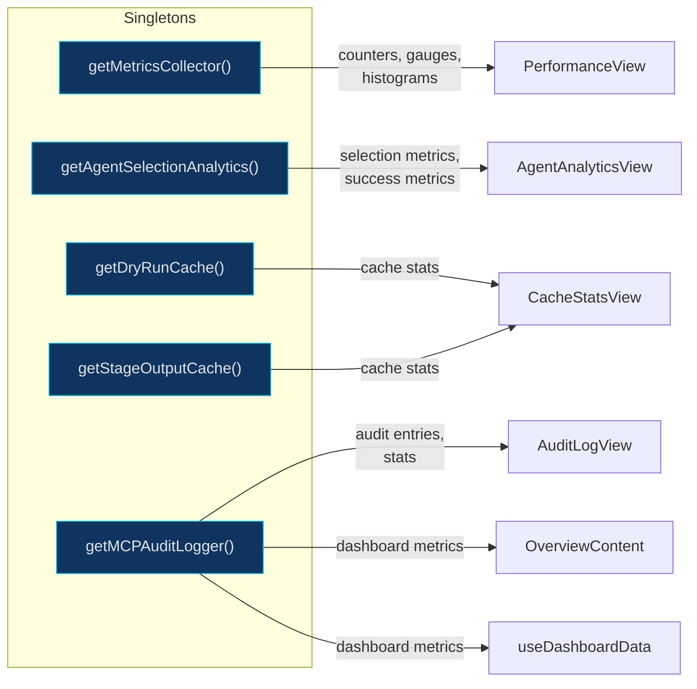

| Accessor                       | Module                                          | Provides                                |
| ------------------------------ | ----------------------------------------------- | --------------------------------------- |
| `getMetricsCollector()`        | `utils/metrics-collector.ts`                    | Counters, gauges, histograms            |
| `getAgentSelectionAnalytics()` | `services/agent-selection-analytics.service.ts` | Selection metrics, success metrics      |
| `getDryRunCache()`             | `executor/dry-run-cache.ts`                     | Dry-run cache stats                     |
| `getStageOutputCache()`        | `executor/stage-output-cache.ts`                | Stage output cache stats                |
| `getMCPAuditLogger()`          | `mcp/mcp-audit-logger.service.ts`               | Audit entries, stats, dashboard metrics |
