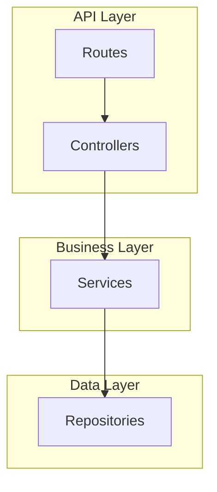

# [Document Title]

| Attribute        | Value                   |
| ---------------- | ----------------------- |
| **Purpose**      | [One-sentence purpose]  |
| **Audience**     | Consumers + Maintainers |
| **Version**      | 1.0.0                   |
| **Last Updated** | [YYYY-MM-DD]            |
| **Status**       | Draft                   |

---

## Quick Reference

[Scannable table — the "menu" a consumer reads to decide if this document has what they need]

| Item             | Description                  | Location / Details   |
| ---------------- | ---------------------------- | -------------------- |
| [Endpoint/Class] | [What it does, one sentence] | [Path or link]       |
| [Key concept]    | [Brief description]          | [Where to find more] |

---

## [Primary Content Section]

[What it does. How to use it. Examples first. Keep scannable.]

```typescript
// Copy-paste ready example
export class ExampleService {
	constructor(private readonly repository: ExampleRepository) {}

	async findAll(): Promise<Example[]> {
		return this.repository.findAll();
	}
}
```

---

## [Second Content Section]

[Tables, diagrams, practical reference material]



| Column 1 | Column 2 | Column 3 |
| -------- | -------- | -------- |
| Value 1  | Value 2  | Value 3  |

---

## API Reference

### `[METHOD] /api/v1/[resource]`

**Description**: [One sentence]

**Request**:

| Parameter | Location | Type   | Required | Description |
| --------- | -------- | ------ | -------- | ----------- |
| `id`      | path     | string | Yes      | Resource ID |

**Request Body**:

```json
{
	"field1": "value1"
}
```

**Response** (`200 OK`):

```json
{
	"data": {
		"id": "abc-123",
		"field1": "value1"
	}
}
```

**Error Responses**:

| Status | Code               | Description             |
| ------ | ------------------ | ----------------------- |
| 400    | `VALIDATION_ERROR` | Invalid request data    |
| 401    | `UNAUTHORIZED`     | Authentication required |
| 404    | `NOT_FOUND`        | Resource not found      |

---

<details>
<summary><strong>Design Rationale and Architecture Decisions</strong></summary>

[WHY it works this way. The decisions that shaped this design. What was considered and rejected. Historical context a maintainer debugging at 2AM will need.]

### Why [specific decision]

[Explanation of the decision, what alternative was considered, why this was chosen]

### Why [another decision]

[Explanation]

</details>

<details>
<summary><strong>Troubleshooting</strong></summary>

[Only include this section if there are project-specific known issues. Generic advice belongs nowhere.]

| Issue                  | Symptoms             | Resolution                  |
| ---------------------- | -------------------- | --------------------------- |
| [Specific known issue] | [Observable symptom] | [Concrete step-by-step fix] |

### Diagnostic Commands

```bash
# Check API health
curl http://localhost:3000/health

# View logs
docker logs api-server --tail 100
```

</details>

---

## Related Documentation

| Document                                                | Relationship | Description                |
| ------------------------------------------------------- | ------------ | -------------------------- |
| [API.md](./API.md)                                      | Related      | Complete API documentation |
| [DATA.md](./DATA.md)                                    | Related      | Data model definitions     |
| [Frontend ARCHITECTURE.md](../frontend/ARCHITECTURE.md) | See Also     | Frontend integration       |
