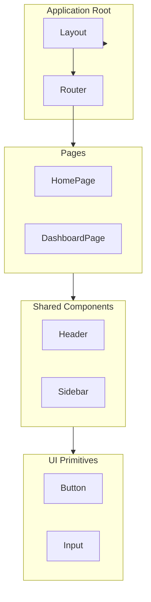
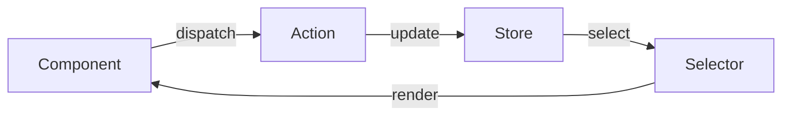

# [Document Title]

| Attribute        | Value                   |
| ---------------- | ----------------------- |
| **Purpose**      | [One-sentence purpose]  |
| **Audience**     | Consumers + Maintainers |
| **Version**      | 1.0.0                   |
| **Last Updated** | [YYYY-MM-DD]            |
| **Status**       | Draft                   |

---

## Quick Reference

[Scannable summary — the "menu" a developer reads to decide if this is what they need]

| Item            | Description            | Location                |
| --------------- | ---------------------- | ----------------------- |
| [Key component] | [What it does]         | `src/components/[path]` |
| [State pattern] | [How state is managed] | `src/store/[module]`    |
| [Route]         | [Where it lives]       | `/path/to/page`         |

---

## Component Architecture



---

## Design Tokens

### Colour Palette

| Name         | Hex       | Usage                  |
| ------------ | --------- | ---------------------- |
| Primary      | `#3B82F6` | Primary actions, links |
| Primary Dark | `#2563EB` | Hover states           |
| Success      | `#10B981` | Success states         |
| Warning      | `#F59E0B` | Warnings               |
| Error        | `#EF4444` | Errors                 |

### Typography

| Token   | Size     | Weight | Usage            |
| ------- | -------- | ------ | ---------------- |
| `h1`    | 2.25rem  | 700    | Page titles      |
| `h2`    | 1.875rem | 600    | Section headings |
| `body`  | 1rem     | 400    | Body text        |
| `small` | 0.875rem | 400    | Captions         |

### Spacing

| Token | Value   | Usage           |
| ----- | ------- | --------------- |
| `xs`  | 0.25rem | Tight spacing   |
| `sm`  | 0.5rem  | Compact spacing |
| `md`  | 1rem    | Default spacing |
| `lg`  | 1.5rem  | Section spacing |

---

## Component Library

### [ComponentName]

**Description**: [One sentence.]

**Props**:

| Prop       | Type                       | Default     | Description    |
| ---------- | -------------------------- | ----------- | -------------- |
| `variant`  | `'primary' \| 'secondary'` | `'primary'` | Visual style   |
| `disabled` | `boolean`                  | `false`     | Disabled state |

**Usage**:

```tsx
import { ComponentName } from 'src/components/ComponentName';

<ComponentName variant="primary">Label</ComponentName>;
```

---

<details>
<summary><strong>State Management Architecture</strong></summary>

[WHY the state is structured this way. What alternatives were considered. Decisions that future maintainers should understand before refactoring.]



### Why [specific state decision]

[Rationale]

</details>

<details>
<summary><strong>Design Decisions and Trade-offs</strong></summary>

[Why the design system is structured the way it is. Accessibility choices. Browser compatibility decisions. What was deliberately left out.]

</details>

<details>
<summary><strong>Troubleshooting</strong></summary>

[Only include project-specific known issues. Generic "check React DevTools" advice belongs nowhere.]

| Issue                  | Symptoms            | Resolution                  |
| ---------------------- | ------------------- | --------------------------- |
| [Specific known issue] | [Observable effect] | [Concrete step-by-step fix] |

</details>

---

## Related Documentation

| Document                            | Relationship | Description      |
| ----------------------------------- | ------------ | ---------------- |
| [DESIGN.md](./DESIGN.md)            | Related      | Design system    |
| [TESTING.md](./TESTING.md)          | Related      | Testing strategy |
| [Backend API.md](../backend/API.md) | See Also     | API integration  |
