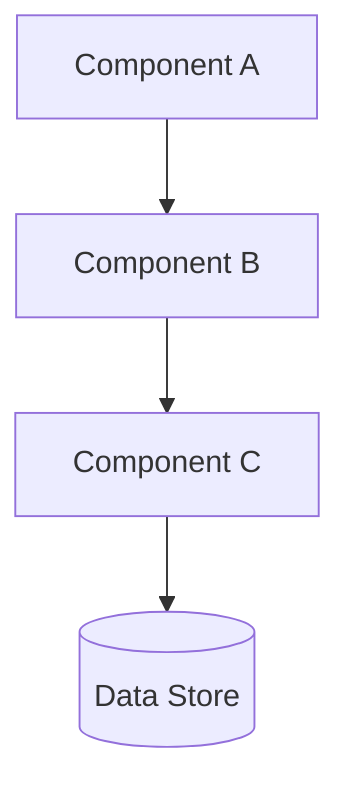

# [Document Title]

| Attribute        | Value                   |
| ---------------- | ----------------------- |
| **Purpose**      | [One-sentence purpose]  |
| **Audience**     | Consumers + Maintainers |
| **Version**      | 1.0.0                   |
| **Last Updated** | [YYYY-MM-DD]            |
| **Status**       | Draft                   |

---

## Quick Reference

[Scannable summary — the "menu" an operator reads under pressure]

| Item           | Value / Location   | Notes                 |
| -------------- | ------------------ | --------------------- |
| [Key config]   | `[value or path]`  | [When to change this] |
| [Key command]  | `[command]`        | [What it does]        |
| [Key endpoint] | `[URL or address]` | [Purpose]             |

---

## Architecture Overview



[2-3 sentences describing the architecture. What it is, not why.]

---

## Configuration Reference

[The settings an operator needs to know. Environment variables, ports, files.]

```yaml
# Key configuration
service:
  name: example-service
  port: 3000
  environment: production
```

| Variable    | Default     | Required | Description        |
| ----------- | ----------- | -------- | ------------------ |
| `[ENV_VAR]` | `[default]` | Yes / No | [What it controls] |

---

## Key Operations

[Commands and procedures an operator runs day-to-day]

```bash
# Start service
systemctl start [service-name]

# Check status
systemctl status [service-name]

# View logs
journalctl -u [service-name] -f

# Test connectivity
curl -v http://localhost:3000/health
```

---

<details>
<summary><strong>Architecture Decisions and Rationale</strong></summary>

[WHY it is structured this way. What was considered. Constraints that shaped the design. What a maintainer needs to understand before changing anything significant.]

### Why [specific infrastructure decision]

[Explanation and rationale]

### Why [another decision]

[Explanation]

</details>

<details>
<summary><strong>Security and Compliance</strong></summary>

[Security posture, compliance framework mappings, controls. This depth is essential for security reviewers but should not be the first thing an operator sees.]

### Security Controls

| Control               | Implementation     | Compliance Mapping |
| --------------------- | ------------------ | ------------------ |
| [Control description] | [How it's applied] | [Framework ref]    |

### Known Gaps and Remediation

| Gap        | Severity | Remediation Plan | Target Date |
| ---------- | -------- | ---------------- | ----------- |
| [Gap desc] | Medium   | [Plan]           | [Date]      |

</details>

<details>
<summary><strong>Troubleshooting</strong></summary>

[Project-specific known issues only. Generic advice belongs nowhere.]

| Issue            | Symptoms              | Resolution                |
| ---------------- | --------------------- | ------------------------- |
| [Specific issue] | [Observable symptoms] | [Step-by-step resolution] |

### Escalation Path

1. Check application logs for errors
2. Verify configuration settings
3. Contact platform team if issue persists

</details>

---

## Related Documentation

| Document                              | Relationship | Description         |
| ------------------------------------- | ------------ | ------------------- |
| [Document A](./DOCUMENT_A.md)         | Related      | [Brief description] |
| [Document B](../domain/DOCUMENT_B.md) | See Also     | [Brief description] |
