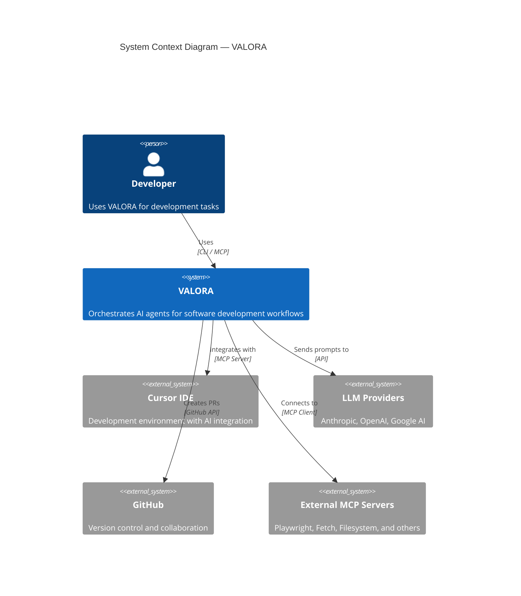
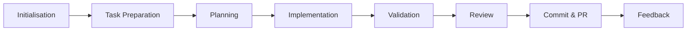

# VALORA Documentation

Valora is a TypeScript CLI tool that orchestrates 11 specialised AI agents across 24 commands to automate the software development lifecycle.

## Navigation

| Guide                                          | Audience     | Contents                                        |
| ---------------------------------------------- | ------------ | ----------------------------------------------- |
| [User Guide](./user-guide/README.md)           | Users        | Quick start, workflows, commands, configuration |
| [Developer Guide](./developer-guide/README.md) | Contributors | Setup, codebase, coding standards, testing      |
| [Architecture](./architecture/README.md)       | Architects   | C4 diagrams, components, data flow              |
| [API Reference](./api-reference/README.md)     | Integrators  | CLI flags, MCP tools, TypeScript API            |
| [Operations](./operations/README.md)           | Operators    | Deployment, monitoring, maintenance             |
| [ADRs](./adr/README.md)                        | All          | Architecture decisions and rationale            |

## Getting Started

- **Using Valora** → [Quick Start](./user-guide/quick-start.md)
- **Contributing to Valora** → [Development Setup](./developer-guide/setup.md)
- **Understanding how it works** → [System Architecture](./architecture/system-architecture.md)

---

<details>
<summary><strong>System overview</strong></summary>



### Architecture layers

| Layer                   | Components                      | Responsibility                            |
| ----------------------- | ------------------------------- | ----------------------------------------- |
| **CLI Layer**           | Commands, Flags, Wizard         | User interaction and command parsing      |
| **Orchestration Layer** | Pipeline, Executor, Coordinator | Workflow execution and state management   |
| **Agent Layer**         | Registry, Loader, Selection     | AI agent management and dynamic selection |
| **LLM Layer**           | Providers, Registry             | Multi-provider LLM integration            |
| **External MCP Layer**  | Client Manager, Approval, Audit | External MCP server integration           |
| **Service Layer**       | Session, Config, Cleanup        | Cross-cutting concerns                    |

</details>

<details>
<summary><strong>Development lifecycle phases</strong></summary>

Valora implements an 8-phase development lifecycle:



| Phase            | Purpose                        | Key Commands                                    |
| ---------------- | ------------------------------ | ----------------------------------------------- |
| Initialisation   | Define scope, gather context   | `refine-specs`, `create-prd`, `create-backlog`  |
| Task Preparation | Fetch and contextualise tasks  | `fetch-task`, `refine-task`, `gather-knowledge` |
| Planning         | Design implementation strategy | `plan`, `review-plan`                           |
| Implementation   | Execute code changes           | `implement`                                     |
| Validation       | Verify correctness             | `assert`, `test`                                |
| Review           | Quality assurance              | `review-code`, `review-functional`              |
| Commit & PR      | Finalise and merge             | `commit`, `create-pr`                           |
| Feedback         | Continuous improvement         | `feedback`                                      |

</details>

<details>
<summary><strong>Agent ecosystem</strong></summary>

| Agent                                           | Domain         | Role                                       |
| ----------------------------------------------- | -------------- | ------------------------------------------ |
| **lead**                                        | Leadership     | Technical oversight, architecture, reviews |
| **product-manager**                             | Product        | Requirements, backlog, prioritisation      |
| **software-engineer-typescript**                | Engineering    | General TypeScript development             |
| **software-engineer-typescript-backend**        | Backend        | APIs, databases, Node.js                   |
| **software-engineer-typescript-frontend**       | Frontend       | React, Vue, Svelte                         |
| **software-engineer-typescript-frontend-react** | React          | React/Next.js specialisation               |
| **platform-engineer**                           | Infrastructure | DevOps, cloud, Kubernetes                  |
| **qa**                                          | Quality        | Testing, automation                        |
| **asserter**                                    | Validation     | Completeness checking                      |
| **secops-engineer**                             | Security       | Compliance, threat detection               |
| **ui-ux-designer**                              | Design         | UI/UX, accessibility                       |

</details>

<details>
<summary><strong>Workflow optimisations</strong></summary>

Valora includes 7 workflow optimisations that reduce development time by up to 32%:

| Optimisation            | Time Savings       | Target Adoption     |
| ----------------------- | ------------------ | ------------------- |
| **Plan Templates**      | 8–10 min/plan      | 40% of plans        |
| **Early Exit Reviews**  | 10–15 min/review   | 30% of reviews      |
| **Express Planning**    | 10–12 min/plan     | 15% of plans        |
| **Parallel Validation** | 12–15 min/review   | All reviews         |
| **Real-Time Linting**   | 3–5 min/workflow   | All implementations |
| **Decision Criteria**   | 5–8 min/review     | All reviews         |
| **Technical Defaults**  | 12–15 min/workflow | All workflows       |

**Baseline workflow**: 3h 12m → **Optimised**: ~2h 10m (32% reduction)

See [Metrics Guide](./user-guide/metrics.md) for details.

</details>

<details>
<summary><strong>Documentation structure</strong></summary>

```
documentation/
├── README.md                        # This file — main entry point
├── user-guide/
│   ├── README.md                    # User guide overview
│   ├── quick-start.md               # Getting started quickly
│   ├── workflows.md                 # Development workflows
│   ├── commands.md                  # Command reference
│   ├── dry-run-mode.md              # Preview changes
│   ├── metrics.md                   # Workflow optimisation metrics
│   ├── metrics-quickstart.md        # 5-minute metrics setup
│   ├── configuration.md             # Configuration and customisation
│   ├── best-practices.md            # Recommended usage patterns
│   └── troubleshooting.md           # Common issues and solutions
├── developer-guide/
│   ├── README.md                    # Developer guide overview
│   ├── setup.md                     # Development environment setup
│   ├── codebase.md                  # Codebase structure
│   ├── contributing.md              # Contribution guidelines
│   ├── code-quality.md              # Code quality standards
│   ├── CODE-QUALITY-GUIDELINES.md   # Detailed quality guidelines
│   └── LANGUAGE_CONVENTION.md       # Language usage conventions
├── architecture/
│   ├── README.md                    # Architecture overview
│   ├── system-architecture.md       # System-level design
│   ├── components.md                # Component architecture
│   ├── data-flow.md                 # Data flow diagrams
│   ├── session-optimization.md      # Session performance
│   ├── metrics-system.md            # Metrics collection architecture
│   └── metrics-dashboard.md         # Metrics tracking reference
├── api-reference/
│   └── README.md                    # CLI, MCP, and TypeScript APIs
├── operations/
│   ├── README.md                    # Deployment and maintenance
│   ├── pipeline-resilience.md       # Pipeline error handling
│   └── automated-reporting.md       # Automated metrics reporting
├── adr/
│   ├── README.md                    # ADR index
│   ├── 001-multi-agent-architecture.md
│   ├── 002-three-tier-execution.md
│   ├── 003-session-based-state.md
│   ├── 004-pipeline-execution-model.md
│   ├── 005-llm-provider-abstraction.md
│   ├── 006-automatic-context-flush.md
│   ├── 007-persistent-stage-output-caching.md
│   ├── 008-pretooluse-cli-enforcement.md
│   └── 009-supply-chain-hardening.md
└── design/
    ├── DESIGN.md                    # Design philosophy
    └── LOGO.md                      # Logo rationale
```

</details>

---

**Version**: 2.3.4 · **Licence**: MIT · [Contributing](./developer-guide/contributing.md)
