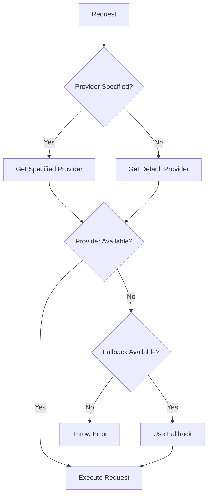

# ADR-005: LLM Provider Abstraction

## Status

Accepted

## Context

VALORA needs to support multiple LLM providers:

1. **Anthropic**: Claude models (Haiku, Sonnet, Opus)
2. **OpenAI**: GPT models (GPT-4, GPT-5)
3. **Google AI**: Gemini models
4. **Cursor**: IDE-integrated AI (via MCP)

Each provider has different:

- API interfaces and authentication
- Response formats
- Capabilities (streaming, tool use, etc.)
- Pricing and rate limits
- Error handling requirements

The engine should be **vendor-agnostic** and allow users to:

- Switch providers without code changes
- Use different providers for different commands
- Add new providers without modifying core code

## Decision

We will implement an **LLM Provider Abstraction** layer with:

### Provider Interface

```typescript
interface LLMProvider {
	// Identity
	readonly name: string;
	readonly displayName: string;

	// Core Operations
	sendPrompt(prompt: string, options?: LLMOptions): Promise<LLMResponse>;
	sendStreamingPrompt(prompt: string, options?: LLMOptions): AsyncGenerator<string>;

	// Configuration
	isConfigured(): boolean;
	getModel(): string;
	getCapabilities(): ProviderCapabilities;

	// Health
	healthCheck(): Promise<HealthStatus>;
}
```

### Provider Registry

```typescript
class LLMProviderRegistry {
	private providers: Map<string, LLMProvider>;

	register(provider: LLMProvider): void;
	getProvider(name: string): LLMProvider;
	getDefaultProvider(): LLMProvider;
	listAvailable(): string[];
}
```

### Response Normalisation

All providers return normalised responses:

```typescript
interface LLMResponse {
	content: string;
	model: string;
	usage?: {
		inputTokens: number;
		outputTokens: number;
		cacheCreationInputTokens?: number;
		cacheReadInputTokens?: number;
		batch_discount_applied?: boolean;
	};
	metadata?: Record<string, unknown>;
}
```

Cache usage fields are optional and populated by providers that support prompt caching (see below).

### Provider Selection



## Prompt Caching

Each provider implements prompt caching according to its API's capabilities. Cache metrics are normalised into the shared `LLMUsage` type (`cache_creation_input_tokens`, `cache_read_input_tokens`) so the CLI layer and cost estimator can display cache hit rates and savings regardless of provider.

| Provider      | Caching Mechanism                                                                   | Opt-In Required                                 | Cache Pricing                                  |
| ------------- | ----------------------------------------------------------------------------------- | ----------------------------------------------- | ---------------------------------------------- |
| **Anthropic** | Explicit `cache_control` breakpoints on system prompt, tools, and last user message | Yes — `prompt_caching: true` in provider config | Write: 1.25× input, Read: 0.1× input (90% off) |
| **OpenAI**    | Automatic prompt caching                                                            | No — metrics extracted automatically            | Read: 0.5× input (50% off), no write surcharge |
| **Google**    | Context caching                                                                     | No — metrics extracted automatically            | Read: 0.25× input (75% off)                    |
| **Cursor**    | N/A (MCP protocol)                                                                  | N/A                                             | N/A                                            |

### Anthropic Cache Strategy

When `prompt_caching` is enabled, the Anthropic provider injects up to 3 `cache_control: { type: "ephemeral" }` breakpoints:

1. **System prompt** — converted from string to `TextBlockParam[]` (skipped if below 1 024 estimated tokens)
2. **Last tool definition** — caches the full tool schema
3. **Last user message before the final turn** — caches the conversation history

This leaves 1 of 4 allowed breakpoints free for future extension.

### OpenAI & Google Cache Extraction

These providers extract cache metrics from API responses without requiring explicit breakpoints:

- **OpenAI**: Reads `prompt_tokens_details.cached_tokens` from `CompletionUsage`
- **Google**: Reads `cachedContentTokenCount` from `usageMetadata`

## Batch API

Each provider that supports a batch API implements the `BatchableProvider` interface (defined in `src/batch/batch-provider.interface.ts`). Batch processing reduces token costs by ~50% in exchange for asynchronous execution (24-hour window).

```typescript
interface BatchableProvider extends LLMProvider {
	supportsBatch(): true;
	submitBatch(requests: BatchRequest[]): Promise<BatchSubmission>;
	getBatchStatus(batchId: string): Promise<BatchStatusInfo>;
	getBatchResults(batchId: string): Promise<BatchResult[]>;
	cancelBatch(batchId: string): Promise<void>;
}
```

The `isBatchableProvider()` type guard performs a runtime check so the stage executor can route eligible stages through the batch path without knowing which provider is active.

| Provider      | Batch API                                | Discount | `supportsBatch()` |
| ------------- | ---------------------------------------- | -------- | ----------------- |
| **Anthropic** | Message Batches (`/v1/messages/batches`) | ~50%     | `true`            |
| **OpenAI**    | Batch API (`/v1/batches`)                | ~50%     | `true`            |
| **Google**    | Vertex AI (not yet implemented)          | ~50%     | `false`           |
| **Cursor**    | Not supported                            | —        | N/A               |

Batch results include `batch_discount_applied: true` on the `LLMUsage` object so cost reporting can distinguish batch from real-time calls.

## Consequences

### Positive

- **Vendor Independence**: Not locked to any provider
- **Easy Switching**: Change providers via configuration
- **Consistent Interface**: Same code works with all providers
- **Extensibility**: New providers easily added
- **Optimisation**: Use best provider for each task
- **Cost Reduction**: Prompt caching reduces input token costs by up to 90%

### Negative

- **Lowest Common Denominator**: Can't use provider-specific features
- **Abstraction Leakage**: Some provider differences leak through
- **Maintenance**: Each provider needs updates
- **Testing**: More combinations to test

### Neutral

- **Configuration Complexity**: Users must understand providers
- **Error Mapping**: Provider errors need normalisation

## Provider Implementations

### Anthropic Provider

```typescript
class AnthropicProvider implements LLMProvider {
	private client: Anthropic;

	async sendPrompt(prompt: string, options?: LLMOptions): Promise<LLMResponse> {
		const response = await this.client.messages.create({
			model: options?.model ?? this.defaultModel,
			max_tokens: options?.maxTokens ?? 4096,
			messages: [{ role: 'user', content: prompt }]
		});

		return this.normaliseResponse(response);
	}
}
```

### OpenAI Provider

```typescript
class OpenAIProvider implements LLMProvider {
	private client: OpenAI;

	async sendPrompt(prompt: string, options?: LLMOptions): Promise<LLMResponse> {
		const response = await this.client.chat.completions.create({
			model: options?.model ?? this.defaultModel,
			messages: [{ role: 'user', content: prompt }]
		});

		return this.normaliseResponse(response);
	}
}
```

### Cursor Provider

```typescript
class CursorProvider implements LLMProvider {
	async sendPrompt(prompt: string): Promise<LLMResponse> {
		// Generate guided completion prompt
		return {
			content: this.formatGuidedPrompt(prompt),
			model: 'cursor-guided',
			metadata: { mode: 'guided-completion' }
		};
	}
}
```

## Model Assignment

Commands specify preferred models:

```json
{
	"plan": { "model": "gpt-5-thinking-high" },
	"implement": { "model": "claude-sonnet-4.5" },
	"test": { "model": "claude-haiku-4.5" }
}
```

Model tiers optimise cost and quality:

| Tier      | Models              | Use Case                |
| --------- | ------------------- | ----------------------- |
| Strategic | GPT-5 Thinking High | Deep analysis, planning |
| Execution | Claude Sonnet 4.5   | Implementation, reviews |
| Fast      | Claude Haiku 4.5    | Quick tasks, validation |

## Alternatives Considered

### Alternative 1: Direct SDK Usage

Use provider SDKs directly throughout codebase.

**Rejected because**:

- Vendor lock-in
- Code duplication
- Difficult to switch providers

### Alternative 2: Third-Party Abstraction (LangChain)

Use LangChain or similar library.

**Rejected because**:

- Heavy dependency
- Limited control
- Unnecessary features

### Alternative 3: OpenAI-Compatible API Only

Only support OpenAI-compatible APIs.

**Rejected because**:

- Excludes Anthropic native API
- Limits provider choice
- Feature limitations

## Configuration

Provider configuration in `config.json`:

```json
{
	"providers": {
		"anthropic": {
			"enabled": true,
			"models": {
				"haiku": "claude-3-haiku-20240307",
				"sonnet": "claude-3-5-sonnet-20241022"
			}
		},
		"openai": {
			"enabled": true,
			"models": {
				"gpt5": "gpt-5-turbo"
			}
		}
	},
	"defaults": {
		"default_provider": "anthropic"
	}
}
```

## References

- [Provider Interface](../../.bin/src/llm/provider.interface.ts)
- [Provider Registry](../../.bin/src/llm/registry.ts)
- [Anthropic Provider](../../.bin/src/llm/providers/anthropic.provider.ts)
- [OpenAI Provider](../../.bin/src/llm/providers/openai.provider.ts)
