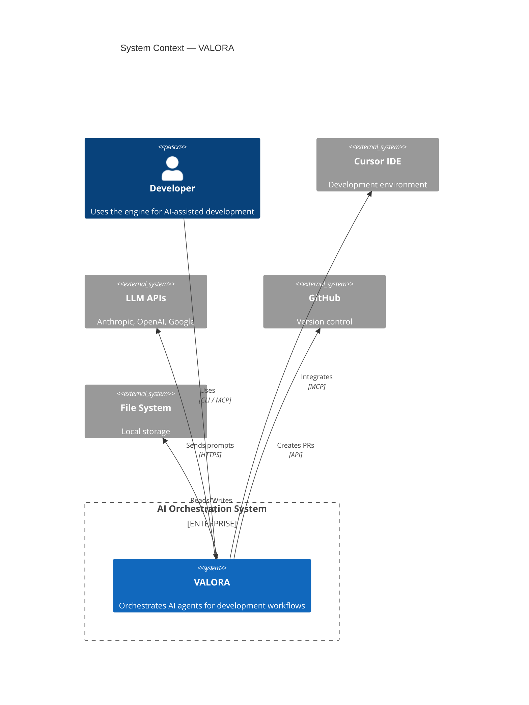
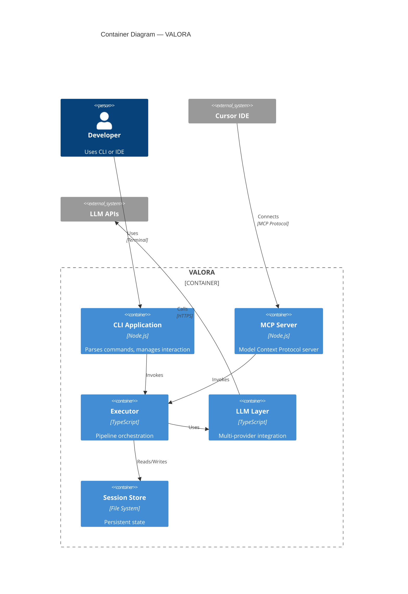
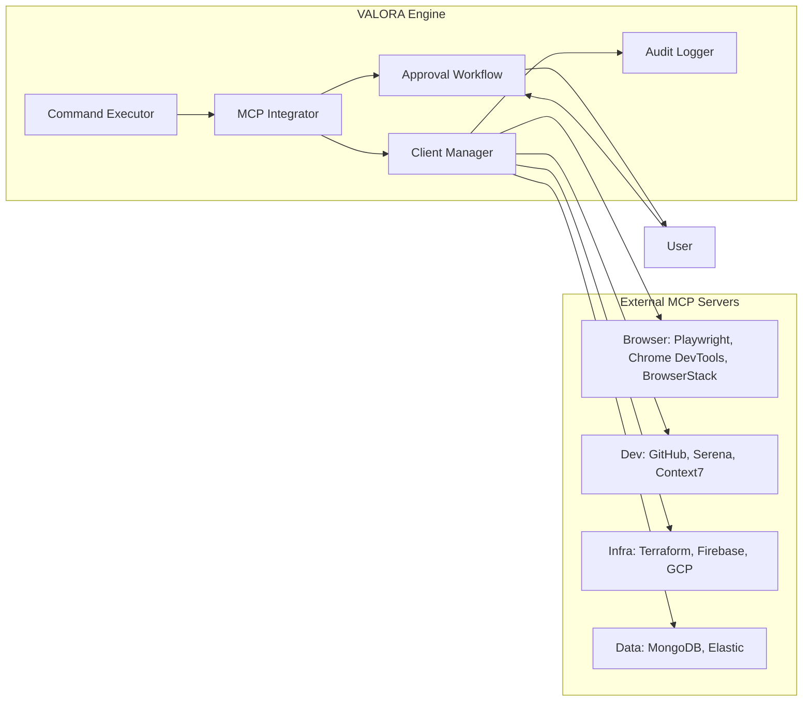

# Architecture

Valora follows a modular, layered architecture built on five core principles:

| Principle         | Description                                     |
| ----------------- | ----------------------------------------------- |
| **Modularity**    | Loosely coupled modules with clear interfaces   |
| **Extensibility** | Easy to add new agents, commands, and providers |
| **Testability**   | All components designed for testing             |
| **Observability** | Comprehensive logging and metrics               |
| **Resilience**    | Graceful error handling and recovery            |

## Contents

| Document                                          | Purpose                                   |
| ------------------------------------------------- | ----------------------------------------- |
| [System Architecture](./system-architecture.md)   | High-level system design — start here     |
| [Component Architecture](./components.md)         | Module-level design                       |
| [Data Flow](./data-flow.md)                       | Data and control flow diagrams            |
| [Session Optimisation](./session-optimization.md) | Session-based performance optimisations   |
| [Metrics System](./metrics-system.md)             | Workflow metrics collection and reporting |
| [Metrics Dashboard](./metrics-dashboard.md)       | Metrics tracking reference                |
| [ADRs](../adr/README.md)                          | Architecture decisions and rationale      |

---

## System Context

## Container Architecture

---

<strong>External MCP client architecture</strong>

Valora connects to 15 external MCP servers as a client, with user approval for each connection.

| Component              | Responsibility                                       |
| ---------------------- | ---------------------------------------------------- |
| **MCP Client Manager** | Connection lifecycle, tool discovery, caching        |
| **Approval Workflow**  | Interactive user approval with risk assessment       |
| **Approval Cache**     | Session/persistent approval memory                   |
| **Audit Logger**       | Security logging of all MCP operations               |
| **Tool Proxy**         | Timeout enforcement, risk assessment, error handling |

<strong>Key architectural decisions</strong>

| Decision                   | Rationale                                       |
| -------------------------- | ----------------------------------------------- |
| Multi-agent architecture   | Specialisation improves output quality          |
| Three-tier execution       | Flexibility for different use cases and budgets |
| Session-based state        | Context preservation across commands            |
| Pipeline-based execution   | Composable, testable workflows                  |
| Provider abstraction       | LLM vendor independence                         |
| External MCP with approval | Security-first external tool integration        |

See [Architecture Decision Records](../adr/README.md) for the full rationale behind each decision.

<strong>Technology stack</strong>

| Component       | Technology | Version  |
| --------------- | ---------- | -------- |
| Runtime         | Node.js    | >=18.0.0 |
| Language        | TypeScript | 5.x      |
| Package manager | npm / pnpm | 10.x     |

| Category        | Library                   | Purpose                 |
| --------------- | ------------------------- | ----------------------- |
| CLI             | Commander                 | Command parsing         |
| UI              | Ink, Chalk                | Terminal UI             |
| Validation      | Zod                       | Schema validation       |
| LLM — Anthropic | @anthropic-ai/sdk         | Claude integration      |
| LLM — OpenAI    | openai                    | GPT integration         |
| LLM — Google    | @google/generative-ai     | Gemini integration      |
| MCP             | @modelcontextprotocol/sdk | Protocol implementation |
| Testing         | Vitest                    | Unit/integration        |
| E2E testing     | Playwright                | End-to-end              |

<strong>Quality attributes</strong>

### Performance

- Sub-second CLI response time
- Streaming LLM responses
- Efficient session serialisation
- Persistent stage output caching (2–3 min savings per context load)

### Reliability

- Graceful provider fallback
- Session recovery on restart
- Comprehensive error handling

### Maintainability

- Modular architecture
- High test coverage

### Security

- No credential storage in code
- Environment-based configuration
- Input validation with Zod

