# Component Architecture

> Component-level design details for each major module in VALORA.

## Component Overview

| Layer            | Key Components                                                                         | Source Files                                                              |
| ---------------- | -------------------------------------------------------------------------------------- | ------------------------------------------------------------------------- |
| CLI              | Command Parser, Resolver, Executor, Wizard, Result Presenter, Error Handler            | `index.ts`, `command-resolver.ts`, `command-executor.ts`                  |
| Orchestration    | Pipeline, Stage Executor, Execution Context, Stage Scheduler, Variable Resolver        | `pipeline.ts`, `stage-executor.ts`, `variable-resolution.service.ts`      |
| Agent            | Agent Registry, Loader, Selector, Command Discovery, Prompt Loader                     | `agent-loader.ts`, `command-loader.ts`, `prompt-loader.ts`                |
| LLM              | Provider Registry, Anthropic/OpenAI/Google/Cursor Providers, Token Estimator           | `providers/`, `utils/token-estimator.ts`, `utils/spending-tracker.ts`     |
| Exploration      | Orchestrator, Collaboration Coordinator, Worktree Manager, Merge Orchestrator          | `orchestrator.ts`, `worktree-manager.ts`, `merge-orchestrator.ts`         |
| Session          | Session Service, Repository, Worktree Stats Tracker                                    | `lifecycle.ts`, `store.ts`, `worktree-stats-tracker.ts`                   |
| MCP              | Server, Tool Handler, Prompt Handler, Discovery Service, Health Service                | `mcp/server.ts`, `tool-handler.ts`, `discovery.ts`                        |
| Configuration    | Config Loader, Schema Validator (Zod), Provider Config                                 | `config-loader.ts`, `providers.ts`                                        |
| Context Mgmt     | Flush Manager, Threshold Monitor, Summarisation Service, Checkpoint Service            | `context-flush-manager.ts`, `context-summarization.service.ts`            |
| Security         | Credential Guard, Command Guard, Injection Detector, Tool Validator, Integrity Monitor | `credential-guard.ts`, `command-guard.ts`, `prompt-injection-detector.ts` |
| AST Intelligence | AST Parser, Index Service, Query Service, Context Service, AST Tools                   | `ast-parser.service.ts`, `ast-index.service.ts`, `ast-tools.service.ts`   |
| LSP Integration  | LSP Client, Client Manager, LSP Tools, Result Cache, Context Enricher                  | `lsp-client.ts`, `lsp-client-manager.service.ts`, `lsp-tools.service.ts`  |

---

## CLI Components


```mermaid
C4Component
    title Component Diagram - CLI Layer

    Container_Boundary(cli, "CLI Layer") {
        Component(parser, "Command Parser", "Commander.js", "Parses CLI arguments")
        Component(resolver, "Command Resolver", "TypeScript", "Resolves command specs")
        Component(executor, "Command Executor", "TypeScript", "Executes commands")
        Component(wizard, "Command Wizard", "Inquirer.js", "Interactive prompts")
        Component(presenter, "Result Presenter", "TypeScript", "Formats output")
        Component(handler, "Error Handler", "TypeScript", "Handles errors")
        Component(adapter, "Commander Adapter", "TypeScript", "Adapts Commander.js")
    }

    Rel(parser, resolver, "Resolves")
    Rel(resolver, executor, "Executes")
    Rel(executor, wizard, "May invoke")
    Rel(executor, presenter, "Presents")
    Rel(executor, handler, "Catches")
    Rel(parser, adapter, "Uses")
```

| Component         | File                       | Responsibility                            |
| ----------------- | -------------------------- | ----------------------------------------- |
| Command Parser    | `index.ts`                 | Entry point, sets up Commander.js         |
| Command Resolver  | `command-resolver.ts`      | Loads and resolves command specifications |
| Command Executor  | `command-executor.ts`      | Orchestrates command execution            |
| Command Wizard    | `command-wizard.ts`        | Interactive command configuration         |
| Result Presenter  | `result-presenter.ts`      | Formats and displays results              |
| Error Handler     | `command-error-handler.ts` | Converts errors to user messages          |
| Commander Adapter | `commander-adapter.ts`     | Abstracts Commander.js                    |

---

## Orchestration Components

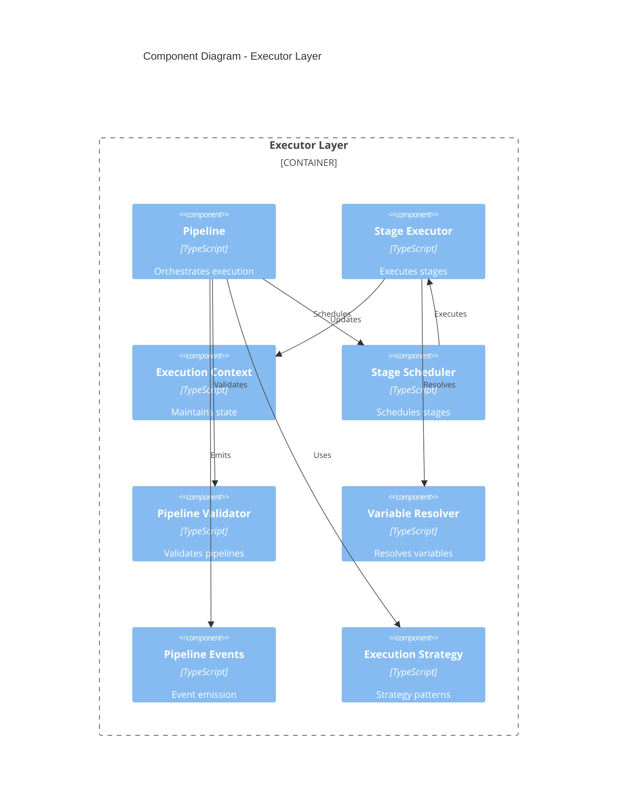
```mermaid
C4Component
    title Component Diagram - Executor Layer

    Container_Boundary(exec, "Executor Layer") {
        Component(pipeline, "Pipeline", "TypeScript", "Orchestrates execution")
        Component(stage, "Stage Executor", "TypeScript", "Executes stages")
        Component(context, "Execution Context", "TypeScript", "Maintains state")
        Component(scheduler, "Stage Scheduler", "TypeScript", "Schedules stages")
        Component(validator, "Pipeline Validator", "TypeScript", "Validates pipelines")
        Component(variables, "Variable Resolver", "TypeScript", "Resolves variables")
        Component(events, "Pipeline Events", "TypeScript", "Event emission")
        Component(strategy, "Execution Strategy", "TypeScript", "Strategy patterns")
    }

    Rel(pipeline, scheduler, "Schedules")
    Rel(scheduler, stage, "Executes")
    Rel(stage, context, "Updates")
    Rel(pipeline, validator, "Validates")
    Rel(stage, variables, "Resolves")
    Rel(pipeline, events, "Emits")
    Rel(pipeline, strategy, "Uses")
```

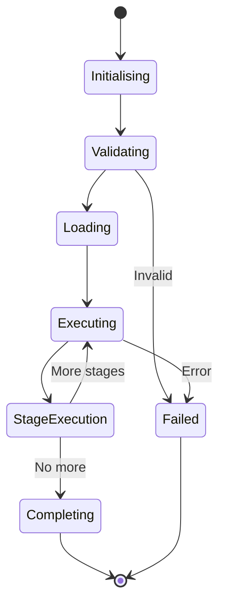
```mermaid
stateDiagram-v2
    [*] --> Initialising
    Initialising --> Validating
    Validating --> Loading
    Loading --> Executing
    Executing --> StageExecution
    StageExecution --> Executing: More stages
    StageExecution --> Completing: No more
    Completing --> [*]

    Validating --> Failed: Invalid
    Executing --> Failed: Error
    Failed --> [*]
```

| Component          | File                             | Responsibility                  |
| ------------------ | -------------------------------- | ------------------------------- |
| Pipeline           | `pipeline.ts`                    | Main orchestration logic        |
| Stage Executor     | `stage-executor.ts`              | Execute individual stages       |
| Execution Context  | `execution-context.ts`           | State container                 |
| Stage Scheduler    | `stage-scheduler.ts`             | Schedule parallel/sequential    |
| Pipeline Validator | `pipeline-validator.ts`          | Validate pipeline structure     |
| Variable Resolver  | `variable-resolution.service.ts` | Template variable resolution    |
| Pipeline Events    | `pipeline-events.ts`             | Event definitions and emission  |
| Execution Strategy | `execution-strategy.ts`          | Strategy pattern implementation |

---

## Agent Components

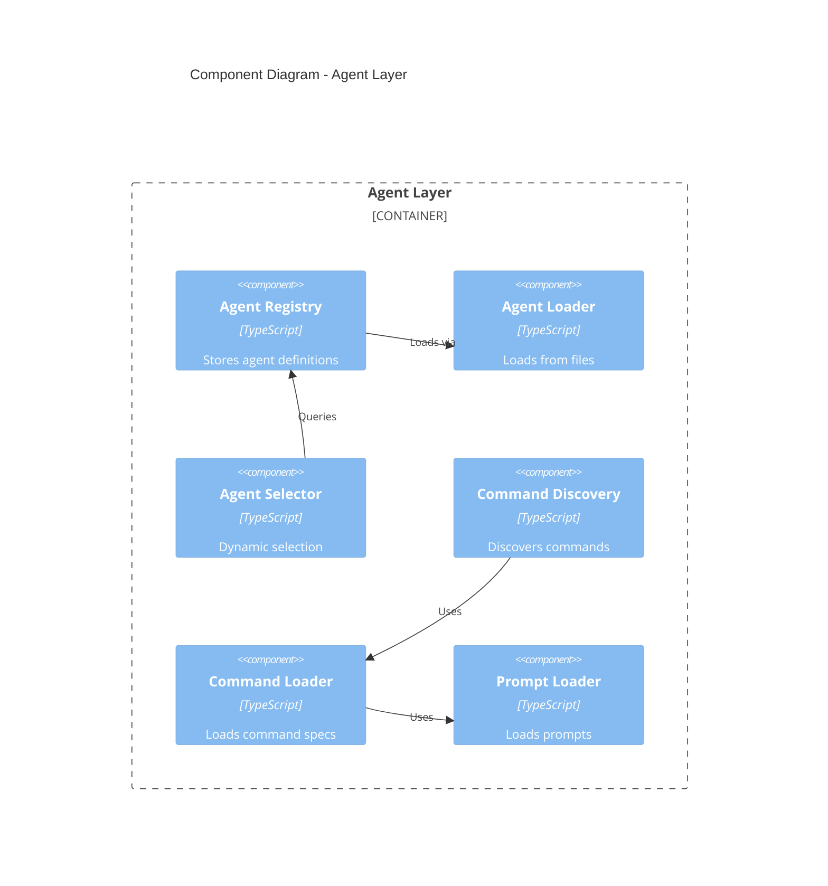
```mermaid
C4Component
    title Component Diagram - Agent Layer

    Container_Boundary(agent, "Agent Layer") {
        Component(registry, "Agent Registry", "TypeScript", "Stores agent definitions")
        Component(loader, "Agent Loader", "TypeScript", "Loads from files")
        Component(selector, "Agent Selector", "TypeScript", "Dynamic selection")
        Component(discovery, "Command Discovery", "TypeScript", "Discovers commands")
        Component(cmd_loader, "Command Loader", "TypeScript", "Loads command specs")
        Component(prompt_loader, "Prompt Loader", "TypeScript", "Loads prompts")
    }

    Rel(registry, loader, "Loads via")
    Rel(selector, registry, "Queries")
    Rel(discovery, cmd_loader, "Uses")
    Rel(cmd_loader, prompt_loader, "Uses")
```

### Agent Selection Algorithm

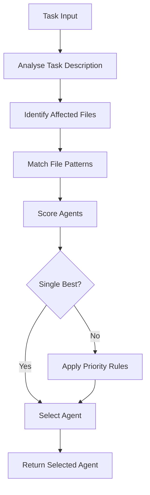
```mermaid
flowchart TD
    A[Task Input] --> B[Analyse Task Description]
    B --> C[Identify Affected Files]
    C --> D[Match File Patterns]
    D --> E[Score Agents]
    E --> F{Single Best?}
    F -->|Yes| G[Select Agent]
    F -->|No| H[Apply Priority Rules]
    H --> G
    G --> I[Return Selected Agent]
```

| Component         | File                    | Responsibility              |
| ----------------- | ----------------------- | --------------------------- |
| Agent Registry    | Part of config          | Agent capability storage    |
| Agent Loader      | `agent-loader.ts`       | Load agent markdown files   |
| Agent Selector    | Dynamic selection logic | Select best agent for task  |
| Command Discovery | `command-discovery.ts`  | Discover available commands |
| Command Loader    | `command-loader.ts`     | Load command specifications |
| Prompt Loader     | `prompt-loader.ts`      | Load prompt templates       |

---

## LLM Components

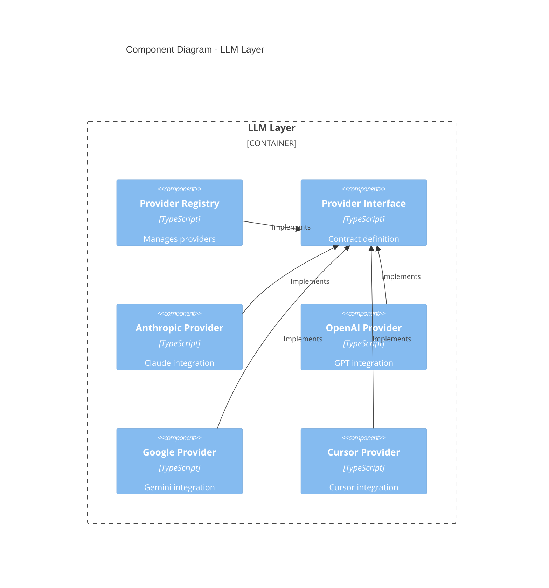
```mermaid
C4Component
    title Component Diagram - LLM Layer

    Container_Boundary(llm, "LLM Layer") {
        Component(registry, "Provider Registry", "TypeScript", "Manages providers")
        Component(interface, "Provider Interface", "TypeScript", "Contract definition")
        Component(anthropic, "Anthropic Provider", "TypeScript", "Claude integration")
        Component(openai, "OpenAI Provider", "TypeScript", "GPT integration")
        Component(google, "Google Provider", "TypeScript", "Gemini integration")
        Component(cursor, "Cursor Provider", "TypeScript", "Cursor integration")
    }

    Rel(registry, interface, "Implements")
    Rel(anthropic, interface, "Implements")
    Rel(openai, interface, "Implements")
    Rel(google, interface, "Implements")
    Rel(cursor, interface, "Implements")
```

### Provider Interface

```typescript
interface LLMProvider {
	readonly name: string;
	readonly displayName: string;

	sendPrompt(prompt: string, options?: LLMOptions): Promise<LLMResponse>;
	sendStreamingPrompt(prompt: string, options?: LLMOptions): AsyncGenerator<string>;

	isConfigured(): boolean;
	getModel(): string;
	getCapabilities(): ProviderCapabilities;
}
```

### Prompt Caching

All providers extract cache metrics into the normalised `LLMUsage` type (`cache_creation_input_tokens`, `cache_read_input_tokens`). The CLI displays cache hit rates and cost savings when these fields are present.

| Provider      | Mechanism                                                               | Config Flag            |
| ------------- | ----------------------------------------------------------------------- | ---------------------- |
| **Anthropic** | Explicit `cache_control` breakpoints (system, tools, last user message) | `prompt_caching: true` |
| **OpenAI**    | Automatic — reads `prompt_tokens_details.cached_tokens`                 | None needed            |
| **Google**    | Automatic — reads `usageMetadata.cachedContentTokenCount`               | None needed            |

### Cost Tracking

Cost information flows through three layers:

1. **Live display** — `ProcessingFeedback` (`src/output/processing-feedback.ts`) calls `calculateActualCost()` on each `LLM_RESPONSE` event and accumulates an `estimatedCostUsd` total, appended to the context-insights status bar (`~$0.xxxx`) and to each stage-completion line.

2. **Final summary** — `ResultPresenter` (`src/cli/result-presenter.ts`) receives `costUsd` and `cacheSavingsUsd` from the executor and appends them to the "Token Usage" block printed at the end of every command:

   ```
   📊 Token Usage:
      • This interaction: 48,880 tokens (~$0.0124)
        └─ Cache read: 12,000 tokens (25% hit rate, saved $0.0036)
   ```

3. **Persistent ledger** — `SpendingTracker` (`src/utils/spending-tracker.ts`) appends one `SpendingRecord` to `.valora/spending.jsonl` after each command, queried by `valora monitoring spending` and by the dashboard Spending panel.

| Component       | File                        | Responsibility                                      |
| --------------- | --------------------------- | --------------------------------------------------- |
| SpendingTracker | `utils/spending-tracker.ts` | Append-only JSONL ledger; query by endpoint or date |
| TokenEstimator  | `utils/token-estimator.ts`  | `calculateActualCost()` — pricing for all providers |

<details>
<summary><strong>Provider Selection Flow</strong></summary>

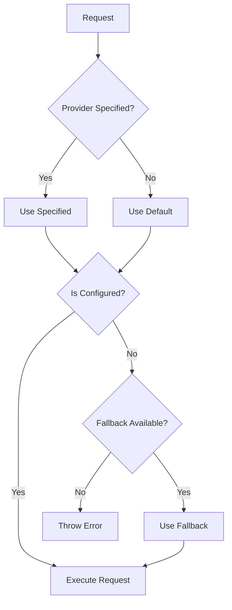
```mermaid
flowchart TD
    A[Request] --> B{Provider Specified?}
    B -->|Yes| C[Use Specified]
    B -->|No| D[Use Default]
    C --> E{Is Configured?}
    D --> E
    E -->|Yes| F[Execute Request]
    E -->|No| G{Fallback Available?}
    G -->|Yes| H[Use Fallback]
    G -->|No| I[Throw Error]
    H --> F
```

</details>

---

## Exploration Components

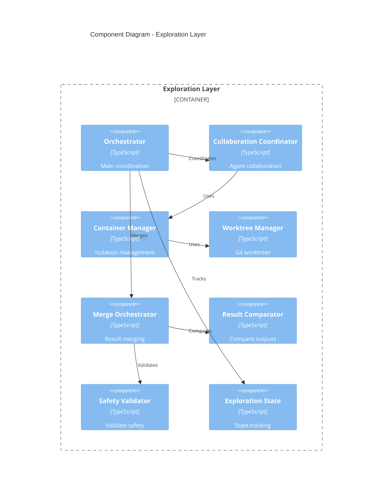
```mermaid
C4Component
    title Component Diagram - Exploration Layer

    Container_Boundary(explore, "Exploration Layer") {
        Component(orchestrator, "Orchestrator", "TypeScript", "Main coordination")
        Component(collab, "Collaboration Coordinator", "TypeScript", "Agent collaboration")
        Component(container, "Container Manager", "TypeScript", "Isolation management")
        Component(worktree, "Worktree Manager", "TypeScript", "Git worktrees")
        Component(merge, "Merge Orchestrator", "TypeScript", "Result merging")
        Component(comparator, "Result Comparator", "TypeScript", "Compare outputs")
        Component(safety, "Safety Validator", "TypeScript", "Validate safety")
        Component(state, "Exploration State", "TypeScript", "State tracking")
    }

    Rel(orchestrator, collab, "Coordinates")
    Rel(collab, container, "Uses")
    Rel(container, worktree, "Uses")
    Rel(orchestrator, merge, "Merges")
    Rel(merge, comparator, "Compares")
    Rel(merge, safety, "Validates")
    Rel(orchestrator, state, "Tracks")
```

### Parallel Exploration Flow

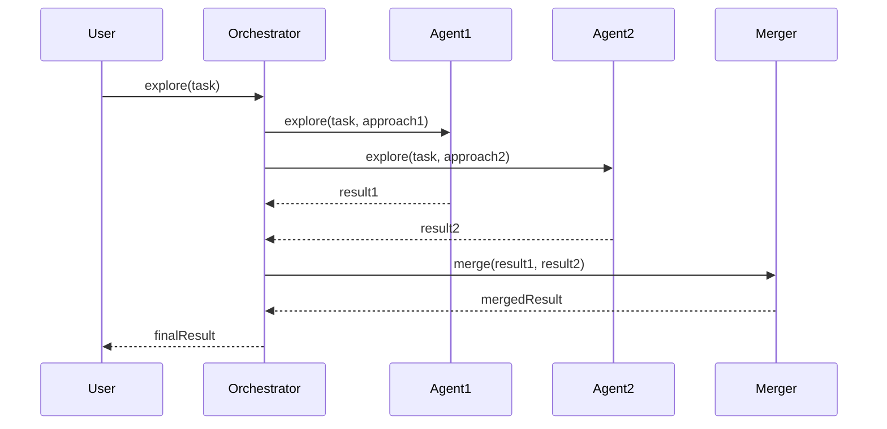
```mermaid
sequenceDiagram
    participant User
    participant Orchestrator
    participant Agent1
    participant Agent2
    participant Merger

    User->>Orchestrator: explore(task)
    Orchestrator->>Agent1: explore(task, approach1)
    Orchestrator->>Agent2: explore(task, approach2)
    Agent1-->>Orchestrator: result1
    Agent2-->>Orchestrator: result2
    Orchestrator->>Merger: merge(result1, result2)
    Merger-->>Orchestrator: mergedResult
    Orchestrator-->>User: finalResult
```

| Component                 | File                           | Responsibility                                    |
| ------------------------- | ------------------------------ | ------------------------------------------------- |
| Orchestrator              | `orchestrator.ts`              | Main exploration coordination                     |
| Collaboration Coordinator | `collaboration-coordinator.ts` | Agent collaboration management                    |
| Container Manager         | `container-manager.ts`         | Docker container isolation                        |
| Worktree Manager          | `worktree-manager.ts`          | Git worktree CRUD operations                      |
| Merge Orchestrator        | `merge-orchestrator.ts`        | Result merging strategies                         |
| Result Comparator         | `result-comparator.ts`         | Compare outputs across branches                   |
| Safety Validator          | `safety-validator.ts`          | Pre-exploration safety checks (1GB/branch memory) |
| Exploration State         | `exploration-state.ts`         | State persistence, recovery, and session linking  |
| Exploration Events        | `exploration-events.ts`        | Real-time event emitter for dashboard monitoring  |

<details>
<summary><strong>Dashboard Integration and Session-Exploration Linking</strong></summary>

The exploration layer integrates with the main dashboard (`valora dash`) through three mechanisms:

1. **Worktree Diagram Panel**: The dashboard fetches `WorktreeManager.listWorktrees()` and `ExplorationStateManager.getActiveExplorations()` in parallel, transforming them into a live tree-diagram showing all git worktrees with exploration status indicators.

2. **Exploration Info Panel**: When viewing a session linked to an exploration, the `ExplorationInfoPanel` component loads the exploration data via `ExplorationStateManager.findBySessionId()` and displays task, status, branch completion, and per-worktree details — even while the exploration is still running.

3. **Worktree Stats Tracking**: `WorktreeStatsTracker` (in `src/session/`) subscribes to `ExplorationEventEmitter` events and accumulates per-session statistics displayed in the session details view.

Explorations and sessions are bidirectionally linked:

- The `Exploration` type has a `session_id` field set immediately after the exploration is created
- Each `WorktreeExploration` also stores the `session_id`
- The session context stores `exploration_id` after the exploration completes
- `ExplorationStateManager.findBySessionId()` enables reverse lookup

</details>

---

## Session Components

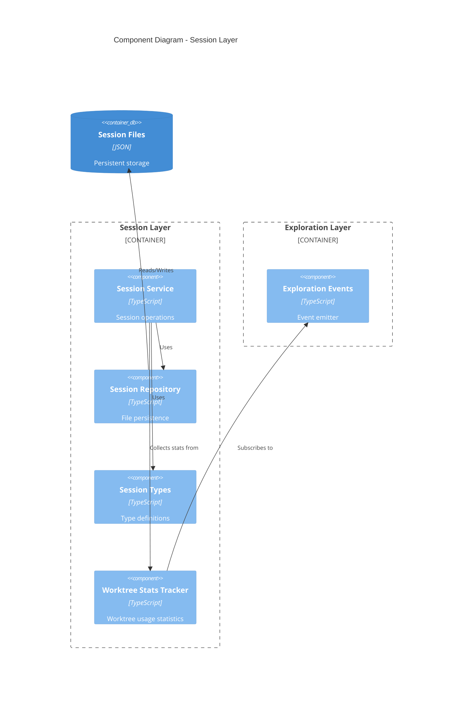
```mermaid
C4Component
    title Component Diagram - Session Layer

    Container_Boundary(session, "Session Layer") {
        Component(service, "Session Service", "TypeScript", "Session operations")
        Component(repository, "Session Repository", "TypeScript", "File persistence")
        Component(types, "Session Types", "TypeScript", "Type definitions")
        Component(worktree_tracker, "Worktree Stats Tracker", "TypeScript", "Worktree usage statistics")
    }

    Container_Boundary(exploration, "Exploration Layer") {
        Component(events, "Exploration Events", "TypeScript", "Event emitter")
    }

    ContainerDb(store, "Session Files", "JSON", "Persistent storage")

    Rel(service, repository, "Uses")
    Rel(repository, store, "Reads/Writes")
    Rel(service, types, "Uses")
    Rel(worktree_tracker, events, "Subscribes to")
    Rel(service, worktree_tracker, "Collects stats from")
```

### Session Lifecycle

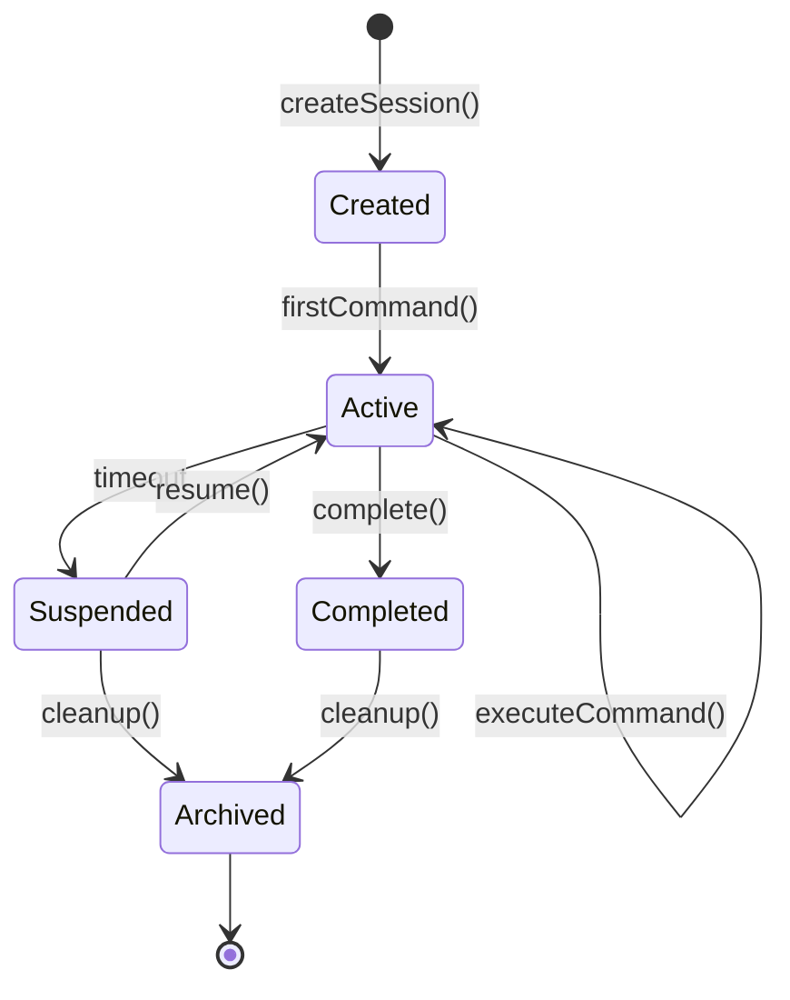
```mermaid
stateDiagram-v2
    [*] --> Created: createSession()
    Created --> Active: firstCommand()
    Active --> Active: executeCommand()
    Active --> Suspended: timeout
    Suspended --> Active: resume()
    Active --> Completed: complete()
    Suspended --> Archived: cleanup()
    Completed --> Archived: cleanup()
    Archived --> [*]
```

| Component              | File                         | Responsibility                                           |
| ---------------------- | ---------------------------- | -------------------------------------------------------- |
| Session Service        | `lifecycle.ts`, `context.ts` | Session creation, resumption, and state management       |
| Session Repository     | `store.ts`                   | File-based persistence of session data                   |
| Session Types          | `types/session.types.ts`     | Type definitions (`Session`, `WorktreeUsageStats`, etc.) |
| Worktree Stats Tracker | `worktree-stats-tracker.ts`  | Event-driven worktree usage statistics accumulation      |

<details>
<summary><strong>Worktree Stats Tracking Detail</strong></summary>

`WorktreeStatsTracker` subscribes to `ExplorationEventEmitter` and accumulates worktree usage statistics during a session:

| Event                | Action                                                        |
| -------------------- | ------------------------------------------------------------- |
| `worktree:created`   | Increment `total_created`, add to `worktree_summaries`        |
| `worktree:started`   | Track in active map, update `max_concurrent`                  |
| `worktree:completed` | Calculate duration, update `total_duration_ms`, mark complete |
| `worktree:failed`    | Same as completed but with `failed` status                    |

Worktrees that exceed the exploration timeout are marked `timed_out` and are not eligible for merging. They score 5/40 (status component) in result comparisons.

On session completion, stats are stored into `session.context['worktree_stats']` (only when `total_created > 0`).

</details>

---

## MCP Components

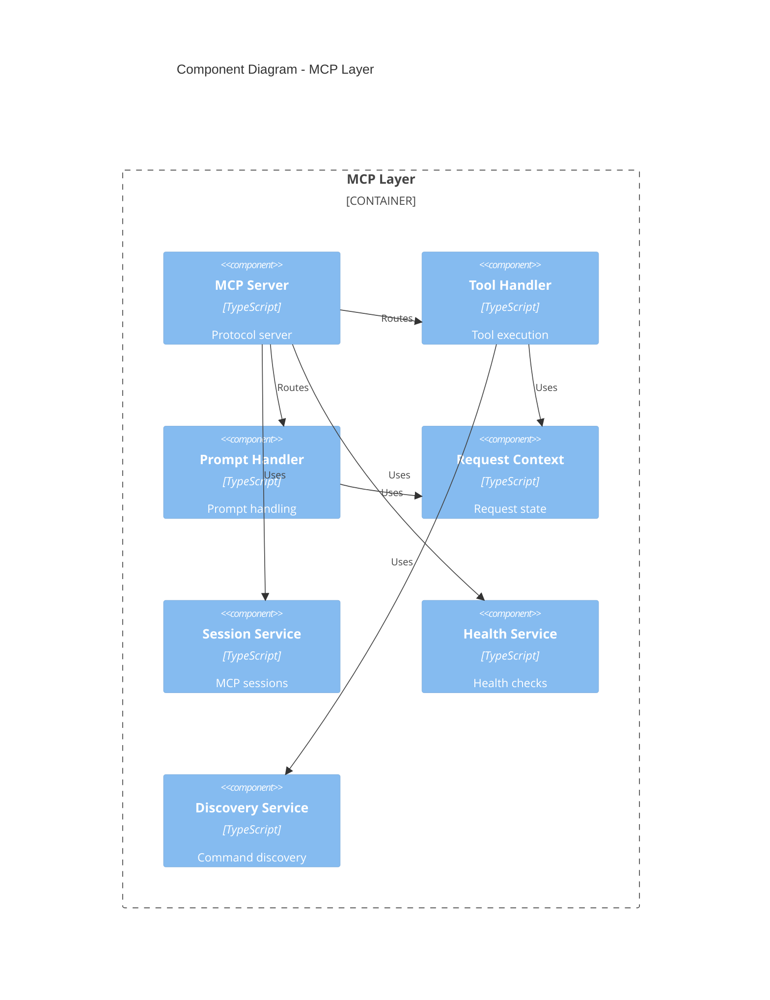
```mermaid
C4Component
    title Component Diagram - MCP Layer

    Container_Boundary(mcp, "MCP Layer") {
        Component(server, "MCP Server", "TypeScript", "Protocol server")
        Component(tool_handler, "Tool Handler", "TypeScript", "Tool execution")
        Component(prompt_handler, "Prompt Handler", "TypeScript", "Prompt handling")
        Component(context, "Request Context", "TypeScript", "Request state")
        Component(session_svc, "Session Service", "TypeScript", "MCP sessions")
        Component(health, "Health Service", "TypeScript", "Health checks")
        Component(discovery, "Discovery Service", "TypeScript", "Command discovery")
    }

    Rel(server, tool_handler, "Routes")
    Rel(server, prompt_handler, "Routes")
    Rel(tool_handler, context, "Uses")
    Rel(prompt_handler, context, "Uses")
    Rel(server, session_svc, "Uses")
    Rel(server, health, "Uses")
    Rel(tool_handler, discovery, "Uses")
```

---

## Context Management Components

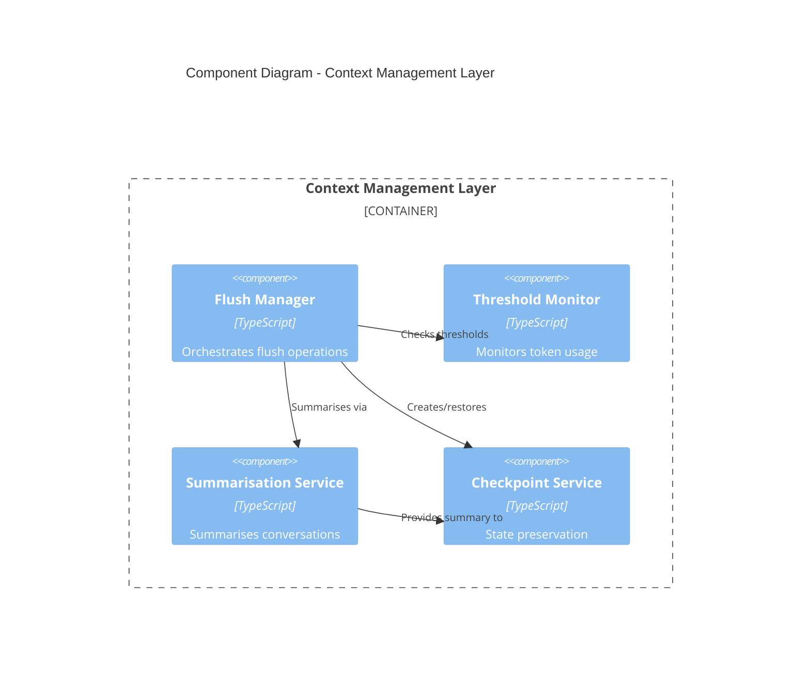
```mermaid
C4Component
    title Component Diagram - Context Management Layer

    Container_Boundary(ctx, "Context Management Layer") {
        Component(manager, "Flush Manager", "TypeScript", "Orchestrates flush operations")
        Component(monitor, "Threshold Monitor", "TypeScript", "Monitors token usage")
        Component(summariser, "Summarisation Service", "TypeScript", "Summarises conversations")
        Component(checkpoint, "Checkpoint Service", "TypeScript", "State preservation")
    }

    Rel(manager, monitor, "Checks thresholds")
    Rel(manager, summariser, "Summarises via")
    Rel(manager, checkpoint, "Creates/restores")
    Rel(summariser, checkpoint, "Provides summary to")
```

### Threshold State Machine

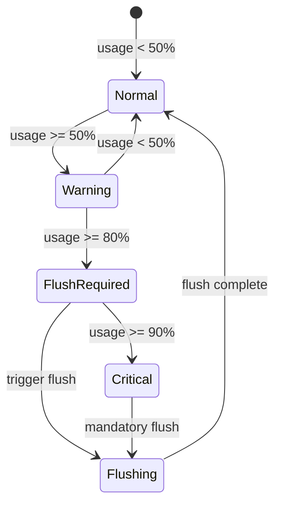
```mermaid
stateDiagram-v2
    [*] --> Normal: usage < 50%
    Normal --> Warning: usage >= 50%
    Warning --> Normal: usage < 50%
    Warning --> FlushRequired: usage >= 80%
    FlushRequired --> Flushing: trigger flush
    Flushing --> Normal: flush complete
    FlushRequired --> Critical: usage >= 90%
    Critical --> Flushing: mandatory flush
```

| Component             | File                               | Responsibility                          |
| --------------------- | ---------------------------------- | --------------------------------------- |
| Flush Manager         | `context-flush-manager.ts`         | Orchestrates flush operations           |
| Threshold Monitor     | `context-threshold-monitor.ts`     | Monitors token usage against thresholds |
| Summarisation Service | `context-summarization.service.ts` | Summarises conversation history         |
| Checkpoint Service    | `context-checkpoint.service.ts`    | Creates and restores execution state    |

### Configuration

| Constant                           | Default          | Description                       |
| ---------------------------------- | ---------------- | --------------------------------- |
| `CONTEXT_FLUSH_THRESHOLD`          | 80%              | Trigger automatic flush           |
| `CONTEXT_FLUSH_CRITICAL_THRESHOLD` | 90%              | Mandatory flush                   |
| `CONTEXT_FLUSH_WARNING_THRESHOLD`  | 50%              | Log warning                       |
| `CONTEXT_PRESERVE_TOOL_RESULTS`    | 3                | Tool results to preserve verbatim |
| `CONTEXT_SUMMARIZATION_MODEL`      | claude-haiku-4-5 | Model for summarisation           |
| `CONTEXT_MIN_TOKENS_AFTER_FLUSH`   | 10,000           | Minimum headroom after flush      |

<details>
<summary><strong>Context Flush Flow</strong></summary>

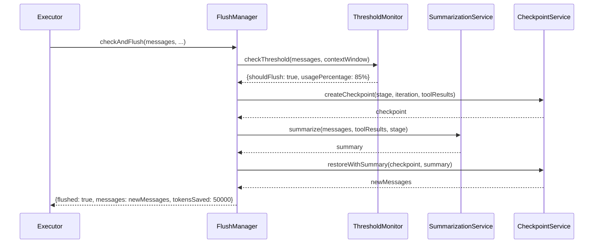
```mermaid
sequenceDiagram
    participant Executor
    participant Manager as FlushManager
    participant Monitor as ThresholdMonitor
    participant Summariser as SummarizationService
    participant Checkpoint as CheckpointService

    Executor->>Manager: checkAndFlush(messages, ...)
    Manager->>Monitor: checkThreshold(messages, contextWindow)
    Monitor-->>Manager: {shouldFlush: true, usagePercentage: 85%}
    Manager->>Checkpoint: createCheckpoint(stage, iteration, toolResults)
    Checkpoint-->>Manager: checkpoint
    Manager->>Summariser: summarize(messages, toolResults, stage)
    Summariser-->>Manager: summary
    Manager->>Checkpoint: restoreWithSummary(checkpoint, summary)
    Checkpoint-->>Manager: newMessages
    Manager-->>Executor: {flushed: true, messages: newMessages, tokensSaved: 50000}
```

</details>

---

## Security Components

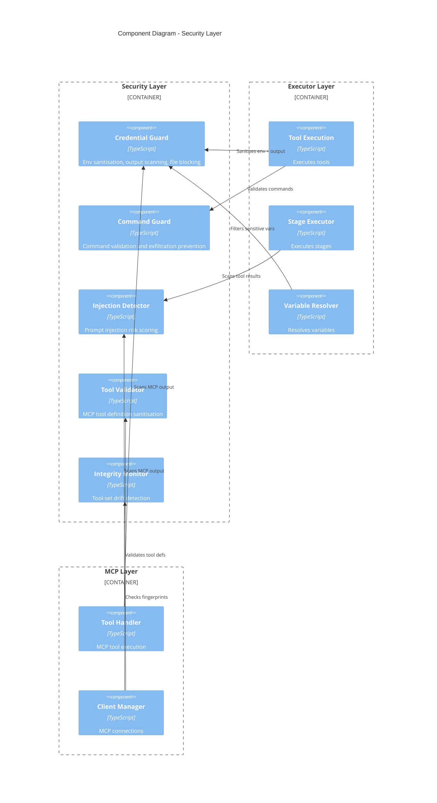
```mermaid
C4Component
    title Component Diagram - Security Layer

    Container_Boundary(sec, "Security Layer") {
        Component(cred_guard, "Credential Guard", "TypeScript", "Env sanitisation, output scanning, file blocking")
        Component(cmd_guard, "Command Guard", "TypeScript", "Command validation and exfiltration prevention")
        Component(injection, "Injection Detector", "TypeScript", "Prompt injection risk scoring")
        Component(tool_validator, "Tool Validator", "TypeScript", "MCP tool definition sanitisation")
        Component(integrity, "Integrity Monitor", "TypeScript", "Tool-set drift detection")
    }

    Container_Boundary(exec_int, "Executor Layer") {
        Component(tool_exec, "Tool Execution", "TypeScript", "Executes tools")
        Component(stage_exec, "Stage Executor", "TypeScript", "Executes stages")
        Component(variables, "Variable Resolver", "TypeScript", "Resolves variables")
    }

    Container_Boundary(mcp_int, "MCP Layer") {
        Component(mcp_handler, "Tool Handler", "TypeScript", "MCP tool execution")
        Component(mcp_client, "Client Manager", "TypeScript", "MCP connections")
    }

    Rel(tool_exec, cmd_guard, "Validates commands")
    Rel(tool_exec, cred_guard, "Sanitises env + output")
    Rel(stage_exec, injection, "Scans tool results")
    Rel(mcp_handler, cred_guard, "Scans MCP output")
    Rel(mcp_handler, injection, "Scans MCP output")
    Rel(mcp_client, tool_validator, "Validates tool defs")
    Rel(mcp_client, integrity, "Checks fingerprints")
    Rel(variables, cred_guard, "Filters sensitive vars")
```

| Component          | File                           | Responsibility                                                 |
| ------------------ | ------------------------------ | -------------------------------------------------------------- |
| Credential Guard   | `credential-guard.ts`          | Redacts sensitive env vars, scans output for leaked secrets    |
| Command Guard      | `command-guard.ts`             | Blocks network, eval, remote access, and exfiltration patterns |
| Injection Detector | `prompt-injection-detector.ts` | Weighted risk scoring with quarantine/redaction thresholds     |
| Tool Validator     | `tool-definition-validator.ts` | Validates MCP tool names, descriptions, and schema safety      |
| Integrity Monitor  | `tool-integrity-monitor.ts`    | SHA-256 fingerprinting with diff-based change detection        |

---

## AST Code Intelligence Components

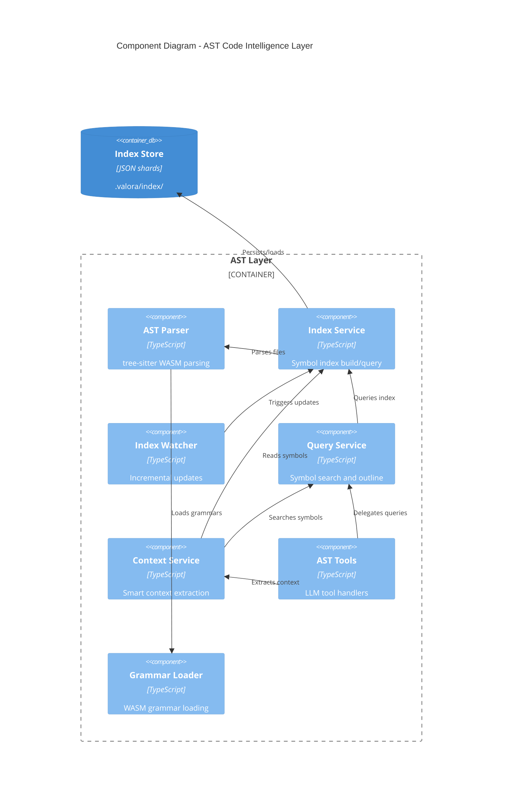
```mermaid
C4Component
    title Component Diagram - AST Code Intelligence Layer

    Container_Boundary(ast, "AST Layer") {
        Component(parser, "AST Parser", "TypeScript", "tree-sitter WASM parsing")
        Component(index, "Index Service", "TypeScript", "Symbol index build/query")
        Component(watcher, "Index Watcher", "TypeScript", "Incremental updates")
        Component(query, "Query Service", "TypeScript", "Symbol search and outline")
        Component(context, "Context Service", "TypeScript", "Smart context extraction")
        Component(tools, "AST Tools", "TypeScript", "LLM tool handlers")
        Component(grammars, "Grammar Loader", "TypeScript", "WASM grammar loading")
    }

    ContainerDb(idx_store, "Index Store", "JSON shards", ".valora/index/")

    Rel(parser, grammars, "Loads grammars")
    Rel(index, parser, "Parses files")
    Rel(index, idx_store, "Persists/loads")
    Rel(watcher, index, "Triggers updates")
    Rel(query, index, "Queries index")
    Rel(context, index, "Reads symbols")
    Rel(context, query, "Searches symbols")
    Rel(tools, query, "Delegates queries")
    Rel(tools, context, "Extracts context")
```

### Smart Context Levels

| Level             | What Is Sent                             | When Used                          |
| ----------------- | ---------------------------------------- | ---------------------------------- |
| 0 — Codebase Map  | Compact file/symbol listing              | Always in system message           |
| 1 — Signatures    | Function signatures, type definitions    | Referenced-but-not-focal files     |
| 2 — Focal symbols | Full body of directly relevant functions | Files in task inputs               |
| 3 — Full file     | Complete content                         | Only on explicit `request_context` |

| Component       | File                           | Responsibility                                                                    |
| --------------- | ------------------------------ | --------------------------------------------------------------------------------- |
| AST Parser      | `ast-parser.service.ts`        | Parse source files via tree-sitter WASM, extract symbols and imports              |
| Index Service   | `ast-index.service.ts`         | Build, persist, load, and incrementally update the codebase symbol index          |
| Index Watcher   | `ast-index-watcher.service.ts` | Watch file system for changes and trigger incremental re-indexing                 |
| Query Service   | `ast-query.service.ts`         | Fuzzy symbol search, file outline, and cross-file reference finding               |
| Context Service | `ast-context.service.ts`       | Budget-aware context extraction at multiple detail levels                         |
| AST Tools       | `ast-tools.service.ts`         | LLM tool handlers for symbol_search, file_outline, find_references, smart_context |
| Grammar Loader  | `grammars/grammar-loader.ts`   | Lazy WASM grammar loading with concurrency-safe initialisation                    |

---

## LSP Integration Components

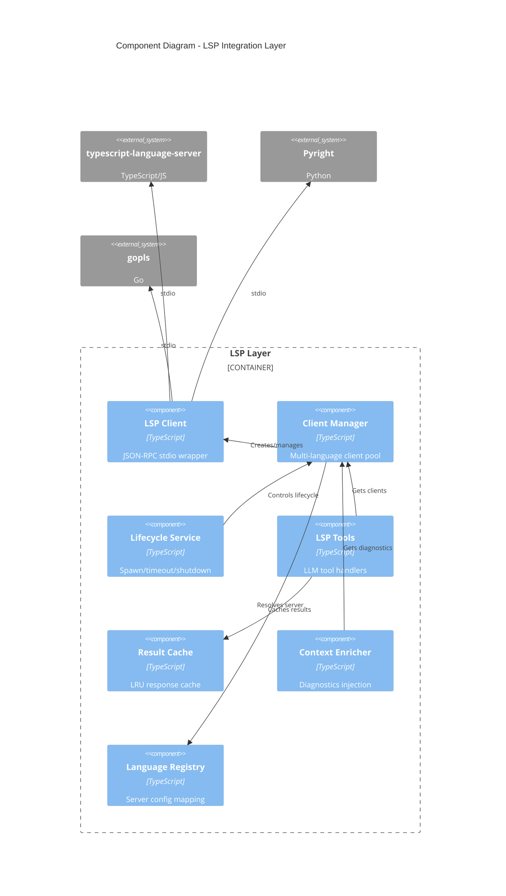
```mermaid
C4Component
    title Component Diagram - LSP Integration Layer

    Container_Boundary(lsp, "LSP Layer") {
        Component(client, "LSP Client", "TypeScript", "JSON-RPC stdio wrapper")
        Component(manager, "Client Manager", "TypeScript", "Multi-language client pool")
        Component(lifecycle, "Lifecycle Service", "TypeScript", "Spawn/timeout/shutdown")
        Component(lsp_tools, "LSP Tools", "TypeScript", "LLM tool handlers")
        Component(cache, "Result Cache", "TypeScript", "LRU response cache")
        Component(enricher, "Context Enricher", "TypeScript", "Diagnostics injection")
        Component(registry, "Language Registry", "TypeScript", "Server config mapping")
    }

    System_Ext(ts_server, "typescript-language-server", "TypeScript/JS")
    System_Ext(pyright, "Pyright", "Python")
    System_Ext(gopls, "gopls", "Go")

    Rel(manager, client, "Creates/manages")
    Rel(manager, registry, "Resolves server")
    Rel(lifecycle, manager, "Controls lifecycle")
    Rel(lsp_tools, manager, "Gets clients")
    Rel(lsp_tools, cache, "Caches results")
    Rel(enricher, manager, "Gets diagnostics")
    Rel(client, ts_server, "stdio")
    Rel(client, pyright, "stdio")
    Rel(client, gopls, "stdio")
```

| Component         | File                            | Responsibility                                                                    |
| ----------------- | ------------------------------- | --------------------------------------------------------------------------------- |
| LSP Client        | `lsp-client.ts`                 | JSON-RPC stdio wrapper for a single language server process                       |
| Client Manager    | `lsp-client-manager.service.ts` | Multi-language client pool with spawn-on-demand and idle timeout                  |
| Lifecycle Service | `lsp-lifecycle.service.ts`      | Session-scoped server lifecycle coordination                                      |
| LSP Tools         | `lsp-tools.service.ts`          | LLM tool handlers for goto_definition, get_type_info, get_diagnostics, hover_info |
| Result Cache      | `lsp-result-cache.ts`           | LRU cache (500 entries, 30-second TTL)                                            |
| Context Enricher  | `lsp-context-enricher.ts`       | Injects compiler diagnostics into LLM message context                             |
| Language Registry | `lsp-language-registry.ts`      | Maps file extensions to language server commands                                  |

---

## Cross-Cutting Concerns

<details>
<summary><strong>Logging, Error Handling, and Dependency Injection</strong></summary>

### Logging

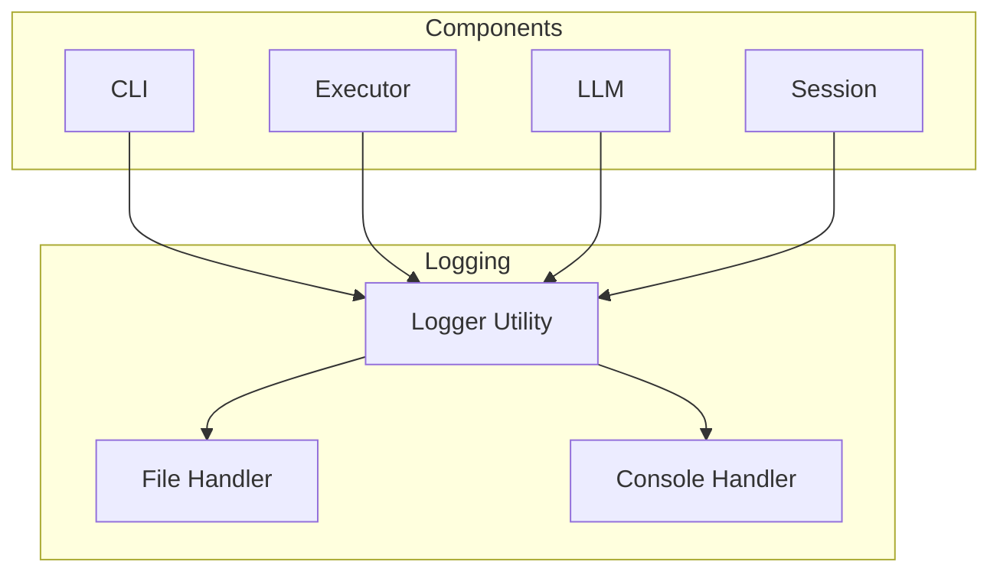
```mermaid
flowchart TD
    subgraph Components
        CLI
        Executor
        LLM
        Session
    end

    subgraph Logging
        Logger[Logger Utility]
        File[File Handler]
        Console[Console Handler]
    end

    CLI --> Logger
    Executor --> Logger
    LLM --> Logger
    Session --> Logger
    Logger --> File
    Logger --> Console
```

### Error Handling

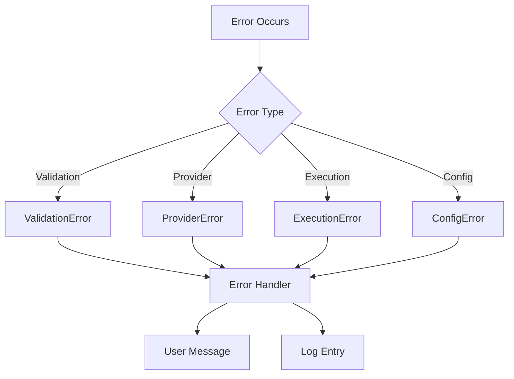
```mermaid
flowchart TD
    A[Error Occurs] --> B{Error Type}
    B -->|Validation| C[ValidationError]
    B -->|Provider| D[ProviderError]
    B -->|Execution| E[ExecutionError]
    B -->|Config| F[ConfigError]
    C --> G[Error Handler]
    D --> G
    E --> G
    F --> G
    G --> H[User Message]
    G --> I[Log Entry]
```

### Dependency Injection

```mermaid
classDiagram
    class Container {
        +register(token, implementation)
        +resolve(token)
        +singleton(token, implementation)
    }

    class Logger
    class SessionService
    class ConfigLoader
    class LLMRegistry

    Container --> Logger
    Container --> SessionService
    Container --> ConfigLoader
    Container --> LLMRegistry
```

</details>
