# Data Flow Architecture

> Data flow, state management, and integration patterns in VALORA.

## Primary Data Flows

### 1. Command Execution Flow

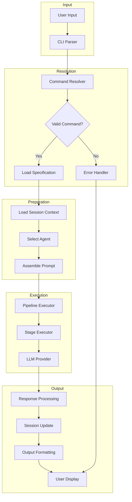

### 2. Pipeline Execution Flow

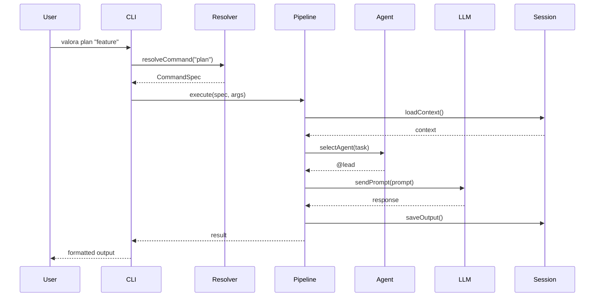

### 3. LLM Request Flow

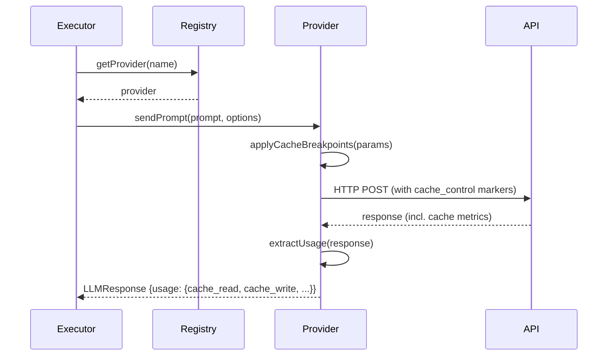

Prompt caching reduces input token costs across tool-loop iterations. Each provider applies its own caching strategy:

- **Anthropic**: Injects `cache_control: { type: "ephemeral" }` breakpoints on system prompt, tools, and last user message (when `prompt_caching: true`)
- **OpenAI**: Automatic caching — extracts `cached_tokens` from `prompt_tokens_details`
- **Google**: Automatic caching — extracts `cachedContentTokenCount` from `usageMetadata`

Cache metrics are normalised into `LLMUsage.cache_creation_input_tokens` and `LLMUsage.cache_read_input_tokens`. For caching implementation detail, see [Session Optimisation](./session-optimization.md).

### 4. Terminal Output Compression

Before tool results are assembled into the LLM context, `compressTerminalOutput()` in `src/executor/output-compression.service.ts` reduces their token footprint through a three-step pipeline:

| Step                 | Mechanism                                                                                                    | Applied when                                |
| -------------------- | ------------------------------------------------------------------------------------------------------------ | ------------------------------------------- |
| ANSI strip           | Removes colour codes and cursor-movement sequences                                                           | Always                                      |
| Per-command filter   | Content-aware noise reduction keyed on the executable (`git`, `tsc`, `eslint`, `jest`/`vitest`, `pnpm`)      | Output above `OUTPUT_COMPRESSION_THRESHOLD` |
| Head+tail truncation | Keeps the first 80 % (command context) and last 20 % (errors and summary) within `MAX_TERMINAL_OUTPUT_CHARS` | Always                                      |

Short outputs below `OUTPUT_COMPRESSION_THRESHOLD` pass through after ANSI stripping only. The full filter table is in [Orchestration Components](./components.md#orchestration-components).

### 5. MCP Integration Flow

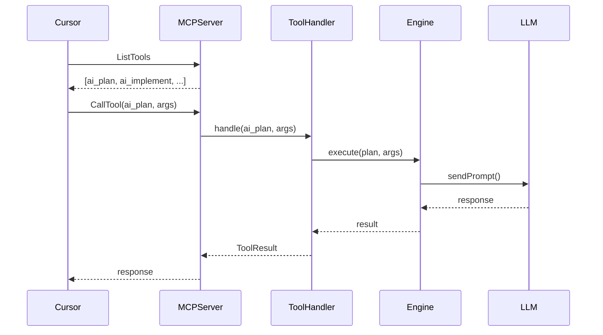

### 6. Interactive Clarification Flow

When commands require user input to resolve ambiguities, the pipeline pauses for interactive clarification:

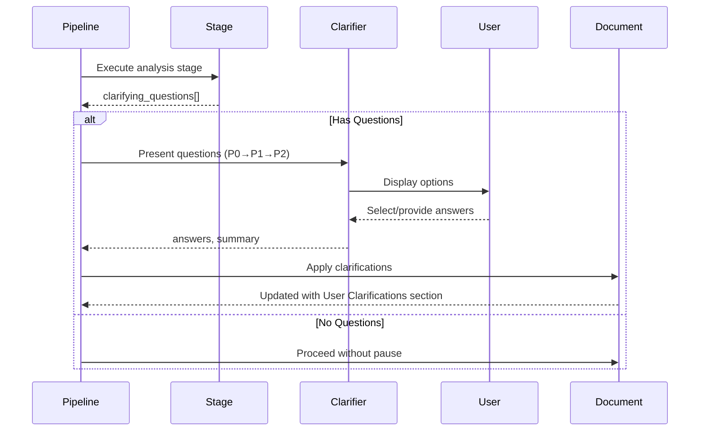

<details>
<summary><strong>Clarification Data Structures</strong></summary>

```typescript
interface ClarifyingQuestion {
	id: string;
	question: string;
	options: string[];
	priority: 'P0' | 'P1' | 'P2';
	context?: string;
	affects_sections: string[];
}

interface UserAnswer {
	question: string;
	answer: string | null;
	selected_option?: number;
	was_custom: boolean;
	skipped: boolean;
	priority: string;
	affects_sections: string[];
}

interface ClarificationOutput {
	answers: Record<string, UserAnswer>;
	summary: string; // Formatted markdown for document inclusion
	questions_answered: number;
	questions_skipped: number;
}
```

</details>

---

## State Management

### Session State

```typescript
interface SessionState {
	// Identity
	id: string;
	createdAt: Date;
	updatedAt: Date;

	// Context
	context: {
		currentTask?: Task;
		currentPlan?: Plan;
		knowledgeBase: KnowledgeItem[];
		history: HistoryEntry[];
	};

	// Outputs
	outputs: Map<string, CommandOutput>;

	// Metadata
	metadata: {
		commandCount: number;
		lastCommand: string;
		totalTokens: number;
	};
}
```

### Session Data Flow

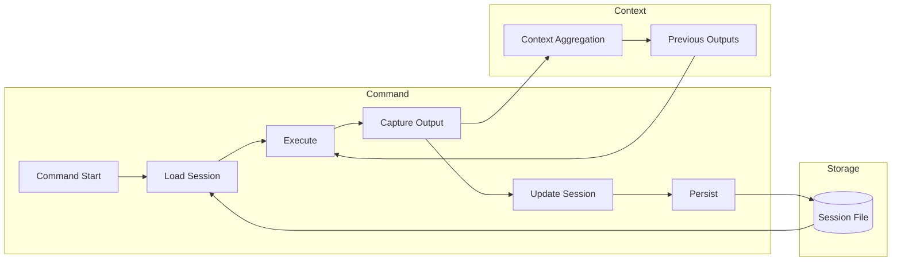

### Context Propagation

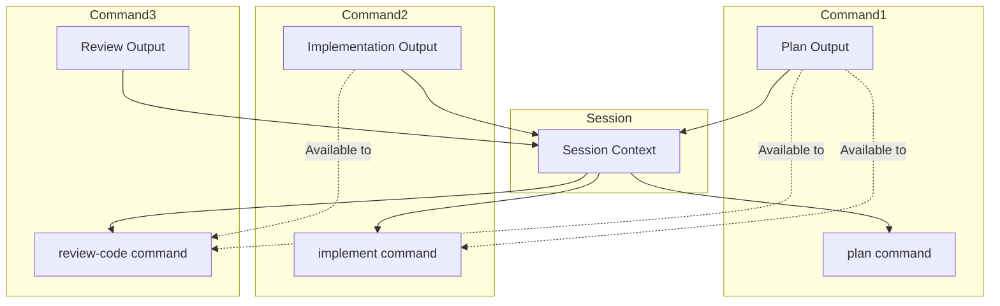

---

## Data Persistence

### File Structure

```plaintext
.valora/
├── sessions/
│   ├── session-abc123.json
│   └── session-def456.json
├── logs/
│   ├── <date>.log
│   └── latest.log -> <date>.log
├── batches/
│   └── <localId>.json
├── index/               ← AST symbol index (sharded JSON)
│   ├── manifest.json
│   ├── files.json
│   └── symbols-*.json
├── memory/              ← Agent memory stores (biologically-inspired decay)
│   ├── episodic.json    #   7-day half-life events and observations
│   ├── semantic.json    #   30-day half-life extracted patterns and insights
│   └── decisions.json   #   21-day half-life architectural decisions
└── spending.jsonl        ← append-only per-request cost ledger
```

### spending.jsonl Record Format

```json
{
	"id": "1741609384000-review",
	"command": "review",
	"stage": "context+analysis+synthesis",
	"model": "claude-3-5-sonnet-latest",
	"promptTokens": 29817,
	"completionTokens": 19063,
	"cacheReadTokens": 12000,
	"cacheWriteTokens": 0,
	"totalTokens": 48880,
	"costUsd": 0.0124,
	"cacheSavingsUsd": 0.0036,
	"durationMs": 3200,
	"timestamp": "2026-03-10T14:23:01.000Z",
	"batchDiscounted": false
}
```

### Session File Format

```json
{
	"id": "session-abc123",
	"createdAt": "...",
	"updatedAt": "...",
	"context": {
		"currentTask": {},
		"history": []
	},
	"outputs": {
		"plan": {},
		"implement": {}
	},
	"metadata": {
		"commandCount": 5,
		"lastCommand": "review-code",
		"totalTokens": 15000
	}
}
```

---

## What's Cached

| Data Type         | Cache Location        | TTL                |
| ----------------- | --------------------- | ------------------ |
| Agent definitions | Memory                | Session lifetime   |
| Command specs     | Memory                | Session lifetime   |
| Prompt templates  | Memory                | Session lifetime   |
| Configuration     | Memory                | Until reload       |
| Session data      | File                  | Configurable       |
| LLM prompt tokens | Provider-side (API)   | ~5 minutes         |
| LLM responses     | None                  | Not cached         |
| AST symbol index  | File (.valora/index/) | Until file changes |

LLM prompt token caching is handled server-side by the provider APIs — the provider injects cache markers in the request and extracts cache metrics from the response. For the full caching implementation, see [Session Optimisation](./session-optimization.md).

---

## Metrics and Observability

| Metric                 | Type      | Description                                                |
| ---------------------- | --------- | ---------------------------------------------------------- |
| command_duration       | Histogram | Command execution time                                     |
| llm_request_duration   | Histogram | LLM API latency                                            |
| session_count          | Gauge     | Active sessions                                            |
| error_count            | Counter   | Errors by type                                             |
| token_usage            | Counter   | Tokens consumed                                            |
| cache_read_tokens      | Counter   | Tokens read from prompt cache                              |
| cache_write_tokens     | Counter   | Tokens written to prompt cache                             |
| cost_usd               | Ledger    | Per-request USD cost (spending.jsonl)                      |
| cache_savings_usd      | Ledger    | Per-request cache savings (spending.jsonl)                 |
| memory:created         | Event     | New memory entry created from feedback output              |
| memory:accessed        | Event     | Memory entry accessed; half-life extended by boost days    |
| memory:pruned          | Event     | Entry removed; strength fell below `prune_threshold`       |
| memory:promoted        | Event     | Episodic entry promoted to semantic store                  |
| memory:stale           | Event     | Entry confidence downgraded to `stale`                     |
| consolidation:complete | Event     | Full consolidation cycle finished (pruned/merged/promoted) |

### Log Structure

```json
{
	"timestamp": "...",
	"level": "info",
	"component": "executor",
	"message": "Pipeline execution started",
	"context": {
		"command": "plan",
		"sessionId": "abc123",
		"agent": "lead"
	}
}
```

---

## Integration Patterns

<details>
<summary><strong>Provider Integration, GitHub Integration, and Concurrency Patterns</strong></summary>

### Provider Integration

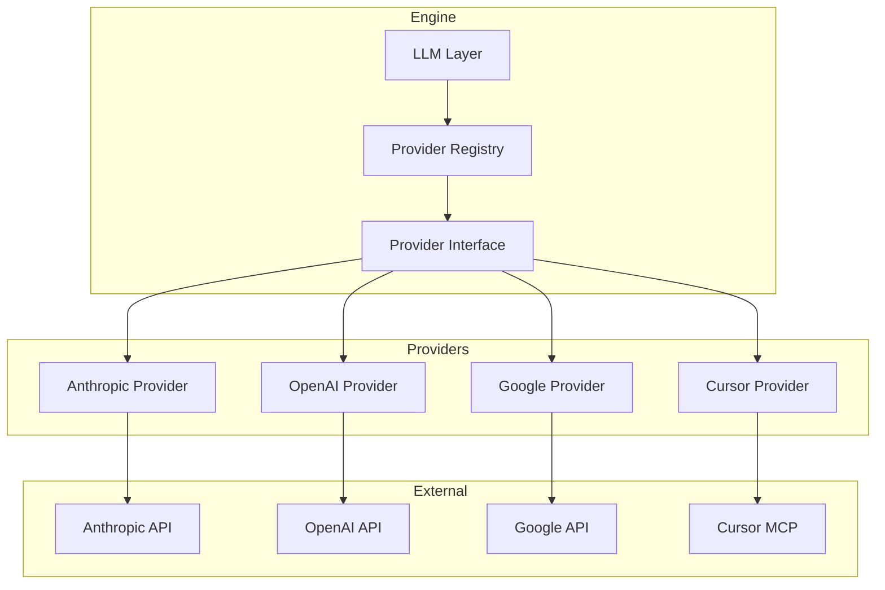

### GitHub Integration

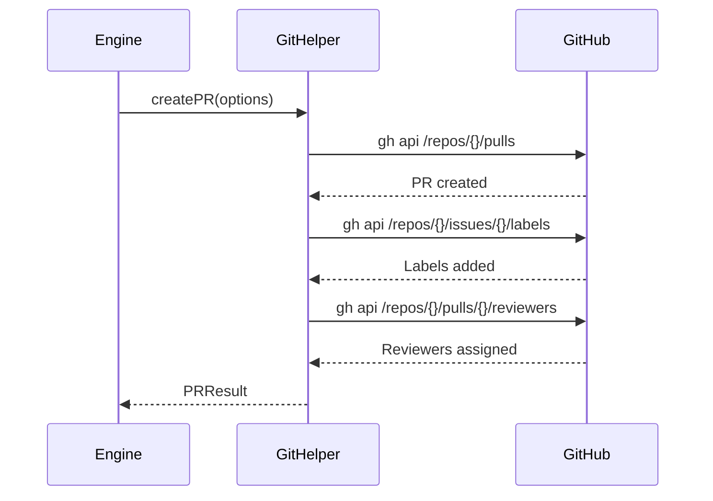

### Parallel Stage Execution

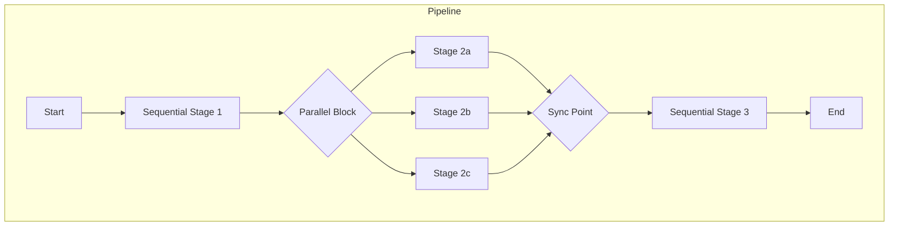

### Resource Locking

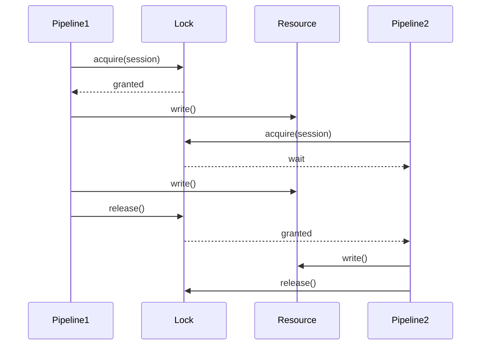

</details>

<details>
<summary><strong>Error Propagation</strong></summary>

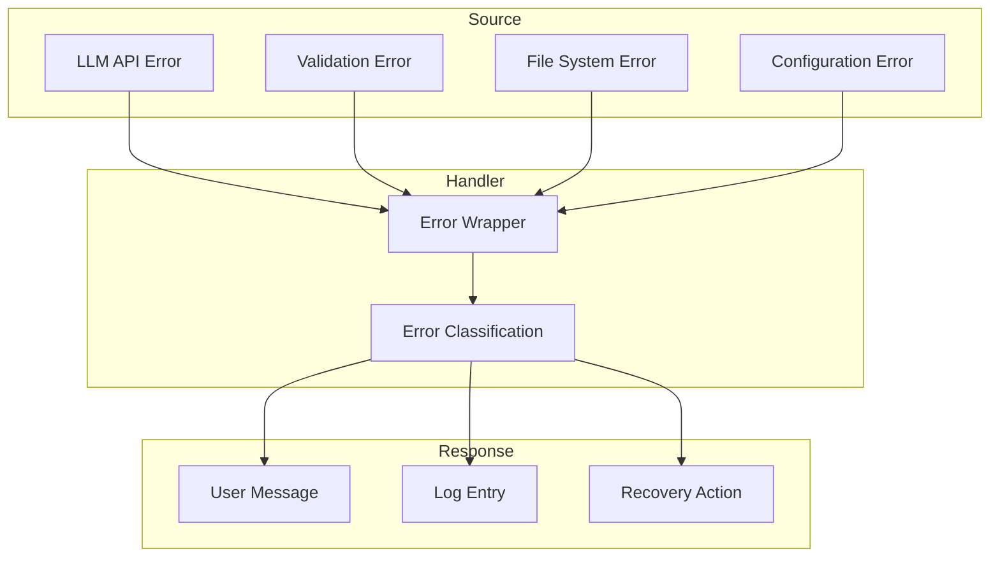

</details>
