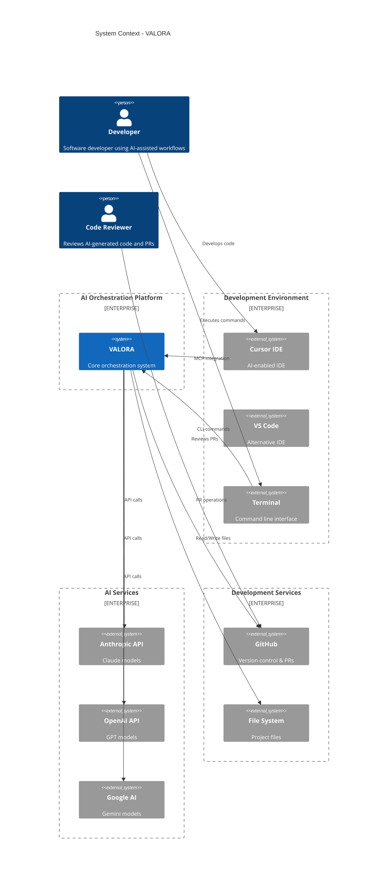
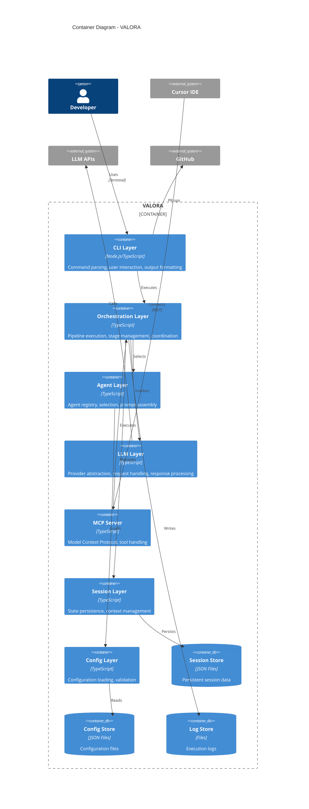
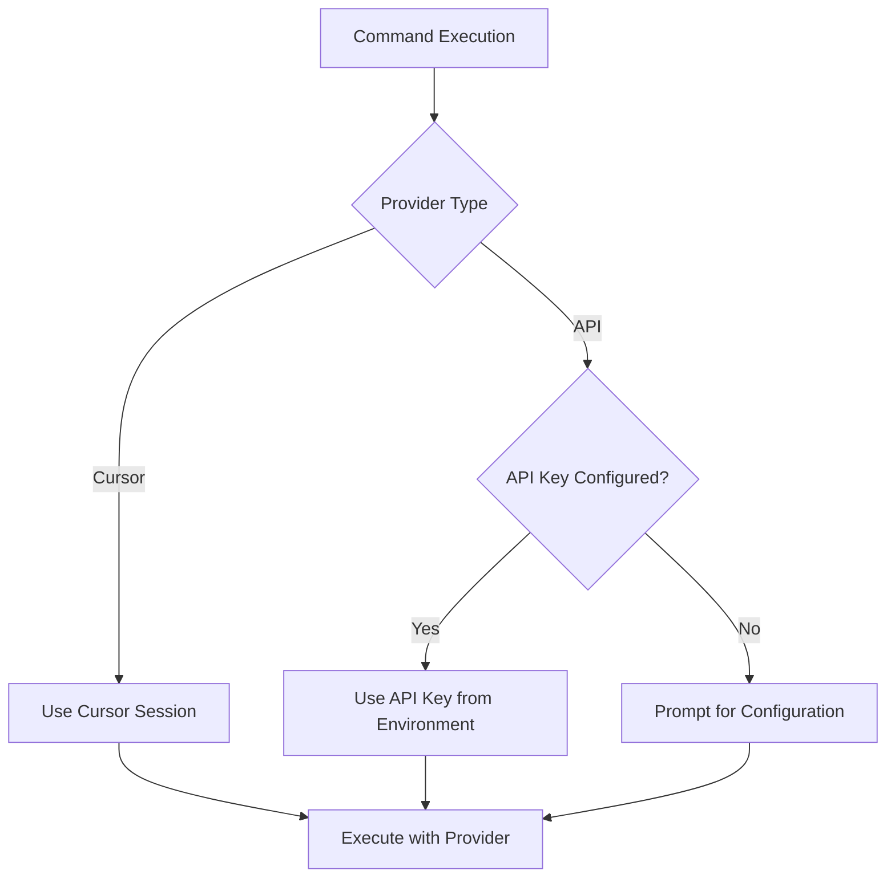

# System Architecture

> High-level architectural design of VALORA — a TypeScript CLI that orchestrates 11 AI agents across 24 commands for software development automation.

## System Context

## Container Architecture

## Layer Responsibilities

| Layer             | Purpose                                           | Key Components                                         |
| ----------------- | ------------------------------------------------- | ------------------------------------------------------ |
| CLI               | User interaction and command handling             | Command Parser, Resolver, Wizard, Result Presenter     |
| Orchestration     | Workflow execution and coordination               | Pipeline, Stage Executor, Variable Resolver            |
| Code Intelligence | AST-based codebase understanding, LSP integration | AST Parser, Symbol Index, Smart Context, LSP Client    |
| Agent             | AI agent management and selection                 | Agent Registry, Loader, Selector, Prompt Assembler     |
| LLM               | Multi-provider AI integration                     | Provider Registry, Anthropic/OpenAI/Google/Cursor      |
| MCP Server        | IDE integration via Model Context Protocol        | Server, Tool Handler, Prompt Handler, Session Service  |
| Session           | Persistent state management                       | Session Service, Repository, Context Manager           |
| Configuration     | Application configuration                         | Config Loader, Schema Validator (Zod), Provider Config |

## Key Design Decisions

| Decision                  | Choice                                                | Rationale                                                            |
| ------------------------- | ----------------------------------------------------- | -------------------------------------------------------------------- |
| Execution model           | Local, single-user, sequential                        | Simplicity; no infrastructure dependencies                           |
| Provider abstraction      | Normalised `LLMUsage` across all providers            | Cache metrics and cost tracking work identically regardless of model |
| Session storage           | File-based JSON with dual snapshot/full               | Zero infrastructure; fast resume via lightweight snapshot            |
| Context window management | Automatic flush + summarisation at 80%                | Prevents hard context-limit failures during long pipelines           |
| Security perimeter        | Credential Guard + Command Guard + Injection Detector | Defence-in-depth for local-execution threat model                    |
| Codebase intelligence     | tree-sitter WASM + LSP (spawn-on-demand)              | Language-agnostic parsing; rich type info without bundling a server  |

<strong>Non-Functional Requirement Mapping</strong>

| NFR             | Mechanism                                                                |
| --------------- | ------------------------------------------------------------------------ |
| Performance     | Prompt caching (up to 90% input token savings); AST symbol index on disk |
| Reliability     | Retry logic on transient LLM errors; session snapshots for fast recovery |
| Security        | Credential Guard, Command Guard, Injection Detector, Tool Validator      |
| Observability   | Structured JSON logs; per-request spending ledger (`spending.jsonl`)     |
| Extensibility   | Provider registry pattern; file-driven command/agent definitions         |
| Maintainability | Dependency injection container; typed pipeline events                    |

<strong>Security Architecture</strong>

### Authentication Flow

### Security Boundaries

| Boundary      | Protection                           |
| ------------- | ------------------------------------ |
| API Keys      | Environment variables, never in code |
| Configuration | Local file, gitignored               |
| Sessions      | Local storage, no sensitive data     |
| Network       | HTTPS only for API calls             |

### Security Component Summary

| Component          | Vulnerability Class                        | Severity |
| ------------------ | ------------------------------------------ | -------- |
| Credential Guard   | Credential leakage via env/output/files    | Critical |
| Command Guard      | Command injection and data exfiltration    | Critical |
| Injection Detector | Indirect prompt injection via tool results | High     |
| Tool Validator     | MCP tool poisoning via descriptions        | High     |
| Integrity Monitor  | Rug pull attacks via tool-set drift        | High     |

