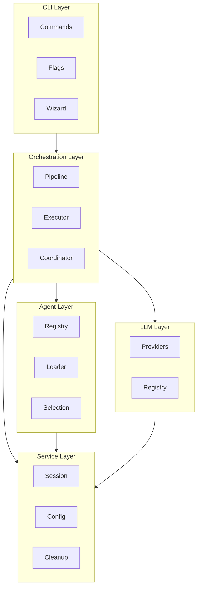

# Developer Guide

Technical documentation for developers contributing to or extending Valora.

## Contents

| Document                                                | Purpose                                |
| ------------------------------------------------------- | -------------------------------------- |
| [Setup](./setup.md)                                     | Configure your development environment |
| [Codebase](./codebase.md)                               | Understand the project structure       |
| [Contributing](./contributing.md)                       | Guidelines for contributions           |
| [Code Quality](./code-quality.md)                       | Coding standards and enforcement       |
| [Code Quality Guidelines](./CODE-QUALITY-GUIDELINES.md) | Detailed quality reference             |
| [Language Convention](./LANGUAGE_CONVENTION.md)         | Language usage rules for docs and code |

## Quick Setup

```bash
git clone <repository-url>
cd valora

npm install
npm run build
npm test
```

### Development mode

```bash
npm run dev              # watch mode
npm run dev plan "Test"  # run a command in dev mode
```

### Quality checks

```bash
npm run format       # format and lint
npm run tsc:check    # type check
npm test             # run test suite
npm run test:coverage
```

---

<details>
<summary><strong>Architecture overview</strong></summary>

The engine follows a modular, layered architecture:



</details>

<details>
<summary><strong>Technology stack</strong></summary>

| Category            | Technology         | Purpose                  |
| ------------------- | ------------------ | ------------------------ |
| **Runtime**         | Node.js >=18.0.0   | JavaScript runtime       |
| **Language**        | TypeScript 5.x     | Type-safe development    |
| **Package manager** | npm / pnpm 10.x    | Dependency management    |
| **Build**           | tsc, tsc-alias     | TypeScript compilation   |
| **Testing**         | Vitest             | Unit/integration testing |
| **E2E testing**     | Playwright         | End-to-end testing       |
| **Linting**         | ESLint 9.x         | Code quality             |
| **Formatting**      | Prettier           | Code formatting          |
| **Pre-commit**      | Husky, lint-staged | Git hooks                |
| **CLI UI**          | Ink (React), Chalk | Terminal UI              |
| **Validation**      | Zod                | Schema validation        |

</details>

<details>
<summary><strong>Key directories</strong></summary>

| Directory          | Purpose                                                        |
| ------------------ | -------------------------------------------------------------- |
| `src/ast/`         | AST-based code intelligence (parsing, indexing, smart context) |
| `src/cli/`         | Command-line interface and commands                            |
| `src/executor/`    | Pipeline and execution logic                                   |
| `src/exploration/` | Parallel exploration and collaboration                         |
| `src/llm/`         | LLM provider integrations                                      |
| `src/lsp/`         | Language server protocol integration                           |
| `src/mcp/`         | MCP server implementation                                      |
| `src/session/`     | Session state management                                       |
| `src/config/`      | Configuration loading and validation                           |
| `src/services/`    | Shared services                                                |
| `src/types/`       | TypeScript type definitions                                    |
| `src/utils/`       | Utility functions                                              |

</details>

<details>
<summary><strong>Key concepts</strong></summary>

### Commands

Each command has a specification file in `data/commands/` (built-in) or `.valora/commands/` (project overrides). It maps to an agent and model, defines allowed tools, and specifies a pipeline for execution.

### Agents

Agents are AI personas with specific expertise. They are defined in `data/agents/` (built-in) or `.valora/agents/` (project overrides), registered in `registry.json`, and selected based on task characteristics.

### Pipelines

Pipelines orchestrate command execution as sequential or parallel stages with variable resolution and error handling.

### Sessions

Sessions maintain state across commands. They are stored in `.valora/sessions/`, include context, outputs, and metadata, and support resume and cleanup.

</details>

<details>
<summary><strong>Debugging</strong></summary>

### Enable debug logging

```bash
export LOG_LEVEL=debug
npm run dev plan "Test"
```

### View logs

```bash
tail -f .valora/logs/latest.log
```

### Run diagnostics

```bash
npm run dev doctor
```

### Test suites

```bash
npm run test:suite:unit
npm run test:suite:integration
npm run test:suite:e2e
```

</details>

<details>
<summary><strong>Development workflow</strong></summary>

```bash
# 1. Create a feature branch
git checkout -b feature/your-feature-name

# 2. Make changes — follow codebase structure and coding standards

# 3. Run quality checks
npm run format
npm run tsc:check
npm test

# 4. Commit with conventional commits
git commit -m "feat(cli): add new command option"

# 5. Create pull request — follow the PR template
```

</details>
