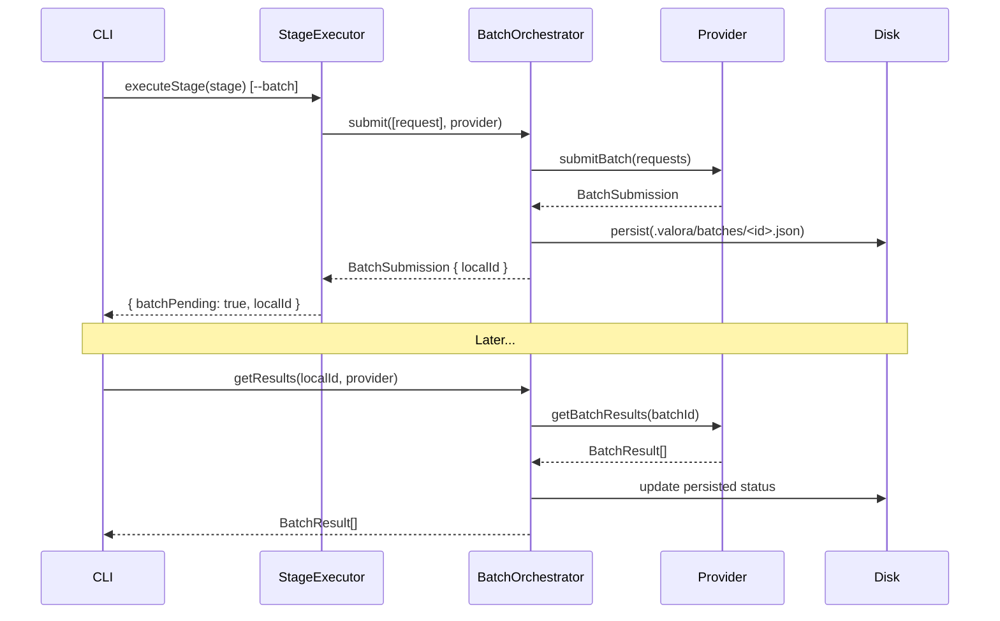
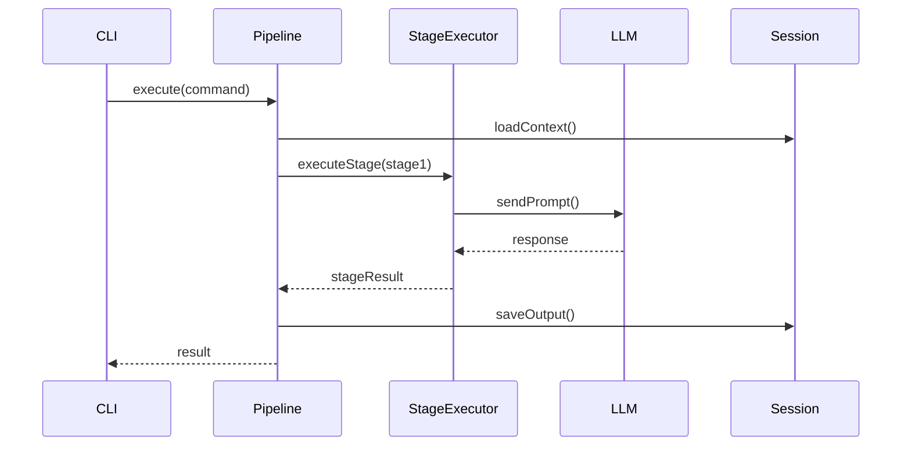
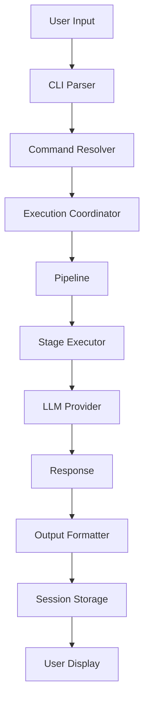
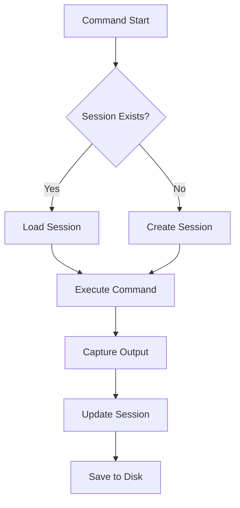

# Codebase Overview

> Detailed walkthrough of the VALORA source code structure.

## Directory Structure

```plaintext
src/
├── batch/             # Async batch processing (LLM batch APIs)
│   └── providers/     # Provider-specific batch implementations
├── cleanup/           # Resource cleanup coordination
├── cli/               # Command-line interface
│   ├── commands/      # Individual CLI commands
│   └── types/         # CLI-specific types
├── config/            # Configuration management
├── di/                # Dependency injection container
├── executor/          # Pipeline execution
├── exploration/       # Parallel exploration system
├── llm/               # LLM provider integrations
│   └── providers/     # Individual provider implementations
├── mcp/               # MCP server implementation
├── output/            # Output formatting and rendering
├── security/          # Agentic AI security (credential guard, command guard, injection detection)
├── services/          # Shared services
├── session/           # Session management
├── types/             # Global type definitions
├── ui/                # Terminal UI components
└── utils/             # Utility functions
```

## Core Modules

### Batch Layer (`src/batch/`)

The batch layer provides asynchronous LLM processing via provider batch APIs, reducing token costs by ~50%.

```plaintext
src/batch/
├── batch.types.ts                   # BatchRequest, BatchSubmission, BatchResult, PersistedBatch
├── batch-provider.interface.ts      # BatchableProvider interface + isBatchableProvider() type guard
├── batch-eligibility.ts             # isEligible(stage, context, provider) helper
├── batch-orchestrator.ts            # Submit → poll → retrieve orchestration; singleton getBatchOrchestrator()
├── batch-session.ts                 # JSON file persistence under .valora/batches/<localId>.json
└── providers/
    ├── anthropic.batch-provider.ts  # Anthropic Message Batches implementation
    ├── openai.batch-provider.ts     # OpenAI Batch API (JSONL file upload)
    └── google.batch-provider.ts     # Vertex AI stub (supportsBatch() returns false)
```

Key components:

| Component                     | Responsibility                                                    |
| ----------------------------- | ----------------------------------------------------------------- |
| `batch-provider.interface.ts` | `BatchableProvider` extends `LLMProvider`; runtime type guard     |
| `batch-eligibility.ts`        | Checks stage opt-in, `--batch` flag, and provider capability      |
| `batch-orchestrator.ts`       | Coordinates submit/poll/retrieve; persists state via BatchSession |
| `batch-session.ts`            | File-based batch state persistence (one JSON file per job)        |

The `AnthropicProvider` and `OpenAIProvider` implement `BatchableProvider` directly. The `isBatchableProvider()` type guard is used in `StageExecutor` to route eligible stages through the batch path.

#### Batch Flow



---

### CLI Layer (`src/cli/`)

The CLI layer handles user interaction and command parsing.

#### Entry Point (`index.ts`)

```typescript
// Main entry point for the CLI application
// Sets up Commander.js and registers all commands
```

#### Command Structure

Each command follows a consistent pattern:

```plaintext
src/cli/
├── commands/
│   ├── config.ts        # Configuration commands
│   ├── dashboard.ts     # Dashboard display
│   ├── doctor.ts        # Diagnostics
│   ├── dynamic.ts       # Dynamic command loading
│   ├── explore.ts       # Exploration mode
│   ├── help.ts          # Help display
│   ├── monitoring.ts    # Monitoring commands
│   └── session.ts       # Session management
├── command-adapter.interface.ts
├── commander-adapter.ts
├── command-error-handler.ts
├── command-executor.ts
├── command-palette.ts
├── command-resolver.ts
├── command-suggestions.ts
├── command-templates.ts
├── command-validator.ts
├── command-wizard.ts
├── config-builder.ts
├── execution-coordinator.ts
├── flags.ts
├── provider-fallback-service.ts
├── provider-resolver.ts
├── result-presenter.ts
├── session-browser.ts
├── session-cleanup-adapter.ts
├── session-formatter.ts
├── session-manager.ts
└── session-resume.ts
```

Key components:

| Component                  | Responsibility                      |
| -------------------------- | ----------------------------------- |
| `command-executor.ts`      | Executes parsed commands            |
| `command-resolver.ts`      | Resolves command specifications     |
| `command-wizard.ts`        | Interactive command configuration   |
| `execution-coordinator.ts` | Coordinates multi-step execution    |
| `provider-resolver.ts`     | Resolves LLM provider configuration |

---

### Executor Layer (`src/executor/`)

The executor layer handles pipeline orchestration and stage execution.

```plaintext
src/executor/
├── agent-loader.ts              # Load agent definitions
├── command-discovery.ts         # Discover available commands
├── command-isolation.executor.ts # Isolated command execution
├── command-loader.ts            # Load command specifications
├── command-validation.ts        # Validate command inputs
├── execution-context.ts         # Execution state container
├── execution-strategy.ts        # Execution strategy patterns
├── pipeline.ts                  # Pipeline orchestration
├── pipeline-events.ts           # Pipeline event definitions
├── pipeline-validator.ts        # Pipeline validation
├── prompt-loader.ts             # Load prompt templates
├── stage-executor.ts            # Execute individual stages
├── stage-scheduler.ts           # Schedule stage execution
├── variable-resolution.service.ts # Resolve template variables
└── variables.ts                 # Variable definitions
```

Key components:

| Component              | Responsibility                          |
| ---------------------- | --------------------------------------- |
| `pipeline.ts`          | Orchestrates command pipeline execution |
| `stage-executor.ts`    | Executes individual pipeline stages     |
| `execution-context.ts` | Maintains execution state               |
| `agent-loader.ts`      | Loads and validates agent definitions   |

#### Pipeline Flow



---

### LLM Layer (`src/llm/`)

The LLM layer provides multi-provider AI integration.

```plaintext
src/llm/
├── index.ts              # Module exports
├── provider.interface.ts # Provider interface definition
├── registry.ts           # Provider registry
└── providers/
    ├── anthropic.provider.ts  # Anthropic/Claude
    ├── cursor.provider.ts     # Cursor integration
    ├── google.provider.ts     # Google AI
    ├── index.ts
    └── openai.provider.ts     # OpenAI
```

#### Provider Interface

```typescript
interface LLMProvider {
	name: string;
	sendPrompt(prompt: string, options?: LLMOptions): Promise<LLMResponse>;
	isConfigured(): boolean;
	getModel(): string;
}
```

#### Provider Registration

```typescript
// registry.ts
class LLMRegistry {
	register(provider: LLMProvider): void;
	getProvider(name: string): LLMProvider;
	listProviders(): string[];
}
```

#### Prompt Caching

Each provider extracts cache metrics into the normalised `LLMUsage` type:

- **Anthropic**: Injects `cache_control` breakpoints when `prompt_caching: true` in provider config. Caches system prompt, tools, and conversation history across tool-loop iterations.
- **OpenAI**: Extracts `cached_tokens` from `prompt_tokens_details` (automatic, no config needed).
- **Google**: Extracts `cachedContentTokenCount` from `usageMetadata` (automatic, no config needed).

The token estimator (`src/utils/token-estimator.ts`) includes `cache_write` and `cache_read` rates per model for accurate cost calculation via `calculateActualCost()`.

---

### Exploration Layer (`src/exploration/`)

The exploration layer enables parallel agent collaboration using git worktrees.

```plaintext
src/exploration/
├── collaboration-coordinator.ts  # Coordinate agent collaboration
├── container-manager.ts          # Manage exploration containers
├── execution-modes.ts            # Execution mode definitions
├── exploration-events.ts         # Event emitter for real-time updates
├── exploration-state.ts          # State persistence and recovery
├── merge-orchestrator.ts         # Merge exploration results
├── orchestrator.ts               # Main orchestration logic
├── resource-allocator.ts         # Resource management
├── result-comparator.ts          # Compare agent results
├── safety-validator.ts           # Safety validation
├── shared-volume-manager.ts      # Volume management
├── worktree-manager.ts           # Git worktree CRUD operations
└── worktree-manager-secure.ts    # Secure worktree manager
```

This module supports:

- Parallel exploration of implementation approaches using git worktrees
- Multi-agent collaboration with shared insights and decisions
- Safe result merging with backup branches
- Real-time event emission for dashboard monitoring (via `ExplorationEventEmitter`)
- Worktree usage statistics tracked per session (via `WorktreeStatsTracker` in session layer)

---

### Session Layer (`src/session/`)

The session layer manages persistent state and worktree usage tracking.

```plaintext
src/session/
├── archive-adapter.interface.ts  # Archive adapter interface
├── archive-adapter.ts            # Archive implementation
├── cleanup-scheduler.ts          # Session cleanup scheduling
├── context.ts                    # Session context management
├── lifecycle.ts                  # Session lifecycle (create, resume, complete)
├── retention-manager.ts          # Retention management
├── retention-policy-runner.ts    # Retention policy execution
├── session-cleanup-ui.ts         # Cleanup UI
├── session-exporter.ts           # Session export
├── store.ts                      # Session file persistence
├── types.ts                      # Internal types
└── worktree-stats-tracker.ts     # Worktree usage statistics (event-driven)
```

Key components:

| Component                   | Responsibility                                                     |
| --------------------------- | ------------------------------------------------------------------ |
| `lifecycle.ts`              | Session creation, resumption, completion, and state transitions    |
| `context.ts`                | Session context management and updates                             |
| `store.ts`                  | File-based session persistence and listing                         |
| `worktree-stats-tracker.ts` | Event-driven worktree usage tracking via `ExplorationEventEmitter` |

---

### Configuration Layer (`src/config/`)

```plaintext
src/config/
├── constants.ts           # Application constants
├── index.ts
├── interactive-wizard.ts  # Configuration wizard
├── loader.ts              # Config file loading
├── providers.config.ts    # Provider configuration
├── schema.ts              # Zod schemas
├── validation-helpers.ts  # Validation utilities
└── wizard.ts              # Wizard utilities
```

#### Configuration Schema

Configuration is validated using Zod:

```typescript
const ConfigSchema = z.object({
	defaults: z.object({
		default_provider: z.string(),
		interactive: z.boolean(),
		log_level: z.enum(['debug', 'info', 'warn', 'error']),
		output_format: z.enum(['markdown', 'json', 'plain']),
		session_mode: z.boolean()
	}),
	providers: z.record(ProviderSchema)
	// ...
});
```

---

### MCP Layer (`src/mcp/`)

The MCP layer implements the Model Context Protocol server.

```plaintext
src/mcp/
├── command-discovery.service.ts  # Discover commands
├── context.ts                    # Request context
├── health.service.ts             # Health checks
├── index.ts
├── mcp-logger.ts                 # MCP-specific logging
├── prompt-handler.ts             # Handle prompt requests
├── prompt.service.ts             # Prompt operations
├── server.ts                     # MCP server entry
├── session.service.ts            # Session handling
├── tool-handler.ts               # Tool execution
└── types.ts                      # Type definitions
```

---

### Security Layer (`src/security/`)

The security layer provides agentic AI attack detection and prevention.

```plaintext
src/security/
├── index.ts                          # Barrel exports
├── security-event.types.ts           # Shared event types (SecurityEvent, SecurityEventType)
├── credential-guard.ts               # Env sanitisation, output scanning, sensitive file blocking
├── command-guard.ts                  # Command validation (network, eval, exfiltration patterns)
├── prompt-injection-detector.ts      # 0–1 risk scoring for injection in tool results
├── tool-definition-validator.ts      # MCP tool name/description/schema validation
└── tool-integrity-monitor.ts         # SHA-256 fingerprinting for tool-set drift detection
```

Key components:

| Component                      | Responsibility                                                           |
| ------------------------------ | ------------------------------------------------------------------------ |
| `credential-guard.ts`          | Redacts sensitive env vars in subprocess env; scans output for secrets   |
| `command-guard.ts`             | Blocks network, remote access, eval, and exfiltration command patterns   |
| `prompt-injection-detector.ts` | Scores tool results for injection markers; quarantines or redacts        |
| `tool-definition-validator.ts` | Validates MCP tool names, descriptions, and schemas against poisoning    |
| `tool-integrity-monitor.ts`    | Fingerprints MCP tool sets; detects rug pull attacks between connections |

Integration points:

- **`tool-execution.service.ts`** — command guard before exec, env sanitisation, output scanning, sensitive file blocking
- **`stage-executor.ts`** — prompt injection scanning of all tool results before LLM context
- **`mcp-tool-handler.ts`** — credential and injection scanning of MCP tool output
- **`mcp-client-manager.service.ts`** — tool definition validation and integrity checking on connection
- **`variables.ts`** — sensitive env var filtering in `$ENV_*` resolution

All services are registered in the DI container (`src/di/container.ts`) and use singleton patterns.

---

### Types Layer (`src/types/`)

Global type definitions used across the codebase.

```plaintext
src/types/
├── agent.types.ts          # Agent definitions
├── command-validation.types.ts
├── command.types.ts        # Command definitions
├── config.types.ts         # Configuration types
├── context.types.ts        # Context types
├── events.types.ts         # Event definitions
├── execution.types.ts      # Execution types
├── exploration.types.ts    # Exploration types
├── index.ts
├── llm.types.ts            # LLM types (incl. LLMUsage with cache fields)
├── output.types.ts         # Output types
├── pipeline.types.ts       # Pipeline types
├── prompt.types.ts         # Prompt types
├── provider.types.ts       # Provider types
├── registry.types.ts       # Registry types
├── result.types.ts         # Result types
├── session.types.ts        # Session types (incl. WorktreeUsageStats)
└── stage.types.ts          # Stage types
```

---

### Utilities (`src/utils/`)

Shared utility functions.

```plaintext
src/utils/
├── arrays.ts               # Array utilities
├── async-helpers.ts        # Async utilities
├── cli-helpers.ts          # CLI utilities
├── concurrent-executor.ts  # Concurrent execution
├── date.ts                 # Date utilities
├── file.ts                 # File operations
├── formatting.ts           # Text formatting
├── git.ts                  # Git operations
├── index.ts
├── logger.ts               # Logging
├── markdown-parser.ts      # Markdown parsing
├── paths.ts                # Path utilities
├── process-manager.ts      # Process management
├── registry-utils.ts       # Registry utilities
├── script-runner.ts        # Script execution
├── string.ts               # String utilities
├── timeout-promise.ts      # Timeout handling
├── time.ts                 # Time utilities
├── token-estimator.ts      # Token counting, cost estimation, cache pricing
└── validation.ts           # Validation utilities
```

---

## Data Flow

### Command Execution Flow



### Session Management Flow



---

## Key Patterns

### Dependency Injection

The codebase uses a simple DI container (`src/di/container.ts`):

```typescript
const container = new Container();
container.register('logger', Logger);
container.register('sessionService', SessionService);
```

### Event-Driven Architecture

Pipeline execution uses events for loose coupling:

```typescript
pipeline.on('stageStart', (stage) => { ... });
pipeline.on('stageComplete', (stage, result) => { ... });
pipeline.on('error', (error) => { ... });
```

### Strategy Pattern

Execution strategies are pluggable:

```typescript
interface ExecutionStrategy {
	execute(context: ExecutionContext): Promise<Result>;
}
```

---

## Testing Structure

```plaintext
tests/
├── integration/    # Integration tests
├── e2e/            # End-to-end tests
├── security/       # Security tests
├── performance/    # Performance tests
├── error-scenarios/ # Error handling tests
└── architecture/   # Architecture tests
```

Unit tests are co-located with source files using `.test.ts` extension.

---

## Next Steps

1. Explore individual modules in detail
2. Read [Contributing Guidelines](./contributing.md)
3. Review [Architecture Documentation](../architecture/README.md)
