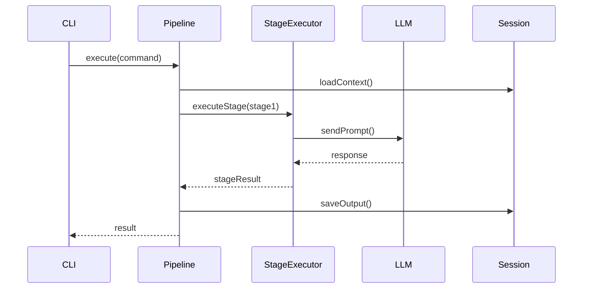
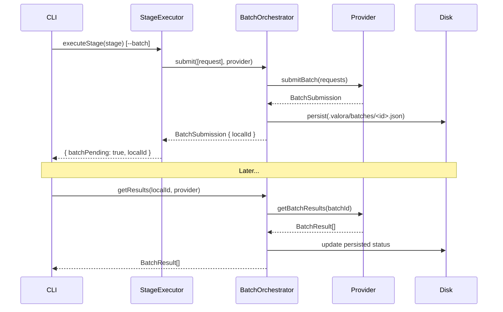

# Codebase Overview

> Walkthrough of the VALORA source structure.

## Directory Tree

```plaintext
src/
├── ast/               # AST-based code intelligence (tree-sitter)
│   └── grammars/      # WASM grammar loading and language mapping
├── batch/             # Async LLM batch processing
│   └── providers/     # Provider-specific batch implementations
├── cleanup/           # Resource cleanup coordination
├── cli/               # Command-line interface and command dispatch
│   ├── commands/      # Individual CLI command handlers
│   └── types/         # CLI-specific types
├── config/            # Configuration loading and validation
├── di/                # Dependency injection container
├── executor/          # Pipeline orchestration and stage execution
├── exploration/       # Parallel agent exploration (git worktrees)
├── llm/               # LLM provider integrations
│   └── providers/     # Anthropic, OpenAI, Google, Cursor
├── lsp/               # Language server client pool
├── mcp/               # Model Context Protocol server
├── output/            # Output formatting and rendering
├── security/          # Agentic AI security (credential, injection, tool guards)
├── services/          # Shared services
├── session/           # Session lifecycle and persistence
├── types/             # Global type definitions
├── ui/                # Terminal UI components (Ink/React)
└── utils/             # Shared utilities
```

Non-source directories:

```plaintext
data/                     # Built-in resources (shipped with the package)
│   ├── agents/           # Agent definition files (Markdown + frontmatter)
│   ├── commands/         # Command specification files
│   ├── prompts/          # Prompt templates
│   │   └── _shared/      # Shared reusable fragments included across prompts
│   ├── templates/        # Document templates
│   ├── hooks/            # Hook scripts
│   ├── config.default.json
│   ├── hooks.default.json
│   └── external-mcp.default.json
tests/
│   ├── integration/
│   ├── e2e/
│   ├── security/
│   ├── performance/
│   ├── error-scenarios/
│   └── architecture/     # arch-unit-ts architectural rules
```

Unit tests are co-located with source files (`*.test.ts`).

---

## Key Files Quick Reference

| File                               | Purpose                                                    |
| ---------------------------------- | ---------------------------------------------------------- |
| `src/cli/index.ts`                 | CLI entry point — registers all commands with Commander.js |
| `src/executor/pipeline.ts`         | Orchestrates the command pipeline stage by stage           |
| `src/executor/stage-executor.ts`   | Executes a single pipeline stage against an LLM provider   |
| `src/llm/provider.interface.ts`    | `LLMProvider` interface implemented by all providers       |
| `src/llm/registry.ts`              | Provider registry — register and resolve providers by name |
| `src/session/lifecycle.ts`         | Session create / resume / complete transitions             |
| `src/session/store.ts`             | File-based session persistence under `.valora/sessions/`   |
| `src/config/loader.ts`             | Multi-level config cascade (defaults → project → flags)    |
| `src/di/container.ts`              | DI container — all services registered here                |
| `src/security/credential-guard.ts` | Env sanitisation and output secret scanning                |
| `src/batch/batch-orchestrator.ts`  | Submit → poll → retrieve orchestration for async batches   |
| `src/exploration/orchestrator.ts`  | Parallel worktree exploration coordination                 |

---

## Module Reference

### CLI Layer (`src/cli/`)

Handles user input, flag parsing, and command dispatch.

| Component                  | Responsibility                                       |
| -------------------------- | ---------------------------------------------------- |
| `command-executor.ts`      | Executes a parsed command after validation           |
| `command-resolver.ts`      | Resolves a command name to its specification         |
| `command-wizard.ts`        | Interactive prompts for missing required inputs      |
| `execution-coordinator.ts` | Coordinates multi-step execution (wizard → pipeline) |
| `provider-resolver.ts`     | Resolves LLM provider from flags and config          |
| `flags.ts`                 | Shared flag definitions for Commander.js             |

---

### Executor Layer (`src/executor/`)

Owns pipeline orchestration and stage execution.

| Component                        | Responsibility                                                                               |
| -------------------------------- | -------------------------------------------------------------------------------------------- |
| `pipeline.ts`                    | Iterates stages, manages dependencies and results                                            |
| `stage-executor.ts`              | Sends a single stage prompt to the LLM provider                                              |
| `output-compression.service.ts`  | Compresses terminal output before LLM context assembly (ANSI stripping, per-command filters) |
| `stage-scheduler.ts`             | Determines execution order for parallel stages                                               |
| `variable-resolution.service.ts` | Resolves `$VAR` and `$ENV_*` template variables                                              |
| `agent-loader.ts`                | Loads and validates agent definition files                                                   |
| `command-loader.ts`              | Loads command specification files                                                            |
| `execution-context.ts`           | Immutable container for execution state                                                      |

<details>
<summary><strong>Pipeline flow detail</strong></summary>



The pipeline reads each stage's `depends_on` field to build a dependency graph. Independent stages can run in parallel via `stage-scheduler.ts`. The `stage-executor.ts` checks `isBatchableProvider()` before routing eligible stages to the batch path (see Batch layer below).

</details>

---

### LLM Layer (`src/llm/`)

Multi-provider AI integration with a single unified interface.

```typescript
interface LLMProvider {
	name: string;
	sendPrompt(prompt: string, options?: LLMOptions): Promise<LLMResponse>;
	isConfigured(): boolean;
	getModel(): string;
}
```

Providers: `anthropic.provider.ts`, `openai.provider.ts`, `google.provider.ts`, `cursor.provider.ts`.

<details>
<summary><strong>Prompt caching per provider</strong></summary>

Each provider surfaces cache metrics through the normalised `LLMUsage` type:

- **Anthropic**: Injects `cache_control` breakpoints when `prompt_caching: true` in provider config. Caches system prompt, tools, and conversation history across tool-loop iterations.
- **OpenAI**: Extracts `cached_tokens` from `prompt_tokens_details` (automatic, no configuration required).
- **Google**: Extracts `cachedContentTokenCount` from `usageMetadata` (automatic, no configuration required).

`src/utils/token-estimator.ts` includes per-model `cache_write` and `cache_read` rates for accurate cost calculation via `calculateActualCost()`.

</details>

---

### Batch Layer (`src/batch/`)

Asynchronous LLM processing via provider batch APIs, reducing token costs by ~50%.

```plaintext
src/batch/
├── batch.types.ts                   # BatchRequest, BatchSubmission, BatchResult, PersistedBatch
├── batch-provider.interface.ts      # BatchableProvider extends LLMProvider; isBatchableProvider() guard
├── batch-eligibility.ts             # isEligible(stage, context, provider)
├── batch-orchestrator.ts            # submit → poll → retrieve; singleton getBatchOrchestrator()
├── batch-session.ts                 # JSON persistence under .valora/batches/<localId>.json
└── providers/
    ├── anthropic.batch-provider.ts  # Anthropic Message Batches
    ├── openai.batch-provider.ts     # OpenAI Batch API (JSONL file upload)
    └── google.batch-provider.ts     # Vertex AI stub (supportsBatch() returns false)
```

<details>
<summary><strong>Batch flow detail</strong></summary>



`AnthropicProvider` and `OpenAIProvider` implement `BatchableProvider` directly. The `isBatchableProvider()` type guard in `stage-executor.ts` routes eligible stages through the batch path automatically when `--batch` is passed.

</details>

---

### AST Layer (`src/ast/`)

Code intelligence via tree-sitter: symbol extraction, codebase indexing, semantic search, and smart context selection for token reduction.

| Component                | Responsibility                                                                         |
| ------------------------ | -------------------------------------------------------------------------------------- |
| `ast-parser.service.ts`  | Parses files via tree-sitter WASM; extracts symbols and imports                        |
| `ast-index.service.ts`   | Builds and persists sharded symbol index under `.valora/index/`                        |
| `ast-query.service.ts`   | Symbol search, file outline, and cross-file reference finding                          |
| `ast-context.service.ts` | Budget-aware context extraction at multiple detail levels                              |
| `ast-tools.service.ts`   | LLM tool handlers: `symbol_search`, `file_outline`, `find_references`, `smart_context` |

---

### LSP Layer (`src/lsp/`)

Language server client pool providing compiler-level intelligence to the LLM: definitions, hover info, diagnostics, and type information.

| Component                       | Responsibility                                                                         |
| ------------------------------- | -------------------------------------------------------------------------------------- |
| `lsp-client.ts`                 | JSON-RPC stdio wrapper for a single language server process                            |
| `lsp-client-manager.service.ts` | Pool of language server clients with spawn-on-demand and idle timeout                  |
| `lsp-tools.service.ts`          | LLM tool handlers: `goto_definition`, `get_type_info`, `get_diagnostics`, `hover_info` |
| `lsp-context-enricher.ts`       | Injects compiler diagnostics into LLM message context                                  |
| `lsp-result-cache.ts`           | LRU cache (500 entries, 30s TTL) for LSP query results                                 |

---

### Exploration Layer (`src/exploration/`)

Parallel agent collaboration using git worktrees — multiple agents explore different approaches simultaneously, then results are merged.

| Component                      | Responsibility                                      |
| ------------------------------ | --------------------------------------------------- |
| `orchestrator.ts`              | Main orchestration entry point                      |
| `worktree-manager.ts`          | Git worktree CRUD operations                        |
| `collaboration-coordinator.ts` | Coordinates shared insights between parallel agents |
| `merge-orchestrator.ts`        | Safe result merging with backup branches            |
| `exploration-events.ts`        | Event emitter for real-time dashboard updates       |
| `safety-validator.ts`          | Pre-merge safety validation                         |

---

### Session Layer (`src/session/`)

Persistent state management and worktree usage tracking.

| Component                   | Responsibility                                                     |
| --------------------------- | ------------------------------------------------------------------ |
| `lifecycle.ts`              | Session create / resume / complete state transitions               |
| `context.ts`                | Session context management and updates                             |
| `store.ts`                  | File-based session persistence and listing                         |
| `worktree-stats-tracker.ts` | Event-driven worktree usage tracking via `ExplorationEventEmitter` |

---

### Security Layer (`src/security/`)

Agentic AI attack detection and prevention across five threat surfaces.

| Component                      | Responsibility                                                                   |
| ------------------------------ | -------------------------------------------------------------------------------- |
| `credential-guard.ts`          | Redacts sensitive env vars in subprocess env; scans output for secrets           |
| `command-guard.ts`             | Blocks network, remote access, eval, and exfiltration command patterns           |
| `prompt-injection-detector.ts` | Scores tool results for injection markers; quarantines or redacts                |
| `tool-definition-validator.ts` | Validates MCP tool names, descriptions, and schemas against poisoning            |
| `tool-integrity-monitor.ts`    | SHA-256 fingerprints MCP tool sets; detects rug pull attacks between connections |

<details>
<summary><strong>Security integration points</strong></summary>

- **`tool-execution.service.ts`** — command guard before exec, env sanitisation, output scanning, sensitive file blocking
- **`stage-executor.ts`** — prompt injection scanning of all tool results before LLM context
- **`mcp-tool-handler.ts`** — credential and injection scanning of MCP tool output
- **`mcp-client-manager.service.ts`** — tool definition validation and integrity checking on connection
- **`variables.ts`** — sensitive env var filtering in `$ENV_*` resolution

All services are registered in `src/di/container.ts` and use singleton patterns.

</details>

---

### Configuration Layer (`src/config/`)

Multi-level cascade: package defaults (`data/config.default.json`) → project level (`.valora/config.json`) → CLI flags.

Schemas are validated with Zod:

```typescript
const ConfigSchema = z.object({
	defaults: z.object({
		default_provider: z.string(),
		interactive: z.boolean(),
		log_level: z.enum(['debug', 'info', 'warn', 'error']),
		output_format: z.enum(['markdown', 'json', 'plain']),
		session_mode: z.boolean()
	}),
	providers: z.record(ProviderSchema)
});
```

---

### MCP Layer (`src/mcp/`)

Implements the [Model Context Protocol](https://modelcontextprotocol.io) server, exposing VALORA commands as MCP tools and prompts for use in Cursor and other MCP-capable hosts.

Entry point: `src/mcp/server.ts` → binary at `bin/mcp.js`.

---

## Key Architectural Patterns

### Dependency injection

All services are registered in `src/di/container.ts` and resolved by name at runtime. This pattern makes unit testing straightforward — inject mock implementations.

### Event-driven pipeline

Pipeline execution emits typed events for loose coupling:

```typescript
pipeline.on('stageStart', (stage) => { ... });
pipeline.on('stageComplete', (stage, result) => { ... });
pipeline.on('error', (error) => { ... });
```

### Adapter pattern for LLM providers

Each provider (`AnthropicProvider`, `OpenAIProvider`, etc.) implements the `LLMProvider` interface. The CLI layer never imports a concrete provider directly — always via the registry.

---

## Next Steps

1. Read the [Contributing Guidelines](./contributing.md)
2. Review the [Architecture Documentation](../architecture/README.md)
3. Explore individual modules starting from `src/cli/index.ts`
