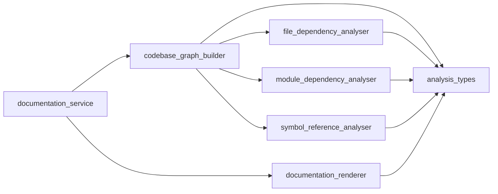

# Module: `analysis`

_Generated: 2026-04-18_

## File Dependencies

## Symbol References

| Symbol                   | Kind      | Defined in                    | Used in                                                                                                               |
| ------------------------ | --------- | ----------------------------- | --------------------------------------------------------------------------------------------------------------------- |
| CodebaseGraph            | interface | analysis.types.ts             | codebase-graph.builder.ts, documentation.renderer.ts, documentation.renderer.test.ts, documentation.service.test.ts   |
| CodebaseGraphBuilder     | class     | codebase-graph.builder.ts     | documentation.service.ts, map.ts, codebase-map.test.ts, codebase-graph.builder.test.ts, documentation.service.test.ts |
| DocumentationRenderer    | class     | documentation.renderer.ts     | documentation.service.ts, map.ts, codebase-map.test.ts, documentation.renderer.test.ts, documentation.service.test.ts |
| DocumentationService     | class     | documentation.service.ts      | map.ts, codebase-map.test.ts, documentation.service.test.ts                                                           |
| FileDependencyAnalyser   | class     | file-dependency.analyser.ts   | codebase-graph.builder.ts, codebase-graph.builder.test.ts, file-dependency.analyser.test.ts                           |
| FileNode                 | interface | analysis.types.ts             | documentation.renderer.ts, file-dependency.analyser.ts                                                                |
| ModuleDependencyAnalyser | class     | module-dependency.analyser.ts | codebase-graph.builder.ts, codebase-graph.builder.test.ts, module-dependency.analyser.test.ts                         |
| ModuleNode               | interface | analysis.types.ts             | documentation.renderer.ts, module-dependency.analyser.ts                                                              |
| RenderedOutput           | interface | documentation.renderer.ts     | —                                                                                                                     |
| SymbolReference          | interface | analysis.types.ts             | documentation.renderer.ts, symbol-reference.analyser.ts                                                               |
| SymbolReferenceAnalyser  | class     | symbol-reference.analyser.ts  | codebase-graph.builder.ts, map.ts, codebase-graph.builder.test.ts, symbol-reference.analyser.test.ts                  |
