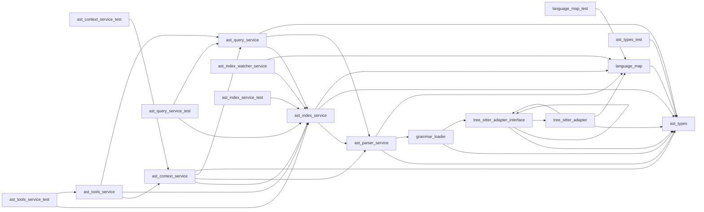

# Module: `ast`

_Generated: 2026-04-18_

## File Dependencies

## Symbol References

| Symbol                         | Kind      | Defined in                       | Used in                                                                                                                                                                                                                                                                    |
| ------------------------------ | --------- | -------------------------------- | -------------------------------------------------------------------------------------------------------------------------------------------------------------------------------------------------------------------------------------------------------------------------- |
| ASTIndexService                | class     | ast-index.service.ts             | codebase-graph.builder.ts, ast-index.service.test.ts, ast-query.service.test.ts, codebase-map.test.ts, codebase-graph.builder.test.ts                                                                                                                                      |
| ASTIndexWatcherService         | class     | ast-index-watcher.service.ts     | —                                                                                                                                                                                                                                                                          |
| ASTLanguage                    | type      | ast.types.ts                     | ast-parser.service.ts, ast.types.test.ts, grammar-loader.ts, language-map.ts, tree-sitter-adapter.interface.ts, tree-sitter-adapter.ts                                                                                                                                     |
| ASTToolsService                | class     | ast-tools.service.ts             | ast-tools.service.test.ts, tool-execution.service.ts                                                                                                                                                                                                                       |
| CHARS_PER_TOKEN                | constant  | ast-parser.service.ts            | ast-query.service.ts                                                                                                                                                                                                                                                       |
| clearGrammarCache              | function  | grammar-loader.ts                | —                                                                                                                                                                                                                                                                          |
| CodebaseIndex                  | interface | ast.types.ts                     | file-dependency.analyser.ts, module-dependency.analyser.ts, symbol-reference.analyser.ts, ast-index.service.ts, ast.types.test.ts, codebase-graph.builder.test.ts, file-dependency.analyser.test.ts, module-dependency.analyser.test.ts, symbol-reference.analyser.test.ts |
| CodebaseMapEntry               | interface | ast.types.ts                     | ast.types.test.ts                                                                                                                                                                                                                                                          |
| computeContentHash             | function  | ast-parser.service.ts            | ast-index.service.ts                                                                                                                                                                                                                                                       |
| ContextDeduplicationState      | interface | ast.types.ts                     | ast-context.service.ts, ast.types.test.ts                                                                                                                                                                                                                                  |
| ContextDeduplicator            | class     | ast-context.service.ts           | ast-context.service.test.ts                                                                                                                                                                                                                                                |
| ContextLevel                   | type      | ast.types.ts                     | ast-context.service.ts, ast.types.test.ts                                                                                                                                                                                                                                  |
| ContextSavingsMetrics          | interface | ast.types.ts                     | ast.types.test.ts                                                                                                                                                                                                                                                          |
| createDefaultTreeSitterAdapter | function  | tree-sitter-adapter.ts           | tree-sitter-adapter.interface.ts                                                                                                                                                                                                                                           |
| createParser                   | function  | grammar-loader.ts                | ast-parser.service.ts                                                                                                                                                                                                                                                      |
| DEFAULT_SEARCH_LIMIT           | constant  | ast-query.service.ts             | ast-tools.service.ts                                                                                                                                                                                                                                                       |
| estimateTokens                 | function  | ast-parser.service.ts            | ast-context.service.ts, dry-run-preview.service.ts                                                                                                                                                                                                                         |
| EXCLUDED_DIRS                  | constant  | ast-index.service.ts             | ast-index-watcher.service.ts                                                                                                                                                                                                                                               |
| extractSmartContext            | function  | ast-context.service.ts           | ast-tools.service.ts                                                                                                                                                                                                                                                       |
| FileOutlineEntry               | interface | ast.types.ts                     | ast-query.service.ts, ast.types.test.ts                                                                                                                                                                                                                                    |
| findReferences                 | function  | ast-query.service.ts             | symbol-reference.analyser.ts, ast-query.service.test.ts, ast-tools.service.ts, symbol-reference.analyser.test.ts                                                                                                                                                           |
| generateCodebaseMap            | function  | ast-query.service.ts             | ast-query.service.test.ts, stage-executor.ts                                                                                                                                                                                                                               |
| getContextDeduplicator         | function  | ast-context.service.ts           | ast-context.service.test.ts                                                                                                                                                                                                                                                |
| getFileOutline                 | function  | ast-query.service.ts             | ast-query.service.test.ts, ast-tools.service.ts                                                                                                                                                                                                                            |
| getGrammarWasmFile             | function  | language-map.ts                  | language-map.test.ts, tree-sitter-adapter.ts                                                                                                                                                                                                                               |
| getLanguageForExtension        | function  | language-map.ts                  | ast-parser.service.ts, language-map.test.ts                                                                                                                                                                                                                                |
| getSupportedExtensions         | function  | language-map.ts                  | language-map.test.ts                                                                                                                                                                                                                                                       |
| getSupportedLanguages          | function  | language-map.ts                  | language-map.test.ts                                                                                                                                                                                                                                                       |
| getTreeSitterAdapter           | function  | tree-sitter-adapter.interface.ts | grammar-loader.ts                                                                                                                                                                                                                                                          |
| ImportInfo                     | interface | ast.types.ts                     | ast-parser.service.ts, ast.types.test.ts                                                                                                                                                                                                                                   |
| IndexedFile                    | interface | ast.types.ts                     | ast-index.service.ts, ast.types.test.ts                                                                                                                                                                                                                                    |
| IndexedSymbol                  | interface | ast.types.ts                     | ast-context.service.ts, ast-index.service.ts, ast-parser.service.ts, ast-query.service.ts, ast.types.test.ts, symbol-reference.analyser.test.ts                                                                                                                            |
| IndexManifest                  | interface | ast.types.ts                     | ast-index.service.ts, ast.types.test.ts                                                                                                                                                                                                                                    |
| isSupportedExtension           | function  | language-map.ts                  | ast-index-watcher.service.ts, ast-index.service.ts, language-map.test.ts                                                                                                                                                                                                   |
| loadLanguage                   | function  | grammar-loader.ts                | —                                                                                                                                                                                                                                                                          |
| parseFile                      | function  | ast-parser.service.ts            | ast-index.service.ts                                                                                                                                                                                                                                                       |
| ParseResult                    | interface | ast-parser.service.ts            | —                                                                                                                                                                                                                                                                          |
| resetContextDeduplicator       | function  | ast-context.service.ts           | ast-context.service.test.ts                                                                                                                                                                                                                                                |
| resetTreeSitterAdapter         | function  | tree-sitter-adapter.interface.ts | —                                                                                                                                                                                                                                                                          |
| searchSymbols                  | function  | ast-query.service.ts             | ast-context.service.ts, ast-query.service.test.ts, ast-tools.service.ts, search-tools.service.ts                                                                                                                                                                           |
| setTreeSitterAdapter           | function  | tree-sitter-adapter.interface.ts | —                                                                                                                                                                                                                                                                          |
| SmartContextOptions            | interface | ast.types.ts                     | ast-context.service.ts, ast.types.test.ts                                                                                                                                                                                                                                  |
| SmartContextResult             | interface | ast.types.ts                     | ast-context.service.ts, ast.types.test.ts                                                                                                                                                                                                                                  |
| SymbolKind                     | type      | ast.types.ts                     | analysis.types.ts, ast-parser.service.ts, ast-query.service.ts, ast.types.test.ts                                                                                                                                                                                          |
| SymbolSearchResult             | interface | ast.types.ts                     | ast-query.service.ts, ast.types.test.ts                                                                                                                                                                                                                                    |
| TreeSitterAdapter              | interface | tree-sitter-adapter.interface.ts | tree-sitter-adapter.ts                                                                                                                                                                                                                                                     |
| TreeSitterLanguage             | type      | tree-sitter-adapter.interface.ts | grammar-loader.ts, tree-sitter-adapter.ts                                                                                                                                                                                                                                  |
| TreeSitterNode                 | type      | tree-sitter-adapter.interface.ts | —                                                                                                                                                                                                                                                                          |
| TreeSitterParser               | interface | tree-sitter-adapter.interface.ts | grammar-loader.ts, tree-sitter-adapter.ts                                                                                                                                                                                                                                  |
| TreeSitterTree                 | interface | tree-sitter-adapter.interface.ts | —                                                                                                                                                                                                                                                                          |
| WebTreeSitterAdapter           | class     | tree-sitter-adapter.ts           | —                                                                                                                                                                                                                                                                          |
