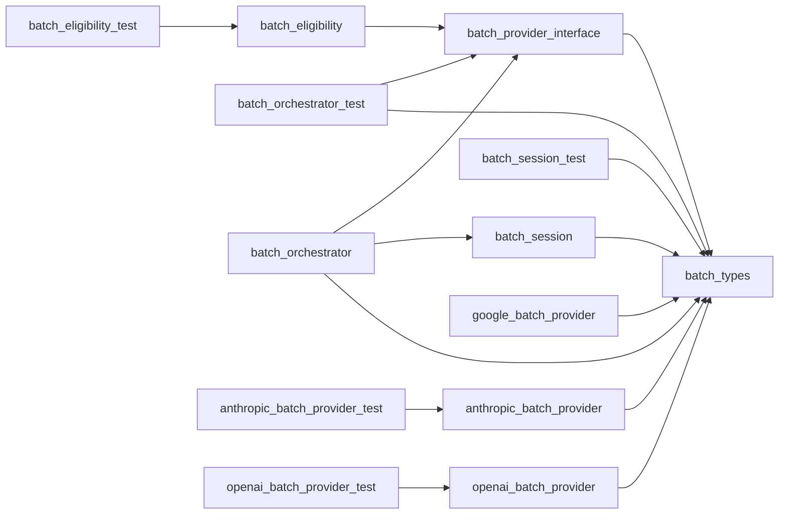

# Module: `batch`

_Generated: 2026-04-18_

## File Dependencies

## Symbol References

| Symbol                   | Kind      | Defined in                  | Used in                                                                                                                                                                                                    |
| ------------------------ | --------- | --------------------------- | ---------------------------------------------------------------------------------------------------------------------------------------------------------------------------------------------------------- |
| BatchableProvider        | interface | batch-provider.interface.ts | batch-orchestrator.test.ts, batch-orchestrator.ts, batch.command.ts, anthropic.provider.ts, openai.provider.ts                                                                                             |
| BatchOrchestrator        | class     | batch-orchestrator.ts       | batch-orchestrator.test.ts                                                                                                                                                                                 |
| BatchRequest             | interface | batch.types.ts              | batch-orchestrator.test.ts, batch-orchestrator.ts, batch-provider.interface.ts, stage-executor.ts, anthropic.provider.ts, openai.provider.ts                                                               |
| BatchResult              | interface | batch.types.ts              | batch-orchestrator.test.ts, batch-orchestrator.ts, batch-provider.interface.ts, anthropic.batch-provider.ts, google.batch-provider.ts, openai.batch-provider.ts, anthropic.provider.ts, openai.provider.ts |
| BatchStatusInfo          | interface | batch.types.ts              | batch-orchestrator.test.ts, batch-orchestrator.ts, batch-provider.interface.ts, anthropic.batch-provider.ts, google.batch-provider.ts, openai.batch-provider.ts, anthropic.provider.ts, openai.provider.ts |
| BatchStatusValue         | type      | batch.types.ts              | anthropic.batch-provider.ts, openai.batch-provider.ts                                                                                                                                                      |
| BatchSubmission          | interface | batch.types.ts              | batch-orchestrator.test.ts, batch-orchestrator.ts, batch-provider.interface.ts, anthropic.batch-provider.ts, google.batch-provider.ts, openai.batch-provider.ts, anthropic.provider.ts, openai.provider.ts |
| cancelAnthropicBatch     | function  | anthropic.batch-provider.ts | anthropic.provider.ts                                                                                                                                                                                      |
| cancelOpenAIBatch        | function  | openai.batch-provider.ts    | openai.provider.ts                                                                                                                                                                                         |
| cancelVertexBatch        | function  | google.batch-provider.ts    | —                                                                                                                                                                                                          |
| EligibilityResult        | interface | batch-eligibility.ts        | —                                                                                                                                                                                                          |
| generateLocalId          | function  | batch-session.ts            | batch-orchestrator.ts, anthropic.provider.ts, openai.provider.ts                                                                                                                                           |
| getAnthropicBatchResults | function  | anthropic.batch-provider.ts | anthropic.batch-provider.test.ts, anthropic.provider.ts                                                                                                                                                    |
| getAnthropicBatchStatus  | function  | anthropic.batch-provider.ts | anthropic.batch-provider.test.ts, anthropic.provider.ts                                                                                                                                                    |
| getBatchOrchestrator     | function  | batch-orchestrator.ts       | batch.command.ts, stage-executor.ts                                                                                                                                                                        |
| getOpenAIBatchResults    | function  | openai.batch-provider.ts    | openai.batch-provider.test.ts, openai.provider.ts                                                                                                                                                          |
| getOpenAIBatchStatus     | function  | openai.batch-provider.ts    | openai.batch-provider.test.ts, openai.provider.ts                                                                                                                                                          |
| getVertexBatchResults    | function  | google.batch-provider.ts    | —                                                                                                                                                                                                          |
| getVertexBatchStatus     | function  | google.batch-provider.ts    | —                                                                                                                                                                                                          |
| isBatchableProvider      | function  | batch-provider.interface.ts | batch-eligibility.ts, batch.command.ts, stage-executor.ts                                                                                                                                                  |
| isEligible               | function  | batch-eligibility.ts        | batch-eligibility.test.ts, stage-executor.ts                                                                                                                                                               |
| isVertexBatchConfigured  | function  | google.batch-provider.ts    | —                                                                                                                                                                                                          |
| listBatches              | function  | batch-session.ts            | batch-orchestrator.ts                                                                                                                                                                                      |
| loadBatch                | function  | batch-session.ts            | batch-orchestrator.ts, batch.command.ts                                                                                                                                                                    |
| mapAnthropicStatus       | function  | anthropic.batch-provider.ts | anthropic.batch-provider.test.ts                                                                                                                                                                           |
| mapOpenAIStatus          | function  | openai.batch-provider.ts    | openai.batch-provider.test.ts                                                                                                                                                                              |
| persistBatch             | function  | batch-session.ts            | batch-orchestrator.ts                                                                                                                                                                                      |
| PersistedBatch           | interface | batch.types.ts              | batch-orchestrator.ts, batch-session.test.ts, batch-session.ts                                                                                                                                             |
| removeBatch              | function  | batch-session.ts            | —                                                                                                                                                                                                          |
| submitAnthropicBatch     | function  | anthropic.batch-provider.ts | anthropic.provider.ts                                                                                                                                                                                      |
| submitOpenAIBatch        | function  | openai.batch-provider.ts    | openai.provider.ts                                                                                                                                                                                         |
| submitVertexBatch        | function  | google.batch-provider.ts    | —                                                                                                                                                                                                          |
| updateBatch              | function  | batch-session.ts            | batch-orchestrator.ts                                                                                                                                                                                      |
