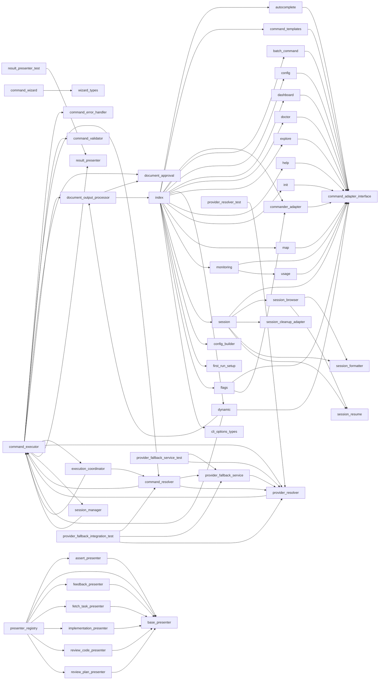

# Module: `cli`

_Generated: 2026-04-18_

## File Dependencies

## Symbol References

| Symbol                              | Kind      | Defined in                   | Used in                                                                                                                                                                                                  |
| ----------------------------------- | --------- | ---------------------------- | -------------------------------------------------------------------------------------------------------------------------------------------------------------------------------------------------------- |
| AssertPresenter                     | class     | assert-presenter.ts          | presenter-registry.ts                                                                                                                                                                                    |
| AutocompleteGenerator               | class     | autocomplete.ts              | —                                                                                                                                                                                                        |
| BaseWizardAnswers                   | interface | wizard.types.ts              | command-wizard.ts                                                                                                                                                                                        |
| checkAndRunFirstTimeSetup           | function  | first-run-setup.ts           | index.ts                                                                                                                                                                                                 |
| CliConfigBuilder                    | class     | config-builder.ts            | index.ts                                                                                                                                                                                                 |
| CliOptions                          | interface | cli-options.types.ts         | index.ts                                                                                                                                                                                                 |
| CLIProviderResolver                 | class     | provider-resolver.ts         | command-executor.ts, command-resolver.ts, provider-fallback-service.test.ts, provider-fallback-service.ts, provider-fallback.integration.test.ts, container.ts                                           |
| CLISessionManager                   | class     | session-manager.ts           | command-executor.ts, container.ts                                                                                                                                                                        |
| CLIUIAdapter                        | class     | session-cleanup-adapter.ts   | session.ts                                                                                                                                                                                               |
| CommandAdapter                      | interface | command-adapter.interface.ts | autocomplete.ts, command-templates.ts, commander-adapter.ts, batch.command.ts, config.ts, dashboard.ts, doctor.ts, dynamic.ts, explore.ts, help.ts, init.ts, map.ts, monitoring.ts, session.ts, usage.ts |
| CommanderCommandAdapter             | class     | commander-adapter.ts         | —                                                                                                                                                                                                        |
| CommanderCommandContract            | interface | commander-adapter.ts         | —                                                                                                                                                                                                        |
| CommanderOptionContract             | interface | commander-adapter.ts         | —                                                                                                                                                                                                        |
| CommandErrorHandler                 | class     | command-error-handler.ts     | command-executor.ts                                                                                                                                                                                      |
| CommandExecutionOptions             | interface | command-executor.ts          | command-resolver.ts, execution-coordinator.ts, provider-resolver.ts, session-manager.ts                                                                                                                  |
| CommandExecutor                     | class     | command-executor.ts          | dynamic.ts, container.ts, request-handler.ts, server.ts                                                                                                                                                  |
| CommandExecutorDependencies         | interface | command-executor.ts          | —                                                                                                                                                                                                        |
| CommandPalette                      | class     | command-palette.ts           | —                                                                                                                                                                                                        |
| CommandPaletteItem                  | interface | command-palette.ts           | —                                                                                                                                                                                                        |
| CommandPresenter                    | interface | base-presenter.ts            | presenter-registry.ts                                                                                                                                                                                    |
| CommandResolver                     | class     | command-resolver.ts          | command-executor.ts, provider-fallback.integration.test.ts                                                                                                                                               |
| CommandSuggestion                   | interface | command-suggestions.ts       | —                                                                                                                                                                                                        |
| CommandSuggestionEngine             | class     | command-suggestions.ts       | —                                                                                                                                                                                                        |
| CommandTemplate                     | interface | command-templates.ts         | —                                                                                                                                                                                                        |
| CommandValidator                    | class     | command-validator.ts         | command-executor.ts                                                                                                                                                                                      |
| CommandWizard                       | class     | command-wizard.ts            | —                                                                                                                                                                                                        |
| configureBatchCommand               | function  | batch.command.ts             | index.ts                                                                                                                                                                                                 |
| configureConfigCommand              | function  | config.ts                    | index.ts                                                                                                                                                                                                 |
| configureConsolidateCommand         | function  | dynamic.ts                   | index.ts                                                                                                                                                                                                 |
| configureDashboardCommand           | function  | dashboard.ts                 | index.ts                                                                                                                                                                                                 |
| configureDoctorCommand              | function  | doctor.ts                    | index.ts                                                                                                                                                                                                 |
| configureExecCommand                | function  | dynamic.ts                   | index.ts                                                                                                                                                                                                 |
| configureExploreCommand             | function  | explore.ts                   | index.ts                                                                                                                                                                                                 |
| configureHelpCommand                | function  | help.ts                      | index.ts                                                                                                                                                                                                 |
| configureInitCommand                | function  | init.ts                      | index.ts                                                                                                                                                                                                 |
| configureListCommand                | function  | dynamic.ts                   | index.ts                                                                                                                                                                                                 |
| configureMapCommand                 | function  | map.ts                       | index.ts                                                                                                                                                                                                 |
| configureMonitoringCommand          | function  | monitoring.ts                | index.ts                                                                                                                                                                                                 |
| configureRolloutCommand             | function  | dynamic.ts                   | index.ts                                                                                                                                                                                                 |
| configureSessionCommand             | function  | session.ts                   | index.ts                                                                                                                                                                                                 |
| configureShortcutCommands           | function  | dynamic.ts                   | index.ts                                                                                                                                                                                                 |
| configureUsageSubcommand            | function  | usage.ts                     | monitoring.ts                                                                                                                                                                                            |
| CustomWizardAnswers                 | interface | wizard.types.ts              | command-wizard.ts                                                                                                                                                                                        |
| DocumentApprovalWorkflow            | class     | document-approval.ts         | command-executor.ts, document-output-processor.ts, container.ts                                                                                                                                          |
| DocumentOutputProcessor             | class     | document-output-processor.ts | command-executor.ts, dynamic.ts, container.ts                                                                                                                                                            |
| DocumentOutputProcessorDependencies | interface | document-output-processor.ts | —                                                                                                                                                                                                        |
| DocumentOutputResult                | interface | document-output-processor.ts | —                                                                                                                                                                                                        |
| ErrorHandlingContext                | interface | command-error-handler.ts     | command-executor.ts                                                                                                                                                                                      |
| ExecuteWizardAnswers                | interface | wizard.types.ts              | command-wizard.ts                                                                                                                                                                                        |
| ExecutionCoordinator                | class     | execution-coordinator.ts     | command-executor.ts, execution-coordinator-dynamic-agent.integration.test.ts                                                                                                                             |
| ExecutionResult                     | interface | execution-coordinator.ts     | execution-modes.ts, orchestrator.ts                                                                                                                                                                      |
| FeedbackPresenter                   | class     | feedback-presenter.ts        | presenter-registry.ts                                                                                                                                                                                    |
| FetchTaskPresenter                  | class     | fetch-task-presenter.ts      | presenter-registry.ts                                                                                                                                                                                    |
| FileValidationResult                | interface | command-validator.ts         | —                                                                                                                                                                                                        |
| GenericWizardAnswers                | interface | wizard.types.ts              | command-wizard.ts                                                                                                                                                                                        |
| getModelsForProvider                | function  | provider-resolver.ts         | —                                                                                                                                                                                                        |
| getSessionFormatter                 | function  | session-formatter.ts         | session.ts, session-browser.ts                                                                                                                                                                           |
| globalFlags                         | variable  | flags.ts                     | index.ts                                                                                                                                                                                                 |
| GlobalFlags                         | interface | flags.ts                     | —                                                                                                                                                                                                        |
| ImplementationPresenter             | class     | implementation-presenter.ts  | presenter-registry.ts                                                                                                                                                                                    |
| ImplementWizardAnswers              | interface | wizard.types.ts              | command-wizard.ts                                                                                                                                                                                        |
| MODEL_PROVIDER_SUGGESTIONS          | constant  | provider-resolver.ts         | provider-resolver.test.ts                                                                                                                                                                                |
| OptionAdapter                       | interface | command-adapter.interface.ts | commander-adapter.ts, flags.ts                                                                                                                                                                           |
| PlanWizardAnswers                   | interface | wizard.types.ts              | command-wizard.ts                                                                                                                                                                                        |
| PresenterRegistry                   | class     | presenter-registry.ts        | document-output-processor.ts                                                                                                                                                                             |
| ProviderFallbackContext             | interface | provider-fallback-service.ts | —                                                                                                                                                                                                        |
| ProviderFallbackService             | class     | provider-fallback-service.ts | command-resolver.ts, provider-fallback-service.test.ts                                                                                                                                                   |
| ProviderMismatchHandler             | class     | provider-mismatch-handler.ts | provider-resolver.ts                                                                                                                                                                                     |
| ProviderResolution                  | interface | provider-resolver.ts         | provider-fallback-service.ts, provider-mismatch-handler.ts                                                                                                                                               |
| ProviderResolution                  | interface | provider-mismatch-handler.ts | provider-fallback-service.ts, provider-resolver.ts                                                                                                                                                       |
| ProviderResolution                  | interface | provider-fallback-service.ts | provider-mismatch-handler.ts, provider-resolver.ts                                                                                                                                                       |
| RecentCommand                       | interface | command-palette.ts           | use-dashboard-data.ts, recent-commands-panel.tsx, types.ts                                                                                                                                               |
| ResolvedCommand                     | interface | command-resolver.ts          | execution-coordinator.ts, execution-coordinator-dynamic-agent.integration.test.ts                                                                                                                        |
| ResultPresenter                     | class     | result-presenter.ts          | command-executor.ts, result-presenter.test.ts                                                                                                                                                            |
| ReviewCodePresenter                 | class     | review-code-presenter.ts     | presenter-registry.ts                                                                                                                                                                                    |
| ReviewPlanPresenter                 | class     | review-plan-presenter.ts     | presenter-registry.ts                                                                                                                                                                                    |
| SessionAcquisitionResult            | interface | session-manager.ts           | —                                                                                                                                                                                                        |
| SessionAnalysis                     | interface | session-resume.ts            | —                                                                                                                                                                                                        |
| SessionBrowser                      | class     | session-browser.ts           | session.ts                                                                                                                                                                                               |
| SessionFormatter                    | class     | session-formatter.ts         | —                                                                                                                                                                                                        |
| SessionResumeService                | class     | session-resume.ts            | session.ts, session-browser.ts                                                                                                                                                                           |
| ShellType                           | type      | autocomplete.ts              | —                                                                                                                                                                                                        |
| shouldTriggerFirstRun               | function  | first-run-setup.ts           | index.ts                                                                                                                                                                                                 |
| showSuggestions                     | function  | command-suggestions.ts       | —                                                                                                                                                                                                        |
| TemplateManager                     | class     | command-templates.ts         | —                                                                                                                                                                                                        |
| ValidationResult                    | interface | command-validator.ts         | review-code-presenter.ts, request-handler.ts, sampling-service.ts, input-validator.ts                                                                                                                    |
| WizardAnswers                       | type      | wizard.types.ts              | —                                                                                                                                                                                                        |
| WizardConfig                        | interface | command-wizard.ts            | —                                                                                                                                                                                                        |
| WizardStep                          | interface | command-wizard.ts            | —                                                                                                                                                                                                        |
| WorkflowContext                     | interface | command-suggestions.ts       | —                                                                                                                                                                                                        |
