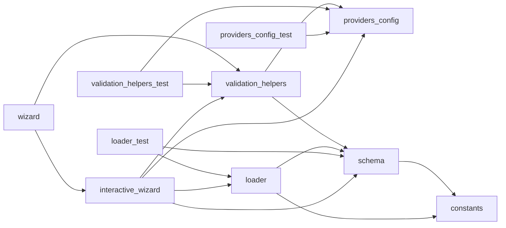

# Module: `config`

_Generated: 2026-04-18_

## File Dependencies

## Symbol References

| Symbol                                      | Kind      | Defined in            | Used in                                                                                                                                                                                                                                                                                                                                                         |
| ------------------------------------------- | --------- | --------------------- | --------------------------------------------------------------------------------------------------------------------------------------------------------------------------------------------------------------------------------------------------------------------------------------------------------------------------------------------------------------- |
| AST_CODEBASE_MAP_MAX_TOKENS                 | constant  | constants.ts          | —                                                                                                                                                                                                                                                                                                                                                               |
| AST_DEFAULT_CONTEXT_BUDGET                  | constant  | constants.ts          | —                                                                                                                                                                                                                                                                                                                                                               |
| AST_INDEX_BATCH_SIZE                        | constant  | constants.ts          | —                                                                                                                                                                                                                                                                                                                                                               |
| AST_INDEX_VERSION                           | constant  | constants.ts          | —                                                                                                                                                                                                                                                                                                                                                               |
| AST_MAX_INDEXABLE_FILES                     | constant  | constants.ts          | —                                                                                                                                                                                                                                                                                                                                                               |
| AST_WATCHER_DEBOUNCE_MS                     | constant  | constants.ts          | —                                                                                                                                                                                                                                                                                                                                                               |
| BYTES_PER_GB                                | constant  | constants.ts          | —                                                                                                                                                                                                                                                                                                                                                               |
| BYTES_PER_KB                                | constant  | constants.ts          | —                                                                                                                                                                                                                                                                                                                                                               |
| BYTES_PER_MB                                | constant  | constants.ts          | cleanup-scheduler.ts, logger.ts, retention-manager.ts, retention-manager.ts, base-retention-manager.ts                                                                                                                                                                                                                                                          |
| COMMAND_DISPLAY_TRUNCATE_LENGTH             | constant  | constants.ts          | —                                                                                                                                                                                                                                                                                                                                                               |
| COMMAND_EXECUTION_LIMIT                     | constant  | constants.ts          | rate-limiter.ts                                                                                                                                                                                                                                                                                                                                                 |
| COMMAND_EXISTENCE_CHECK_TIMEOUT_MS          | constant  | constants.ts          | safe-exec.ts                                                                                                                                                                                                                                                                                                                                                    |
| COMPLETION_MODE                             | constant  | constants.ts          | cursor.provider.ts                                                                                                                                                                                                                                                                                                                                              |
| CompletionModeValue                         | type      | constants.ts          | —                                                                                                                                                                                                                                                                                                                                                               |
| Config                                      | type      | schema.ts             | coordinator.ts, doctor.ts, config-builder.ts, provider-mismatch-handler.ts, provider-resolver.ts, interactive-wizard.ts, loader.ts, validation-helpers.ts, container.ts, hook-execution.service.ts, cursor.provider.ts, diagnostics.service.ts, config.types.ts, error-handler.test.ts, agentic-security.security.test.ts, security-validation.security.test.ts |
| CONFIG_ACCESS_LIMIT                         | constant  | constants.ts          | rate-limiter.ts                                                                                                                                                                                                                                                                                                                                                 |
| CONFIG_SCHEMA                               | constant  | schema.ts             | loader.test.ts, loader.ts                                                                                                                                                                                                                                                                                                                                       |
| ConfigLoader                                | class     | loader.ts             | config.ts, interactive-wizard.ts, loader.test.ts, container.ts, config-file-integration.test.ts                                                                                                                                                                                                                                                                 |
| configureDefaults                           | function  | validation-helpers.ts | interactive-wizard.ts, wizard.ts                                                                                                                                                                                                                                                                                                                                |
| configureProvider                           | function  | validation-helpers.ts | interactive-wizard.ts, wizard.ts                                                                                                                                                                                                                                                                                                                                |
| CONTAINER_ID_DISPLAY_LENGTH                 | constant  | constants.ts          | —                                                                                                                                                                                                                                                                                                                                                               |
| CONTEXT_THRESHOLD_WARNING                   | constant  | constants.ts          | processing-feedback.ts                                                                                                                                                                                                                                                                                                                                          |
| DAILY_FILE_ROTATION_ENABLED                 | constant  | constants.ts          | logger.ts                                                                                                                                                                                                                                                                                                                                                       |
| DEFAULT_BOX_WIDTH                           | constant  | constants.ts          | —                                                                                                                                                                                                                                                                                                                                                               |
| DEFAULT_CONFIG                              | constant  | schema.ts             | interactive-wizard.ts, loader.test.ts, loader.ts, config-file-integration.test.ts                                                                                                                                                                                                                                                                               |
| DEFAULT_CONTEXT_WINDOW                      | constant  | providers.config.ts   | —                                                                                                                                                                                                                                                                                                                                                               |
| DEFAULT_DAILY_FILE_MAX_SIZE_MB              | constant  | constants.ts          | loader.ts, schema.ts, logger.ts                                                                                                                                                                                                                                                                                                                                 |
| DEFAULT_HEADER_WIDTH                        | constant  | constants.ts          | —                                                                                                                                                                                                                                                                                                                                                               |
| DEFAULT_LOG_CLEANUP_INTERVAL_HOURS          | constant  | constants.ts          | loader.ts, schema.ts                                                                                                                                                                                                                                                                                                                                            |
| DEFAULT_LOG_COMPRESS_AFTER_DAYS             | constant  | constants.ts          | schema.ts                                                                                                                                                                                                                                                                                                                                                       |
| DEFAULT_LOG_DRY_RUN                         | constant  | constants.ts          | loader.ts, schema.ts                                                                                                                                                                                                                                                                                                                                            |
| DEFAULT_LOG_MAX_AGE_DAYS                    | constant  | constants.ts          | schema.ts                                                                                                                                                                                                                                                                                                                                                       |
| DEFAULT_LOG_MAX_FILES                       | constant  | constants.ts          | schema.ts                                                                                                                                                                                                                                                                                                                                                       |
| DEFAULT_LOG_MAX_SIZE_MB                     | constant  | constants.ts          | schema.ts                                                                                                                                                                                                                                                                                                                                                       |
| DEFAULT_LOG_RETENTION_ENABLED               | constant  | constants.ts          | loader.ts, schema.ts                                                                                                                                                                                                                                                                                                                                            |
| DEFAULT_MAX_RETRIES                         | constant  | constants.ts          | provider.interface.ts                                                                                                                                                                                                                                                                                                                                           |
| DEFAULT_MAX_TOKENS                          | constant  | constants.ts          | stage-executor.ts, anthropic.provider.ts, cursor.provider.test.ts, cursor.provider.ts, sampling-service.ts                                                                                                                                                                                                                                                      |
| DEFAULT_MEMORY_DECISION_HALF_LIFE_DAYS      | constant  | constants.ts          | schema.ts, manager.ts                                                                                                                                                                                                                                                                                                                                           |
| DEFAULT_MEMORY_ENABLED                      | constant  | constants.ts          | schema.ts                                                                                                                                                                                                                                                                                                                                                       |
| DEFAULT_MEMORY_EPISODIC_HALF_LIFE_DAYS      | constant  | constants.ts          | schema.ts, manager.ts                                                                                                                                                                                                                                                                                                                                           |
| DEFAULT_MEMORY_ERROR_HALF_LIFE_MULTIPLIER   | constant  | constants.ts          | schema.ts, manager.ts                                                                                                                                                                                                                                                                                                                                           |
| DEFAULT_MEMORY_INJECTION_STRENGTH_THRESHOLD | constant  | constants.ts          | schema.ts                                                                                                                                                                                                                                                                                                                                                       |
| DEFAULT_MEMORY_INJECTION_TOKEN_BUDGET       | constant  | constants.ts          | schema.ts                                                                                                                                                                                                                                                                                                                                                       |
| DEFAULT_MEMORY_MAX_ENTRIES_PER_STORE        | constant  | constants.ts          | schema.ts                                                                                                                                                                                                                                                                                                                                                       |
| DEFAULT_MEMORY_PRUNE_THRESHOLD              | constant  | constants.ts          | schema.ts, manager.ts                                                                                                                                                                                                                                                                                                                                           |
| DEFAULT_MEMORY_RETRIEVAL_BOOST_DAYS         | constant  | constants.ts          | schema.ts, manager.ts                                                                                                                                                                                                                                                                                                                                           |
| DEFAULT_MEMORY_SEMANTIC_HALF_LIFE_DAYS      | constant  | constants.ts          | schema.ts, manager.ts                                                                                                                                                                                                                                                                                                                                           |
| DEFAULT_MODELS                              | constant  | validation-helpers.ts | provider-resolver.test.ts, validation-helpers.test.ts                                                                                                                                                                                                                                                                                                           |
| DEFAULT_PROCESS_MEMORY_THRESHOLD_MB         | constant  | constants.ts          | system-monitor.ts                                                                                                                                                                                                                                                                                                                                               |
| DEFAULT_SESSION_CLEANUP_INTERVAL_HOURS      | constant  | constants.ts          | loader.ts, schema.ts                                                                                                                                                                                                                                                                                                                                            |
| DEFAULT_SESSION_COMPRESS_AFTER_DAYS         | constant  | constants.ts          | schema.ts                                                                                                                                                                                                                                                                                                                                                       |
| DEFAULT_SESSION_DRY_RUN                     | constant  | constants.ts          | loader.ts, schema.ts                                                                                                                                                                                                                                                                                                                                            |
| DEFAULT_SESSION_MAX_AGE_DAYS                | constant  | constants.ts          | schema.ts                                                                                                                                                                                                                                                                                                                                                       |
| DEFAULT_SESSION_MAX_COUNT                   | constant  | constants.ts          | schema.ts                                                                                                                                                                                                                                                                                                                                                       |
| DEFAULT_SESSION_MAX_SIZE_MB                 | constant  | constants.ts          | schema.ts                                                                                                                                                                                                                                                                                                                                                       |
| DEFAULT_SESSION_RETENTION_ENABLED           | constant  | constants.ts          | loader.ts, schema.ts                                                                                                                                                                                                                                                                                                                                            |
| DEFAULT_TEMPERATURE                         | constant  | constants.ts          | stage-executor.ts                                                                                                                                                                                                                                                                                                                                               |
| DEFAULT_TIMEOUT_MS                          | constant  | constants.ts          | tool-execution.service.ts, search-tools.service.ts, worktree-manager-secure.ts, provider.interface.ts                                                                                                                                                                                                                                                           |
| DEFAULTS_CONFIG_SCHEMA                      | constant  | schema.ts             | —                                                                                                                                                                                                                                                                                                                                                               |
| DefaultsConfig                              | type      | schema.ts             | config.types.ts                                                                                                                                                                                                                                                                                                                                                 |
| ERROR_STACK_TRACE_MAX_LENGTH                | constant  | constants.ts          | —                                                                                                                                                                                                                                                                                                                                                               |
| FEATURE_FLAGS_SCHEMA                        | constant  | schema.ts             | —                                                                                                                                                                                                                                                                                                                                                               |
| FeatureFlags                                | type      | schema.ts             | config.types.ts                                                                                                                                                                                                                                                                                                                                                 |
| filterValidProviders                        | function  | validation-helpers.ts | interactive-wizard.ts                                                                                                                                                                                                                                                                                                                                           |
| getAllModels                                | function  | providers.config.ts   | providers.config.test.ts                                                                                                                                                                                                                                                                                                                                        |
| getAllProviderKeys                          | function  | providers.config.ts   | providers.config.test.ts, validation-helpers.ts                                                                                                                                                                                                                                                                                                                 |
| getDefaultModel                             | function  | providers.config.ts   | provider-mismatch-handler.ts, provider-resolver.ts, providers.config.test.ts                                                                                                                                                                                                                                                                                    |
| getDocsUrl                                  | function  | constants.ts          | help-formatter.ts, error-messages.ts                                                                                                                                                                                                                                                                                                                            |
| getModelContextWindow                       | function  | providers.config.ts   | session-manager.ts, processing-feedback.ts, token-usage-panel.tsx                                                                                                                                                                                                                                                                                               |
| getProviderMetadata                         | function  | providers.config.ts   | interactive-wizard.ts, providers.config.test.ts, validation-helpers.ts                                                                                                                                                                                                                                                                                          |
| getProviderModels                           | function  | providers.config.ts   | provider-resolver.ts, providers.config.test.ts, anthropic.provider.ts, cursor.provider.ts, google.provider.ts, openai.provider.ts                                                                                                                                                                                                                               |
| getProvidersRequiringApiKey                 | function  | providers.config.ts   | providers.config.test.ts                                                                                                                                                                                                                                                                                                                                        |
| getProvidersWithoutApiKey                   | function  | providers.config.ts   | providers.config.test.ts                                                                                                                                                                                                                                                                                                                                        |
| hasModel                                    | function  | providers.config.ts   | providers.config.test.ts                                                                                                                                                                                                                                                                                                                                        |
| HEALTH_CHECK_INTERVAL_MS                    | constant  | constants.ts          | safe-exec.ts                                                                                                                                                                                                                                                                                                                                                    |
| HIGH_CONFIDENCE_THRESHOLD                   | constant  | constants.ts          | escalation-handler.service.ts, processing-feedback.ts                                                                                                                                                                                                                                                                                                           |
| HOOK_COMMAND_SCHEMA                         | constant  | schema.ts             | —                                                                                                                                                                                                                                                                                                                                                               |
| HOOK_MATCHER_SCHEMA                         | constant  | schema.ts             | —                                                                                                                                                                                                                                                                                                                                                               |
| HOOKS_CONFIG_FILE                           | constant  | constants.ts          | hook-execution.service.ts                                                                                                                                                                                                                                                                                                                                       |
| HOOKS_CONFIG_SCHEMA                         | constant  | schema.ts             | plugin-manifest.schema.ts                                                                                                                                                                                                                                                                                                                                       |
| HooksConfigSchema                           | type      | schema.ts             | —                                                                                                                                                                                                                                                                                                                                                               |
| IDEMPOTENCY_CLEANUP_INTERVAL_MS             | constant  | constants.ts          | —                                                                                                                                                                                                                                                                                                                                                               |
| IDEMPOTENCY_LOCK_TIMEOUT_MS                 | constant  | constants.ts          | —                                                                                                                                                                                                                                                                                                                                                               |
| isValidProvider                             | function  | providers.config.ts   | providers.config.test.ts                                                                                                                                                                                                                                                                                                                                        |
| LOG_BUFFER_SIZE                             | constant  | constants.ts          | logger.ts                                                                                                                                                                                                                                                                                                                                                       |
| LOG_COMPRESSED_EXTENSION                    | constant  | constants.ts          | —                                                                                                                                                                                                                                                                                                                                                               |
| LOG_COMPRESSION_LEVEL                       | constant  | constants.ts          | —                                                                                                                                                                                                                                                                                                                                                               |
| LOG_DATE_FORMAT                             | constant  | constants.ts          | —                                                                                                                                                                                                                                                                                                                                                               |
| LOG_FILE_EXTENSION                          | constant  | constants.ts          | logger.ts                                                                                                                                                                                                                                                                                                                                                       |
| LOG_FILE_PREFIX                             | constant  | constants.ts          | logger.ts                                                                                                                                                                                                                                                                                                                                                       |
| LOG_PREVIEW_LINE_COUNT                      | constant  | constants.ts          | —                                                                                                                                                                                                                                                                                                                                                               |
| LOGGING_RETENTION_CONFIG_SCHEMA             | constant  | schema.ts             | —                                                                                                                                                                                                                                                                                                                                                               |
| LoggingRetentionConfig                      | type      | schema.ts             | config-builder.ts                                                                                                                                                                                                                                                                                                                                               |
| LOW_CONFIDENCE_THRESHOLD                    | constant  | constants.ts          | —                                                                                                                                                                                                                                                                                                                                                               |
| LSP_CACHE_MAX_ENTRIES                       | constant  | constants.ts          | —                                                                                                                                                                                                                                                                                                                                                               |
| LSP_CACHE_TTL_MS                            | constant  | constants.ts          | —                                                                                                                                                                                                                                                                                                                                                               |
| LSP_DIAGNOSTICS_WAIT_MS                     | constant  | constants.ts          | —                                                                                                                                                                                                                                                                                                                                                               |
| LSP_IDLE_TIMEOUT_MS                         | constant  | constants.ts          | —                                                                                                                                                                                                                                                                                                                                                               |
| LSP_MAX_DIAGNOSTICS_DISPLAY                 | constant  | constants.ts          | —                                                                                                                                                                                                                                                                                                                                                               |
| LSP_REQUEST_TIMEOUT_MS                      | constant  | constants.ts          | —                                                                                                                                                                                                                                                                                                                                                               |
| MAX_ARRAY_LENGTH                            | constant  | constants.ts          | —                                                                                                                                                                                                                                                                                                                                                               |
| MAX_BUFFER_SIZE_BYTES                       | constant  | constants.ts          | —                                                                                                                                                                                                                                                                                                                                                               |
| MAX_COUNTER_METRICS                         | constant  | constants.ts          | —                                                                                                                                                                                                                                                                                                                                                               |
| MAX_GAUGE_METRICS                           | constant  | constants.ts          | —                                                                                                                                                                                                                                                                                                                                                               |
| MAX_GREP_OUTPUT_LINES                       | constant  | constants.ts          | output-compression.service.ts, search-tools.service.ts                                                                                                                                                                                                                                                                                                          |
| MAX_HISTOGRAM_METRICS                       | constant  | constants.ts          | —                                                                                                                                                                                                                                                                                                                                                               |
| MAX_LIST_DIR_ENTRIES                        | constant  | constants.ts          | tool-execution.service.ts                                                                                                                                                                                                                                                                                                                                       |
| MAX_MCP_OUTPUT_CHARS                        | constant  | constants.ts          | tool-execution.service.ts                                                                                                                                                                                                                                                                                                                                       |
| MAX_OBJECT_DEPTH                            | constant  | constants.ts          | —                                                                                                                                                                                                                                                                                                                                                               |
| MAX_OBJECT_KEYS                             | constant  | constants.ts          | —                                                                                                                                                                                                                                                                                                                                                               |
| MAX_OUTPUT_PREVIEW_LENGTH                   | constant  | constants.ts          | —                                                                                                                                                                                                                                                                                                                                                               |
| MAX_READ_FILE_SIZE_BYTES                    | constant  | constants.ts          | —                                                                                                                                                                                                                                                                                                                                                               |
| MAX_REQUEST_SIZE_BYTES                      | constant  | constants.ts          | —                                                                                                                                                                                                                                                                                                                                                               |
| MAX_SEQUENCE_ATTEMPTS                       | constant  | constants.ts          | —                                                                                                                                                                                                                                                                                                                                                               |
| MAX_SESSION_SIZE_BYTES                      | constant  | constants.ts          | —                                                                                                                                                                                                                                                                                                                                                               |
| MAX_STRING_LENGTH                           | constant  | constants.ts          | —                                                                                                                                                                                                                                                                                                                                                               |
| MAX_TERMINAL_OUTPUT_CHARS                   | constant  | constants.ts          | output-compression.service.ts                                                                                                                                                                                                                                                                                                                                   |
| MCP_ID                                      | constant  | constants.ts          | server-manager.ts, logger.ts, retention-manager.ts                                                                                                                                                                                                                                                                                                              |
| MCP_SAMPLING_LIMIT                          | constant  | constants.ts          | rate-limiter.ts                                                                                                                                                                                                                                                                                                                                                 |
| MCP_TOOL_CALL_LIMIT                         | constant  | constants.ts          | rate-limiter.ts                                                                                                                                                                                                                                                                                                                                                 |
| MEDIUM_CONFIDENCE_THRESHOLD                 | constant  | constants.ts          | escalation-handler.service.ts                                                                                                                                                                                                                                                                                                                                   |
| MEMORY_CONFIG_SCHEMA                        | constant  | schema.ts             | —                                                                                                                                                                                                                                                                                                                                                               |
| MEMORY_PERSIST_DEBOUNCE_MS                  | constant  | constants.ts          | store.ts                                                                                                                                                                                                                                                                                                                                                        |
| MEMORY_STORE_VERSION                        | constant  | constants.ts          | store.ts                                                                                                                                                                                                                                                                                                                                                        |
| MemoryRetentionConfig                       | type      | schema.ts             | manager.ts                                                                                                                                                                                                                                                                                                                                                      |
| MIN_RETRY_BACKOFF_MS                        | constant  | constants.ts          | —                                                                                                                                                                                                                                                                                                                                                               |
| MODEL_CONTEXT_WINDOWS                       | constant  | providers.config.ts   | —                                                                                                                                                                                                                                                                                                                                                               |
| ModelMode                                   | interface | providers.config.ts   | —                                                                                                                                                                                                                                                                                                                                                               |
| MS_PER_DAY                                  | constant  | constants.ts          | decay.test.ts, decay.ts, retention-manager.ts, retention-manager.ts                                                                                                                                                                                                                                                                                             |
| MS_PER_HOUR                                 | constant  | constants.ts          | system-monitor.ts, base-cleanup-scheduler.ts                                                                                                                                                                                                                                                                                                                    |
| MS_PER_MINUTE                               | constant  | constants.ts          | base-cleanup-scheduler.ts                                                                                                                                                                                                                                                                                                                                       |
| MS_PER_SECOND                               | constant  | constants.ts          | —                                                                                                                                                                                                                                                                                                                                                               |
| OUTPUT_COMPRESSION_THRESHOLD                | constant  | constants.ts          | output-compression.service.ts                                                                                                                                                                                                                                                                                                                                   |
| OUTPUT_KEY_DISPLAY_COUNT                    | constant  | constants.ts          | —                                                                                                                                                                                                                                                                                                                                                               |
| PATHS_CONFIG_SCHEMA                         | constant  | schema.ts             | —                                                                                                                                                                                                                                                                                                                                                               |
| PathsConfig                                 | type      | schema.ts             | config.types.ts                                                                                                                                                                                                                                                                                                                                                 |
| PBKDF2_ITERATIONS                           | constant  | constants.ts          | —                                                                                                                                                                                                                                                                                                                                                               |
| PBKDF2_ITERATIONS_LEGACY                    | constant  | constants.ts          | —                                                                                                                                                                                                                                                                                                                                                               |
| PLUGIN_SOURCE_SCHEMA                        | constant  | schema.ts             | —                                                                                                                                                                                                                                                                                                                                                               |
| PLUGINS_CONFIG_SCHEMA                       | constant  | schema.ts             | —                                                                                                                                                                                                                                                                                                                                                               |
| PluginsConfigSchema                         | type      | schema.ts             | —                                                                                                                                                                                                                                                                                                                                                               |
| PROJECT_ID_HASH_LENGTH                      | constant  | constants.ts          | —                                                                                                                                                                                                                                                                                                                                                               |
| PROVIDER_CHOICES                            | constant  | validation-helpers.ts | interactive-wizard.ts, validation-helpers.test.ts                                                                                                                                                                                                                                                                                                               |
| PROVIDER_CONFIG_SCHEMA                      | constant  | schema.ts             | —                                                                                                                                                                                                                                                                                                                                                               |
| PROVIDER_KEYS                               | constant  | providers.config.ts   | —                                                                                                                                                                                                                                                                                                                                                               |
| PROVIDER_LABELS                             | constant  | validation-helpers.ts | validation-helpers.test.ts                                                                                                                                                                                                                                                                                                                                      |
| PROVIDER_REGISTRY                           | constant  | providers.config.ts   | provider-resolver.ts, providers.config.test.ts, validation-helpers.ts                                                                                                                                                                                                                                                                                           |
| ProviderConfig                              | type      | schema.ts             | provider-fallback-service.test.ts, provider-mismatch-handler.ts, provider-resolver.ts, config.types.ts                                                                                                                                                                                                                                                          |
| ProviderMetadata                            | interface | providers.config.ts   | —                                                                                                                                                                                                                                                                                                                                                               |
| PROVIDERS_CONFIG_SCHEMA                     | constant  | schema.ts             | —                                                                                                                                                                                                                                                                                                                                                               |
| ProvidersConfig                             | type      | schema.ts             | config.types.ts                                                                                                                                                                                                                                                                                                                                                 |
| QUICK_SELECT_LIST_PAGE_SIZE                 | constant  | constants.ts          | —                                                                                                                                                                                                                                                                                                                                                               |
| QUICK_SETUP_CHOICES                         | constant  | validation-helpers.ts | interactive-wizard.ts, validation-helpers.test.ts                                                                                                                                                                                                                                                                                                               |
| RATE_LIMIT_BLOCK_DURATION_MS                | constant  | constants.ts          | rate-limiter.ts                                                                                                                                                                                                                                                                                                                                                 |
| RATE_LIMIT_WINDOW_MS                        | constant  | constants.ts          | rate-limiter.ts                                                                                                                                                                                                                                                                                                                                                 |
| RECENT_SESSIONS_DISPLAY_COUNT               | constant  | constants.ts          | —                                                                                                                                                                                                                                                                                                                                                               |
| RESOURCE_ALERT_CRITICAL_THRESHOLD           | constant  | constants.ts          | —                                                                                                                                                                                                                                                                                                                                                               |
| RESOURCE_ALERT_WARNING_THRESHOLD            | constant  | constants.ts          | —                                                                                                                                                                                                                                                                                                                                                               |
| RESOURCE_MONITOR_INTERVAL_MS                | constant  | constants.ts          | system-monitor.ts                                                                                                                                                                                                                                                                                                                                               |
| RETRY_BACKOFF_MS                            | constant  | constants.ts          | —                                                                                                                                                                                                                                                                                                                                                               |
| SESSION_ARCHIVE_DAYS                        | constant  | constants.ts          | lifecycle.ts                                                                                                                                                                                                                                                                                                                                                    |
| SESSION_CLEANUP_DAYS                        | constant  | constants.ts          | lifecycle.ts, store.ts                                                                                                                                                                                                                                                                                                                                          |
| SESSION_ID_DISPLAY_LENGTH                   | constant  | constants.ts          | —                                                                                                                                                                                                                                                                                                                                                               |
| SESSION_LIST_PAGE_SIZE                      | constant  | constants.ts          | —                                                                                                                                                                                                                                                                                                                                                               |
| SESSION_PERSIST_DEBOUNCE_MS                 | constant  | constants.ts          | lifecycle.ts                                                                                                                                                                                                                                                                                                                                                    |
| SESSION_PERSIST_EXTENDED_DEBOUNCE_MS        | constant  | constants.ts          | lifecycle.ts                                                                                                                                                                                                                                                                                                                                                    |
| SESSION_RAPID_COMMAND_THRESHOLD_MS          | constant  | constants.ts          | lifecycle.ts                                                                                                                                                                                                                                                                                                                                                    |
| SESSION_RETENTION_CONFIG_SCHEMA             | constant  | schema.ts             | —                                                                                                                                                                                                                                                                                                                                                               |
| SessionRetentionConfig                      | type      | schema.ts             | config-builder.ts                                                                                                                                                                                                                                                                                                                                               |
| SetupWizard                                 | class     | interactive-wizard.ts | config.ts, dynamic.ts, first-run-setup.ts, provider-mismatch-handler.ts, wizard.ts                                                                                                                                                                                                                                                                              |
| SLOW_OPERATIONS_DISPLAY_COUNT               | constant  | constants.ts          | —                                                                                                                                                                                                                                                                                                                                                               |
| STALE_DOCUMENT_THRESHOLD_DAYS               | constant  | constants.ts          | —                                                                                                                                                                                                                                                                                                                                                               |
| SUGGESTION_DISPLAY_COUNT                    | constant  | constants.ts          | —                                                                                                                                                                                                                                                                                                                                                               |
| SYSTEM_MONITOR_INTERVAL_MS                  | constant  | constants.ts          | system-monitor.ts                                                                                                                                                                                                                                                                                                                                               |
| TEST_SHORT_TIMEOUT_MS                       | constant  | constants.ts          | —                                                                                                                                                                                                                                                                                                                                                               |
| TEST_TIMEOUT_MS                             | constant  | constants.ts          | —                                                                                                                                                                                                                                                                                                                                                               |
| TRACING_BATCH_EXPORT_INTERVAL_MS            | constant  | constants.ts          | —                                                                                                                                                                                                                                                                                                                                                               |
| TRACING_MAX_BATCH_SIZE                      | constant  | constants.ts          | —                                                                                                                                                                                                                                                                                                                                                               |
| TRACING_MAX_QUEUE_SIZE                      | constant  | constants.ts          | —                                                                                                                                                                                                                                                                                                                                                               |
| validateApiKey                              | function  | validation-helpers.ts | —                                                                                                                                                                                                                                                                                                                                                               |
