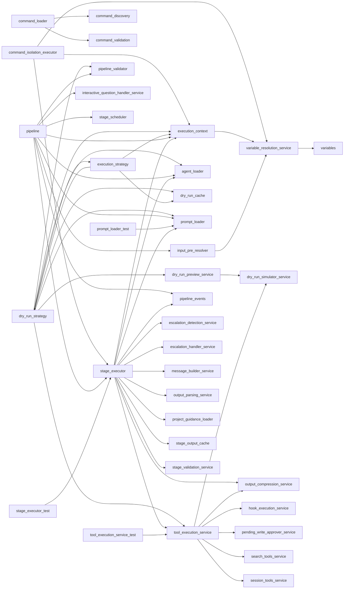

# Module: `executor`

_Generated: 2026-04-18_

## File Dependencies

## Symbol References

| Symbol                            | Kind      | Defined in                              | Used in                                                                                                                                                                                                                                                                            |
| --------------------------------- | --------- | --------------------------------------- | ---------------------------------------------------------------------------------------------------------------------------------------------------------------------------------------------------------------------------------------------------------------------------------- |
| AgentLoader                       | class     | agent-loader.ts                         | command-executor.ts, execution-coordinator.ts, container.ts, dry-run-strategy.ts, execution-strategy.ts, pipeline.ts, stage-executor.ts                                                                                                                                            |
| ClarifyingQuestion                | interface | interactive-question-handler.service.ts | document.types.ts                                                                                                                                                                                                                                                                  |
| clearAgentContentCache            | function  | project-guidance-loader.ts              | —                                                                                                                                                                                                                                                                                  |
| clearGuidanceCache                | function  | project-guidance-loader.ts              | —                                                                                                                                                                                                                                                                                  |
| clearKnowledgeCache               | function  | project-guidance-loader.ts              | —                                                                                                                                                                                                                                                                                  |
| COMMAND_FILE_EXTENSION            | constant  | command-discovery.ts                    | —                                                                                                                                                                                                                                                                                  |
| CommandExecutionStrategy          | interface | execution-strategy.ts                   | dry-run-strategy.ts                                                                                                                                                                                                                                                                |
| commandFileExists                 | function  | command-discovery.ts                    | command-loader.ts                                                                                                                                                                                                                                                                  |
| CommandIsolationExecutor          | class     | command-isolation.executor.ts           | command-executor.ts, container.ts                                                                                                                                                                                                                                                  |
| CommandLoader                     | class     | command-loader.ts                       | autocomplete.ts, command-executor.ts, command-palette.ts, command-resolver.ts, dynamic.ts, provider-fallback.integration.test.ts, container.ts, command-discovery.service.ts, server.ts, tool-registry.ts                                                                          |
| compressMessageHistory            | function  | stage-executor.ts                       | stage-executor.test.ts                                                                                                                                                                                                                                                             |
| compressTerminalOutput            | function  | output-compression.service.ts           | tool-execution.service.ts, output-compression.service.test.ts                                                                                                                                                                                                                      |
| createDryRunStrategy              | function  | dry-run-strategy.ts                     | —                                                                                                                                                                                                                                                                                  |
| DEFAULT_COMMANDS_DIR              | constant  | command-discovery.ts                    | —                                                                                                                                                                                                                                                                                  |
| DEFAULT_FAILURE_POLICY            | constant  | stage-executor.ts                       | stage-executor.test.ts                                                                                                                                                                                                                                                             |
| discoverCommandFiles              | function  | command-discovery.ts                    | —                                                                                                                                                                                                                                                                                  |
| djb2                              | function  | stage-executor.ts                       | stage-executor.test.ts                                                                                                                                                                                                                                                             |
| DryRunCache                       | class     | dry-run-cache.ts                        | —                                                                                                                                                                                                                                                                                  |
| DryRunCacheEntry                  | interface | dry-run-cache.ts                        | dry-run-strategy.ts, execution-strategy.ts                                                                                                                                                                                                                                         |
| DryRunCacheLookupOptions          | interface | dry-run-cache.ts                        | dry-run-strategy.ts                                                                                                                                                                                                                                                                |
| DryRunCacheLookupResult           | interface | dry-run-cache.ts                        | —                                                                                                                                                                                                                                                                                  |
| DryRunExecutionStrategy           | class     | dry-run-strategy.ts                     | execution-strategy.ts                                                                                                                                                                                                                                                              |
| DryRunPreviewOptions              | interface | dry-run-preview.service.ts              | —                                                                                                                                                                                                                                                                                  |
| DryRunPreviewService              | class     | dry-run-preview.service.ts              | —                                                                                                                                                                                                                                                                                  |
| DryRunSummary                     | interface | dry-run-preview.service.ts              | —                                                                                                                                                                                                                                                                                  |
| DryRunToolSimulator               | class     | dry-run-simulator.service.ts            | tool-execution.service.ts                                                                                                                                                                                                                                                          |
| EscalationDetectionService        | class     | escalation-detection.service.ts         | stage-executor.ts                                                                                                                                                                                                                                                                  |
| EscalationHandlerService          | class     | escalation-handler.service.ts           | stage-executor.ts                                                                                                                                                                                                                                                                  |
| ExecutionContext                  | class     | execution-context.ts                    | batch-eligibility.test.ts, batch-eligibility.ts, execution-coordinator.ts, command-isolation.executor.ts, dry-run-strategy.ts, execution-strategy.ts, pipeline.ts, stage-executor.ts, execution-modes.ts, orchestrator.ts, execution-coordinator-dynamic-agent.integration.test.ts |
| ExecutionContextOptions           | interface | execution-context.ts                    | —                                                                                                                                                                                                                                                                                  |
| extractCommandName                | function  | command-discovery.ts                    | —                                                                                                                                                                                                                                                                                  |
| filesToCommandNames               | function  | command-discovery.ts                    | —                                                                                                                                                                                                                                                                                  |
| filterCommandFiles                | function  | command-discovery.ts                    | —                                                                                                                                                                                                                                                                                  |
| FlushResult                       | interface | pending-write-approver.service.ts       | —                                                                                                                                                                                                                                                                                  |
| formatMemoryForInjection          | function  | memory-formatter.ts                     | —                                                                                                                                                                                                                                                                                  |
| getCommandFilePath                | function  | command-discovery.ts                    | command-loader.ts                                                                                                                                                                                                                                                                  |
| getCompressionStats               | function  | output-compression.service.ts           | stage-executor.ts, tool-execution.service.ts, output-compression.service.test.ts                                                                                                                                                                                                   |
| getEscalationHandlerService       | function  | escalation-handler.service.ts           | stage-executor.ts                                                                                                                                                                                                                                                                  |
| getGuidanceFilePatterns           | function  | project-guidance-loader.ts              | —                                                                                                                                                                                                                                                                                  |
| getHookExecutionService           | function  | hook-execution.service.ts               | container.ts, tool-execution.service.ts                                                                                                                                                                                                                                            |
| getInputPreResolver               | function  | input-pre-resolver.ts                   | pipeline.ts                                                                                                                                                                                                                                                                        |
| getProjectRoot                    | function  | project-guidance-loader.ts              | —                                                                                                                                                                                                                                                                                  |
| getStageValidationService         | function  | stage-validation.service.ts             | stage-executor.ts                                                                                                                                                                                                                                                                  |
| handleCommandLoadError            | function  | command-validation.ts                   | command-loader.ts                                                                                                                                                                                                                                                                  |
| hasProjectGuidance                | function  | project-guidance-loader.ts              | —                                                                                                                                                                                                                                                                                  |
| HookExecutionService              | class     | hook-execution.service.ts               | hook-execution.service.test.ts                                                                                                                                                                                                                                                     |
| InputPreResolver                  | class     | input-pre-resolver.ts                   | pipeline.ts                                                                                                                                                                                                                                                                        |
| InteractiveQuestionHandlerService | class     | interactive-question-handler.service.ts | pipeline.ts                                                                                                                                                                                                                                                                        |
| InteractiveQuestionResult         | interface | interactive-question-handler.service.ts | —                                                                                                                                                                                                                                                                                  |
| listAvailableCommands             | function  | command-discovery.ts                    | command-loader.ts                                                                                                                                                                                                                                                                  |
| loadAllCommandFiles               | function  | command-discovery.ts                    | —                                                                                                                                                                                                                                                                                  |
| loadAvailableAgents               | function  | project-guidance-loader.ts              | stage-executor.ts                                                                                                                                                                                                                                                                  |
| loadProjectGuidance               | function  | project-guidance-loader.ts              | stage-executor.ts                                                                                                                                                                                                                                                                  |
| loadProjectKnowledge              | function  | project-guidance-loader.ts              | stage-executor.ts                                                                                                                                                                                                                                                                  |
| MAX_COMMAND_FILE_SIZE             | constant  | command-discovery.ts                    | —                                                                                                                                                                                                                                                                                  |
| MAX_COMMAND_NAME_LENGTH           | constant  | command-discovery.ts                    | —                                                                                                                                                                                                                                                                                  |
| MessageBuilderService             | class     | message-builder.service.ts              | stage-executor.ts                                                                                                                                                                                                                                                                  |
| OutputParsingService              | class     | output-parsing.service.ts               | stage-executor.ts                                                                                                                                                                                                                                                                  |
| ParsedOutputs                     | interface | output-parsing.service.ts               | —                                                                                                                                                                                                                                                                                  |
| PendingWrite                      | interface | pending-write-approver.service.ts       | tool-execution.service.ts                                                                                                                                                                                                                                                          |
| PendingWriteApproverService       | class     | pending-write-approver.service.ts       | tool-execution.service.ts                                                                                                                                                                                                                                                          |
| PipelineExecutionContext          | interface | stage-executor.ts                       | pipeline.ts                                                                                                                                                                                                                                                                        |
| PipelineExecutionStrategy         | class     | execution-strategy.ts                   | —                                                                                                                                                                                                                                                                                  |
| PipelineExecutor                  | class     | pipeline.ts                             | command-executor.ts, container.ts, dry-run-strategy.ts, execution-strategy.ts                                                                                                                                                                                                      |
| PipelineValidator                 | class     | pipeline-validator.ts                   | dry-run-strategy.ts, pipeline.ts                                                                                                                                                                                                                                                   |
| PreloadedAgent                    | interface | dry-run-cache.ts                        | dry-run-strategy.ts                                                                                                                                                                                                                                                                |
| PreloadedPrompt                   | interface | dry-run-cache.ts                        | dry-run-strategy.ts                                                                                                                                                                                                                                                                |
| PreresolvedInputs                 | interface | dry-run-cache.ts                        | dry-run-strategy.ts                                                                                                                                                                                                                                                                |
| PreResolvedInputs                 | interface | input-pre-resolver.ts                   | pipeline.ts                                                                                                                                                                                                                                                                        |
| PromptLoader                      | class     | prompt-loader.ts                        | command-executor.ts, container.ts, dry-run-strategy.ts, execution-strategy.ts, pipeline.ts, prompt-loader.test.ts, stage-executor.ts                                                                                                                                               |
| QuestionAnswer                    | interface | interactive-question-handler.service.ts | —                                                                                                                                                                                                                                                                                  |
| REQUIRED_COMMAND_FIELDS           | constant  | command-validation.ts                   | —                                                                                                                                                                                                                                                                                  |
| resetCompressionStats             | function  | output-compression.service.ts           | output-compression.service.test.ts                                                                                                                                                                                                                                                 |
| resetInputPreResolver             | function  | input-pre-resolver.ts                   | —                                                                                                                                                                                                                                                                                  |
| SearchToolsService                | class     | search-tools.service.ts                 | tool-execution.service.ts                                                                                                                                                                                                                                                          |
| SessionInfo                       | interface | execution-context.ts                    | execution-coordinator.ts                                                                                                                                                                                                                                                           |
| SessionToolsService               | class     | session-tools.service.ts                | tool-execution.service.ts                                                                                                                                                                                                                                                          |
| setHookExecutionService           | function  | hook-execution.service.ts               | —                                                                                                                                                                                                                                                                                  |
| SimulatedOperation                | interface | dry-run-simulator.service.ts            | dry-run-preview.service.ts, tool-execution.service.ts                                                                                                                                                                                                                              |
| SimulatedOperationType            | type      | dry-run-simulator.service.ts            | dry-run-preview.service.ts                                                                                                                                                                                                                                                         |
| SimulatedToolResult               | interface | dry-run-simulator.service.ts            | —                                                                                                                                                                                                                                                                                  |
| StageCacheConfig                  | interface | stage-output-cache.ts                   | —                                                                                                                                                                                                                                                                                  |
| StageCacheEntry                   | interface | stage-output-cache.ts                   | —                                                                                                                                                                                                                                                                                  |
| StageCacheLookupResult            | interface | stage-output-cache.ts                   | —                                                                                                                                                                                                                                                                                  |
| StageExecutionOptions             | interface | stage-executor.ts                       | pipeline.ts                                                                                                                                                                                                                                                                        |
| StageExecutor                     | class     | stage-executor.ts                       | command-executor.ts, container.ts, command-isolation.executor.ts, pipeline.ts                                                                                                                                                                                                      |
| StageOutputCache                  | class     | stage-output-cache.ts                   | stage-executor.ts                                                                                                                                                                                                                                                                  |
| StageScheduler                    | class     | stage-scheduler.ts                      | pipeline.ts                                                                                                                                                                                                                                                                        |
| StageValidationResult             | interface | stage-validation.service.ts             | —                                                                                                                                                                                                                                                                                  |
| StageValidationService            | class     | stage-validation.service.ts             | stage-executor.ts                                                                                                                                                                                                                                                                  |
| stripAnsiCodes                    | function  | output-compression.service.ts           | stage-executor.ts, output-compression.service.test.ts                                                                                                                                                                                                                              |
| SystemMessageOptions              | interface | message-builder.service.ts              | —                                                                                                                                                                                                                                                                                  |
| ToolExecutionService              | class     | tool-execution.service.ts               | stage-executor.ts                                                                                                                                                                                                                                                                  |
| truncateTerminalOutput            | function  | output-compression.service.ts           | output-compression.service.test.ts                                                                                                                                                                                                                                                 |
| validateCommandFile               | function  | command-discovery.ts                    | —                                                                                                                                                                                                                                                                                  |
| validateCommandMetadata           | function  | command-validation.ts                   | command-loader.ts                                                                                                                                                                                                                                                                  |
| validateCommandName               | function  | command-discovery.ts                    | command-loader.ts                                                                                                                                                                                                                                                                  |
| validateCommandsDirectory         | function  | command-discovery.ts                    | —                                                                                                                                                                                                                                                                                  |
| validatePipelineStages            | function  | command-validation.ts                   | —                                                                                                                                                                                                                                                                                  |
| VariableContext                   | interface | variables.ts                            | variable-resolution.service.ts                                                                                                                                                                                                                                                     |
| VariableDefinition                | interface | variable-resolution.service.ts          | —                                                                                                                                                                                                                                                                                  |
| VariableResolutionOptions         | interface | variable-resolution.service.ts          | —                                                                                                                                                                                                                                                                                  |
| VariableResolutionService         | class     | variable-resolution.service.ts          | command-isolation.executor.ts, execution-context.ts, input-pre-resolver.ts                                                                                                                                                                                                         |
| VariableResolver                  | class     | variables.ts                            | variable-resolution.service.ts                                                                                                                                                                                                                                                     |
| VariableScope                     | type      | variables.ts                            | variable-resolution.service.ts                                                                                                                                                                                                                                                     |
| WorktreeInfoContext               | interface | stage-executor.ts                       | —                                                                                                                                                                                                                                                                                  |
