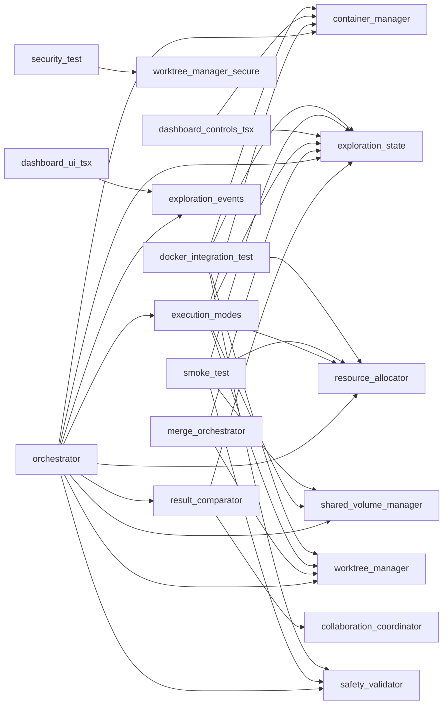

# Module: `exploration`

_Generated: 2026-04-18_

## File Dependencies

## Symbol References

| Symbol                      | Kind      | Defined in                   | Used in                                                                                                                                                                                                                                                                              |
| --------------------------- | --------- | ---------------------------- | ------------------------------------------------------------------------------------------------------------------------------------------------------------------------------------------------------------------------------------------------------------------------------------ |
| AllocationRequest           | interface | resource-allocator.ts        | —                                                                                                                                                                                                                                                                                    |
| CollaborationCoordinator    | class     | collaboration-coordinator.ts | explore.ts, result-comparator.ts                                                                                                                                                                                                                                                     |
| ComparisonMetrics           | interface | result-comparator.ts         | —                                                                                                                                                                                                                                                                                    |
| ComparisonReport            | interface | result-comparator.ts         | —                                                                                                                                                                                                                                                                                    |
| ConflictInfo                | interface | merge-orchestrator.ts        | —                                                                                                                                                                                                                                                                                    |
| ContainerConfig             | interface | container-manager.ts         | execution-modes.ts                                                                                                                                                                                                                                                                   |
| ContainerInfo               | interface | container-manager.ts         | —                                                                                                                                                                                                                                                                                    |
| ContainerManager            | class     | container-manager.ts         | explore.ts, docker-integration.test.ts, dashboard-controls.tsx, execution-modes.ts, orchestrator.ts                                                                                                                                                                                  |
| ContainerMetricsPanel       | function  | dashboard-metrics.tsx        | —                                                                                                                                                                                                                                                                                    |
| ContainerStatsEvent         | interface | exploration-events.ts        | dashboard-ui.tsx                                                                                                                                                                                                                                                                     |
| createExecutionStrategy     | function  | execution-modes.ts           | orchestrator.ts                                                                                                                                                                                                                                                                      |
| CreateWorktreeOptions       | interface | worktree-manager-secure.ts   | orchestrator.ts, worktree-manager.ts                                                                                                                                                                                                                                                 |
| CreateWorktreeOptions       | interface | worktree-manager.ts          | orchestrator.ts, worktree-manager-secure.ts                                                                                                                                                                                                                                          |
| DecisionEvent               | interface | exploration-events.ts        | —                                                                                                                                                                                                                                                                                    |
| ExecutionContext            | interface | execution-modes.ts           | batch-eligibility.test.ts, batch-eligibility.ts, execution-coordinator.ts, command-isolation.executor.ts, dry-run-strategy.ts, execution-context.ts, execution-strategy.ts, pipeline.ts, stage-executor.ts, orchestrator.ts, execution-coordinator-dynamic-agent.integration.test.ts |
| ExecutionResult             | interface | execution-modes.ts           | execution-coordinator.ts, orchestrator.ts                                                                                                                                                                                                                                            |
| ExplorationEvent            | interface | exploration-events.ts        | dashboard-ui.tsx                                                                                                                                                                                                                                                                     |
| ExplorationEventType        | type      | exploration-events.ts        | —                                                                                                                                                                                                                                                                                    |
| ExplorationOrchestrator     | class     | orchestrator.ts              | explore.ts                                                                                                                                                                                                                                                                           |
| ExplorationStateManager     | class     | exploration-state.ts         | explore.ts, docker-integration.test.ts, smoke.test.ts, dashboard-controls.tsx, execution-modes.ts, merge-orchestrator.ts, orchestrator.ts, result-comparator.ts, exploration-info-panel.tsx, use-dashboard-data.ts                                                                   |
| ExplorationStats            | variable  | dashboard-metrics.tsx        | —                                                                                                                                                                                                                                                                                    |
| InsightEvent                | interface | exploration-events.ts        | dashboard-ui.tsx                                                                                                                                                                                                                                                                     |
| MergeOptions                | interface | merge-orchestrator.ts        | exploration.types.ts                                                                                                                                                                                                                                                                 |
| MergeOrchestrator           | class     | merge-orchestrator.ts        | explore.ts                                                                                                                                                                                                                                                                           |
| MergeResult                 | interface | merge-orchestrator.ts        | explore.ts, exploration.types.ts                                                                                                                                                                                                                                                     |
| MergeStrategy               | type      | merge-orchestrator.ts        | explore.ts, command.types.ts                                                                                                                                                                                                                                                         |
| MergeValidation             | interface | merge-orchestrator.ts        | —                                                                                                                                                                                                                                                                                    |
| OrchestratorOptions         | interface | orchestrator.ts              | —                                                                                                                                                                                                                                                                                    |
| OrchestratorResult          | interface | orchestrator.ts              | —                                                                                                                                                                                                                                                                                    |
| ParallelExecutionStrategy   | class     | execution-modes.ts           | —                                                                                                                                                                                                                                                                                    |
| ProgressEvent               | interface | exploration-events.ts        | dashboard-ui.tsx                                                                                                                                                                                                                                                                     |
| ProposeDecisionOptions      | interface | collaboration-coordinator.ts | —                                                                                                                                                                                                                                                                                    |
| PublishInsightOptions       | interface | collaboration-coordinator.ts | —                                                                                                                                                                                                                                                                                    |
| RankingCriteria             | interface | result-comparator.ts         | —                                                                                                                                                                                                                                                                                    |
| ResourceAllocator           | class     | resource-allocator.ts        | docker-integration.test.ts, smoke.test.ts, execution-modes.ts, orchestrator.ts                                                                                                                                                                                                       |
| ResourceGauge               | variable  | dashboard-metrics.tsx        | performance-view.tsx                                                                                                                                                                                                                                                                 |
| ResourcePool                | interface | resource-allocator.ts        | —                                                                                                                                                                                                                                                                                    |
| ResultComparator            | class     | result-comparator.ts         | explore.ts, orchestrator.ts                                                                                                                                                                                                                                                          |
| SafetyValidator             | class     | safety-validator.ts          | explore.ts, docker-integration.test.ts, smoke.test.ts, orchestrator.ts                                                                                                                                                                                                               |
| SafetyValidatorConfig       | interface | safety-validator.ts          | —                                                                                                                                                                                                                                                                                    |
| SequentialExecutionStrategy | class     | execution-modes.ts           | —                                                                                                                                                                                                                                                                                    |
| SharedVolumeManager         | class     | shared-volume-manager.ts     | smoke.test.ts, execution-modes.ts, orchestrator.ts                                                                                                                                                                                                                                   |
| SharedVolumeStructure       | interface | shared-volume-manager.ts     | —                                                                                                                                                                                                                                                                                    |
| Sparkline                   | function  | dashboard-metrics.tsx        | quality-panel.tsx, token-usage-panel.tsx, tool-calls-panel.tsx, performance-view.tsx, usage-analytics-view.tsx                                                                                                                                                                       |
| TestResults                 | interface | result-comparator.ts         | implementation-presenter.ts                                                                                                                                                                                                                                                          |
| VoteOnDecisionOptions       | interface | collaboration-coordinator.ts | —                                                                                                                                                                                                                                                                                    |
| WorktreeEvent               | interface | exploration-events.ts        | dashboard-ui.tsx, worktree-stats-tracker.ts                                                                                                                                                                                                                                          |
| WorktreeInfo                | interface | worktree-manager-secure.ts   | worktree-manager.ts                                                                                                                                                                                                                                                                  |
| WorktreeInfo                | interface | worktree-manager.ts          | worktree-manager-secure.ts                                                                                                                                                                                                                                                           |
| WorktreeManager             | class     | worktree-manager-secure.ts   | explore.ts, docker-integration.test.ts, security.test.ts, execution-modes.ts, merge-orchestrator.ts, orchestrator.ts, worktree-manager.ts, use-dashboard-data.ts                                                                                                                     |
| WorktreeManager             | class     | worktree-manager.ts          | explore.ts, docker-integration.test.ts, security.test.ts, execution-modes.ts, merge-orchestrator.ts, orchestrator.ts, worktree-manager-secure.ts, use-dashboard-data.ts                                                                                                              |
