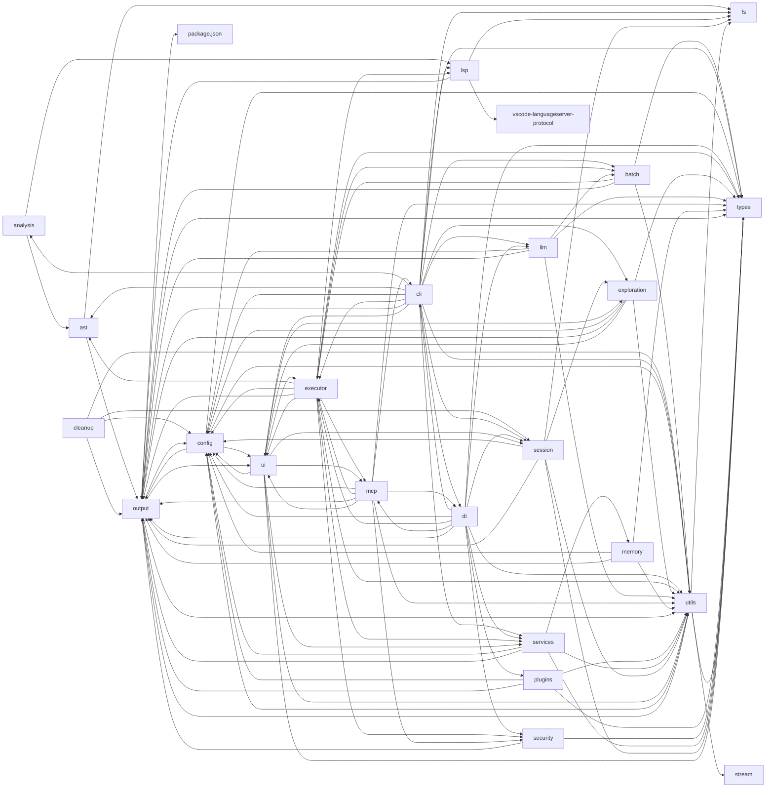

# Codebase Map

_Generated: 2026-04-18_

## Module Dependencies

```mermaid
graph LR
  analysis --> ast
  analysis --> lsp
  ast --> fs
  ast --> output
  batch --> executor
  batch --> output
  batch --> types
  batch --> utils
  cleanup --> config
  cleanup --> output
  cleanup --> session
  cleanup --> utils
  cli --> analysis
  cli --> ast
  cli --> batch
  cli --> config
  cli --> di
  cli --> executor
  cli --> exploration
  cli --> fs
  cli --> llm
  cli --> lsp
  cli --> output
  cli --> services
  cli --> session
  cli --> types
  cli --> ui
  cli --> utils
  config --> output
  config --> types
  config --> ui
  config --> utils
  di --> cli
  di --> config
  di --> executor
  di --> llm
  di --> mcp
  di --> output
  di --> plugins
  di --> security
  di --> services
  di --> session
  di --> types
  di --> utils
  executor --> ast
  executor --> batch
  executor --> config
  executor --> lsp
  executor --> mcp
  executor --> output
  executor --> security
  executor --> services
  executor --> types
  executor --> ui
  executor --> utils
  exploration --> config
  exploration --> output
  exploration --> types
  exploration --> ui
  exploration --> utils
  llm --> batch
  llm --> config
  llm --> output
  llm --> types
  llm --> utils
  lsp --> fs
  lsp --> output
  lsp --> vscode-languageserver-protocol
  mcp --> cli
  mcp --> config
  mcp --> di
  mcp --> executor
  mcp --> output
  mcp --> security
  mcp --> types
  mcp --> ui
  mcp --> utils
  memory --> config
  memory --> output
  memory --> types
  memory --> utils
  output --> config
  output --> package.json
  output --> types
  output --> ui
  output --> utils
  plugins --> config
  plugins --> output
  plugins --> types
  plugins --> utils
  security --> output
  security --> types
  services --> config
  services --> memory
  services --> output
  services --> types
  services --> utils
  session --> config
  session --> exploration
  session --> fs
  session --> output
  session --> types
  session --> utils
  ui --> config
  ui --> executor
  ui --> exploration
  ui --> mcp
  ui --> services
  ui --> session
  ui --> types
  ui --> utils
  utils --> config
  utils --> fs
  utils --> output
  utils --> stream
  utils --> types
```
