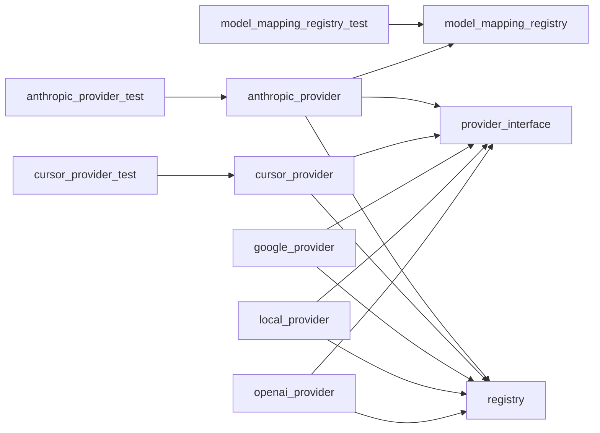

# Module: `llm`

_Generated: 2026-04-18_

## File Dependencies

## Symbol References

| Symbol               | Kind  | Defined in                | Used in                                                                       |
| -------------------- | ----- | ------------------------- | ----------------------------------------------------------------------------- |
| AnthropicProvider    | class | anthropic.provider.ts     | anthropic.provider.test.ts                                                    |
| CursorProvider       | class | cursor.provider.ts        | provider-fallback-service.ts, cursor.provider.test.ts, registry.ts, server.ts |
| GoogleProvider       | class | google.provider.ts        | —                                                                             |
| LLMProviderRegistry  | class | registry.ts               | —                                                                             |
| LocalProvider        | class | local.provider.ts         | —                                                                             |
| ModelMappingRegistry | class | model-mapping-registry.ts | model-mapping-registry.test.ts, anthropic.provider.ts                         |
| ModelMappingType     | type  | model-mapping-registry.ts | —                                                                             |
| OpenAIProvider       | class | openai.provider.ts        | —                                                                             |
