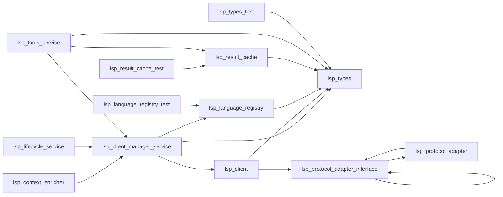

# Module: `lsp`

_Generated: 2026-04-18_

## File Dependencies

## Symbol References

| Symbol                       | Kind      | Defined in                        | Used in                                                                                   |
| ---------------------------- | --------- | --------------------------------- | ----------------------------------------------------------------------------------------- |
| CacheEntry                   | interface | lsp.types.ts                      | lsp-result-cache.ts, lsp.types.test.ts                                                    |
| DefinitionResult             | interface | lsp.types.ts                      | lsp-tools.service.ts, lsp.types.test.ts                                                   |
| DiagnosticResult             | interface | lsp.types.ts                      | lsp.types.test.ts, diagnostic-formatter.ts, diagnostics.service.ts, diagnostics.types.ts  |
| enrichContextWithDiagnostics | function  | lsp-context-enricher.ts           | —                                                                                         |
| getAllServers                | function  | lsp-language-registry.ts          | lsp-language-registry.test.ts                                                             |
| getFileDiagnosticSummary     | function  | lsp-context-enricher.ts           | —                                                                                         |
| getLSPProtocolAdapter        | function  | lsp-protocol-adapter.interface.ts | lsp-client.ts                                                                             |
| getServerForFile             | function  | lsp-language-registry.ts          | lsp-client-manager.service.ts, lsp-language-registry.test.ts                              |
| getServerForLanguage         | function  | lsp-language-registry.ts          | lsp-language-registry.test.ts                                                             |
| HoverResult                  | interface | lsp.types.ts                      | lsp-tools.service.ts, lsp.types.test.ts                                                   |
| JSONRPCNotification          | interface | lsp.types.ts                      | lsp.types.test.ts                                                                         |
| JSONRPCRequest               | interface | lsp.types.ts                      | lsp.types.test.ts                                                                         |
| JSONRPCResponse              | interface | lsp.types.ts                      | lsp.types.test.ts                                                                         |
| LSPCacheOptions              | interface | lsp.types.ts                      | lsp-result-cache.ts, lsp.types.test.ts                                                    |
| LSPClient                    | class     | lsp-client.ts                     | lsp-client-manager.service.ts                                                             |
| LSPClientManagerService      | class     | lsp-client-manager.service.ts     | lsp-lifecycle.service.ts                                                                  |
| LSPClientState               | type      | lsp.types.ts                      | lsp-client.ts, lsp.types.test.ts                                                          |
| LSPLanguage                  | type      | lsp.types.ts                      | lsp-language-registry.ts, lsp.types.test.ts                                               |
| LSPLifecycleService          | class     | lsp-lifecycle.service.ts          | —                                                                                         |
| LSPLocation                  | interface | lsp.types.ts                      | lsp-tools.service.ts, lsp.types.test.ts                                                   |
| LSPPosition                  | interface | lsp.types.ts                      | lsp-tools.service.ts, lsp.types.test.ts                                                   |
| LSPProtocolAdapter           | interface | lsp-protocol-adapter.interface.ts | lsp-protocol-adapter.ts                                                                   |
| LSPProtocolConnection        | interface | lsp-protocol-adapter.interface.ts | lsp-client.ts, lsp-protocol-adapter.ts                                                    |
| LSPRange                     | interface | lsp.types.ts                      | lsp.types.test.ts                                                                         |
| LSPResultCache               | class     | lsp-result-cache.ts               | lsp-result-cache.test.ts, lsp-tools.service.ts                                            |
| LSPServerConfig              | interface | lsp.types.ts                      | lsp-client-manager.service.ts, lsp-client.ts, lsp-language-registry.ts, lsp.types.test.ts |
| LSPToolsService              | class     | lsp-tools.service.ts              | symbol-reference.analyser.ts, tool-execution.service.ts                                   |
| resetLanguageRegistry        | function  | lsp-language-registry.ts          | lsp-language-registry.test.ts                                                             |
| resetLSPProtocolAdapter      | function  | lsp-protocol-adapter.interface.ts | —                                                                                         |
| setLSPProtocolAdapter        | function  | lsp-protocol-adapter.interface.ts | —                                                                                         |
