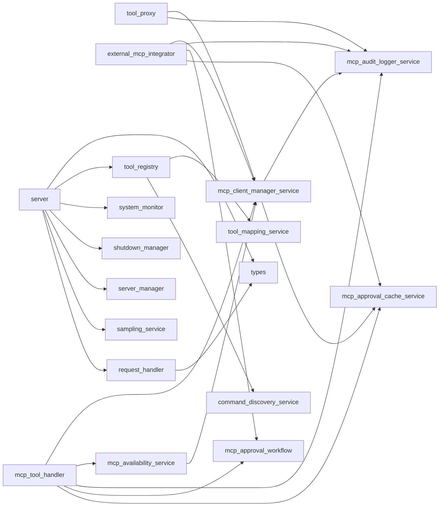

# Module: `mcp`

_Generated: 2026-04-18_

## File Dependencies

## Symbol References

| Symbol                   | Kind      | Defined in                    | Used in                                                                                                                                                          |
| ------------------------ | --------- | ----------------------------- | ---------------------------------------------------------------------------------------------------------------------------------------------------------------- |
| CommandDiscoveryService  | class     | command-discovery.service.ts  | tool-registry.ts                                                                                                                                                 |
| CommandFlags             | interface | types.ts                      | request-handler.ts                                                                                                                                               |
| ExternalMCPIntegrator    | class     | external-mcp-integrator.ts    | container.ts                                                                                                                                                     |
| ExternalMCPToolProxy     | class     | tool-proxy.ts                 | container.ts                                                                                                                                                     |
| getMCPApprovalWorkflow   | function  | mcp-approval-workflow.ts      | —                                                                                                                                                                |
| getMCPServer             | function  | context.ts                    | —                                                                                                                                                                |
| hasMCPServer             | function  | context.ts                    | —                                                                                                                                                                |
| MCPApprovalCacheService  | class     | mcp-approval-cache.service.ts | container.ts, stage-executor.ts, external-mcp-integrator.ts, mcp-client-manager.service.ts, mcp-tool-handler.ts                                                  |
| MCPApprovalWorkflow      | class     | mcp-approval-workflow.ts      | container.ts, stage-executor.ts, external-mcp-integrator.ts, mcp-tool-handler.ts                                                                                 |
| MCPAuditLoggerService    | class     | mcp-audit-logger.service.ts   | container.ts, stage-executor.ts, tool-proxy.ts, external-mcp-integrator.ts, mcp-client-manager.service.ts, mcp-tool-handler.ts, mcp-audit-logger-metrics.test.ts |
| MCPAvailabilityResult    | interface | mcp-availability.service.ts   | —                                                                                                                                                                |
| MCPAvailabilityService   | class     | mcp-availability.service.ts   | stage-executor.ts, mcp-tool-handler.ts                                                                                                                           |
| MCPAvailabilityStatus    | type      | mcp-availability.service.ts   | —                                                                                                                                                                |
| MCPAvailabilitySummary   | interface | mcp-availability.service.ts   | —                                                                                                                                                                |
| MCPClientManagerService  | class     | mcp-client-manager.service.ts | container.ts, stage-executor.ts, tool-execution.service.ts, tool-proxy.ts, external-mcp-integrator.ts, mcp-availability.service.ts, mcp-tool-handler.ts          |
| MCPIntegrationResult     | interface | external-mcp-integrator.ts    | —                                                                                                                                                                |
| MCPOrchestratorServer    | class     | server.ts                     | —                                                                                                                                                                |
| MCPRequestHandler        | class     | request-handler.ts            | container.ts, server.ts                                                                                                                                          |
| MCPSamplingServiceImpl   | class     | sampling-service.ts           | container.ts, server.ts                                                                                                                                          |
| MCPServerManager         | class     | server-manager.ts             | server.ts                                                                                                                                                        |
| MCPServerOverrides       | interface | types.ts                      | server.ts, cli.types.ts                                                                                                                                          |
| MCPTool                  | interface | tool-mapping.service.ts       | tool-execution.service.ts, mcp-tool-handler.ts, command.types.ts, mcp-registry.types.ts                                                                          |
| MCPToolExecutionResult   | interface | mcp-tool-handler.ts           | —                                                                                                                                                                |
| MCPToolHandler           | class     | mcp-tool-handler.ts           | execution-coordinator.ts, stage-executor.ts, tool-execution.service.ts                                                                                           |
| MCPToolRegistry          | class     | tool-registry.ts              | container.ts, server.ts                                                                                                                                          |
| resetMCPApprovalWorkflow | function  | mcp-approval-workflow.ts      | —                                                                                                                                                                |
| ResourceAlert            | interface | system-monitor.ts             | resource-monitor.ts                                                                                                                                              |
| setMCPServer             | function  | context.ts                    | —                                                                                                                                                                |
| ShutdownManager          | class     | shutdown-manager.ts           | server.ts                                                                                                                                                        |
| SystemMonitorService     | class     | system-monitor.ts             | server.ts                                                                                                                                                        |
| ToolMappingService       | class     | tool-mapping.service.ts       | tool-registry.ts                                                                                                                                                 |
| ToolProxyOptions         | interface | tool-proxy.ts                 | —                                                                                                                                                                |
