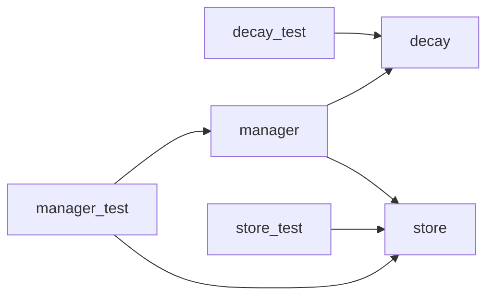

# Module: `memory`

_Generated: 2026-04-18_

## File Dependencies

## Symbol References

| Symbol                   | Kind     | Defined in | Used in                                                                                                                                                                                               |
| ------------------------ | -------- | ---------- | ----------------------------------------------------------------------------------------------------------------------------------------------------------------------------------------------------- |
| computeEffectiveHalfLife | function | decay.ts   | decay.test.ts, manager.ts                                                                                                                                                                             |
| computeStrength          | function | decay.ts   | decay.test.ts, manager.ts                                                                                                                                                                             |
| MemoryManager            | class    | manager.ts | stage-executor.ts, manager.test.ts, memory-consolidation.service.test.ts, memory-extraction.service.test.ts, memory-consolidation.service.ts, memory-extraction.service.ts                            |
| MemoryStore              | class    | store.ts   | stage-executor.ts, manager.test.ts, store.test.ts, manager.ts, memory-consolidation.service.test.ts, memory-extraction.service.test.ts, memory-consolidation.service.ts, memory-extraction.service.ts |
| shouldPrune              | function | decay.ts   | decay.test.ts                                                                                                                                                                                         |
