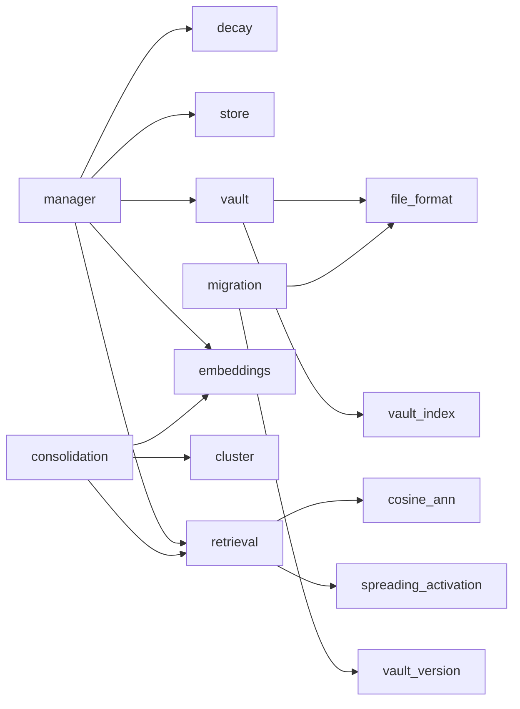

# Module: `memory`

_Last updated: 2026-05-07 (Valora 2.6.0 — vault unification, ADR-013 accepted)_

The memory subsystem implements the biologically-inspired agent memory described in [ADR-011](../adr/011-biologically-inspired-memory.md), extended by the vault-and-embeddings design in [ADR-013](../adr/013-vault-and-embeddings.md). Every production read and write goes through the `VaultStore` (per-memory Markdown files); the legacy `MemoryStore` (JSON) survives only as a one-shot migration source.

## Subsystem map

## Public surface (`memory/index.ts`)

External callers (CLI, executor, services) must import from `memory` rather than reaching into internals — enforced by the "External code uses public memory API" rule in `__tests__/architecture/vault-memory.arch.test.ts`.

| Export                                                                                | Purpose                                                                                                 |
| ------------------------------------------------------------------------------------- | ------------------------------------------------------------------------------------------------------- |
| `MemoryManager`                                                                       | High-level CRUD + recall API; injected with a `MemoryStorePort` and an optional `EmbedderPort`.         |
| `VaultStore`                                                                          | Per-memory Markdown vault implementing `MemoryStorePort`; the only production backend.                  |
| `MemoryStore` _(deprecated)_                                                          | Legacy JSON backend retained for migration only. New code must not instantiate it (arch-unit enforced). |
| `getDefaultVaultDir`, `getLegacyJsonDir`                                              | Single source of truth for vault paths under `getRuntimeDataDir()/memory`.                              |
| `runAutoMigrationIfNeeded`                                                            | Cheap idempotent helper that migrates legacy JSON on first boot.                                        |
| `migrateJsonToVault`                                                                  | One-shot migration entry point; called by the `valora memory migrate` CLI.                              |
| `readVaultVersion`, `writeVaultVersion`, `VAULT_SCHEMA_VERSION`                       | Vault format version stamp.                                                                             |
| `EmbedderPort`, `LlmProviderEmbedder`, `EmbedderNotSupportedError`, `resolveEmbedder` | Adapter contract bridging `LLMProvider.embed?()` to the memory subsystem.                               |
| `openVectorStore`, `readVectorStoreMeta`, `VectorStore`                               | Per-vault binary embedding store. Open throws on dim/model mismatch — run `valora memory reembed`.      |
| `cosineClusters`, `centroidSummary`                                                   | Deterministic cosine clustering used by consolidation.                                                  |
| `computeStrength`, `computeEffectiveHalfLife`, `shouldPrune`                          | Pure decay maths.                                                                                       |

## Module layout

| Path                                  | Responsibility                                                                                                                                                                                              |
| ------------------------------------- | ----------------------------------------------------------------------------------------------------------------------------------------------------------------------------------------------------------- |
| `manager.ts`                          | Public API. Decay-aware CRUD, ANN+spreading-activation recall, lexical fallback, supersession, `purge`, `prune`.                                                                                            |
| `decay.ts`                            | Pure exponential-decay maths (Ebbinghaus model).                                                                                                                                                            |
| `store.ts` _(deprecated)_             | Three-JSON-file legacy backend. Used only as a migration source.                                                                                                                                            |
| `vault/file-format.ts`                | Markdown ↔ entry serialisation, atomic file writes.                                                                                                                                                         |
| `vault/vault-index.ts`                | In-memory index built by scanning `*.md` files.                                                                                                                                                             |
| `vault/vault-store.ts`                | `MemoryStorePort` implementation backed by the vault. Atomic per-entry writes; `meta.json` round-trips across restart.                                                                                      |
| `vault/default-vault-dir.ts`          | `getDefaultVaultDir`, `getLegacyJsonDir`.                                                                                                                                                                   |
| `embeddings/embedder.port.ts`         | `EmbedderPort` interface.                                                                                                                                                                                   |
| `embeddings/llm-provider-embedder.ts` | Adapter wrapping `LLMProvider.embed?()`. Throws `EmbedderNotSupportedError` when the wrapped provider lacks support.                                                                                        |
| `embeddings/resolve-embedder.ts`      | Resolves an `EmbedderPort` from the configured provider; falls back to `undefined` when none is available so semantic recall degrades gracefully to lexical.                                                |
| `embeddings/vector-store.ts`          | Packed `Float32Array` vector store. Atomic flush, dim/model fast-fail, `readVectorStoreMeta()` for safe re-open.                                                                                            |
| `retrieval/cosine-ann.ts`             | Cosine-similarity helpers (length-mismatch and NaN-safe).                                                                                                                                                   |
| `retrieval/spreading-activation.ts`   | BFS activation walk over `related` (forward) and `co_accessed` (symmetric) edges. Hebbian `co_accessed` edges are synthesised by `vault-index.ts:addRecord` from the persisted `co_access` frontmatter map. |
| `consolidation/cluster.ts`            | Deterministic union-find cosine clustering.                                                                                                                                                                 |
| `migration/json-to-vault.ts`          | Idempotent migration with sentinel lock and existence-skipping.                                                                                                                                             |
| `migration/vault-version.ts`          | Atomic schema version stamp.                                                                                                                                                                                |
| `migration/auto-migrate.ts`           | `runAutoMigrationIfNeeded(jsonDir, vaultDir)` — cheap memoised helper called from production hot paths.                                                                                                     |

## Configuration

The schema is `MEMORY_CONFIG_SCHEMA` in `src/config/schema.ts`. Salient defaults:

- `backend: 'vault'` (only supported value at runtime).
- `episodic/semantic/decision_half_life_days: 7 / 30 / 21`.
- `injection_token_budget: 2000` — applied inside the recall path (`MemoryQueryOptions.tokenBudget`) and again in `formatMemoryForInjection` for defence in depth.
- `embedding.{model, dim, batch_size, provider}` — defaults to `nomic-embed-text` / 768 / 32 / `'auto'` (Ollama preferred).
- `recall.{seed_k, walk_depth, walk_decay, co_access_increment}` — defaults from `src/config/constants.ts`.

## Operator commands

- `valora memory info` — schema version, entry/edge counts, embedding coverage.
- `valora memory list` — filter by category, tag, agent.
- `valora memory migrate` — manual migration entry point (also runs automatically on first boot via `runAutoMigrationIfNeeded`).
- `valora memory verify` — sanity-check that every category is readable.
- `valora memory purge` — bulk delete by category, age, or all (requires explicit criteria).
- `valora memory reembed --confirm` — rebuild `embeddings.bin` against the active model. Required by ADR-013 §4 when the embedding model or dimension changes.

## Architectural invariants (arch-unit-enforced)

See `__tests__/architecture/vault-memory.arch.test.ts`:

1. Memory only reaches embedders via `EmbedderPort` — never via direct LLM-SDK imports.
2. `MemoryStore` is not instantiated outside `migration/`.
3. No file under `vault/`, `embeddings/`, or `migration/` calls `writeFileSync` directly — `atomicWriteFile` / `atomicWriteBuffer` only.
4. No placeholder model literals (`'stub'`, `'placeholder'`, `'dummy'`, `'fake'`) in production code.
5. No native binary dependencies.
6. No external module imports memory internals deeper than the public barrel.
7. No top-level memory function exceeds 50 lines.
8. `LlmProviderEmbedder` exists and implements `EmbedderPort`.
9. `valora memory reembed` is registered.
10. ADR-013 status is `Accepted`.
