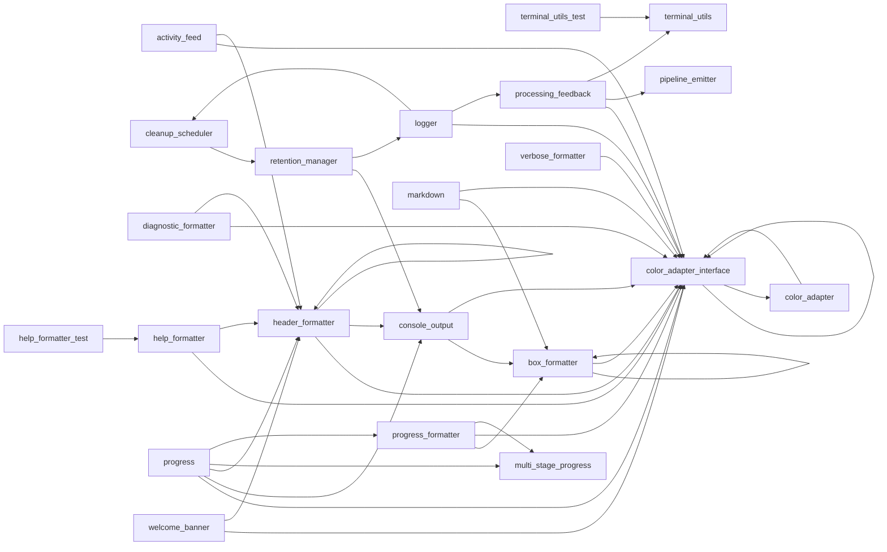

# Module: `output`

_Generated: 2026-04-18_

## File Dependencies

## Symbol References

| Symbol                    | Kind      | Defined in                 | Used in                                                                                                                                                                                                                                                                                                                                                                                                                                                                                                                                                                                                                                                                                                                                                                                                                                                                                                                                                                        |
| ------------------------- | --------- | -------------------------- | ------------------------------------------------------------------------------------------------------------------------------------------------------------------------------------------------------------------------------------------------------------------------------------------------------------------------------------------------------------------------------------------------------------------------------------------------------------------------------------------------------------------------------------------------------------------------------------------------------------------------------------------------------------------------------------------------------------------------------------------------------------------------------------------------------------------------------------------------------------------------------------------------------------------------------------------------------------------------------ |
| ActivityEntry             | interface | activity-feed.ts           | —                                                                                                                                                                                                                                                                                                                                                                                                                                                                                                                                                                                                                                                                                                                                                                                                                                                                                                                                                                              |
| ActivityFeed              | class     | activity-feed.ts           | —                                                                                                                                                                                                                                                                                                                                                                                                                                                                                                                                                                                                                                                                                                                                                                                                                                                                                                                                                                              |
| ActivityStatus            | type      | activity-feed.ts           | —                                                                                                                                                                                                                                                                                                                                                                                                                                                                                                                                                                                                                                                                                                                                                                                                                                                                                                                                                                              |
| ANSI                      | constant  | terminal-utils.ts          | output-parsing.service.ts, stage-executor.ts, terminal-utils.test.ts, processing-feedback.ts                                                                                                                                                                                                                                                                                                                                                                                                                                                                                                                                                                                                                                                                                                                                                                                                                                                                                   |
| BoxFormatter              | class     | box-formatter.ts           | console-output.ts                                                                                                                                                                                                                                                                                                                                                                                                                                                                                                                                                                                                                                                                                                                                                                                                                                                                                                                                                              |
| BoxOptions                | interface | box-formatter.ts           | —                                                                                                                                                                                                                                                                                                                                                                                                                                                                                                                                                                                                                                                                                                                                                                                                                                                                                                                                                                              |
| BoxStyle                  | type      | box-formatter.ts           | —                                                                                                                                                                                                                                                                                                                                                                                                                                                                                                                                                                                                                                                                                                                                                                                                                                                                                                                                                                              |
| centerText                | function  | terminal-utils.ts          | terminal-utils.test.ts                                                                                                                                                                                                                                                                                                                                                                                                                                                                                                                                                                                                                                                                                                                                                                                                                                                                                                                                                         |
| ChainableColorFn          | interface | color-adapter.interface.ts | color-adapter.ts                                                                                                                                                                                                                                                                                                                                                                                                                                                                                                                                                                                                                                                                                                                                                                                                                                                                                                                                                               |
| ChalkAdapter              | class     | color-adapter.ts           | —                                                                                                                                                                                                                                                                                                                                                                                                                                                                                                                                                                                                                                                                                                                                                                                                                                                                                                                                                                              |
| CleanupResult             | interface | retention-manager.ts       | cleanup-scheduler.ts, exploration.types.ts                                                                                                                                                                                                                                                                                                                                                                                                                                                                                                                                                                                                                                                                                                                                                                                                                                                                                                                                     |
| CleanupSchedule           | interface | cleanup-scheduler.ts       | coordinator.ts                                                                                                                                                                                                                                                                                                                                                                                                                                                                                                                                                                                                                                                                                                                                                                                                                                                                                                                                                                 |
| CleanupScheduler          | class     | cleanup-scheduler.ts       | coordinator.ts, logger.ts                                                                                                                                                                                                                                                                                                                                                                                                                                                                                                                                                                                                                                                                                                                                                                                                                                                                                                                                                      |
| Color                     | type      | color-adapter.interface.ts | box-formatter.ts, color-adapter.ts, header-formatter.ts, ui.types.ts, spinner-adapter.interface.ts                                                                                                                                                                                                                                                                                                                                                                                                                                                                                                                                                                                                                                                                                                                                                                                                                                                                             |
| ColorAdapter              | interface | color-adapter.interface.ts | doctor.ts, dry-run-preview.service.ts, pending-write-approver.service.ts, box-formatter.ts, color-adapter.ts, console-output.ts, header-formatter.ts                                                                                                                                                                                                                                                                                                                                                                                                                                                                                                                                                                                                                                                                                                                                                                                                                           |
| ColorAdapterFactory       | type      | color-adapter.interface.ts | —                                                                                                                                                                                                                                                                                                                                                                                                                                                                                                                                                                                                                                                                                                                                                                                                                                                                                                                                                                              |
| ConsoleOutput             | class     | console-output.ts          | document-output-processor.ts, assert-presenter.ts, base-presenter.ts, feedback-presenter.ts, fetch-task-presenter.ts, implementation-presenter.ts, presenter-registry.ts, review-code-presenter.ts, review-plan-presenter.ts, container.ts, dry-run-preview.service.ts, pending-write-approver.service.ts, retention-manager.ts                                                                                                                                                                                                                                                                                                                                                                                                                                                                                                                                                                                                                                                |
| ConsoleOutputOptions      | interface | console-output.ts          | —                                                                                                                                                                                                                                                                                                                                                                                                                                                                                                                                                                                                                                                                                                                                                                                                                                                                                                                                                                              |
| createNextStepsMessage    | function  | welcome-banner.ts          | first-run-setup.ts                                                                                                                                                                                                                                                                                                                                                                                                                                                                                                                                                                                                                                                                                                                                                                                                                                                                                                                                                             |
| createSetupProgress       | function  | welcome-banner.ts          | —                                                                                                                                                                                                                                                                                                                                                                                                                                                                                                                                                                                                                                                                                                                                                                                                                                                                                                                                                                              |
| createWelcomeBanner       | function  | welcome-banner.ts          | first-run-setup.ts                                                                                                                                                                                                                                                                                                                                                                                                                                                                                                                                                                                                                                                                                                                                                                                                                                                                                                                                                             |
| DiagnosticFormatter       | class     | diagnostic-formatter.ts    | —                                                                                                                                                                                                                                                                                                                                                                                                                                                                                                                                                                                                                                                                                                                                                                                                                                                                                                                                                                              |
| FileInfo                  | interface | retention-manager.ts       | —                                                                                                                                                                                                                                                                                                                                                                                                                                                                                                                                                                                                                                                                                                                                                                                                                                                                                                                                                                              |
| getBoxFormatter           | function  | box-formatter.ts           | console-output.ts, markdown.ts, progress-formatter.ts                                                                                                                                                                                                                                                                                                                                                                                                                                                                                                                                                                                                                                                                                                                                                                                                                                                                                                                          |
| getColorAdapter           | function  | color-adapter.interface.ts | autocomplete.ts, command-error-handler.ts, command-palette.ts, command-suggestions.ts, command-templates.ts, command-validator.ts, command-wizard.ts, batch.command.ts, config.ts, dashboard.ts, doctor.ts, dynamic.ts, explore.ts, help.ts, init.ts, monitoring.ts, session.ts, usage.ts, document-approval.ts, provider-mismatch-handler.ts, session-browser.ts, session-cleanup-adapter.ts, session-formatter.ts, session-resume.ts, interactive-wizard.ts, validation-helpers.ts, dry-run-preview.service.ts, escalation-handler.service.ts, interactive-question-handler.service.ts, project-guidance-loader.ts, stage-validation.service.ts, tool-execution.service.ts, mcp-approval-workflow.ts, activity-feed.ts, box-formatter.ts, console-output.ts, diagnostic-formatter.ts, header-formatter.ts, help-formatter.ts, logger.ts, markdown.ts, processing-feedback.ts, progress-formatter.ts, progress.ts, verbose-formatter.ts, welcome-banner.ts, prompt-handler.ts |
| getDiagnosticFormatter    | function  | diagnostic-formatter.ts    | doctor.ts                                                                                                                                                                                                                                                                                                                                                                                                                                                                                                                                                                                                                                                                                                                                                                                                                                                                                                                                                                      |
| getHeaderFormatter        | function  | header-formatter.ts        | command-error-handler.ts, command-palette.ts, command-templates.ts, command-wizard.ts, session-browser.ts, session-cleanup-adapter.ts, session-formatter.ts, session-resume.ts, container.ts, activity-feed.ts, diagnostic-formatter.ts, help-formatter.ts, progress.ts, welcome-banner.ts                                                                                                                                                                                                                                                                                                                                                                                                                                                                                                                                                                                                                                                                                     |
| getHelpFormatter          | function  | help-formatter.ts          | help.ts                                                                                                                                                                                                                                                                                                                                                                                                                                                                                                                                                                                                                                                                                                                                                                                                                                                                                                                                                                        |
| getPipelineEmitter        | function  | pipeline-emitter.ts        | hook-execution.service.ts, pipeline.ts, stage-executor.ts, tool-execution.service.ts, processing-feedback.ts, memory-consolidation.service.ts                                                                                                                                                                                                                                                                                                                                                                                                                                                                                                                                                                                                                                                                                                                                                                                                                                  |
| getProgressFormatter      | function  | progress-formatter.ts      | progress.ts                                                                                                                                                                                                                                                                                                                                                                                                                                                                                                                                                                                                                                                                                                                                                                                                                                                                                                                                                                    |
| getProgressTracker        | function  | multi-stage-progress.ts    | progress.ts                                                                                                                                                                                                                                                                                                                                                                                                                                                                                                                                                                                                                                                                                                                                                                                                                                                                                                                                                                    |
| getRenderer               | function  | markdown.ts                | command-executor.ts, document-approval.ts, result-presenter.ts, container.ts, escalation-handler.service.ts, stage-validation.service.ts, mcp-approval-workflow.ts                                                                                                                                                                                                                                                                                                                                                                                                                                                                                                                                                                                                                                                                                                                                                                                                             |
| getSpinnerFrame           | function  | terminal-utils.ts          | terminal-utils.test.ts                                                                                                                                                                                                                                                                                                                                                                                                                                                                                                                                                                                                                                                                                                                                                                                                                                                                                                                                                         |
| getVerboseFormatter       | function  | verbose-formatter.ts       | —                                                                                                                                                                                                                                                                                                                                                                                                                                                                                                                                                                                                                                                                                                                                                                                                                                                                                                                                                                              |
| getVisibleLength          | function  | terminal-utils.ts          | terminal-utils.test.ts                                                                                                                                                                                                                                                                                                                                                                                                                                                                                                                                                                                                                                                                                                                                                                                                                                                                                                                                                         |
| HeaderColor               | type      | header-formatter.ts        | —                                                                                                                                                                                                                                                                                                                                                                                                                                                                                                                                                                                                                                                                                                                                                                                                                                                                                                                                                                              |
| HeaderFormatter           | class     | header-formatter.ts        | container.ts                                                                                                                                                                                                                                                                                                                                                                                                                                                                                                                                                                                                                                                                                                                                                                                                                                                                                                                                                                   |
| HeaderOptions             | interface | header-formatter.ts        | —                                                                                                                                                                                                                                                                                                                                                                                                                                                                                                                                                                                                                                                                                                                                                                                                                                                                                                                                                                              |
| HelpFormatter             | class     | help-formatter.ts          | help-formatter.test.ts                                                                                                                                                                                                                                                                                                                                                                                                                                                                                                                                                                                                                                                                                                                                                                                                                                                                                                                                                         |
| Logger                    | class     | logger.ts                  | ast-tools.service.ts, command-executor.ts, command-resolver.ts, container.ts, message-builder.service.ts, output-parsing.service.ts, pending-write-approver.service.ts, search-tools.service.ts, session-tools.service.ts, lsp-tools.service.ts, mcp-audit-logger.service.ts, server-manager.ts, server.ts, shutdown-manager.ts, system-monitor.ts                                                                                                                                                                                                                                                                                                                                                                                                                                                                                                                                                                                                                             |
| MarkdownRenderer          | class     | markdown.ts                | document-output-processor.ts, assert-presenter.ts, base-presenter.ts, feedback-presenter.ts, fetch-task-presenter.ts, implementation-presenter.ts, presenter-registry.ts, review-code-presenter.ts, review-plan-presenter.ts, container.ts                                                                                                                                                                                                                                                                                                                                                                                                                                                                                                                                                                                                                                                                                                                                     |
| Modifier                  | type      | color-adapter.interface.ts | color-adapter.ts                                                                                                                                                                                                                                                                                                                                                                                                                                                                                                                                                                                                                                                                                                                                                                                                                                                                                                                                                               |
| MultiStageProgressTracker | class     | multi-stage-progress.ts    | progress.ts                                                                                                                                                                                                                                                                                                                                                                                                                                                                                                                                                                                                                                                                                                                                                                                                                                                                                                                                                                    |
| padToWidth                | function  | terminal-utils.ts          | terminal-utils.test.ts                                                                                                                                                                                                                                                                                                                                                                                                                                                                                                                                                                                                                                                                                                                                                                                                                                                                                                                                                         |
| PipelineEventEmitter      | class     | pipeline-emitter.ts        | pipeline.ts, stage-executor.ts, processing-feedback.ts                                                                                                                                                                                                                                                                                                                                                                                                                                                                                                                                                                                                                                                                                                                                                                                                                                                                                                                         |
| ProcessingFeedback        | class     | processing-feedback.ts     | logger.ts                                                                                                                                                                                                                                                                                                                                                                                                                                                                                                                                                                                                                                                                                                                                                                                                                                                                                                                                                                      |
| ProcessingFeedbackOptions | interface | processing-feedback.ts     | —                                                                                                                                                                                                                                                                                                                                                                                                                                                                                                                                                                                                                                                                                                                                                                                                                                                                                                                                                                              |
| ProgressFormatter         | class     | progress-formatter.ts      | progress.ts                                                                                                                                                                                                                                                                                                                                                                                                                                                                                                                                                                                                                                                                                                                                                                                                                                                                                                                                                                    |
| ProgressHistory           | interface | multi-stage-progress.ts    | —                                                                                                                                                                                                                                                                                                                                                                                                                                                                                                                                                                                                                                                                                                                                                                                                                                                                                                                                                                              |
| ProgressIndicator         | class     | progress.ts                | —                                                                                                                                                                                                                                                                                                                                                                                                                                                                                                                                                                                                                                                                                                                                                                                                                                                                                                                                                                              |
| ProgressMode              | type      | progress.ts                | —                                                                                                                                                                                                                                                                                                                                                                                                                                                                                                                                                                                                                                                                                                                                                                                                                                                                                                                                                                              |
| RetentionManager          | class     | retention-manager.ts       | coordinator.ts, cleanup-scheduler.ts                                                                                                                                                                                                                                                                                                                                                                                                                                                                                                                                                                                                                                                                                                                                                                                                                                                                                                                                           |
| RetentionPolicy           | interface | retention-manager.ts       | coordinator.ts                                                                                                                                                                                                                                                                                                                                                                                                                                                                                                                                                                                                                                                                                                                                                                                                                                                                                                                                                                 |
| setColorAdapter           | function  | color-adapter.interface.ts | —                                                                                                                                                                                                                                                                                                                                                                                                                                                                                                                                                                                                                                                                                                                                                                                                                                                                                                                                                                              |
| setPipelineEmitter        | function  | pipeline-emitter.ts        | —                                                                                                                                                                                                                                                                                                                                                                                                                                                                                                                                                                                                                                                                                                                                                                                                                                                                                                                                                                              |
| setProgressTracker        | function  | multi-stage-progress.ts    | —                                                                                                                                                                                                                                                                                                                                                                                                                                                                                                                                                                                                                                                                                                                                                                                                                                                                                                                                                                              |
| SPINNER_FRAMES            | constant  | terminal-utils.ts          | terminal-utils.test.ts, processing-feedback.ts                                                                                                                                                                                                                                                                                                                                                                                                                                                                                                                                                                                                                                                                                                                                                                                                                                                                                                                                 |
| StageMetadata             | interface | multi-stage-progress.ts    | —                                                                                                                                                                                                                                                                                                                                                                                                                                                                                                                                                                                                                                                                                                                                                                                                                                                                                                                                                                              |
| StageProgress             | interface | multi-stage-progress.ts    | progress-formatter.ts                                                                                                                                                                                                                                                                                                                                                                                                                                                                                                                                                                                                                                                                                                                                                                                                                                                                                                                                                          |
| stripAnsi                 | function  | terminal-utils.ts          | terminal-utils.test.ts                                                                                                                                                                                                                                                                                                                                                                                                                                                                                                                                                                                                                                                                                                                                                                                                                                                                                                                                                         |
| truncateToWidth           | function  | terminal-utils.ts          | terminal-utils.test.ts, processing-feedback.ts                                                                                                                                                                                                                                                                                                                                                                                                                                                                                                                                                                                                                                                                                                                                                                                                                                                                                                                                 |
| VerboseFormatter          | class     | verbose-formatter.ts       | —                                                                                                                                                                                                                                                                                                                                                                                                                                                                                                                                                                                                                                                                                                                                                                                                                                                                                                                                                                              |
