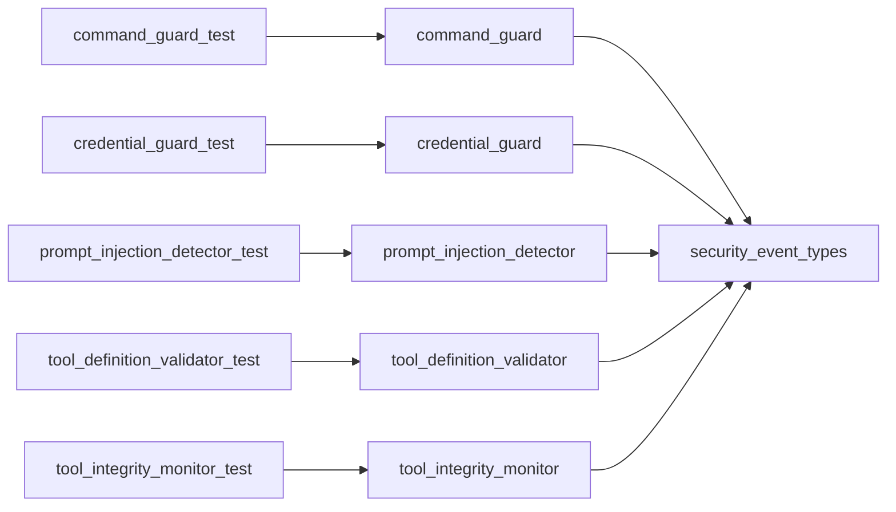

# Module: `security`

_Generated: 2026-04-18_

## File Dependencies

## Symbol References

| Symbol                       | Kind      | Defined in                   | Used in                                                                                                                      |
| ---------------------------- | --------- | ---------------------------- | ---------------------------------------------------------------------------------------------------------------------------- |
| CommandGuard                 | class     | command-guard.ts             | container.ts, command-guard.test.ts, agentic-security.security.test.ts                                                       |
| CommandValidationResult      | interface | command-guard.ts             | —                                                                                                                            |
| createSecurityEvent          | function  | security-event.types.ts      | command-guard.ts, credential-guard.ts, prompt-injection-detector.ts, tool-definition-validator.ts, tool-integrity-monitor.ts |
| CredentialGuard              | class     | credential-guard.ts          | container.ts, credential-guard.test.ts, agentic-security.security.test.ts                                                    |
| getCommandGuard              | function  | command-guard.ts             | container.ts, tool-execution.service.ts                                                                                      |
| getCredentialGuard           | function  | credential-guard.ts          | container.ts, tool-execution.service.ts, variables.ts, mcp-tool-handler.ts                                                   |
| getPromptInjectionDetector   | function  | prompt-injection-detector.ts | container.ts, stage-executor.ts, mcp-tool-handler.ts                                                                         |
| getToolDefinitionValidator   | function  | tool-definition-validator.ts | container.ts, mcp-client-manager.service.ts                                                                                  |
| getToolIntegrityMonitor      | function  | tool-integrity-monitor.ts    | container.ts, mcp-client-manager.service.ts                                                                                  |
| InjectionScanResult          | interface | prompt-injection-detector.ts | —                                                                                                                            |
| IntegrityCheckResult         | interface | tool-integrity-monitor.ts    | —                                                                                                                            |
| PromptInjectionDetector      | class     | prompt-injection-detector.ts | container.ts, prompt-injection-detector.test.ts, agentic-security.security.test.ts                                           |
| resetCommandGuard            | function  | command-guard.ts             | command-guard.test.ts                                                                                                        |
| resetCredentialGuard         | function  | credential-guard.ts          | credential-guard.test.ts                                                                                                     |
| resetPromptInjectionDetector | function  | prompt-injection-detector.ts | prompt-injection-detector.test.ts                                                                                            |
| resetToolDefinitionValidator | function  | tool-definition-validator.ts | tool-definition-validator.test.ts                                                                                            |
| resetToolIntegrityMonitor    | function  | tool-integrity-monitor.ts    | tool-integrity-monitor.test.ts                                                                                               |
| SecurityEvent                | interface | security-event.types.ts      | command-guard.ts, credential-guard.ts, prompt-injection-detector.ts, tool-definition-validator.ts, tool-integrity-monitor.ts |
| SecurityEventType            | type      | security-event.types.ts      | —                                                                                                                            |
| SecuritySeverity             | type      | security-event.types.ts      | —                                                                                                                            |
| ToolDefinitionValidator      | class     | tool-definition-validator.ts | container.ts, tool-definition-validator.test.ts, agentic-security.security.test.ts                                           |
| ToolIntegrityMonitor         | class     | tool-integrity-monitor.ts    | container.ts, tool-integrity-monitor.test.ts, agentic-security.security.test.ts                                              |
| ToolSetDiff                  | interface | tool-integrity-monitor.ts    | —                                                                                                                            |
| ToolValidationResult         | interface | tool-definition-validator.ts | —                                                                                                                            |
