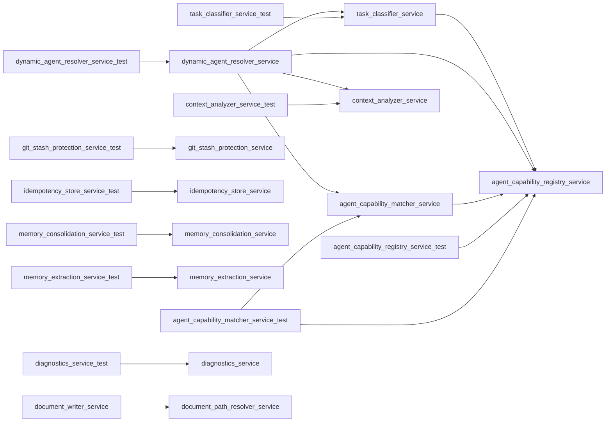

# Module: `services`

_Generated: 2026-04-18_

## File Dependencies

## Symbol References

| Symbol                         | Kind      | Defined in                           | Used in                                                                                                                                                                                                                                                                                                                                                                                                                                                                                                    |
| ------------------------------ | --------- | ------------------------------------ | ---------------------------------------------------------------------------------------------------------------------------------------------------------------------------------------------------------------------------------------------------------------------------------------------------------------------------------------------------------------------------------------------------------------------------------------------------------------------------------------------------------- |
| AgentCapabilityMatcherService  | class     | agent-capability-matcher.service.ts  | container.ts, agent-capability-matcher.service.test.ts, dynamic-agent-resolver.service.ts, dynamic-agent-selection.acceptance.test.ts, agent-confidence-thresholds.integration.test.ts, agent-selection-integration.integration.test.ts, dynamic-agent-selection.integration.test.ts, execution-coordinator-dynamic-agent.integration.test.ts, agent-selection-performance.performance.test.ts                                                                                                             |
| AgentCapabilityRegistryService | class     | agent-capability-registry.service.ts | container.ts, agent-capability-matcher.service.test.ts, agent-capability-registry.service.test.ts, agent-capability-matcher.service.ts, dynamic-agent-resolver.service.ts, task-classifier.service.ts, dynamic-agent-selection.acceptance.test.ts, agent-confidence-thresholds.integration.test.ts, agent-selection-integration.integration.test.ts, dynamic-agent-selection.integration.test.ts, execution-coordinator-dynamic-agent.integration.test.ts, agent-selection-performance.performance.test.ts |
| AgentSelectionAnalyticsService | class     | agent-selection-analytics.service.ts | command-executor.ts, execution-coordinator.ts                                                                                                                                                                                                                                                                                                                                                                                                                                                              |
| AgentSelectionEvent            | interface | agent-selection-analytics.service.ts | —                                                                                                                                                                                                                                                                                                                                                                                                                                                                                                          |
| AgentSelectionMetrics          | interface | agent-selection-analytics.service.ts | use-metrics-data.ts, agent-analytics-view.tsx                                                                                                                                                                                                                                                                                                                                                                                                                                                              |
| ConfirmStashFn                 | type      | git-stash-protection.service.ts      | —                                                                                                                                                                                                                                                                                                                                                                                                                                                                                                          |
| ConsolidationOptions           | interface | memory-consolidation.service.ts      | —                                                                                                                                                                                                                                                                                                                                                                                                                                                                                                          |
| ConsolidationResult            | interface | memory-consolidation.service.ts      | memory.types.ts                                                                                                                                                                                                                                                                                                                                                                                                                                                                                            |
| ContextAnalyzerService         | class     | context-analyzer.service.ts          | container.ts, context-analyzer.service.test.ts, dynamic-agent-resolver.service.ts, dynamic-agent-selection.acceptance.test.ts, agent-confidence-thresholds.integration.test.ts, agent-selection-integration.integration.test.ts, dynamic-agent-selection.integration.test.ts, execution-coordinator-dynamic-agent.integration.test.ts, agent-selection-performance.performance.test.ts                                                                                                                     |
| DiagnosticsService             | class     | diagnostics.service.ts               | doctor.ts, diagnostics.service.test.ts                                                                                                                                                                                                                                                                                                                                                                                                                                                                     |
| DocumentDetectorService        | class     | document-detector.service.ts         | command-executor.ts, document-output-processor.ts, container.ts, document-detector.service.test.ts                                                                                                                                                                                                                                                                                                                                                                                                         |
| DocumentPathResolverService    | class     | document-path-resolver.service.ts    | command-executor.ts, container.ts, document-writer.service.ts                                                                                                                                                                                                                                                                                                                                                                                                                                              |
| DocumentTemplateService        | class     | document-template.service.ts         | command-executor.ts, document-output-processor.ts, container.ts                                                                                                                                                                                                                                                                                                                                                                                                                                            |
| DocumentWriterService          | class     | document-writer.service.ts           | command-executor.ts, document-output-processor.ts, container.ts                                                                                                                                                                                                                                                                                                                                                                                                                                            |
| DynamicAgentResolverService    | class     | dynamic-agent-resolver.service.ts    | command-executor.ts, execution-coordinator.ts, container.ts, dynamic-agent-resolver.service.test.ts, dynamic-agent-selection.acceptance.test.ts, agent-confidence-thresholds.integration.test.ts, agent-selection-integration.integration.test.ts, dynamic-agent-selection.integration.test.ts, execution-coordinator-dynamic-agent.integration.test.ts, agent-selection-performance.performance.test.ts                                                                                                   |
| getAgentSelectionAnalytics     | function  | agent-selection-analytics.service.ts | command-executor.ts, use-metrics-data.ts                                                                                                                                                                                                                                                                                                                                                                                                                                                                   |
| GitStashProtectionService      | class     | git-stash-protection.service.ts      | command-executor.ts, git-stash-protection.service.test.ts                                                                                                                                                                                                                                                                                                                                                                                                                                                  |
| GitStatus                      | interface | git-stash-protection.service.ts      | —                                                                                                                                                                                                                                                                                                                                                                                                                                                                                                          |
| IdempotencyStoreService        | class     | idempotency-store.service.ts         | tool-execution.service.ts, idempotency-store.service.test.ts                                                                                                                                                                                                                                                                                                                                                                                                                                               |
| MemoryConsolidationService     | class     | memory-consolidation.service.ts      | memory-consolidation.service.test.ts                                                                                                                                                                                                                                                                                                                                                                                                                                                                       |
| MemoryExtractionService        | class     | memory-extraction.service.ts         | memory-extraction.service.test.ts                                                                                                                                                                                                                                                                                                                                                                                                                                                                          |
| setAgentSelectionAnalytics     | function  | agent-selection-analytics.service.ts | —                                                                                                                                                                                                                                                                                                                                                                                                                                                                                                          |
| StashProtectionResult          | interface | git-stash-protection.service.ts      | —                                                                                                                                                                                                                                                                                                                                                                                                                                                                                                          |
| TaskClassifierService          | class     | task-classifier.service.ts           | container.ts, task-classifier.service.test.ts, dynamic-agent-resolver.service.ts, dynamic-agent-selection.acceptance.test.ts, agent-confidence-thresholds.integration.test.ts, agent-selection-integration.integration.test.ts, dynamic-agent-selection.integration.test.ts, execution-coordinator-dynamic-agent.integration.test.ts, agent-selection-performance.performance.test.ts                                                                                                                      |
| UnstashResult                  | interface | git-stash-protection.service.ts      | —                                                                                                                                                                                                                                                                                                                                                                                                                                                                                                          |
