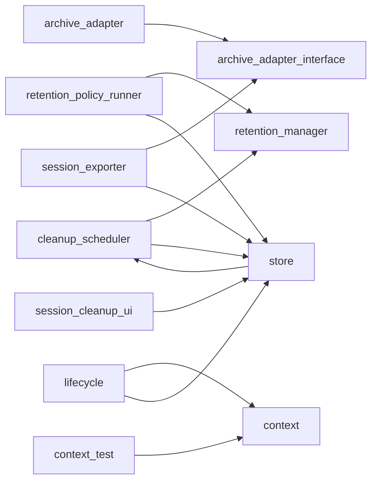

# Module: `session`

_Generated: 2026-04-18_

## File Dependencies

## Symbol References

| Symbol                      | Kind      | Defined in                   | Used in                                                                                                                                                                                                                                                                  |
| --------------------------- | --------- | ---------------------------- | ------------------------------------------------------------------------------------------------------------------------------------------------------------------------------------------------------------------------------------------------------------------------ |
| ArchiveAdapter              | interface | archive-adapter.interface.ts | archive-adapter.ts, session-exporter.ts                                                                                                                                                                                                                                  |
| ArchiveEntry                | interface | archive-adapter.interface.ts | archive-adapter.ts, session-exporter.ts                                                                                                                                                                                                                                  |
| ArchiveResult               | interface | archive-adapter.interface.ts | archive-adapter.ts                                                                                                                                                                                                                                                       |
| CleanupConfirmationAnswer   | interface | types.ts                     | —                                                                                                                                                                                                                                                                        |
| CleanupCriteria             | interface | session-cleanup-ui.ts        | session.ts                                                                                                                                                                                                                                                               |
| CleanupCriteriaAnswers      | interface | types.ts                     | —                                                                                                                                                                                                                                                                        |
| CleanupPreview              | interface | session-cleanup-ui.ts        | —                                                                                                                                                                                                                                                                        |
| createArchiveAdapter        | function  | archive-adapter.ts           | session.ts, session-browser.ts                                                                                                                                                                                                                                           |
| CreateArchiveOptions        | interface | archive-adapter.interface.ts | archive-adapter.ts                                                                                                                                                                                                                                                       |
| ExportMetadata              | interface | session-exporter.ts          | —                                                                                                                                                                                                                                                                        |
| ExportOptions               | interface | session-exporter.ts          | —                                                                                                                                                                                                                                                                        |
| ImportOptions               | interface | session-exporter.ts          | —                                                                                                                                                                                                                                                                        |
| runAutomaticCleanupIfNeeded | function  | retention-policy-runner.ts   | —                                                                                                                                                                                                                                                                        |
| runRetentionPolicy          | function  | retention-policy-runner.ts   | —                                                                                                                                                                                                                                                                        |
| SessionCleanupResult        | interface | retention-manager.ts         | cleanup-scheduler.ts, retention-policy-runner.ts                                                                                                                                                                                                                         |
| SessionCleanupSchedule      | type      | cleanup-scheduler.ts         | coordinator.ts                                                                                                                                                                                                                                                           |
| SessionCleanupScheduler     | class     | cleanup-scheduler.ts         | coordinator.ts, store.ts                                                                                                                                                                                                                                                 |
| SessionCleanupUI            | class     | session-cleanup-ui.ts        | session.ts                                                                                                                                                                                                                                                               |
| SessionContextManager       | class     | context.ts                   | execution-coordinator.ts, session-manager.ts, context.test.ts, lifecycle.ts                                                                                                                                                                                              |
| SessionExporter             | class     | session-exporter.ts          | session.ts, session-browser.ts                                                                                                                                                                                                                                           |
| SessionFileInfo             | interface | retention-manager.ts         | —                                                                                                                                                                                                                                                                        |
| SessionLifecycle            | class     | lifecycle.ts                 | command-error-handler.ts, command-executor.ts, explore.ts, session.ts, session-manager.ts, container.ts                                                                                                                                                                  |
| SessionRetentionManager     | class     | retention-manager.ts         | coordinator.ts, cleanup-scheduler.ts, retention-policy-runner.ts                                                                                                                                                                                                         |
| SessionRetentionPolicy      | type      | retention-manager.ts         | coordinator.ts, retention-policy-runner.ts                                                                                                                                                                                                                               |
| SessionSnapshot             | interface | store.ts                     | —                                                                                                                                                                                                                                                                        |
| SessionStore                | class     | store.ts                     | coordinator.ts, command-executor.ts, explore.ts, session.ts, session-browser.ts, session-resume.ts, container.ts, cleanup-scheduler.ts, lifecycle.ts, retention-policy-runner.ts, session-cleanup-ui.ts, session-exporter.ts, use-dashboard-data.ts, use-metrics-data.ts |
| shouldRunAutomaticCleanup   | function  | retention-policy-runner.ts   | —                                                                                                                                                                                                                                                                        |
| WorktreeStatsTracker        | class     | worktree-stats-tracker.ts    | session-manager.ts                                                                                                                                                                                                                                                       |
| ZipArchiveAdapter           | class     | archive-adapter.ts           | —                                                                                                                                                                                                                                                                        |
