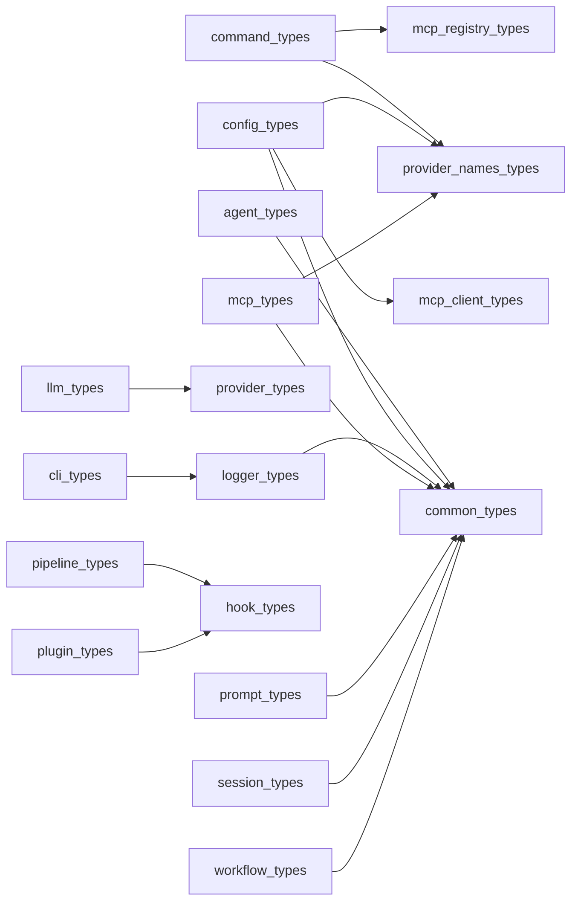

# Module: `types`

_Generated: 2026-04-18_

## File Dependencies

## Symbol References

| Symbol                         | Kind      | Defined in              | Used in                                                                                                                                                                                                                                                                                                                                                                                                                                                                                                                                                                                                                                                                                                                                                                                                                                                                                                                                                                                                                                                                                                                                           |
| ------------------------------ | --------- | ----------------------- | ------------------------------------------------------------------------------------------------------------------------------------------------------------------------------------------------------------------------------------------------------------------------------------------------------------------------------------------------------------------------------------------------------------------------------------------------------------------------------------------------------------------------------------------------------------------------------------------------------------------------------------------------------------------------------------------------------------------------------------------------------------------------------------------------------------------------------------------------------------------------------------------------------------------------------------------------------------------------------------------------------------------------------------------------------------------------------------------------------------------------------------------------- |
| AgentCapabilities              | interface | agent.types.ts          | —                                                                                                                                                                                                                                                                                                                                                                                                                                                                                                                                                                                                                                                                                                                                                                                                                                                                                                                                                                                                                                                                                                                                                 |
| AgentCapability                | interface | agent.types.ts          | agent-capability-matcher.service.ts, agent-capability-registry.service.ts                                                                                                                                                                                                                                                                                                                                                                                                                                                                                                                                                                                                                                                                                                                                                                                                                                                                                                                                                                                                                                                                         |
| AgentConstraints               | interface | agent.types.ts          | —                                                                                                                                                                                                                                                                                                                                                                                                                                                                                                                                                                                                                                                                                                                                                                                                                                                                                                                                                                                                                                                                                                                                                 |
| AgentContext                   | interface | agent.types.ts          | —                                                                                                                                                                                                                                                                                                                                                                                                                                                                                                                                                                                                                                                                                                                                                                                                                                                                                                                                                                                                                                                                                                                                                 |
| AgentContextRequirements       | interface | agent.types.ts          | —                                                                                                                                                                                                                                                                                                                                                                                                                                                                                                                                                                                                                                                                                                                                                                                                                                                                                                                                                                                                                                                                                                                                                 |
| AgentDecisionMaking            | interface | agent.types.ts          | —                                                                                                                                                                                                                                                                                                                                                                                                                                                                                                                                                                                                                                                                                                                                                                                                                                                                                                                                                                                                                                                                                                                                                 |
| AgentDefinition                | interface | agent.types.ts          | agent-loader.ts, stage-executor.ts                                                                                                                                                                                                                                                                                                                                                                                                                                                                                                                                                                                                                                                                                                                                                                                                                                                                                                                                                                                                                                                                                                                |
| AgentMetadata                  | interface | agent.types.ts          | agent-loader.ts                                                                                                                                                                                                                                                                                                                                                                                                                                                                                                                                                                                                                                                                                                                                                                                                                                                                                                                                                                                                                                                                                                                                   |
| AgentOutputFormat              | interface | agent.types.ts          | —                                                                                                                                                                                                                                                                                                                                                                                                                                                                                                                                                                                                                                                                                                                                                                                                                                                                                                                                                                                                                                                                                                                                                 |
| AgentRole                      | type      | command.types.ts        | execution-coordinator.ts, agent-selection-analytics.service.ts                                                                                                                                                                                                                                                                                                                                                                                                                                                                                                                                                                                                                                                                                                                                                                                                                                                                                                                                                                                                                                                                                    |
| AgentScore                     | interface | agent.types.ts          | dynamic-agent-resolver.service.test.ts, agent-capability-matcher.service.ts, dynamic-agent-resolver.service.ts                                                                                                                                                                                                                                                                                                                                                                                                                                                                                                                                                                                                                                                                                                                                                                                                                                                                                                                                                                                                                                    |
| AgentSelection                 | interface | agent.types.ts          | agent-selection-analytics.service.ts, dynamic-agent-resolver.service.ts, dynamic-agent-selection.acceptance.test.ts, agent-selection-performance.performance.test.ts, agent-selection-test-helpers.ts                                                                                                                                                                                                                                                                                                                                                                                                                                                                                                                                                                                                                                                                                                                                                                                                                                                                                                                                             |
| AgentThinkingData              | interface | pipeline.types.ts       | pipeline-emitter.ts                                                                                                                                                                                                                                                                                                                                                                                                                                                                                                                                                                                                                                                                                                                                                                                                                                                                                                                                                                                                                                                                                                                               |
| AIModel                        | type      | command.types.ts        | —                                                                                                                                                                                                                                                                                                                                                                                                                                                                                                                                                                                                                                                                                                                                                                                                                                                                                                                                                                                                                                                                                                                                                 |
| AllocatedResources             | interface | exploration.types.ts    | resource-allocator.ts                                                                                                                                                                                                                                                                                                                                                                                                                                                                                                                                                                                                                                                                                                                                                                                                                                                                                                                                                                                                                                                                                                                             |
| AllowedTool                    | type      | command.types.ts        | execution-context.ts, tool-execution.service.ts, dry-run-simulator.service.ts                                                                                                                                                                                                                                                                                                                                                                                                                                                                                                                                                                                                                                                                                                                                                                                                                                                                                                                                                                                                                                                                     |
| AudioContent                   | interface | mcp.types.ts            | —                                                                                                                                                                                                                                                                                                                                                                                                                                                                                                                                                                                                                                                                                                                                                                                                                                                                                                                                                                                                                                                                                                                                                 |
| AutonomyLevel                  | type      | agent.types.ts          | —                                                                                                                                                                                                                                                                                                                                                                                                                                                                                                                                                                                                                                                                                                                                                                                                                                                                                                                                                                                                                                                                                                                                                 |
| BaseContent                    | interface | mcp.types.ts            | —                                                                                                                                                                                                                                                                                                                                                                                                                                                                                                                                                                                                                                                                                                                                                                                                                                                                                                                                                                                                                                                                                                                                                 |
| BaseWizardAnswers              | interface | wizard.types.ts         | command-wizard.ts                                                                                                                                                                                                                                                                                                                                                                                                                                                                                                                                                                                                                                                                                                                                                                                                                                                                                                                                                                                                                                                                                                                                 |
| BuiltInTool                    | type      | command.types.ts        | tool-execution.service.ts                                                                                                                                                                                                                                                                                                                                                                                                                                                                                                                                                                                                                                                                                                                                                                                                                                                                                                                                                                                                                                                                                                                         |
| CacheStrategy                  | type      | command.types.ts        | —                                                                                                                                                                                                                                                                                                                                                                                                                                                                                                                                                                                                                                                                                                                                                                                                                                                                                                                                                                                                                                                                                                                                                 |
| ClarificationResult            | interface | document.types.ts       | document-approval.ts                                                                                                                                                                                                                                                                                                                                                                                                                                                                                                                                                                                                                                                                                                                                                                                                                                                                                                                                                                                                                                                                                                                              |
| ClarifyingQuestion             | interface | document.types.ts       | interactive-question-handler.service.ts                                                                                                                                                                                                                                                                                                                                                                                                                                                                                                                                                                                                                                                                                                                                                                                                                                                                                                                                                                                                                                                                                                           |
| CleanupOptions                 | interface | exploration.types.ts    | —                                                                                                                                                                                                                                                                                                                                                                                                                                                                                                                                                                                                                                                                                                                                                                                                                                                                                                                                                                                                                                                                                                                                                 |
| CleanupResult                  | interface | exploration.types.ts    | cleanup-scheduler.ts, retention-manager.ts                                                                                                                                                                                                                                                                                                                                                                                                                                                                                                                                                                                                                                                                                                                                                                                                                                                                                                                                                                                                                                                                                                        |
| CLIFlagValue                   | type      | cli.types.ts            | —                                                                                                                                                                                                                                                                                                                                                                                                                                                                                                                                                                                                                                                                                                                                                                                                                                                                                                                                                                                                                                                                                                                                                 |
| CLIOptionDefinition            | interface | cli.types.ts            | —                                                                                                                                                                                                                                                                                                                                                                                                                                                                                                                                                                                                                                                                                                                                                                                                                                                                                                                                                                                                                                                                                                                                                 |
| CliOptions                     | interface | cli-options.types.ts    | index.ts                                                                                                                                                                                                                                                                                                                                                                                                                                                                                                                                                                                                                                                                                                                                                                                                                                                                                                                                                                                                                                                                                                                                          |
| CLIOptions                     | interface | cli.types.ts            | config-builder.ts                                                                                                                                                                                                                                                                                                                                                                                                                                                                                                                                                                                                                                                                                                                                                                                                                                                                                                                                                                                                                                                                                                                                 |
| CLITransformer                 | type      | cli.types.ts            | —                                                                                                                                                                                                                                                                                                                                                                                                                                                                                                                                                                                                                                                                                                                                                                                                                                                                                                                                                                                                                                                                                                                                                 |
| CLIValidator                   | type      | cli.types.ts            | —                                                                                                                                                                                                                                                                                                                                                                                                                                                                                                                                                                                                                                                                                                                                                                                                                                                                                                                                                                                                                                                                                                                                                 |
| CodebaseContext                | interface | agent.types.ts          | agent-capability-matcher.service.test.ts, dynamic-agent-resolver.service.test.ts, agent-capability-matcher.service.ts, context-analyzer.service.ts, dynamic-agent-resolver.service.ts                                                                                                                                                                                                                                                                                                                                                                                                                                                                                                                                                                                                                                                                                                                                                                                                                                                                                                                                                             |
| CommandDefinition              | interface | command.types.ts        | command-resolver.ts, provider-fallback.integration.test.ts, command-loader.ts, dry-run-cache.ts, dry-run-strategy.ts, execution-strategy.ts, command-discovery.service.ts, tool-mapping.service.ts                                                                                                                                                                                                                                                                                                                                                                                                                                                                                                                                                                                                                                                                                                                                                                                                                                                                                                                                                |
| CommandExecutionContext        | interface | command.types.ts        | —                                                                                                                                                                                                                                                                                                                                                                                                                                                                                                                                                                                                                                                                                                                                                                                                                                                                                                                                                                                                                                                                                                                                                 |
| CommandIsolationMode           | interface | command.types.ts        | command-isolation.executor.ts                                                                                                                                                                                                                                                                                                                                                                                                                                                                                                                                                                                                                                                                                                                                                                                                                                                                                                                                                                                                                                                                                                                     |
| CommandMetadata                | interface | command.types.ts        | command-loader.ts, command-validation.ts                                                                                                                                                                                                                                                                                                                                                                                                                                                                                                                                                                                                                                                                                                                                                                                                                                                                                                                                                                                                                                                                                                          |
| CommandResult                  | interface | command.types.ts        | command-executor.ts, execution-coordinator.ts, command-isolation.executor.ts, dry-run-strategy.ts, execution-strategy.ts, pipeline.ts, request-handler.ts, execution-coordinator-dynamic-agent.integration.test.ts                                                                                                                                                                                                                                                                                                                                                                                                                                                                                                                                                                                                                                                                                                                                                                                                                                                                                                                                |
| ConfidenceTier                 | type      | memory.types.ts         | —                                                                                                                                                                                                                                                                                                                                                                                                                                                                                                                                                                                                                                                                                                                                                                                                                                                                                                                                                                                                                                                                                                                                                 |
| Config                         | interface | config.types.ts         | coordinator.ts, doctor.ts, config-builder.ts, provider-mismatch-handler.ts, provider-resolver.ts, interactive-wizard.ts, loader.ts, schema.ts, validation-helpers.ts, container.ts, hook-execution.service.ts, cursor.provider.ts, diagnostics.service.ts, error-handler.test.ts, agentic-security.security.test.ts, security-validation.security.test.ts                                                                                                                                                                                                                                                                                                                                                                                                                                                                                                                                                                                                                                                                                                                                                                                         |
| ConfigurationError             | interface | error.types.ts          | loader.test.ts, loader.ts, error-handler.test.ts                                                                                                                                                                                                                                                                                                                                                                                                                                                                                                                                                                                                                                                                                                                                                                                                                                                                                                                                                                                                                                                                                                  |
| ConfigValidationError          | interface | config.types.ts         | —                                                                                                                                                                                                                                                                                                                                                                                                                                                                                                                                                                                                                                                                                                                                                                                                                                                                                                                                                                                                                                                                                                                                                 |
| ConfigValidationResult         | interface | config.types.ts         | —                                                                                                                                                                                                                                                                                                                                                                                                                                                                                                                                                                                                                                                                                                                                                                                                                                                                                                                                                                                                                                                                                                                                                 |
| ConnectedMCPServer             | interface | mcp-client.types.ts     | external-mcp-integrator.ts, mcp-client-manager.service.ts                                                                                                                                                                                                                                                                                                                                                                                                                                                                                                                                                                                                                                                                                                                                                                                                                                                                                                                                                                                                                                                                                         |
| ConsolidationCompleteData      | interface | pipeline.types.ts       | pipeline-emitter.ts                                                                                                                                                                                                                                                                                                                                                                                                                                                                                                                                                                                                                                                                                                                                                                                                                                                                                                                                                                                                                                                                                                                               |
| ConsolidationResult            | interface | memory.types.ts         | memory-consolidation.service.ts                                                                                                                                                                                                                                                                                                                                                                                                                                                                                                                                                                                                                                                                                                                                                                                                                                                                                                                                                                                                                                                                                                                   |
| ContainerStats                 | interface | exploration.types.ts    | container-manager.ts, dashboard-metrics.tsx, dashboard-ui.tsx, execution-modes.ts, exploration-events.ts                                                                                                                                                                                                                                                                                                                                                                                                                                                                                                                                                                                                                                                                                                                                                                                                                                                                                                                                                                                                                                          |
| ContentType                    | type      | common.types.ts         | mcp.types.ts                                                                                                                                                                                                                                                                                                                                                                                                                                                                                                                                                                                                                                                                                                                                                                                                                                                                                                                                                                                                                                                                                                                                      |
| ContextWindowUsage             | interface | session.types.ts        | session-manager.ts                                                                                                                                                                                                                                                                                                                                                                                                                                                                                                                                                                                                                                                                                                                                                                                                                                                                                                                                                                                                                                                                                                                                |
| CustomWizardAnswers            | interface | wizard.types.ts         | command-wizard.ts                                                                                                                                                                                                                                                                                                                                                                                                                                                                                                                                                                                                                                                                                                                                                                                                                                                                                                                                                                                                                                                                                                                                 |
| Decision                       | interface | exploration.types.ts    | extract-metrics.ts, generate-dashboard.ts, review-code-presenter.ts, review-plan-presenter.ts, escalation-handler.service.ts, collaboration-coordinator.ts, exploration-events.ts                                                                                                                                                                                                                                                                                                                                                                                                                                                                                                                                                                                                                                                                                                                                                                                                                                                                                                                                                                 |
| DecisionOption                 | interface | exploration.types.ts    | —                                                                                                                                                                                                                                                                                                                                                                                                                                                                                                                                                                                                                                                                                                                                                                                                                                                                                                                                                                                                                                                                                                                                                 |
| DecisionsPool                  | interface | exploration.types.ts    | collaboration-coordinator.ts, shared-volume-manager.ts                                                                                                                                                                                                                                                                                                                                                                                                                                                                                                                                                                                                                                                                                                                                                                                                                                                                                                                                                                                                                                                                                            |
| DEFAULT_ESCALATION_CONFIG      | constant  | escalation.types.ts     | escalation-detection.service.ts                                                                                                                                                                                                                                                                                                                                                                                                                                                                                                                                                                                                                                                                                                                                                                                                                                                                                                                                                                                                                                                                                                                   |
| DefaultsConfig                 | interface | config.types.ts         | schema.ts                                                                                                                                                                                                                                                                                                                                                                                                                                                                                                                                                                                                                                                                                                                                                                                                                                                                                                                                                                                                                                                                                                                                         |
| DiagnosticResult               | interface | diagnostics.types.ts    | lsp.types.test.ts, lsp.types.ts, diagnostic-formatter.ts, diagnostics.service.ts                                                                                                                                                                                                                                                                                                                                                                                                                                                                                                                                                                                                                                                                                                                                                                                                                                                                                                                                                                                                                                                                  |
| DiagnosticStatus               | type      | diagnostics.types.ts    | diagnostic-formatter.ts, diagnostics.service.ts                                                                                                                                                                                                                                                                                                                                                                                                                                                                                                                                                                                                                                                                                                                                                                                                                                                                                                                                                                                                                                                                                                   |
| DisplayOptions                 | interface | ui.types.ts             | session-cleanup-adapter.ts                                                                                                                                                                                                                                                                                                                                                                                                                                                                                                                                                                                                                                                                                                                                                                                                                                                                                                                                                                                                                                                                                                                        |
| DOCUMENT_CONFIDENCE_THRESHOLDS | constant  | document.types.ts       | document-approval.ts                                                                                                                                                                                                                                                                                                                                                                                                                                                                                                                                                                                                                                                                                                                                                                                                                                                                                                                                                                                                                                                                                                                              |
| DOCUMENT_STATUS_EMOJI          | constant  | document.types.ts       | document-template.service.ts                                                                                                                                                                                                                                                                                                                                                                                                                                                                                                                                                                                                                                                                                                                                                                                                                                                                                                                                                                                                                                                                                                                      |
| DOCUMENT_TYPE_CATEGORIES       | constant  | document.types.ts       | document-approval.ts, document-path-resolver.service.ts                                                                                                                                                                                                                                                                                                                                                                                                                                                                                                                                                                                                                                                                                                                                                                                                                                                                                                                                                                                                                                                                                           |
| DOCUMENT_TYPE_DEFAULT_CATEGORY | constant  | document.types.ts       | document-detector.service.ts, document-path-resolver.service.ts                                                                                                                                                                                                                                                                                                                                                                                                                                                                                                                                                                                                                                                                                                                                                                                                                                                                                                                                                                                                                                                                                   |
| DocumentApprovalResult         | interface | document.types.ts       | document-approval.ts                                                                                                                                                                                                                                                                                                                                                                                                                                                                                                                                                                                                                                                                                                                                                                                                                                                                                                                                                                                                                                                                                                                              |
| DocumentCategory               | type      | document.types.ts       | dynamic.ts, document-approval.ts, document-output-processor.ts, document-detector.service.ts, document-path-resolver.service.ts, document-writer.service.ts                                                                                                                                                                                                                                                                                                                                                                                                                                                                                                                                                                                                                                                                                                                                                                                                                                                                                                                                                                                       |
| DocumentDefinition             | interface | document.types.ts       | document-approval.ts, document-output-processor.ts, document-writer.service.ts                                                                                                                                                                                                                                                                                                                                                                                                                                                                                                                                                                                                                                                                                                                                                                                                                                                                                                                                                                                                                                                                    |
| DocumentDetectionResult        | interface | document.types.ts       | document-approval.ts, document-detector.service.ts                                                                                                                                                                                                                                                                                                                                                                                                                                                                                                                                                                                                                                                                                                                                                                                                                                                                                                                                                                                                                                                                                                |
| DocumentMetadata               | interface | document.types.ts       | document-template.service.ts                                                                                                                                                                                                                                                                                                                                                                                                                                                                                                                                                                                                                                                                                                                                                                                                                                                                                                                                                                                                                                                                                                                      |
| DocumentOutputOptions          | interface | document.types.ts       | command-executor.ts, dynamic.ts, document-output-processor.ts                                                                                                                                                                                                                                                                                                                                                                                                                                                                                                                                                                                                                                                                                                                                                                                                                                                                                                                                                                                                                                                                                     |
| DocumentStatus                 | type      | document.types.ts       | document-template.service.ts                                                                                                                                                                                                                                                                                                                                                                                                                                                                                                                                                                                                                                                                                                                                                                                                                                                                                                                                                                                                                                                                                                                      |
| DocumentType                   | type      | document.types.ts       | document-approval.ts, document-output-processor.ts, document-detector.service.ts, document-path-resolver.service.ts, document-template.service.ts, document-writer.service.ts                                                                                                                                                                                                                                                                                                                                                                                                                                                                                                                                                                                                                                                                                                                                                                                                                                                                                                                                                                     |
| DocumentWriteResult            | interface | document.types.ts       | document-writer.service.ts                                                                                                                                                                                                                                                                                                                                                                                                                                                                                                                                                                                                                                                                                                                                                                                                                                                                                                                                                                                                                                                                                                                        |
| EscalationAbortedData          | interface | pipeline.types.ts       | pipeline-emitter.ts                                                                                                                                                                                                                                                                                                                                                                                                                                                                                                                                                                                                                                                                                                                                                                                                                                                                                                                                                                                                                                                                                                                               |
| EscalationConfig               | interface | escalation.types.ts     | escalation-detection.service.ts                                                                                                                                                                                                                                                                                                                                                                                                                                                                                                                                                                                                                                                                                                                                                                                                                                                                                                                                                                                                                                                                                                                   |
| EscalationContext              | interface | escalation.types.ts     | escalation-handler.service.ts, stage-executor.ts                                                                                                                                                                                                                                                                                                                                                                                                                                                                                                                                                                                                                                                                                                                                                                                                                                                                                                                                                                                                                                                                                                  |
| EscalationDecision             | interface | escalation.types.ts     | escalation-handler.service.ts                                                                                                                                                                                                                                                                                                                                                                                                                                                                                                                                                                                                                                                                                                                                                                                                                                                                                                                                                                                                                                                                                                                     |
| EscalationDecisionType         | type      | escalation.types.ts     | escalation-handler.service.ts                                                                                                                                                                                                                                                                                                                                                                                                                                                                                                                                                                                                                                                                                                                                                                                                                                                                                                                                                                                                                                                                                                                     |
| EscalationParseResult          | interface | escalation.types.ts     | escalation-detection.service.ts                                                                                                                                                                                                                                                                                                                                                                                                                                                                                                                                                                                                                                                                                                                                                                                                                                                                                                                                                                                                                                                                                                                   |
| EscalationResolvedData         | interface | pipeline.types.ts       | pipeline-emitter.ts                                                                                                                                                                                                                                                                                                                                                                                                                                                                                                                                                                                                                                                                                                                                                                                                                                                                                                                                                                                                                                                                                                                               |
| EscalationResult               | interface | escalation.types.ts     | escalation-handler.service.ts                                                                                                                                                                                                                                                                                                                                                                                                                                                                                                                                                                                                                                                                                                                                                                                                                                                                                                                                                                                                                                                                                                                     |
| EscalationRiskLevel            | type      | escalation.types.ts     | escalation-detection.service.ts                                                                                                                                                                                                                                                                                                                                                                                                                                                                                                                                                                                                                                                                                                                                                                                                                                                                                                                                                                                                                                                                                                                   |
| EscalationSignal               | interface | escalation.types.ts     | escalation-detection.service.ts, escalation-handler.service.ts, stage-executor.ts                                                                                                                                                                                                                                                                                                                                                                                                                                                                                                                                                                                                                                                                                                                                                                                                                                                                                                                                                                                                                                                                 |
| EscalationTriggeredData        | interface | pipeline.types.ts       | pipeline-emitter.ts                                                                                                                                                                                                                                                                                                                                                                                                                                                                                                                                                                                                                                                                                                                                                                                                                                                                                                                                                                                                                                                                                                                               |
| ExecuteWizardAnswers           | interface | wizard.types.ts         | command-wizard.ts                                                                                                                                                                                                                                                                                                                                                                                                                                                                                                                                                                                                                                                                                                                                                                                                                                                                                                                                                                                                                                                                                                                                 |
| ExecutionMode                  | type      | exploration.types.ts    | —                                                                                                                                                                                                                                                                                                                                                                                                                                                                                                                                                                                                                                                                                                                                                                                                                                                                                                                                                                                                                                                                                                                                                 |
| Exploration                    | interface | exploration.types.ts    | explore.ts, dashboard-controls.tsx, dashboard-ui.tsx, execution-modes.ts, exploration-events.ts, exploration-state.ts, merge-orchestrator.ts, orchestrator.ts, result-comparator.ts, shared-volume-manager.ts, exploration-info-panel.tsx                                                                                                                                                                                                                                                                                                                                                                                                                                                                                                                                                                                                                                                                                                                                                                                                                                                                                                         |
| ExplorationConfig              | interface | exploration.types.ts    | explore.ts, docker-integration.test.ts, smoke.test.ts, exploration-state.ts, orchestrator.ts                                                                                                                                                                                                                                                                                                                                                                                                                                                                                                                                                                                                                                                                                                                                                                                                                                                                                                                                                                                                                                                      |
| ExplorationListFilters         | interface | exploration.types.ts    | —                                                                                                                                                                                                                                                                                                                                                                                                                                                                                                                                                                                                                                                                                                                                                                                                                                                                                                                                                                                                                                                                                                                                                 |
| ExplorationResults             | interface | exploration.types.ts    | execution-modes.ts                                                                                                                                                                                                                                                                                                                                                                                                                                                                                                                                                                                                                                                                                                                                                                                                                                                                                                                                                                                                                                                                                                                                |
| ExplorationState               | interface | exploration.types.ts    | exploration-state.ts                                                                                                                                                                                                                                                                                                                                                                                                                                                                                                                                                                                                                                                                                                                                                                                                                                                                                                                                                                                                                                                                                                                              |
| ExplorationStatus              | type      | exploration.types.ts    | —                                                                                                                                                                                                                                                                                                                                                                                                                                                                                                                                                                                                                                                                                                                                                                                                                                                                                                                                                                                                                                                                                                                                                 |
| ExplorationSummary             | interface | exploration.types.ts    | explore.ts, exploration-state.ts, orchestrator.ts                                                                                                                                                                                                                                                                                                                                                                                                                                                                                                                                                                                                                                                                                                                                                                                                                                                                                                                                                                                                                                                                                                 |
| ExternalMCPRegistry            | interface | mcp-client.types.ts     | generate-mcp-types.ts, test-mcp-integration.ts, mcp-client-manager.service.ts                                                                                                                                                                                                                                                                                                                                                                                                                                                                                                                                                                                                                                                                                                                                                                                                                                                                                                                                                                                                                                                                     |
| ExternalMCPRequirement         | interface | mcp-client.types.ts     | external-mcp-integrator.ts                                                                                                                                                                                                                                                                                                                                                                                                                                                                                                                                                                                                                                                                                                                                                                                                                                                                                                                                                                                                                                                                                                                        |
| ExternalMCPServerConfig        | interface | mcp-client.types.ts     | tool-proxy.ts, mcp-approval-workflow.ts, mcp-availability.service.ts, mcp-client-manager.service.ts, mcp-tool-handler.ts, config.types.ts                                                                                                                                                                                                                                                                                                                                                                                                                                                                                                                                                                                                                                                                                                                                                                                                                                                                                                                                                                                                         |
| ExternalMCPServersConfig       | interface | config.types.ts         | —                                                                                                                                                                                                                                                                                                                                                                                                                                                                                                                                                                                                                                                                                                                                                                                                                                                                                                                                                                                                                                                                                                                                                 |
| ExternalMCPTool                | interface | mcp-client.types.ts     | tool-proxy.ts, mcp-approval-workflow.ts, mcp-client-manager.service.ts, tool-definition-validator.test.ts, tool-definition-validator.ts, tool-integrity-monitor.test.ts, tool-integrity-monitor.ts, agentic-security.security.test.ts                                                                                                                                                                                                                                                                                                                                                                                                                                                                                                                                                                                                                                                                                                                                                                                                                                                                                                             |
| ExternalMCPToolCallRequest     | interface | mcp-client.types.ts     | tool-proxy.ts, mcp-client-manager.service.ts                                                                                                                                                                                                                                                                                                                                                                                                                                                                                                                                                                                                                                                                                                                                                                                                                                                                                                                                                                                                                                                                                                      |
| ExternalMCPToolCallResult      | interface | mcp-client.types.ts     | tool-proxy.ts, mcp-client-manager.service.ts                                                                                                                                                                                                                                                                                                                                                                                                                                                                                                                                                                                                                                                                                                                                                                                                                                                                                                                                                                                                                                                                                                      |
| extractMCPServerId             | function  | command.types.ts        | mcp-tool-handler.ts                                                                                                                                                                                                                                                                                                                                                                                                                                                                                                                                                                                                                                                                                                                                                                                                                                                                                                                                                                                                                                                                                                                               |
| FailurePolicy                  | type      | command.types.ts        | stage-executor.ts                                                                                                                                                                                                                                                                                                                                                                                                                                                                                                                                                                                                                                                                                                                                                                                                                                                                                                                                                                                                                                                                                                                                 |
| FeatureFlags                   | interface | config.types.ts         | schema.ts                                                                                                                                                                                                                                                                                                                                                                                                                                                                                                                                                                                                                                                                                                                                                                                                                                                                                                                                                                                                                                                                                                                                         |
| FileLock                       | interface | exploration.types.ts    | file-lock.ts                                                                                                                                                                                                                                                                                                                                                                                                                                                                                                                                                                                                                                                                                                                                                                                                                                                                                                                                                                                                                                                                                                                                      |
| FileSystemError                | interface | error.types.ts          | —                                                                                                                                                                                                                                                                                                                                                                                                                                                                                                                                                                                                                                                                                                                                                                                                                                                                                                                                                                                                                                                                                                                                                 |
| GenericWizardAnswers           | interface | wizard.types.ts         | command-wizard.ts                                                                                                                                                                                                                                                                                                                                                                                                                                                                                                                                                                                                                                                                                                                                                                                                                                                                                                                                                                                                                                                                                                                                 |
| getServerIdFromTool            | function  | mcp-registry.types.ts   | tool-execution.service.ts                                                                                                                                                                                                                                                                                                                                                                                                                                                                                                                                                                                                                                                                                                                                                                                                                                                                                                                                                                                                                                                                                                                         |
| getToolFromServerId            | function  | mcp-registry.types.ts   | —                                                                                                                                                                                                                                                                                                                                                                                                                                                                                                                                                                                                                                                                                                                                                                                                                                                                                                                                                                                                                                                                                                                                                 |
| GitState                       | interface | exploration.types.ts    | safety-validator.ts                                                                                                                                                                                                                                                                                                                                                                                                                                                                                                                                                                                                                                                                                                                                                                                                                                                                                                                                                                                                                                                                                                                               |
| GUIDED_MODE                    | constant  | provider.types.ts       | provider-fallback-service.ts                                                                                                                                                                                                                                                                                                                                                                                                                                                                                                                                                                                                                                                                                                                                                                                                                                                                                                                                                                                                                                                                                                                      |
| GuidedMode                     | type      | provider.types.ts       | llm.types.ts                                                                                                                                                                                                                                                                                                                                                                                                                                                                                                                                                                                                                                                                                                                                                                                                                                                                                                                                                                                                                                                                                                                                      |
| HookCommand                    | interface | hook.types.ts           | hook-execution.service.ts, hook-execution.service.test.ts                                                                                                                                                                                                                                                                                                                                                                                                                                                                                                                                                                                                                                                                                                                                                                                                                                                                                                                                                                                                                                                                                         |
| HookEventName                  | type      | hook.types.ts           | hook-execution.service.ts, pipeline.types.ts                                                                                                                                                                                                                                                                                                                                                                                                                                                                                                                                                                                                                                                                                                                                                                                                                                                                                                                                                                                                                                                                                                      |
| HookExecutionResult            | interface | hook.types.ts           | hook-execution.service.ts                                                                                                                                                                                                                                                                                                                                                                                                                                                                                                                                                                                                                                                                                                                                                                                                                                                                                                                                                                                                                                                                                                                         |
| HookInput                      | interface | hook.types.ts           | hook-execution.service.ts, hook-execution.service.test.ts                                                                                                                                                                                                                                                                                                                                                                                                                                                                                                                                                                                                                                                                                                                                                                                                                                                                                                                                                                                                                                                                                         |
| HookMatcher                    | interface | hook.types.ts           | hook-execution.service.ts, hook-execution.service.test.ts                                                                                                                                                                                                                                                                                                                                                                                                                                                                                                                                                                                                                                                                                                                                                                                                                                                                                                                                                                                                                                                                                         |
| HookOutput                     | interface | hook.types.ts           | hook-execution.service.ts                                                                                                                                                                                                                                                                                                                                                                                                                                                                                                                                                                                                                                                                                                                                                                                                                                                                                                                                                                                                                                                                                                                         |
| HookPermissionDecision         | type      | hook.types.ts           | —                                                                                                                                                                                                                                                                                                                                                                                                                                                                                                                                                                                                                                                                                                                                                                                                                                                                                                                                                                                                                                                                                                                                                 |
| HooksConfig                    | interface | hook.types.ts           | hook-execution.service.ts, plugin-loader.service.ts, plugin.types.ts                                                                                                                                                                                                                                                                                                                                                                                                                                                                                                                                                                                                                                                                                                                                                                                                                                                                                                                                                                                                                                                                              |
| IdempotencyCheckResult         | interface | idempotency.types.ts    | idempotency-store.service.ts                                                                                                                                                                                                                                                                                                                                                                                                                                                                                                                                                                                                                                                                                                                                                                                                                                                                                                                                                                                                                                                                                                                      |
| IdempotencyOptions             | interface | idempotency.types.ts    | tool-execution.service.ts, idempotency-store.service.ts                                                                                                                                                                                                                                                                                                                                                                                                                                                                                                                                                                                                                                                                                                                                                                                                                                                                                                                                                                                                                                                                                           |
| IdempotencyRecord              | interface | idempotency.types.ts    | idempotency-store.service.ts                                                                                                                                                                                                                                                                                                                                                                                                                                                                                                                                                                                                                                                                                                                                                                                                                                                                                                                                                                                                                                                                                                                      |
| IdempotencyResult              | interface | idempotency.types.ts    | idempotency-store.service.ts                                                                                                                                                                                                                                                                                                                                                                                                                                                                                                                                                                                                                                                                                                                                                                                                                                                                                                                                                                                                                                                                                                                      |
| IdempotencyStoreConfig         | interface | idempotency.types.ts    | idempotency-store.service.ts                                                                                                                                                                                                                                                                                                                                                                                                                                                                                                                                                                                                                                                                                                                                                                                                                                                                                                                                                                                                                                                                                                                      |
| IDEMPOTENT_TOOLS               | constant  | idempotency.types.ts    | —                                                                                                                                                                                                                                                                                                                                                                                                                                                                                                                                                                                                                                                                                                                                                                                                                                                                                                                                                                                                                                                                                                                                                 |
| IdempotentTool                 | type      | idempotency.types.ts    | —                                                                                                                                                                                                                                                                                                                                                                                                                                                                                                                                                                                                                                                                                                                                                                                                                                                                                                                                                                                                                                                                                                                                                 |
| ImageContent                   | interface | mcp.types.ts            | —                                                                                                                                                                                                                                                                                                                                                                                                                                                                                                                                                                                                                                                                                                                                                                                                                                                                                                                                                                                                                                                                                                                                                 |
| ImplementWizardAnswers         | interface | wizard.types.ts         | command-wizard.ts                                                                                                                                                                                                                                                                                                                                                                                                                                                                                                                                                                                                                                                                                                                                                                                                                                                                                                                                                                                                                                                                                                                                 |
| InputType                      | type      | common.types.ts         | prompt.types.ts                                                                                                                                                                                                                                                                                                                                                                                                                                                                                                                                                                                                                                                                                                                                                                                                                                                                                                                                                                                                                                                                                                                                   |
| Insight                        | interface | exploration.types.ts    | collaboration-coordinator.ts, dashboard-ui.tsx, exploration-events.ts                                                                                                                                                                                                                                                                                                                                                                                                                                                                                                                                                                                                                                                                                                                                                                                                                                                                                                                                                                                                                                                                             |
| InsightsPool                   | interface | exploration.types.ts    | collaboration-coordinator.ts, shared-volume-manager.ts                                                                                                                                                                                                                                                                                                                                                                                                                                                                                                                                                                                                                                                                                                                                                                                                                                                                                                                                                                                                                                                                                            |
| InsightType                    | type      | exploration.types.ts    | —                                                                                                                                                                                                                                                                                                                                                                                                                                                                                                                                                                                                                                                                                                                                                                                                                                                                                                                                                                                                                                                                                                                                                 |
| isFileSystemError              | function  | error.types.ts          | —                                                                                                                                                                                                                                                                                                                                                                                                                                                                                                                                                                                                                                                                                                                                                                                                                                                                                                                                                                                                                                                                                                                                                 |
| isIdempotentTool               | function  | idempotency.types.ts    | tool-execution.service.ts, idempotency-store.service.ts                                                                                                                                                                                                                                                                                                                                                                                                                                                                                                                                                                                                                                                                                                                                                                                                                                                                                                                                                                                                                                                                                           |
| isMCPTool                      | function  | command.types.ts        | tool-execution.service.ts                                                                                                                                                                                                                                                                                                                                                                                                                                                                                                                                                                                                                                                                                                                                                                                                                                                                                                                                                                                                                                                                                                                         |
| isNodeJSError                  | function  | error.types.ts          | —                                                                                                                                                                                                                                                                                                                                                                                                                                                                                                                                                                                                                                                                                                                                                                                                                                                                                                                                                                                                                                                                                                                                                 |
| IsolatedExecutionOptions       | interface | command.types.ts        | command-executor.ts, dynamic.ts, command-isolation.executor.ts, execution-context.ts                                                                                                                                                                                                                                                                                                                                                                                                                                                                                                                                                                                                                                                                                                                                                                                                                                                                                                                                                                                                                                                              |
| isValidMCPTool                 | function  | mcp-registry.types.ts   | —                                                                                                                                                                                                                                                                                                                                                                                                                                                                                                                                                                                                                                                                                                                                                                                                                                                                                                                                                                                                                                                                                                                                                 |
| LLMCompletionOptions           | interface | llm.types.ts            | batch.types.ts, stage-executor.ts, provider.interface.ts, anthropic.provider.ts, cursor.provider.test.ts, cursor.provider.ts, google.provider.ts, local.provider.ts, openai.provider.ts                                                                                                                                                                                                                                                                                                                                                                                                                                                                                                                                                                                                                                                                                                                                                                                                                                                                                                                                                           |
| LLMCompletionResult            | interface | llm.types.ts            | batch.types.ts, anthropic.batch-provider.ts, openai.batch-provider.ts, stage-executor.ts, provider.interface.ts, anthropic.provider.ts, cursor.provider.ts, google.provider.ts, local.provider.ts, openai.provider.ts                                                                                                                                                                                                                                                                                                                                                                                                                                                                                                                                                                                                                                                                                                                                                                                                                                                                                                                             |
| LLMMessage                     | interface | llm.types.ts            | dry-run-preview.service.ts, stage-executor.test.ts, stage-executor.ts, anthropic.provider.ts, cursor.provider.ts, token-estimator.ts                                                                                                                                                                                                                                                                                                                                                                                                                                                                                                                                                                                                                                                                                                                                                                                                                                                                                                                                                                                                              |
| LLMProvider                    | interface | llm.types.ts            | batch-eligibility.test.ts, batch-eligibility.ts, batch-provider.interface.ts, provider-fallback-service.test.ts, provider-fallback-service.ts, execution-context.ts, provider.interface.ts, registry.ts                                                                                                                                                                                                                                                                                                                                                                                                                                                                                                                                                                                                                                                                                                                                                                                                                                                                                                                                           |
| LLMRequestData                 | interface | pipeline.types.ts       | pipeline-emitter.ts                                                                                                                                                                                                                                                                                                                                                                                                                                                                                                                                                                                                                                                                                                                                                                                                                                                                                                                                                                                                                                                                                                                               |
| LLMResponseData                | interface | pipeline.types.ts       | pipeline-emitter.ts                                                                                                                                                                                                                                                                                                                                                                                                                                                                                                                                                                                                                                                                                                                                                                                                                                                                                                                                                                                                                                                                                                                               |
| LLMRole                        | type      | llm.types.ts            | —                                                                                                                                                                                                                                                                                                                                                                                                                                                                                                                                                                                                                                                                                                                                                                                                                                                                                                                                                                                                                                                                                                                                                 |
| LLMToolCall                    | interface | llm.types.ts            | hook-execution.service.ts, stage-executor.ts, tool-execution.service.ts, dry-run-simulator.service.ts, idempotency-store.service.test.ts, idempotency-store.service.ts, hook-execution.service.test.ts                                                                                                                                                                                                                                                                                                                                                                                                                                                                                                                                                                                                                                                                                                                                                                                                                                                                                                                                            |
| LLMToolDefinition              | interface | llm.types.ts            | stage-executor.ts, tool-execution.service.ts                                                                                                                                                                                                                                                                                                                                                                                                                                                                                                                                                                                                                                                                                                                                                                                                                                                                                                                                                                                                                                                                                                      |
| LLMToolResult                  | interface | llm.types.ts            | stage-executor.ts, tool-execution.service.ts, dry-run-simulator.service.ts                                                                                                                                                                                                                                                                                                                                                                                                                                                                                                                                                                                                                                                                                                                                                                                                                                                                                                                                                                                                                                                                        |
| LLMUsage                       | interface | llm.types.ts            | anthropic.batch-provider.ts, openai.batch-provider.ts, anthropic.provider.ts, google.provider.ts, local.provider.ts, openai.provider.ts, token-estimator.test.ts, token-estimator.ts                                                                                                                                                                                                                                                                                                                                                                                                                                                                                                                                                                                                                                                                                                                                                                                                                                                                                                                                                              |
| LoadedPlugin                   | interface | plugin.types.ts         | doctor.ts, container.ts, processing-feedback.ts, plugin-loader.service.ts                                                                                                                                                                                                                                                                                                                                                                                                                                                                                                                                                                                                                                                                                                                                                                                                                                                                                                                                                                                                                                                                         |
| LogEntry                       | interface | logger.types.ts         | logger.ts                                                                                                                                                                                                                                                                                                                                                                                                                                                                                                                                                                                                                                                                                                                                                                                                                                                                                                                                                                                                                                                                                                                                         |
| LogLevel                       | type      | common.types.ts         | logger.ts, cli.types.ts, config.types.ts, logger.types.ts                                                                                                                                                                                                                                                                                                                                                                                                                                                                                                                                                                                                                                                                                                                                                                                                                                                                                                                                                                                                                                                                                         |
| MCP_SERVER_IDS                 | constant  | mcp-registry.types.ts   | —                                                                                                                                                                                                                                                                                                                                                                                                                                                                                                                                                                                                                                                                                                                                                                                                                                                                                                                                                                                                                                                                                                                                                 |
| MCPAccessRequest               | interface | mcp-client.types.ts     | external-mcp-integrator.ts, mcp-approval-workflow.ts, mcp-tool-handler.ts                                                                                                                                                                                                                                                                                                                                                                                                                                                                                                                                                                                                                                                                                                                                                                                                                                                                                                                                                                                                                                                                         |
| MCPApprovalCacheEntry          | interface | mcp-client.types.ts     | mcp-approval-cache.service.ts                                                                                                                                                                                                                                                                                                                                                                                                                                                                                                                                                                                                                                                                                                                                                                                                                                                                                                                                                                                                                                                                                                                     |
| MCPApprovalMemory              | type      | mcp-client.types.ts     | mcp-approval-cache.service.ts                                                                                                                                                                                                                                                                                                                                                                                                                                                                                                                                                                                                                                                                                                                                                                                                                                                                                                                                                                                                                                                                                                                     |
| MCPApprovalResult              | interface | mcp-client.types.ts     | mcp-approval-cache.service.ts, mcp-approval-workflow.ts                                                                                                                                                                                                                                                                                                                                                                                                                                                                                                                                                                                                                                                                                                                                                                                                                                                                                                                                                                                                                                                                                           |
| MCPAuditLogEntry               | interface | mcp-client.types.ts     | mcp-audit-logger.service.ts                                                                                                                                                                                                                                                                                                                                                                                                                                                                                                                                                                                                                                                                                                                                                                                                                                                                                                                                                                                                                                                                                                                       |
| MCPCapability                  | type      | mcp-client.types.ts     | —                                                                                                                                                                                                                                                                                                                                                                                                                                                                                                                                                                                                                                                                                                                                                                                                                                                                                                                                                                                                                                                                                                                                                 |
| MCPConnectionConfig            | interface | mcp-client.types.ts     | —                                                                                                                                                                                                                                                                                                                                                                                                                                                                                                                                                                                                                                                                                                                                                                                                                                                                                                                                                                                                                                                                                                                                                 |
| MCPConnectionType              | type      | mcp-client.types.ts     | —                                                                                                                                                                                                                                                                                                                                                                                                                                                                                                                                                                                                                                                                                                                                                                                                                                                                                                                                                                                                                                                                                                                                                 |
| MCPDashboardMetrics            | interface | mcp-client.types.ts     | mcp-audit-logger.service.ts, tool-calls-panel.tsx, server-metrics-panel.tsx, types.ts                                                                                                                                                                                                                                                                                                                                                                                                                                                                                                                                                                                                                                                                                                                                                                                                                                                                                                                                                                                                                                                             |
| MCPRecentToolCall              | interface | mcp-client.types.ts     | mcp-audit-logger.service.ts                                                                                                                                                                                                                                                                                                                                                                                                                                                                                                                                                                                                                                                                                                                                                                                                                                                                                                                                                                                                                                                                                                                       |
| MCPRiskLevel                   | type      | mcp-client.types.ts     | tool-proxy.ts, mcp-approval-workflow.ts                                                                                                                                                                                                                                                                                                                                                                                                                                                                                                                                                                                                                                                                                                                                                                                                                                                                                                                                                                                                                                                                                                           |
| MCPSamplingOptions             | interface | mcp.types.ts            | sampling-service.ts, server.ts                                                                                                                                                                                                                                                                                                                                                                                                                                                                                                                                                                                                                                                                                                                                                                                                                                                                                                                                                                                                                                                                                                                    |
| MCPSamplingResult              | interface | mcp.types.ts            | sampling-service.ts, server.ts                                                                                                                                                                                                                                                                                                                                                                                                                                                                                                                                                                                                                                                                                                                                                                                                                                                                                                                                                                                                                                                                                                                    |
| MCPSamplingService             | interface | mcp.types.ts            | command-executor.ts, command-resolver.ts, provider-fallback-service.test.ts, provider-fallback-service.ts, provider-fallback.integration.test.ts, cursor.provider.test.ts, cursor.provider.ts, registry.ts, sampling-service.ts, server.ts                                                                                                                                                                                                                                                                                                                                                                                                                                                                                                                                                                                                                                                                                                                                                                                                                                                                                                        |
| MCPSecurityConfig              | interface | mcp-client.types.ts     | —                                                                                                                                                                                                                                                                                                                                                                                                                                                                                                                                                                                                                                                                                                                                                                                                                                                                                                                                                                                                                                                                                                                                                 |
| MCPServerId                    | type      | mcp-registry.types.ts   | generate-mcp-types.ts                                                                                                                                                                                                                                                                                                                                                                                                                                                                                                                                                                                                                                                                                                                                                                                                                                                                                                                                                                                                                                                                                                                             |
| MCPServerInstance              | interface | mcp.types.ts            | context.ts                                                                                                                                                                                                                                                                                                                                                                                                                                                                                                                                                                                                                                                                                                                                                                                                                                                                                                                                                                                                                                                                                                                                        |
| MCPServerMetrics               | interface | mcp-client.types.ts     | mcp-audit-logger.service.ts                                                                                                                                                                                                                                                                                                                                                                                                                                                                                                                                                                                                                                                                                                                                                                                                                                                                                                                                                                                                                                                                                                                       |
| MCPServerOverrides             | interface | cli.types.ts            | server.ts, types.ts                                                                                                                                                                                                                                                                                                                                                                                                                                                                                                                                                                                                                                                                                                                                                                                                                                                                                                                                                                                                                                                                                                                               |
| MCPTool                        | type      | mcp-registry.types.ts   | tool-execution.service.ts, mcp-tool-handler.ts, tool-mapping.service.ts, command.types.ts                                                                                                                                                                                                                                                                                                                                                                                                                                                                                                                                                                                                                                                                                                                                                                                                                                                                                                                                                                                                                                                         |
| MCPToolBreakdown               | interface | mcp-client.types.ts     | mcp-audit-logger.service.ts                                                                                                                                                                                                                                                                                                                                                                                                                                                                                                                                                                                                                                                                                                                                                                                                                                                                                                                                                                                                                                                                                                                       |
| MemoryAccessedData             | interface | pipeline.types.ts       | pipeline-emitter.ts                                                                                                                                                                                                                                                                                                                                                                                                                                                                                                                                                                                                                                                                                                                                                                                                                                                                                                                                                                                                                                                                                                                               |
| MemoryCategory                 | type      | memory.types.ts         | manager.test.ts, manager.ts, store.ts                                                                                                                                                                                                                                                                                                                                                                                                                                                                                                                                                                                                                                                                                                                                                                                                                                                                                                                                                                                                                                                                                                             |
| MemoryCreatedData              | interface | pipeline.types.ts       | pipeline-emitter.ts                                                                                                                                                                                                                                                                                                                                                                                                                                                                                                                                                                                                                                                                                                                                                                                                                                                                                                                                                                                                                                                                                                                               |
| MemoryCreateOptions            | interface | memory.types.ts         | manager.ts                                                                                                                                                                                                                                                                                                                                                                                                                                                                                                                                                                                                                                                                                                                                                                                                                                                                                                                                                                                                                                                                                                                                        |
| MemoryEntry                    | interface | memory.types.ts         | manager.test.ts, store.test.ts, manager.ts, store.ts, memory-consolidation.service.test.ts, memory-extraction.service.test.ts, memory-consolidation.service.ts, memory-extraction.service.ts                                                                                                                                                                                                                                                                                                                                                                                                                                                                                                                                                                                                                                                                                                                                                                                                                                                                                                                                                      |
| MemoryPromotedData             | interface | pipeline.types.ts       | pipeline-emitter.ts                                                                                                                                                                                                                                                                                                                                                                                                                                                                                                                                                                                                                                                                                                                                                                                                                                                                                                                                                                                                                                                                                                                               |
| MemoryPrunedData               | interface | pipeline.types.ts       | pipeline-emitter.ts                                                                                                                                                                                                                                                                                                                                                                                                                                                                                                                                                                                                                                                                                                                                                                                                                                                                                                                                                                                                                                                                                                                               |
| MemoryQueryOptions             | interface | memory.types.ts         | manager.ts                                                                                                                                                                                                                                                                                                                                                                                                                                                                                                                                                                                                                                                                                                                                                                                                                                                                                                                                                                                                                                                                                                                                        |
| MemoryQueryResult              | interface | memory.types.ts         | memory-formatter.ts, manager.ts                                                                                                                                                                                                                                                                                                                                                                                                                                                                                                                                                                                                                                                                                                                                                                                                                                                                                                                                                                                                                                                                                                                   |
| MemorySource                   | interface | memory.types.ts         | —                                                                                                                                                                                                                                                                                                                                                                                                                                                                                                                                                                                                                                                                                                                                                                                                                                                                                                                                                                                                                                                                                                                                                 |
| MemoryStaledData               | interface | pipeline.types.ts       | pipeline-emitter.ts                                                                                                                                                                                                                                                                                                                                                                                                                                                                                                                                                                                                                                                                                                                                                                                                                                                                                                                                                                                                                                                                                                                               |
| MemoryStoreFile                | interface | memory.types.ts         | manager.test.ts, store.ts                                                                                                                                                                                                                                                                                                                                                                                                                                                                                                                                                                                                                                                                                                                                                                                                                                                                                                                                                                                                                                                                                                                         |
| MergeOptions                   | interface | exploration.types.ts    | merge-orchestrator.ts                                                                                                                                                                                                                                                                                                                                                                                                                                                                                                                                                                                                                                                                                                                                                                                                                                                                                                                                                                                                                                                                                                                             |
| MergeResult                    | interface | exploration.types.ts    | explore.ts, merge-orchestrator.ts                                                                                                                                                                                                                                                                                                                                                                                                                                                                                                                                                                                                                                                                                                                                                                                                                                                                                                                                                                                                                                                                                                                 |
| MergeStrategy                  | type      | command.types.ts        | explore.ts, merge-orchestrator.ts                                                                                                                                                                                                                                                                                                                                                                                                                                                                                                                                                                                                                                                                                                                                                                                                                                                                                                                                                                                                                                                                                                                 |
| ModelName                      | variable  | provider-names.types.ts | provider-resolver.test.ts, providers.config.ts                                                                                                                                                                                                                                                                                                                                                                                                                                                                                                                                                                                                                                                                                                                                                                                                                                                                                                                                                                                                                                                                                                    |
| ModelNameValue                 | type      | provider-names.types.ts | providers.config.ts, command.types.ts                                                                                                                                                                                                                                                                                                                                                                                                                                                                                                                                                                                                                                                                                                                                                                                                                                                                                                                                                                                                                                                                                                             |
| NetworkError                   | interface | error.types.ts          | error-handler.test.ts                                                                                                                                                                                                                                                                                                                                                                                                                                                                                                                                                                                                                                                                                                                                                                                                                                                                                                                                                                                                                                                                                                                             |
| NodeJSError                    | interface | error.types.ts          | —                                                                                                                                                                                                                                                                                                                                                                                                                                                                                                                                                                                                                                                                                                                                                                                                                                                                                                                                                                                                                                                                                                                                                 |
| OptimizationMetrics            | interface | session.types.ts        | extract-metrics.ts, command-executor.ts, context.ts, optimization-panel.tsx                                                                                                                                                                                                                                                                                                                                                                                                                                                                                                                                                                                                                                                                                                                                                                                                                                                                                                                                                                                                                                                                       |
| OutputFormat                   | type      | common.types.ts         | agent.types.ts, config.types.ts                                                                                                                                                                                                                                                                                                                                                                                                                                                                                                                                                                                                                                                                                                                                                                                                                                                                                                                                                                                                                                                                                                                   |
| PathsConfig                    | interface | config.types.ts         | schema.ts                                                                                                                                                                                                                                                                                                                                                                                                                                                                                                                                                                                                                                                                                                                                                                                                                                                                                                                                                                                                                                                                                                                                         |
| PipelineEventData              | interface | pipeline.types.ts       | pipeline-emitter.ts, processing-feedback.ts                                                                                                                                                                                                                                                                                                                                                                                                                                                                                                                                                                                                                                                                                                                                                                                                                                                                                                                                                                                                                                                                                                       |
| PipelineEventType              | enum      | pipeline.types.ts       | pipeline-emitter.ts, processing-feedback.ts                                                                                                                                                                                                                                                                                                                                                                                                                                                                                                                                                                                                                                                                                                                                                                                                                                                                                                                                                                                                                                                                                                       |
| PipelineStage                  | interface | command.types.ts        | batch-eligibility.test.ts, batch-eligibility.ts, command-isolation.executor.ts, dry-run-cache.ts, dry-run-strategy.ts, execution-strategy.ts, input-pre-resolver.ts, pipeline-validator.ts, pipeline.ts, stage-executor.ts, stage-scheduler.ts                                                                                                                                                                                                                                                                                                                                                                                                                                                                                                                                                                                                                                                                                                                                                                                                                                                                                                    |
| PipelineStageCacheConfig       | interface | command.types.ts        | —                                                                                                                                                                                                                                                                                                                                                                                                                                                                                                                                                                                                                                                                                                                                                                                                                                                                                                                                                                                                                                                                                                                                                 |
| PipelineStartData              | interface | pipeline.types.ts       | pipeline-emitter.ts                                                                                                                                                                                                                                                                                                                                                                                                                                                                                                                                                                                                                                                                                                                                                                                                                                                                                                                                                                                                                                                                                                                               |
| PlanWizardAnswers              | interface | wizard.types.ts         | command-wizard.ts                                                                                                                                                                                                                                                                                                                                                                                                                                                                                                                                                                                                                                                                                                                                                                                                                                                                                                                                                                                                                                                                                                                                 |
| PluginBinaryRequirement        | interface | plugin.types.ts         | —                                                                                                                                                                                                                                                                                                                                                                                                                                                                                                                                                                                                                                                                                                                                                                                                                                                                                                                                                                                                                                                                                                                                                 |
| PluginContributionType         | type      | plugin.types.ts         | —                                                                                                                                                                                                                                                                                                                                                                                                                                                                                                                                                                                                                                                                                                                                                                                                                                                                                                                                                                                                                                                                                                                                                 |
| PluginManifest                 | interface | plugin.types.ts         | plugin-loader.service.ts                                                                                                                                                                                                                                                                                                                                                                                                                                                                                                                                                                                                                                                                                                                                                                                                                                                                                                                                                                                                                                                                                                                          |
| PluginPermission               | type      | plugin.types.ts         | —                                                                                                                                                                                                                                                                                                                                                                                                                                                                                                                                                                                                                                                                                                                                                                                                                                                                                                                                                                                                                                                                                                                                                 |
| PluginsConfig                  | interface | plugin.types.ts         | container.ts, plugin-loader.service.ts                                                                                                                                                                                                                                                                                                                                                                                                                                                                                                                                                                                                                                                                                                                                                                                                                                                                                                                                                                                                                                                                                                            |
| PluginSource                   | interface | plugin.types.ts         | —                                                                                                                                                                                                                                                                                                                                                                                                                                                                                                                                                                                                                                                                                                                                                                                                                                                                                                                                                                                                                                                                                                                                                 |
| PluginSourceType               | type      | plugin.types.ts         | —                                                                                                                                                                                                                                                                                                                                                                                                                                                                                                                                                                                                                                                                                                                                                                                                                                                                                                                                                                                                                                                                                                                                                 |
| PluginStatus                   | type      | plugin.types.ts         | —                                                                                                                                                                                                                                                                                                                                                                                                                                                                                                                                                                                                                                                                                                                                                                                                                                                                                                                                                                                                                                                                                                                                                 |
| PromptCategory                 | type      | prompt.types.ts         | execution-strategy.ts                                                                                                                                                                                                                                                                                                                                                                                                                                                                                                                                                                                                                                                                                                                                                                                                                                                                                                                                                                                                                                                                                                                             |
| PromptDefinition               | interface | prompt.types.ts         | command-executor.ts, prompt-loader.ts, stage-executor.ts                                                                                                                                                                                                                                                                                                                                                                                                                                                                                                                                                                                                                                                                                                                                                                                                                                                                                                                                                                                                                                                                                          |
| PromptDependencies             | interface | prompt.types.ts         | —                                                                                                                                                                                                                                                                                                                                                                                                                                                                                                                                                                                                                                                                                                                                                                                                                                                                                                                                                                                                                                                                                                                                                 |
| PromptExecutionContext         | interface | prompt.types.ts         | —                                                                                                                                                                                                                                                                                                                                                                                                                                                                                                                                                                                                                                                                                                                                                                                                                                                                                                                                                                                                                                                                                                                                                 |
| PromptInput                    | interface | prompt.types.ts         | —                                                                                                                                                                                                                                                                                                                                                                                                                                                                                                                                                                                                                                                                                                                                                                                                                                                                                                                                                                                                                                                                                                                                                 |
| PromptMetadata                 | interface | prompt.types.ts         | prompt-loader.ts                                                                                                                                                                                                                                                                                                                                                                                                                                                                                                                                                                                                                                                                                                                                                                                                                                                                                                                                                                                                                                                                                                                                  |
| PromptModelRequirements        | interface | prompt.types.ts         | —                                                                                                                                                                                                                                                                                                                                                                                                                                                                                                                                                                                                                                                                                                                                                                                                                                                                                                                                                                                                                                                                                                                                                 |
| PromptOutput                   | interface | prompt.types.ts         | —                                                                                                                                                                                                                                                                                                                                                                                                                                                                                                                                                                                                                                                                                                                                                                                                                                                                                                                                                                                                                                                                                                                                                 |
| PromptResult                   | interface | prompt.types.ts         | —                                                                                                                                                                                                                                                                                                                                                                                                                                                                                                                                                                                                                                                                                                                                                                                                                                                                                                                                                                                                                                                                                                                                                 |
| PromptsPipeline                | interface | command.types.ts        | execution-coordinator.ts                                                                                                                                                                                                                                                                                                                                                                                                                                                                                                                                                                                                                                                                                                                                                                                                                                                                                                                                                                                                                                                                                                                          |
| PromptTokenEstimate            | interface | prompt.types.ts         | —                                                                                                                                                                                                                                                                                                                                                                                                                                                                                                                                                                                                                                                                                                                                                                                                                                                                                                                                                                                                                                                                                                                                                 |
| ProviderConfig                 | interface | config.types.ts         | provider-fallback-service.test.ts, provider-mismatch-handler.ts, provider-resolver.ts, schema.ts                                                                                                                                                                                                                                                                                                                                                                                                                                                                                                                                                                                                                                                                                                                                                                                                                                                                                                                                                                                                                                                  |
| ProviderFactory                | interface | llm.types.ts            | registry.ts                                                                                                                                                                                                                                                                                                                                                                                                                                                                                                                                                                                                                                                                                                                                                                                                                                                                                                                                                                                                                                                                                                                                       |
| ProviderName                   | enum      | provider-names.types.ts | command-resolver.ts, provider-fallback-service.test.ts, provider-fallback-service.ts, provider-fallback.integration.test.ts, provider-resolver.test.ts, provider-resolver.ts, interactive-wizard.ts, providers.config.test.ts, providers.config.ts, validation-helpers.test.ts, validation-helpers.ts, stage-executor.ts, anthropic.provider.ts, cursor.provider.ts, google.provider.ts, local.provider.ts, openai.provider.ts, registry.ts, request-handler.ts, config.types.ts, mcp.types.ts, execution-coordinator-dynamic-agent.integration.test.ts                                                                                                                                                                                                                                                                                                                                                                                                                                                                                                                                                                                           |
| ProviderResolutionPath         | type      | provider.types.ts       | command-resolver.ts, provider-fallback-service.ts                                                                                                                                                                                                                                                                                                                                                                                                                                                                                                                                                                                                                                                                                                                                                                                                                                                                                                                                                                                                                                                                                                 |
| ProvidersConfig                | interface | config.types.ts         | schema.ts                                                                                                                                                                                                                                                                                                                                                                                                                                                                                                                                                                                                                                                                                                                                                                                                                                                                                                                                                                                                                                                                                                                                         |
| QualityMetrics                 | interface | session.types.ts        | extract-metrics.ts, command-executor.ts, context.ts, quality-panel.tsx                                                                                                                                                                                                                                                                                                                                                                                                                                                                                                                                                                                                                                                                                                                                                                                                                                                                                                                                                                                                                                                                            |
| ResolutionPath                 | variable  | provider.types.ts       | command-resolver.ts, provider-fallback-service.ts, provider-fallback.integration.test.ts, stage-executor.ts                                                                                                                                                                                                                                                                                                                                                                                                                                                                                                                                                                                                                                                                                                                                                                                                                                                                                                                                                                                                                                       |
| ResourceAvailability           | interface | exploration.types.ts    | safety-validator.ts                                                                                                                                                                                                                                                                                                                                                                                                                                                                                                                                                                                                                                                                                                                                                                                                                                                                                                                                                                                                                                                                                                                               |
| ResourceContent                | interface | mcp.types.ts            | —                                                                                                                                                                                                                                                                                                                                                                                                                                                                                                                                                                                                                                                                                                                                                                                                                                                                                                                                                                                                                                                                                                                                                 |
| RetryPolicy                    | interface | command.types.ts        | —                                                                                                                                                                                                                                                                                                                                                                                                                                                                                                                                                                                                                                                                                                                                                                                                                                                                                                                                                                                                                                                                                                                                                 |
| RetryReason                    | type      | command.types.ts        | —                                                                                                                                                                                                                                                                                                                                                                                                                                                                                                                                                                                                                                                                                                                                                                                                                                                                                                                                                                                                                                                                                                                                                 |
| SafetyCheck                    | interface | exploration.types.ts    | safety-validator.ts                                                                                                                                                                                                                                                                                                                                                                                                                                                                                                                                                                                                                                                                                                                                                                                                                                                                                                                                                                                                                                                                                                                               |
| SafetyValidation               | interface | exploration.types.ts    | safety-validator.ts                                                                                                                                                                                                                                                                                                                                                                                                                                                                                                                                                                                                                                                                                                                                                                                                                                                                                                                                                                                                                                                                                                                               |
| ScopeConfig                    | interface | config.types.ts         | —                                                                                                                                                                                                                                                                                                                                                                                                                                                                                                                                                                                                                                                                                                                                                                                                                                                                                                                                                                                                                                                                                                                                                 |
| SelectionCriterion             | type      | agent.types.ts          | agent-capability-matcher.service.test.ts, agent-capability-registry.service.test.ts, agent-capability-matcher.service.ts, agent-capability-registry.service.ts                                                                                                                                                                                                                                                                                                                                                                                                                                                                                                                                                                                                                                                                                                                                                                                                                                                                                                                                                                                    |
| SemanticAttributeKey           | type      | tracing.types.ts        | —                                                                                                                                                                                                                                                                                                                                                                                                                                                                                                                                                                                                                                                                                                                                                                                                                                                                                                                                                                                                                                                                                                                                                 |
| SemanticAttributes             | variable  | tracing.types.ts        | tool-execution.service.ts, tracing.ts                                                                                                                                                                                                                                                                                                                                                                                                                                                                                                                                                                                                                                                                                                                                                                                                                                                                                                                                                                                                                                                                                                             |
| SERVER_ID_TO_TOOL              | constant  | mcp-registry.types.ts   | —                                                                                                                                                                                                                                                                                                                                                                                                                                                                                                                                                                                                                                                                                                                                                                                                                                                                                                                                                                                                                                                                                                                                                 |
| Session                        | interface | session.types.ts        | coordinator.ts, autocomplete.ts, command-executor.ts, command-wizard.ts, session.ts, flags.ts, result-presenter.ts, session-browser.ts, session-formatter.ts, session-manager.ts, session-resume.ts, cli-options.types.ts, schema.ts, container.ts, dry-run-cache.ts, execution-context.ts, tool-execution.service.ts, session-tools.service.ts, mcp-approval-cache.service.ts, help-formatter.test.ts, processing-feedback.ts, verbose-formatter.ts, idempotency-store.service.ts, memory-extraction.service.ts, cleanup-scheduler.ts, context.test.ts, context.ts, lifecycle.ts, retention-manager.ts, retention-policy-runner.ts, session-cleanup-ui.ts, session-exporter.ts, store.ts, cli.types.ts, idempotency.types.ts, memory.types.ts, pipeline.types.ts, tracing.types.ts, dashboard-tui.tsx, command-history-panel.tsx, optimization-panel.tsx, quality-panel.tsx, session-info-panel.tsx, spending-panel.tsx, token-usage-panel.tsx, session-details-view.tsx, error-handler.test.ts, error-messages.ts, help-content.ts, user-workflows.acceptance.test.ts, error-handling.error.test.ts, performance-validation.performance.test.ts |
| SessionCommand                 | interface | session.types.ts        | session-resume.ts, context.ts, store.ts, optimization-panel.tsx, quality-panel.tsx                                                                                                                                                                                                                                                                                                                                                                                                                                                                                                                                                                                                                                                                                                                                                                                                                                                                                                                                                                                                                                                                |
| SessionContext                 | interface | session.types.ts        | context.ts                                                                                                                                                                                                                                                                                                                                                                                                                                                                                                                                                                                                                                                                                                                                                                                                                                                                                                                                                                                                                                                                                                                                        |
| SessionCreateOptions           | interface | session.types.ts        | lifecycle.ts                                                                                                                                                                                                                                                                                                                                                                                                                                                                                                                                                                                                                                                                                                                                                                                                                                                                                                                                                                                                                                                                                                                                      |
| SessionInfoData                | interface | pipeline.types.ts       | processing-feedback.ts                                                                                                                                                                                                                                                                                                                                                                                                                                                                                                                                                                                                                                                                                                                                                                                                                                                                                                                                                                                                                                                                                                                            |
| SessionMetadata                | interface | session.types.ts        | —                                                                                                                                                                                                                                                                                                                                                                                                                                                                                                                                                                                                                                                                                                                                                                                                                                                                                                                                                                                                                                                                                                                                                 |
| SessionResumeOptions           | interface | session.types.ts        | lifecycle.ts                                                                                                                                                                                                                                                                                                                                                                                                                                                                                                                                                                                                                                                                                                                                                                                                                                                                                                                                                                                                                                                                                                                                      |
| SessionSummary                 | interface | session.types.ts        | session.ts, session-browser.ts, session-formatter.ts, session-tools.service.ts, lifecycle.ts, retention-manager.ts, session-cleanup-ui.ts, store.ts, active-sessions-panel.tsx, types.ts                                                                                                                                                                                                                                                                                                                                                                                                                                                                                                                                                                                                                                                                                                                                                                                                                                                                                                                                                          |
| SpanAttributes                 | interface | tracing.types.ts        | tracing.ts                                                                                                                                                                                                                                                                                                                                                                                                                                                                                                                                                                                                                                                                                                                                                                                                                                                                                                                                                                                                                                                                                                                                        |
| SpanData                       | interface | tracing.types.ts        | tracing.ts                                                                                                                                                                                                                                                                                                                                                                                                                                                                                                                                                                                                                                                                                                                                                                                                                                                                                                                                                                                                                                                                                                                                        |
| SpanEvent                      | interface | tracing.types.ts        | —                                                                                                                                                                                                                                                                                                                                                                                                                                                                                                                                                                                                                                                                                                                                                                                                                                                                                                                                                                                                                                                                                                                                                 |
| SpanKind                       | enum      | tracing.types.ts        | tool-execution.service.ts, tracing.test.ts, tracing.ts                                                                                                                                                                                                                                                                                                                                                                                                                                                                                                                                                                                                                                                                                                                                                                                                                                                                                                                                                                                                                                                                                            |
| SpanLink                       | interface | tracing.types.ts        | —                                                                                                                                                                                                                                                                                                                                                                                                                                                                                                                                                                                                                                                                                                                                                                                                                                                                                                                                                                                                                                                                                                                                                 |
| SpanOptions                    | interface | tracing.types.ts        | tracing.ts                                                                                                                                                                                                                                                                                                                                                                                                                                                                                                                                                                                                                                                                                                                                                                                                                                                                                                                                                                                                                                                                                                                                        |
| SpanStatusCode                 | enum      | tracing.types.ts        | tracing.test.ts, tracing.ts                                                                                                                                                                                                                                                                                                                                                                                                                                                                                                                                                                                                                                                                                                                                                                                                                                                                                                                                                                                                                                                                                                                       |
| StageCompleteData              | interface | pipeline.types.ts       | pipeline-emitter.ts                                                                                                                                                                                                                                                                                                                                                                                                                                                                                                                                                                                                                                                                                                                                                                                                                                                                                                                                                                                                                                                                                                                               |
| StageOutput                    | interface | command.types.ts        | command-isolation.executor.ts, dry-run-cache.ts, dry-run-strategy.ts, execution-context.ts, pipeline.ts, stage-executor.ts                                                                                                                                                                                                                                                                                                                                                                                                                                                                                                                                                                                                                                                                                                                                                                                                                                                                                                                                                                                                                        |
| StageProgressData              | interface | pipeline.types.ts       | pipeline-emitter.ts                                                                                                                                                                                                                                                                                                                                                                                                                                                                                                                                                                                                                                                                                                                                                                                                                                                                                                                                                                                                                                                                                                                               |
| StageRetryConfig               | interface | command.types.ts        | —                                                                                                                                                                                                                                                                                                                                                                                                                                                                                                                                                                                                                                                                                                                                                                                                                                                                                                                                                                                                                                                                                                                                                 |
| StageStartData                 | interface | pipeline.types.ts       | pipeline-emitter.ts                                                                                                                                                                                                                                                                                                                                                                                                                                                                                                                                                                                                                                                                                                                                                                                                                                                                                                                                                                                                                                                                                                                               |
| StageType                      | type      | command.types.ts        | stage-executor.ts                                                                                                                                                                                                                                                                                                                                                                                                                                                                                                                                                                                                                                                                                                                                                                                                                                                                                                                                                                                                                                                                                                                                 |
| Status                         | type      | common.types.ts         | generate-dashboard.ts, autocomplete.ts, batch.command.ts, dynamic.ts, explore.ts, monitoring.ts, session.ts, document-approval.ts, assert-presenter.ts, fetch-task-presenter.ts, implementation-presenter.ts, session-formatter.ts, session-resume.ts, session-tools.service.ts, docker-integration.test.ts, container-manager.ts, dashboard-metrics.tsx, result-comparator.ts, google.provider.ts, processing-feedback.ts, document-template.service.ts, session-cleanup-ui.ts, diagnostics.types.ts, session.types.ts, workflow.types.ts, session-info-panel.tsx, system-health-panel.tsx, output-compression.service.test.ts, document-detector.service.test.ts                                                                                                                                                                                                                                                                                                                                                                                                                                                                                |
| TaskClassification             | interface | agent.types.ts          | agent-capability-matcher.service.test.ts, dynamic-agent-resolver.service.test.ts, agent-capability-matcher.service.ts, dynamic-agent-resolver.service.ts, task-classifier.service.ts                                                                                                                                                                                                                                                                                                                                                                                                                                                                                                                                                                                                                                                                                                                                                                                                                                                                                                                                                              |
| TaskContext                    | interface | agent.types.ts          | execution-coordinator.ts, dynamic-agent-resolver.service.test.ts, task-classifier.service.test.ts, agent-selection-analytics.service.ts, context-analyzer.service.ts, dynamic-agent-resolver.service.ts, task-classifier.service.ts, dynamic-agent-selection.acceptance.test.ts, agent-confidence-thresholds.integration.test.ts, agent-selection-integration.integration.test.ts, dynamic-agent-selection.integration.test.ts, agent-selection-performance.performance.test.ts, agent-selection-test-helpers.ts                                                                                                                                                                                                                                                                                                                                                                                                                                                                                                                                                                                                                                  |
| TaskDomain                     | type      | agent.types.ts          | agent-capability-matcher.service.test.ts, agent-capability-registry.service.test.ts, agent-capability-matcher.service.ts, agent-capability-registry.service.ts, task-classifier.service.ts, domain-keyword-registry.ts                                                                                                                                                                                                                                                                                                                                                                                                                                                                                                                                                                                                                                                                                                                                                                                                                                                                                                                            |
| TextContent                    | interface | mcp.types.ts            | —                                                                                                                                                                                                                                                                                                                                                                                                                                                                                                                                                                                                                                                                                                                                                                                                                                                                                                                                                                                                                                                                                                                                                 |
| ToneStyle                      | type      | agent.types.ts          | —                                                                                                                                                                                                                                                                                                                                                                                                                                                                                                                                                                                                                                                                                                                                                                                                                                                                                                                                                                                                                                                                                                                                                 |
| TOOL_TO_SERVER_ID              | constant  | mcp-registry.types.ts   | —                                                                                                                                                                                                                                                                                                                                                                                                                                                                                                                                                                                                                                                                                                                                                                                                                                                                                                                                                                                                                                                                                                                                                 |
| ToolCallArgs                   | interface | mcp.types.ts            | container.ts, request-handler.ts, tool-mapping.service.ts, tool-registry.ts                                                                                                                                                                                                                                                                                                                                                                                                                                                                                                                                                                                                                                                                                                                                                                                                                                                                                                                                                                                                                                                                       |
| ToolExecutionFailedData        | interface | pipeline.types.ts       | pipeline-emitter.ts                                                                                                                                                                                                                                                                                                                                                                                                                                                                                                                                                                                                                                                                                                                                                                                                                                                                                                                                                                                                                                                                                                                               |
| ToolHookBlockedData            | interface | pipeline.types.ts       | pipeline-emitter.ts                                                                                                                                                                                                                                                                                                                                                                                                                                                                                                                                                                                                                                                                                                                                                                                                                                                                                                                                                                                                                                                                                                                               |
| ToolHookPostData               | interface | pipeline.types.ts       | pipeline-emitter.ts                                                                                                                                                                                                                                                                                                                                                                                                                                                                                                                                                                                                                                                                                                                                                                                                                                                                                                                                                                                                                                                                                                                               |
| ToolHookTriggeredData          | interface | pipeline.types.ts       | pipeline-emitter.ts                                                                                                                                                                                                                                                                                                                                                                                                                                                                                                                                                                                                                                                                                                                                                                                                                                                                                                                                                                                                                                                                                                                               |
| ToolLoopExhaustedData          | interface | pipeline.types.ts       | pipeline-emitter.ts                                                                                                                                                                                                                                                                                                                                                                                                                                                                                                                                                                                                                                                                                                                                                                                                                                                                                                                                                                                                                                                                                                                               |
| ToolResult                     | interface | mcp.types.ts            | request-handler.ts, tool-mapping.service.ts, tool-registry.ts                                                                                                                                                                                                                                                                                                                                                                                                                                                                                                                                                                                                                                                                                                                                                                                                                                                                                                                                                                                                                                                                                     |
| ToolResultContent              | type      | mcp.types.ts            | —                                                                                                                                                                                                                                                                                                                                                                                                                                                                                                                                                                                                                                                                                                                                                                                                                                                                                                                                                                                                                                                                                                                                                 |
| TraceContext                   | interface | tracing.types.ts        | tool-execution.service.ts, tracing.ts                                                                                                                                                                                                                                                                                                                                                                                                                                                                                                                                                                                                                                                                                                                                                                                                                                                                                                                                                                                                                                                                                                             |
| TracerConfig                   | interface | tracing.types.ts        | tracing.ts                                                                                                                                                                                                                                                                                                                                                                                                                                                                                                                                                                                                                                                                                                                                                                                                                                                                                                                                                                                                                                                                                                                                        |
| UIAdapter                      | interface | ui.types.ts             | session-cleanup-adapter.ts, session-cleanup-ui.ts                                                                                                                                                                                                                                                                                                                                                                                                                                                                                                                                                                                                                                                                                                                                                                                                                                                                                                                                                                                                                                                                                                 |
| UIQuestion                     | interface | ui.types.ts             | session-cleanup-adapter.ts                                                                                                                                                                                                                                                                                                                                                                                                                                                                                                                                                                                                                                                                                                                                                                                                                                                                                                                                                                                                                                                                                                                        |
| ValidationError                | interface | error.types.ts          | execution-coordinator.ts, agent-loader.ts, command-discovery.ts, command-validation.ts, prompt-loader.test.ts, prompt-loader.ts, variables.ts, error-handler.test.ts                                                                                                                                                                                                                                                                                                                                                                                                                                                                                                                                                                                                                                                                                                                                                                                                                                                                                                                                                                              |
| WizardAnswers                  | type      | wizard.types.ts         | —                                                                                                                                                                                                                                                                                                                                                                                                                                                                                                                                                                                                                                                                                                                                                                                                                                                                                                                                                                                                                                                                                                                                                 |
| WorkflowCommand                | interface | workflow.types.ts       | —                                                                                                                                                                                                                                                                                                                                                                                                                                                                                                                                                                                                                                                                                                                                                                                                                                                                                                                                                                                                                                                                                                                                                 |
| WorkflowDecisionPoint          | interface | workflow.types.ts       | —                                                                                                                                                                                                                                                                                                                                                                                                                                                                                                                                                                                                                                                                                                                                                                                                                                                                                                                                                                                                                                                                                                                                                 |
| WorkflowDefinition             | interface | workflow.types.ts       | —                                                                                                                                                                                                                                                                                                                                                                                                                                                                                                                                                                                                                                                                                                                                                                                                                                                                                                                                                                                                                                                                                                                                                 |
| WorkflowExecutionOptions       | interface | workflow.types.ts       | —                                                                                                                                                                                                                                                                                                                                                                                                                                                                                                                                                                                                                                                                                                                                                                                                                                                                                                                                                                                                                                                                                                                                                 |
| WorkflowExecutionResult        | interface | workflow.types.ts       | —                                                                                                                                                                                                                                                                                                                                                                                                                                                                                                                                                                                                                                                                                                                                                                                                                                                                                                                                                                                                                                                                                                                                                 |
| WorkflowNextPhase              | type      | common.types.ts         | workflow.types.ts                                                                                                                                                                                                                                                                                                                                                                                                                                                                                                                                                                                                                                                                                                                                                                                                                                                                                                                                                                                                                                                                                                                                 |
| WorkflowPhase                  | type      | workflow.types.ts       | —                                                                                                                                                                                                                                                                                                                                                                                                                                                                                                                                                                                                                                                                                                                                                                                                                                                                                                                                                                                                                                                                                                                                                 |
| WorkflowPhaseDefinition        | interface | workflow.types.ts       | —                                                                                                                                                                                                                                                                                                                                                                                                                                                                                                                                                                                                                                                                                                                                                                                                                                                                                                                                                                                                                                                                                                                                                 |
| WorkflowState                  | interface | workflow.types.ts       | —                                                                                                                                                                                                                                                                                                                                                                                                                                                                                                                                                                                                                                                                                                                                                                                                                                                                                                                                                                                                                                                                                                                                                 |
| WorktreeComparison             | interface | exploration.types.ts    | —                                                                                                                                                                                                                                                                                                                                                                                                                                                                                                                                                                                                                                                                                                                                                                                                                                                                                                                                                                                                                                                                                                                                                 |
| WorktreeExploration            | interface | exploration.types.ts    | dashboard-metrics.tsx, dashboard-ui.tsx, execution-modes.ts, exploration-events.ts, exploration-state.ts, merge-orchestrator.ts, orchestrator.ts, result-comparator.ts, worktree-stats-tracker.ts                                                                                                                                                                                                                                                                                                                                                                                                                                                                                                                                                                                                                                                                                                                                                                                                                                                                                                                                                 |
| WorktreeInfoData               | interface | pipeline.types.ts       | processing-feedback.ts                                                                                                                                                                                                                                                                                                                                                                                                                                                                                                                                                                                                                                                                                                                                                                                                                                                                                                                                                                                                                                                                                                                            |
| WorktreeProgress               | interface | exploration.types.ts    | —                                                                                                                                                                                                                                                                                                                                                                                                                                                                                                                                                                                                                                                                                                                                                                                                                                                                                                                                                                                                                                                                                                                                                 |
| WorktreeSessionSummary         | interface | session.types.ts        | worktree-stats-tracker.ts                                                                                                                                                                                                                                                                                                                                                                                                                                                                                                                                                                                                                                                                                                                                                                                                                                                                                                                                                                                                                                                                                                                         |
| WorktreeUsageStats             | interface | session.types.ts        | worktree-stats-tracker.ts, worktree-stats-panel.tsx, session-details-view.tsx                                                                                                                                                                                                                                                                                                                                                                                                                                                                                                                                                                                                                                                                                                                                                                                                                                                                                                                                                                                                                                                                     |
